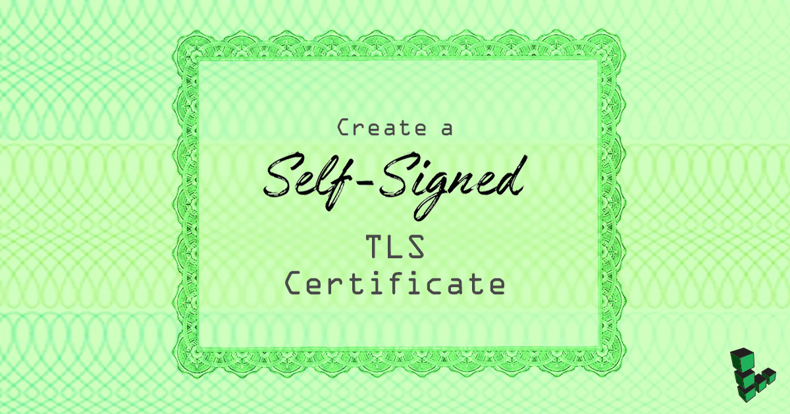

## What is a Self-Signed TLS Certificate?

Self-signed TLS certificates are suitable for personal use or for applications that are used internally within an organization. If you intend to use your SSL certificate on a website, see our guide on enabling TLS for [NGINX](/docs/guides/getting-started-with-nginx-part-3-enable-tls-for-https/) once you’ve completed the process outlined in this guide.

## Create the Certificate

1.  Change to the `root` user and change to the directory in which you want to create the certificate and key pair. That location will vary depending on your needs. Here we'll use `/root/certs`:

        su - root
        mkdir /root/certs && cd /root/certs

2.  Create the certificate:

        openssl req -new -newkey rsa:4096 -x509 -sha256 -days 365 -nodes -out MyCertificate.crt -keyout MyKey.key

    You will be prompted to add identifying information about your website or organization to the certificate. Since a self-signed certificate won't be used publicly, this information isn't necessary. If this certificate will be passed on to a certificate authority for signing, the information needs to be as accurate as possible.

    The following is a breakdown of the OpenSSL options used in this command. There are many other options available, but these will create a basic certificate which will be good for a year. For more information, see `man openssl` in your terminal.

    * `-newkey rsa:4096`: Create a 4096 bit RSA key for use with the certificate. `RSA 2048` is the default on more recent versions of OpenSSL but to be sure of the key size, you should specify it during creation.

    * `-x509`: Create a self-signed certificate.

    * `-sha256`: Generate the certificate request using 265-bit SHA (Secure Hash Algorithm).

    * `-days`: Determines the length of time in days that the certificate is being issued for. For a self-signed certificate, this value can be increased as necessary.

    * `-nodes`: Create a certificate that does not require a passphrase. If this option is excluded, you will be required to enter the passphrase in the console each time the application using it is restarted.

    Here is an example of the output:

    
root@localhost:~# openssl req -new -newkey rsa:4096 -x509 -sha256 -days 365 -nodes -out MyCertificate.crt -keyout MyKey.key
Generating a 4096 bit RSA private key
..............................................................................+++
..............................................+++
writing new private key to 'MyKey.key'
-----
You are about to be asked to enter information that will be incorporated
into your certificate request.
What you are about to enter is what is called a Distinguished Name or a DN.
There are quite a few fields but you can leave some blank
For some fields there will be a default value,
If you enter '.', the field will be left blank.
-----
Country Name (2 letter code) [AU]:US
State or Province Name (full name) [Some-State]:PA
Locality Name (eg, city) []:Philadelphia
Organization Name (eg, company) [Internet Widgits Pty Ltd]:Linode
Organizational Unit Name (eg, section) []:Docs
Common Name (e.g. server FQDN or YOUR name) []:hostname.example.com
Email Address []:admin@example.com


3.  Restrict the key's permissions so that only `root` can access it:

        chmod 400 /root/certs/MyKey.key

4.  Back up your certificate and key to external storage. **This is an important step. Do not skip it!**
