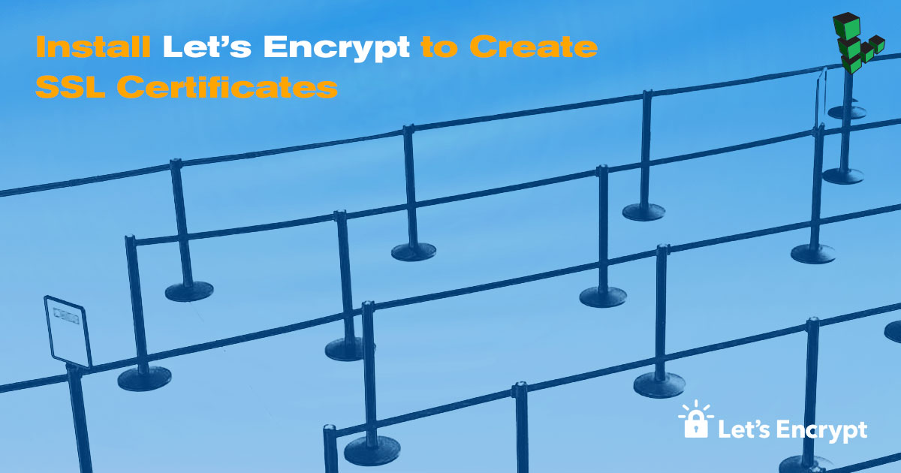

[Let's Encrypt](https://letsencrypt.org/) is an SSL certificate authority managed by the Internet Security Research Group (ISRG). It utilizes the [Automated Certificate Management Environment](https://github.com/ietf-wg-acme/acme/) (ACME) to automatically deploy free SSL certificates that are trusted by nearly all major browsers.


For most situations, the recommended method for installing Let's Encrypt certificates is the official [Certbot](https://certbot.eff.org/) tool. Certbot automates the process of obtaining and installing a certificate, and can also automatically update your web server configuration. The instructions in this guide install Let's Encrypt and add certificates manually, which is not necessary for most users.


## Before you Begin

1.  Familiarize yourself with our [Getting Started](/docs/products/platform/get-started/) guide and complete the steps for setting your Linode's hostname and timezone.

2.  Complete the steps in our [Securing Your Server](/docs/products/compute/compute-instances/guides/set-up-and-secure/) guide to create a standard user account, harden SSH access, and remove unnecessary network services.

3.  Update your server's software packages:

    **CentOS**

        sudo yum update && sudo yum upgrade

    **Debian / Ubuntu**

        sudo apt update && sudo apt upgrade

    
This guide is written for a non-root user. Commands that require elevated privileges are prefixed with `sudo`. If you’re not familiar with the `sudo` command, you can check our [Users and Groups](/docs/guides/linux-users-and-groups/) guide.


## Download and Install Let's Encrypt

1.  Install the `git` package:

    **CentOS**

        sudo yum install git

    **Debian / Ubuntu**

        sudo apt-get install git

2.  Download a clone of Let's Encrypt from the [official GitHub repository](https://github.com/letsencrypt/letsencrypt). `/opt` is a common installation directory for third-party packages, so let's install the clone to `/opt/letsencrypt`:

        sudo git clone https://github.com/letsencrypt/letsencrypt /opt/letsencrypt

3.  Navigate to the new `/opt/letsencrypt` directory:

        cd /opt/letsencrypt

## Create an SSL Certificate

Let's Encrypt automatically performs Domain Validation (DV) using a series of *challenges*. The Certificate Authority (CA) uses challenges to verify the authenticity of your computer's domain. Once your Linode has been validated, the CA will issue SSL certificates to you.

1.  Run Let's Encrypt with the `--standalone` parameter. For each additional domain name requiring a certificate, add `-d example.com` to the end of the command.

        sudo -H ./letsencrypt-auto certonly --standalone -d example.com -d www.example.com

    
ACME version 2 now supports wildcard certificates for subdomains by using the DNS challenge. For more information on obtaining wildcards, visit the [Let's Encrypt documentation](https://community.letsencrypt.org/t/acme-v2-production-environment-wildcards/55578).


2.  When prompted, specify an administrative email address. This will allow you to regain control of a lost certificate and receive urgent security notices if necessary. Press **ENTER** or **RETURN** to save.

3.  Agree to the Terms of Service and specify if you would like to share your email address with EFF:

    
-------------------------------------------------------------------------------
Please read the Terms of Service at
https://letsencrypt.org/documents/LE-SA-v1.2-November-15-2017.pdf. You must
agree in order to register with the ACME server at
https://acme-v01.api.letsencrypt.org/directory
-------------------------------------------------------------------------------
(A)gree/(C)ancel: a

-------------------------------------------------------------------------------
Would you be willing to share your email address with the Electronic Frontier
Foundation, a founding partner of the Let's Encrypt project and the non-profit
organization that develops Certbot? We'd like to send you email about EFF and
our work to encrypt the web, protect its users and defend digital rights.
-------------------------------------------------------------------------------
(Y)es/(N)o: n


4.  If all goes well, a message similar to the one below will appear. Its appearance means Let's Encrypt has approved and issued your certificates.

    
IMPORTANT NOTES:
 - Congratulations! Your certificate and chain have been saved at:
   /etc/letsencrypt/live/example.com/fullchain.pem
   Your key file has been saved at:
   /etc/letsencrypt/live/example.com/privkey.pem
   Your cert will expire on 2018-05-27. To obtain a new or tweaked
   version of this certificate in the future, simply run
   letsencrypt-auto again. To non-interactively renew *all* of your
   certificates, run "letsencrypt-auto renew"
 - If you like Certbot, please consider supporting our work by:

   Donating to ISRG / Let's Encrypt:   https://letsencrypt.org/donate
   Donating to EFF:                    https://eff.org/donate-le


### Check Certificate Domains

1.  The output of the Let's Encrypt script shows where your certificate is stored; in this case, `/etc/letsencrypt/live`:

        sudo ls /etc/letsencrypt/live

    
example.com


2.  All of the domains you specified above will be covered under this single certificate. This can be verified as follows:

        ./certbot-auto certificates

    
Found the following certs:
  Certificate Name: example.com
    Domains: example.com www.example.com
    Expiry Date: 2018-05-27 20:49:02+00:00 (VALID: 89 days)
    Certificate Path: /etc/letsencrypt/live/example.com/fullchain.pem
    Private Key Path: /etc/letsencrypt/live/example.com/privkey.pem


## Maintenance

### Renew SSL Certificates

1.  Return to the `/opt/letsencrypt` directory:

        cd /opt/letsencrypt

2.  Execute the command you used in [Step 1](#create-an-ssl-certificate) of the **Create an SSL Certificate** section, adding the `--renew-by-default` parameter:

        sudo -H ./letsencrypt-auto certonly --standalone --renew-by-default -d example.com -d www.example.com

3.  After a few moments, a confirmation similar to the one below should appear:

    
IMPORTANT NOTES:
 - Congratulations! Your certificate and chain have been saved at:
   /etc/letsencrypt/live/example.com/fullchain.pem
   Your key file has been saved at:
   /etc/letsencrypt/live/example.com/privkey.pem
   Your cert will expire on 2018-05-27. To obtain a new or tweaked
   version of this certificate in the future, simply run
   letsencrypt-auto again. To non-interactively renew *all* of your
   certificates, run "letsencrypt-auto renew"
 - If you like Certbot, please consider supporting our work by:

   Donating to ISRG / Let's Encrypt:   https://letsencrypt.org/donate
   Donating to EFF:                    https://eff.org/donate-le
    

    Let's Encrypt has refreshed the lifespan of your certificates; in this example, March 31st, 2016 is the new expiration date.


Let's Encrypt certificates have a 90-day lifespan. [According to Let's Encrypt](https://letsencrypt.org/2015/11/09/why-90-days.html), this encourages automation and minimizes damage from key compromises. You can renew your certificates at any time during their lifespan.


### Automatically Renew SSL Certificates (Optional)

You can also automate certificate renewal. This will prevent your certificates from expiring, and can be accomplished with `cron`.

1.  The output of the previous command shows how to non-interactively renew all of your certificates:

        ./letsencrypt-auto renew

2.  Set this task to run automatically once per month using a cron job:

        sudo crontab -e

    Add the following line to the end of the crontab file:

    
0 0 1 * * /opt/letsencrypt/letsencrypt-auto renew


### Update Let's Encrypt

1.  Return to the `/opt/letsencrypt` directory:

        cd /opt/letsencrypt

2.  Download any changes made to Let's Encrypt since you last cloned or pulled the repository, effectively updating it:

        sudo git pull

### Automatically Update Let's Encrypt (Optional)

You can also use `cron` to keep the `letsencrypt-auto` client up to date.

    sudo crontab -e

  
0 0 1 * * cd /opt/letsencrypt && git pull

