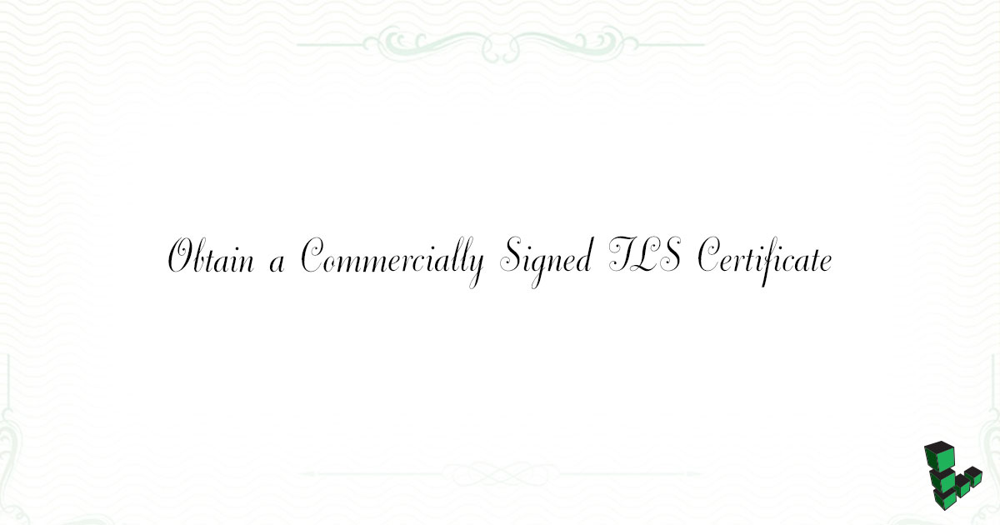

If you intend to host a publicly accessible website which will use HTTPS, then you will want to install a commercially signed TLS certificate so people visiting your site don't get warnings in their browser about an unsafe connection.

The easiest method is to sign your certificate using [Let's Encrypt](https://letsencrypt.org/). The [CertBot](/docs/guides/secure-http-traffic-certbot/) tool makes obtaining and renewing certificates through Let's Encrypt extremely simple. However, this isn't a viable option for everyone.

If you need [Domain Validation](https://en.wikipedia.org/wiki/Domain-validated_certificate) or [Extended Validation certificates](https://en.wikipedia.org/wiki/Extended_Validation_Certificate), you must create a Certificate Signing Request (CSR) for submission to a Certificate Authority (CA) such as Thawte or Verisign. This is the method for obtaining a signed TLS certificate that this guide focuses on.

Some CAs allow you to create a CSR directly through their web interface after you register an account with them. That's certainly a usability advantage over manually creating the CSR on your server or local computer as this guide instructs.

Research certificate authorities thoroughly before deciding on the company which will be used for things such as protecting customers' personal information via HTTPS, cryptographically signing emails, or granting access to internal platforms.

If you intend to use your SSL certificate on a website, see our guide on [Enabling TLS for HTTPS on NGINX](/docs/web-servers/nginx/enable-tls-on-nginx-for-https-connections) once you’ve completed the process in this guide.

## Create a Certificate Signing Request (CSR)

1.  Change to the `root` user and move to the directory in which you want to create the certificate information:

        su - root
        mkdir /root/certs/ && cd /root/certs/

2.  Create the server key and CSR:

        openssl req -new -newkey rsa:4096 -days 365 -nodes -keyout example.com.key -out example.com.csr

    You will be prompted to add identifying information for your website or organization to the certificate. Since this certificate is being created to be passed on to a certificate authority for signing, the information needs to be accurate.

    The following is a breakdown of the OpenSSL options used in this command. There are many other options available, but these will create a basic certificate which will be good for a year. For more information, see `man openssl` in your terminal.

    * `-newkey rsa:4096`: Creates a 4096 bit RSA key for use with the certificate. `RSA 2048` is the default on more recent versions of OpenSSL but to be sure of the key size, you should specify it during creation.

    * `-sha256`: Generates the certificate request using 265-bit SHA (Secure Hash Algorithm).

    * `-days`: Determines the length of time in days that the certificate is being issued for. For a commercial certificate, this value should be no higher than `730` (2 years).

    * `-nodes`: Creates a certificate that does not require a passphrase. If this option is excluded, you will be required to enter the passphrase in the console each time the application using it is restarted.

    Here is an example of the output. You may safely leave the `extra attributes` blank, just press **Enter** to bypass each one:

    
root@localhost:~# openssl req -new -newkey rsa:4096 -days 365 -nodes -keyout example.com.key -out example.com.csr
Generating a 4096 bit RSA private key
..+++
......................................+++
writing new private key to 'example.com.key'
-----
You are about to be asked to enter information that will be incorporated
into your certificate request.
What you are about to enter is what is called a Distinguished Name or a DN.
There are quite a few fields but you can leave some blank
For some fields there will be a default value,
If you enter '.', the field will be left blank.
-----
Country Name (2 letter code) [AU]:US
State or Province Name (full name) [Some-State]:PA
Locality Name (eg, city) []:Philadelphia
Organization Name (eg, company) [Internet Widgits Pty Ltd]:Linode
Organizational Unit Name (eg, section) []:Docs
Common Name (e.g. server FQDN or YOUR name) []:hostname.example.com
Email Address []:admin@example.com

Please enter the following 'extra' attributes
to be sent with your certificate request
A challenge password []:
An optional company name []:


## Your Certificate Authority's Root Certificate

Most modern Linux distributions come with common root CA certificates installed as part of the `ca-certificates` package, located under `/etc/ssl/certs/ca-certificates.crt`.

Alternatively, or if your `ca-certificates` bundle does not already include your CA's root cert, download the certificate directly from the certificate authority's website. Once you have the certificate, add it manually by moving the file to the source directory and updating the bundle.

**CentOS**

    cp rootCert-example.crt /etc/pki/ca-trust/source/anchors/
    update-ca-trust

**Debian or Ubuntu**

    cp rootCert-example.crt /usr/local/share/ca-certificates/
    update-ca-certificates

## Submit Your CSR to Your Certificate Authority

Submit the certificate signing request to the CA. The exact steps differ among certificate authorities, and some CAs have videos or written instructions to guide you through the process. It usually involves the following steps:

1.  Log in to your account with the CA.

2.  Upload your CSR through the web management console.

3.  After a few days, the signed certificate will be available for you to download and install into your server.

## Prepare a Chained SSL Certificate

Many CAs will issue certificates from an intermediate authority, that certificate must be combined with the root certificate.

If you receive several files from your CA ending with `.crt` (collectively referred to as a *chained SSL certificate*), they must be linked into one file, in a specific order, to ensure full compatibility with most browsers. The example below uses a chained SSL certificate that was signed by Comodo.

To combine the individual certificates:

    cat example.com.crt COMODORSADomainValidationSecureServerCA.crt  COMODORSAAddTrustCA.crt AddTrustExternalCARoot.crt > www.mydomain.com.crt

Use this table to better visualize the command entered to prepare the chained certificate:

| **Certificate Type:**      | **Issued to:**                          | **Issued by:**                             |
|----------------------------|:----------------------------------------|:------------------------------------------ |
| End-user Certificate       | example.com                             | Comodo LLC                                 |
| Intermediate Certificate 1 | Comodo LLC                              | COMODORSA DomainValidation SecureServerCA  |
| Intermediate Certificate 2 | COMODORSA DomainValidation SecureServerCA | COMODORSA AddTrustCA                     |
| Root certificate           | COMODORSA AddTrustCA                     | AddTrust ExternalCARoot                   |

The contents of the resulting file will appear similar to the following:


-----BEGIN CERTIFICATE-----
MIIFSzCCBDOgAwIBAgIQVjCXC0bF9U8FypJOnL9cuDANBgkqhkiG9w0BAQsFADCB
................................................................
ncHG3hwHHwhiEz6ukC2mqxA+D3KILiywgHgWcumnpeCEUQgDzy0Fz2Ip/kR/1Fkv
DCQzME2NkT1ZdW8fdz+Y
-----END CERTIFICATE-----
-----BEGIN CERTIFICATE-----
MIIGCDCCA/CgAwIBAgIQKy5u6tl1NmwUim7bo3yMBzANBgkqhkiG9w0BAQwFADCB
................................................................
j4rBYKEMrltDR5FL1ZoXX/nUh8HCjLfn4g8wGTeGrODcQgPmlKidrv0PJFGUzpII
-----END CERTIFICATE-----
-----BEGIN CERTIFICATE-----
ZFRydXN0IEV4dGVybmFsIFRUUCBOZXR3b3JrMSIwIAYDVQQDExlBZGRUcnVzdCBF
................................................................
Uspzgb8c8+a4bmYRBbMelC1/kZWSWfFMzqORcUx8Rww7Cxn2obFshj5cqsQugsv5
-----END CERTIFICATE-----
-----BEGIN CERTIFICATE-----
MIIENjCCAx6gAwIBAgIBATANBgkqhkiG9w0BAQUFADBvMQswCQYDVQQGEwJTRTEU
................................................................
6wwCURQtjr0W4MHfRnXnJK3s9EK0hZNwEGe6nQY1ShjTK3rMUUKhemPR5ruhxSvC
-----END CERTIFICATE-----

