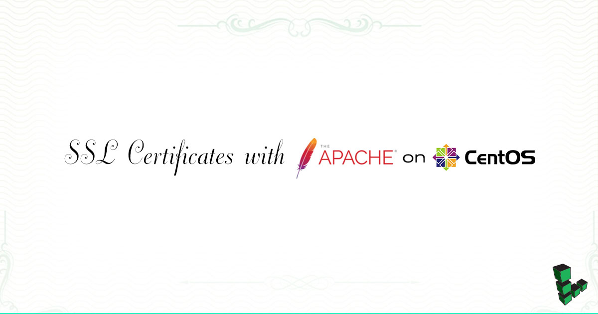

This guide will show you how to enable SSL to secure websites served through Apache on CentOS or Fedora.

## Before You Begin

This guide assumes that you are running Apache2 on CentOS or Fedora. Prior to starting this guide, ensure that the following steps have been taken on your Linode:

-  Familiarize yourself with our [Getting Started](/docs/products/platform/get-started/) guide and complete the steps for setting your Linode's hostname and timezone.

-  Complete our [LAMP on CentOS 7](/docs/guides/how-to-install-a-lamp-stack-on-centos-7/) guide, and create a site that you wish to secure with SSL.

-  Follow our guide for obtaining either a [self-signed](/docs/guides/create-a-self-signed-tls-certificate/) or [commercial](/docs/guides/obtain-a-commercially-signed-tls-certificate/) SSL certificate.

-  In order to configure your Linode to function with SSL, you will need to ensure that the Apache `mod_ssl` module is installed on your system.  You can do so by running the following command:

        yum install mod_ssl

## Configure Apache to use the SSL Certificate

1.  Edit the virtual host entries in the `/etc/httpd/conf.d/ssl.conf` file to include the certificate files and virtual host information that should be used by each domain. For each virtual host, replicate the configuration shown below. Replace each mention of `example.com` with your own domain.

    If you're using a commercially signed certificate and you've manually downloaded the root CA cert to `/etc/pki/tls/certs`, ensure that the `SSLCACertificateFile` value is configured to point to the root certificate directly. If the root certificate is being provided via the "ca-certificates" bundle, you can simply exclude the `SSLCACertificateFile` line.

    
<VirtualHost *:443>
     SSLEngine On
     SSLCertificateFile /etc/pki/tls/certs/example.com.crt
     SSLCertificateKeyFile /etc/pki/tls/private/example.com.key
     SSLCACertificateFile /etc/pki/tls/certs/root-certificate.crt  #If using a self-signed certificate or a root certificate provided by ca-certificates, omit this line

     ServerAdmin info@example.com
     ServerName www.example.com
     DocumentRoot /var/www/example.com/public_html/
     ErrorLog /var/www/example.com/logs/error.log
     CustomLog /var/www/example.com/logs/access.log combined
</VirtualHost>



2.  Restart Apache:

        systemctl restart httpd

You should now be able to visit your site with SSL enabled.

## Test Your Configuration

Test your SSL configuration using the test page at your certificate issuer's website, then perform a deep analysis through the [Qualys SSL Labs SSL Server Test](https://www.ssllabs.com/ssltest/)
