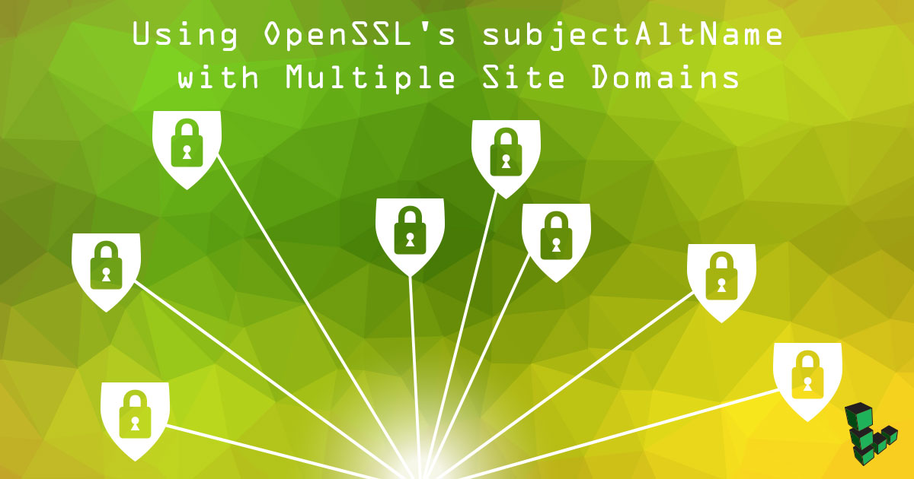

If you're generating your own SSL certificates, you may wish to create a certificate that is valid for multiple DNS names. Using this approach, you can host multiple SSL sites on a single IP address. We assume you've completed the steps detailed in our [Setting Up and Securing a Compute Instance](/docs/products/compute/compute-instances/guides/set-up-and-secure/), and that you're logged into your Linode as root via an SSH session.

## Install OpenSSL

Issue the following command to install required packages for OpenSSL, the open source SSL toolkit.

Debian/Ubuntu users:

    apt-get update
    apt-get upgrade
    apt-get install openssl
    mkdir /etc/ssl/localcerts

CentOS/Fedora users:

    yum install openssl
    mkdir /etc/ssl/localcerts

## Generate the Certificate

Edit the file `openssl.cnf`, inserting the following line immediately before the "HOME" entry. On Debian and Ubuntu systems this file can found at `/usr/lib/ssl/openssl.cnf`, on CentOS and Fedora it can be found at `/etc/pki/tls/openssl.cnf`.


SAN="email:support@example.com"



Change "example.com" to match the domain name used for your server's fully qualified domain name (FQDN). Next, add the following line immediately after the `[ v3_req ]` and `[ v3_ca ]` section markers.


subjectAltName=${ENV::SAN}



These statements instruct OpenSSL to append your default support email address to the SAN field for new SSL certificates if no other alternate names are provided. The environment variable "SAN" will be read to obtain a list of alternate DNS names that should be considered valid for new certificates.

At the shell prompt, issue the following command to declare the names domain names that you want to include in your certificate:

    export SAN="DNS:www.firstsite.org, DNS:firstsite.org, DNS:www.secondsite.org, DNS:secondsite.org"

Substitute your own domain names for "firstsite.org" and "secondsite.org", adding additional domains delimited by commas. For convenience sake, we're including the base domains for each site here (this prevents errors that would otherwise occur if the user doesn't type the "www" part).

Issue the following command to generate the certificate itself. Note that this command should be issued on a single line, without the backslash (e.g. `\`):

    openssl req -new -x509 -sha256 -days 365 -nodes -out /etc/ssl/localcerts/apache.pem\
         -keyout /etc/ssl/localcerts/apache.key

OpenSSL will ask you for several configuration values. Enter values appropriate for your organization and server, as shown here. This example will create a certificate valid for 365 days; you may wish to increase this value. We've specified the FQDN (fully qualified domain name) of the Linode for the "Common Name" entry, as this certificate will be used for generic SSL service.

    Generating a 1024 bit RSA private key
    ...................................++++++
    ..............................++++++
    writing new private key to '/etc/apache2/ssl/apache.pem'
    -----
    You are about to be asked to enter information that will be incorporated
    into your certificate request.
    What you are about to enter is what is called a Distinguished Name or a DN.
    There are quite a few fields but you can leave some blank
    For some fields there will be a default value,
    If you enter '.', the field will be left blank.
    -----
    Country Name (2 letter code) [AU]:US
    State or Province Name (full name) [Some-State]:New Jersey
    Locality Name (eg, city) []:Absecon
    Organization Name (eg, company) [Internet Widgits Pty Ltd]:SoftwareDev, LLC
    Organizational Unit Name (eg, section) []:Web Services
    Common Name (eg, YOUR name) []:archimedes.mydomain.com
    Email Address []:support@mydomain.com

You'll need to configure the applicable server software on your Linode to use the newly generated certificate. After accepting an initial warning regarding the certificate for the first domain you access over SSL, you should be able to access the domains you specified over SSL without further warnings.
