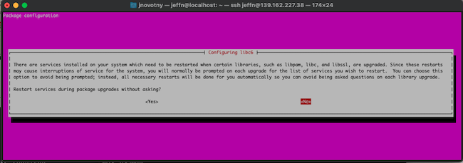
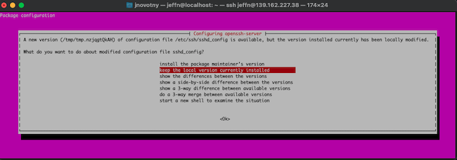

Although Ubuntu 20.04 LTS (*Long Term Support*) is still supported, users should upgrade Ubuntu to the more recent 22.04 LTS. Upgrading to the new release ensures the system can access the most recent security upgrades and application packages. This guide describes how to perform an inline upgrade from Ubuntu 20.xx or 21.xx to 22.04.

## New Features in Ubuntu 22.04

[Ubuntu 22.04 LTS](https://ubuntu.com/blog/ubuntu-22-04-lts-whats-new-linux-desktop) from Canonical is also referred to as "Jammy Jellyfish". Ubuntu generally supports their LTS releases for five years, which means Ubuntu 22.04 is supported until April 2027. This is superior to the Ubuntu 20.04 schedule, where support ends in April 2025. In addition, most application developers test their programs more thoroughly against the latest LTS release.

In addition to the longer support period, Ubuntu 22.04 includes these other features and improvements:

-   Enhanced performance and better power efficiency.
-   A better display, featuring double the frame rate.
-   New power management options.
-   Updated security patches.
-   GNOME 42, which includes a streamlined user interface, on-screen notifications, and better multi-monitor support.
-   Increased customization options.
-   Firefox availability through a Snap package.
-   New releases of applications and toolchains. Updates and enhancements are available for Apache, MySQL, Perl, PHP, PostgreSQL, Python, and Ruby.
-   A new version (5.15) of the Linux Kernel.

## Inline Upgrade versus Clean Install

There are two ways to upgrade a node. These are the *inline upgrade* method and the *clean install* approach. This guide only explains how to perform an inline upgrade. However, it is important to understand both methods to make an informed choice.

### The Inline Upgrade Method

In an inline upgrade, the primary node is upgraded in place using either the GUI or command line directives. Ubuntu downloads and installs the new release of the operating system on the same system. The files and applications on the system are left unchanged and the node can immediately resume operations after the upgrade. Some of the advantages and disadvantages of this method, and other factors to consider, are as follows:

-   This is the easiest and fastest method of upgrading a node. Depending on the size of the new release, the node might be fully operational in as little as 15 minutes.
-   The Ubuntu upgrade procedure is well tested and generally reliable.
-   Users do not have to remember to reinstall a critical program or import data from the original node.
-   It is impossible to avoid some downtime while the updates are installed and the system reboots and initializes. During this period, any websites or applications hosted on the node are inaccessible. It is crucial to declare a maintenance window or switch to a backup system for the duration of the upgrade.
-   There is a greater chance of complications. Some applications might not work properly after the upgrade and might have to be reinstalled. There is also a greater chance of data corruption.
-   This method of upgrading tends to retain "digital residue". This includes unnecessary or outdated packages, patches, and data.
-   This method is recommended if the system is only one release behind and is mainly running a widely used and tested configuration such as a LAMP stack. An inline upgrade might run into more problems when the system configuration is complicated or includes in-house applications.


Although this process upgrades the Ubuntu operating system and most common programs, it does not necessarily upgrade every application. It is difficult to predict how the upgrade might affect these programs.


### The Clean Install Method

The clean install method takes the opposite approach to the inline upgrade. This approach deploys a brand new Linode running the Ubuntu 22.04 release. All necessary applications are reinstalled and the backed-up data from the old node is copied over. After the new node is fully configured and operational, the old node is decommissioned.

The pros and cons of a clean install are as follows:

- It is easier to troubleshoot any problems because there are fewer dependencies.
- The configuration tends to be cleaner. Old packages and unwanted files are not copied over.
- This method takes a lot more effort and is more error prone. It is easy to forget to port over important applications and application data.
- This method is a better choice if the system is running a much older release of Ubuntu or if the configuration is very convoluted. It is also a good choice for systems under the control of an *Infrastructure as Code* (IaC) application, like Terraform or Chef. These applications allow administrators to automatically provision a new remote node with a standard configuration.

For an in-depth explanation of the clean install method, see the [Linode guide to manually upgrading a node](/docs/guides/manually-upgrading-to-latest-distribution-version/).

## Before You Begin

1.  If you have not already done so, create a Linode account and Compute Instance. See our [Getting Started with Linode](/docs/products/platform/get-started/) and [Creating a Compute Instance](/docs/products/compute/compute-instances/guides/create/) guides.

1.  Follow our [Setting Up and Securing a Compute Instance](/docs/products/compute/compute-instances/guides/set-up-and-secure/) guide to update your system. You may also wish to set the timezone, configure your hostname, create a limited user account, and harden SSH access.

1.  Ensure there is at least 20 GB of disk space available. Verify the amount of disk space availability using the `df -Th` command.


This guide is written for a non-root user. Commands that require elevated privileges are prefixed with `sudo`. If you are not familiar with the `sudo` command, see the [Users and Groups](/docs/guides/linux-users-and-groups/) guide.


## How to Upgrade to Ubuntu 22.04 LTS

This guide is designed for users who want to upgrade from Ubuntu 20.04 LTS to Ubuntu 22.04 LTS. However, it is generally applicable for upgrades to Ubuntu 22.04 from any release of Ubuntu 20.xx or 21.xx.

If the Linode is running Ubuntu 18.xx or any earlier release, first upgrade it to Ubuntu 20.04 LTS. Then perform the steps in this guide to upgrade from Ubuntu 20.04 LTS to the 22.04 LTS. See the [Linode guide to Upgrade to Ubuntu 20.04](/docs/guides/upgrade-to-ubuntu-20-04/) for more information. Alternatively, if the Ubuntu software and applications are very old, it might make more sense to perform a clean install instead.


This operation cannot be canceled after it is started. Ensure there is a stable connection to the Linode and backup power is available.


### How to Prepare the Linode for the Upgrade

To increase the chance of a successful upgrade, ensure the operating system and all applications are up to date. All data should be backed up and active user applications shut down.

To prepare the Ubuntu system for the upgrade, follow these steps.

1.  Upgrade the Linode and ensure it is up to date.

    ```command
    sudo apt update -y && sudo apt upgrade -y && sudo apt dist-upgrade -y
    ```

2.  To simplify the upgrade, remove unused packages and files.

    ```command
    sudo apt autoremove -y && sudo apt autoclean -y
    ```

3.  Reboot the node to ensure any new kernel upgrades are installed. Linode makes new kernels available through the Linode cloud manager. Any updates are automatically applied to the node upon a reboot. For more information, see the [Linode guide to monitoring and maintaining a system](/docs/products/compute/compute-instances/guides/monitor-and-maintain/#apply-kernel-updates).

    ```command
    sudo reboot
    ```

4.  Make a backup copy of the system configuration and all application data. The easiest way to do this is to back up the entire system. Subscribing to the [Linode Backup Service](/docs/products/storage/backups/) allows you to take a manual snapshot before the upgrade.

5.  Stop as many non-critical user applications services as possible, including web and database servers. Focus on applications that might be subject to data corruption. To see a list of the active services, use the command `systemctl | grep running`.

    ```command
    sudo systemctl | grep running
    ```

    ```output
    ...
    apache2.service loaded active running The Apache HTTP Server
    ...
    mysql.service loaded active running MySQL Community Server
    ```

6.  Use the command `sudo systemctl stop <application_name>` to stop a service. The following example demonstrates how to stop the Apache web server instance.

    
    Do not stop any essential system services such as `ssh` or any `systemd` entry.
    

    ```command
    sudo systemctl stop apache2
    ```

7.  Allow connections on TCP port 1022 through the `ufw` firewall. This permits Ubuntu to use a fallback port if the main connection drops. After adding the rule, reload the firewall.

    ```command
    sudo ufw allow 1022/tcp
    sudo ufw reload
    ```

    ```output
    Firewall reloaded
    ```

8.  Confirm connections on TCP port 1022 are now allowed.

    ```command
    sudo ufw status
    ```

    ```output
    Status: active

    To                         Action      From
    --                         ------      ----
    OpenSSH                    ALLOW       Anywhere
    Apache Full                ALLOW       Anywhere
    1022/tcp                   ALLOW       Anywhere
    OpenSSH (v6)               ALLOW       Anywhere (v6)
    Apache Full (v6)           ALLOW       Anywhere (v6)
    1022/tcp (v6)              ALLOW       Anywhere (v6)
    ```

### How to Install Ubuntu Release 22.04

The node is now ready for the upgrade. Ensure the update manager is installed, then initiate the upgrade. The upgrade might take some time, depending on the configuration, and must not be interrupted. Ensure there is enough time to complete the entire upgrade before proceeding.


The upgrade operation can be performed using either a LISH session or an SSH connection. A LISH session is safer, but if SSH is used, the upgrade manager opens a second port for redundancy. This guide uses SSH for the procedure to demonstrate the additional steps required.


1.  Ensure the `update-manager-core` package is installed. On many systems, this package might already be available.

    ```command
    sudo apt install update-manager-core
    ```

2.  Confirm the release-upgrader is set to the correct release update mode. The file `/etc/update-manager/release-upgrades` must include the line `Prompt=lts`.

    ```command
    sudo cat /etc/update-manager/release-upgrades
    ```

    ```file {title="/etc/update-manager/release-upgrades" lang="aconf"}
    # Default behavior for the release upgrader.

    [DEFAULT]
    # Default prompting and upgrade behavior, valid options:
    #
    #  never  - Never check for, or allow upgrading to, a new release.
    #  normal - Check to see if a new release is available.  If more than one new
    #           release is found, the release upgrader will attempt to upgrade to
    #           the supported release that immediately succeeds the
    #           currently-running release.
    #  lts    - Check to see if a new LTS release is available.  The upgrader
    #           will attempt to upgrade to the first LTS release available after
    #           the currently-running one.  Note that if this option is used and
    #           the currently-running release is not itself an LTS release the
    #           upgrader will assume prompt was meant to be normal.
    Prompt=lts
    ```

3.  Run the `do-release-upgrade` command to start the upgrade.

    
    To force an upgrade from the latest supported release to a development release, use the command `do-release-upgrade -d`. This guide focuses on upgrading to the latest supported release and does not use this flag.
    

    ```command
    sudo do-release-upgrade
    ```

4.  If the operation is performed using a SSH connection, Ubuntu verifies the SSH connection details and asks whether to continue. Answer `y` to continue.

    ```output
    Continue running under SSH?

    This session appears to be running under ssh. It is not recommended
    to perform a upgrade over ssh currently because in case of failure it
    is harder to recover.

    If you continue, an additional ssh daemon will be started at port
    '1022'.
    Do you want to continue?
    ```

5.  Ubuntu asks the user to confirm the new SSH port is allowed through the firewall. The port should already be open. Press the **Enter** key to continue.

    ```output
    Starting additional sshd

    To make recovery in case of failure easier, an additional sshd will
    be started on port '1022'. If anything goes wrong with the running
    ssh you can still connect to the additional one.
    If you run a firewall, you may need to temporarily open this port. As
    this is potentially dangerous it's not done automatically. You can
    open the port with e.g.:
    'iptables -I INPUT -p tcp --dport 1022 -j ACCEPT'

    To continue please press [ENTER]
    ```

6.  Ubuntu reads through the list of packages, builds the dependencies, and searches for internal package mirrors. If no mirrors are available, it prompts for approval to rewrite the `sources.list` file. Enter `y` to continue.

    ```output
    Fetched 336 kB in 0s (0 B/s)
    Reading package lists... Done
    ...
    No valid mirror found

    While scanning your repository information no mirror entry for the
    upgrade was found. This can happen if you run an internal mirror or
    if the mirror information is out of date.

    Do you want to rewrite your 'sources.list' file anyway? If you choose
    'Yes' here it will update all 'focal' to 'jammy' entries.
    If you select 'No' the upgrade will cancel.

    Continue [yN]
    ```

7.  Ubuntu downloads the new packages and files. It determines which packages are no longer supported and requests approval to proceed. It also calculates how long the upgrade might take. To continue with the upgrade, answer `y`.

    
    To see details about the packages to be removed, installed, and upgraded, enter `d`. Enter `q` to exit the details screen. Then enter `y` to continue with the upgrade.
    

    ```output
    Do you want to start the upgrade?


    14 installed packages are no longer supported by Canonical. You can
    still get support from the community.

    5 packages are going to be removed. 91 new packages are going to be
    installed. 571 packages are going to be upgraded.

    You have to download a total of 552 M. This download will take about
    2 minutes with you connection.

    Installing the upgrade can take several hours. Once the download has
    finished, the process cannot be canceled.

    Continue [yN]  Details [d]
    ```

8.  Ubuntu displays a pop-up asking whether to restart the services after the upgrade. Select either the `<Yes>` button to automatically restart them or `<No>` to restart them manually.

    

9.  Ubuntu continues downloading the new packages. This can take a considerable length of time, especially if many applications have been installed. However, Ubuntu echoes the package names when it installs and processes them, allowing users to monitor the progress. During the upgrade, Ubuntu uses a pop-up to ask users how to handle the `sshd_config` file. Select the `keep the local version currently installed` option, and then choose `<OK>`.

    

10. Ubuntu locates any obsolete packages and asks the user whether to remove them. Enter `y` to delete the outdated packages.

    ```output
    Searching for obsolete software
    Reading state information... Done

    Remove obsolete packages?


    41 packages are going to be removed.

    Continue [yN]  Details [d]
    ```

11. Ubuntu removes the packages and finalizes the upgrade. This stage might also take some length of time. Ubuntu informs the user that the upgrade is complete and prompts them to reboot the system. Select `y` to reboot and finalize the upgrade.

    ```output
    System upgrade is complete.

    Restart required

    To finish the upgrade, a restart is required.
    If you select 'y' the system will be restarted.

    Continue [yN]
    ```

## How to Perform Post-Upgrade Clean-Up Activities

Ubuntu has now been upgraded to version 22.04 LTS. After the Linode reboots, it is ready to resume operations. However, it is important to validate the upgrade. There are also still a few security concerns to fix and clean-up activities to perform. Log in to the Linode and perform the following steps.

1.  Use the `lsb_release -a` command to verify the correct release of Ubuntu is now installed. The `Release` attribute should be `22.04`.

    ```command
    lsb_release -a
    ```

    ```output
    No LSB modules are available.
    Distributor ID: Ubuntu
    Description:    Ubuntu 22.04.1 LTS
    Release:        22.04
    Codename:       jammy
    ```

2.  **Optional:** To validate the kernel version, use the `uname` command.

    ```command
    uname -mrs
    ```

    ```output
    Linux 5.15.0-53-generic x86_64
    ```

3.  To increase security, close port `1022` in the `ufw` firewall. Reload the firewall.

    ```command
    sudo ufw delete allow 1022/tcp
    sudo ufw reload
    ```

4.  Confirm the firewall rules are updated.

    ```command
    sudo ufw status
    ```

    ```output
    Status: active

    To                         Action      From
    --                         ------      ----
    OpenSSH                    ALLOW       Anywhere
    Apache Full                ALLOW       Anywhere
    OpenSSH (v6)               ALLOW       Anywhere (v6)
    Apache Full (v6)           ALLOW       Anywhere (v6)
    ```

5.  Ubuntu disables any third-party repositories during the upgrade. To search for disabled repositories, switch to the `sources.list.d` directory and list the entries.

    ```command
    cd /etc/apt/sources.list.d
    ls -l
    ```

6.  Edit each list using a text editor. Remove the `#` symbol at the start of the affected entries, and save the file. In the following example, remove the `#` symbol in front of `deb [arch=amd64]`.

    ```command
    nano archive-application.list
    ```

    ```file {title="archive-application.list" lang="aconf"}
    [DEFAULT]
    deb [arch=amd64] https://apt.releases.application-name.com jammy main
    ```

7.  Update any third-party repositories and remove unnecessary packages using `apt` commands.

    ```command
    sudo apt update -y && sudo apt upgrade -y && sudo apt dist-upgrade -y && sudo apt autoremove -y && sudo apt autoclean -y
    ```

## Conclusion

Users can access security updates and new features by upgrading to the new Ubuntu 22.04 LTS release. The two methods of updating a Linode are the inline update or the clean install. This guide explains how to perform an Ubuntu inline upgrade, which is the quickest and easiest method.

To prepare to upgrade a Linode to Ubuntu 22.04 LTS, update and upgrade the node, back up the data, and stop all services. Use the `do-release-upgrade` command to initiate the upgrade and follow all Ubuntu prompts. After the upgrade, tighten up security, enable third-party archives, and perform some clean-up tasks. For more information about the Ubuntu 22.04 LTS release, see the [Ubuntu server documentation](https://ubuntu.com/server/docs).