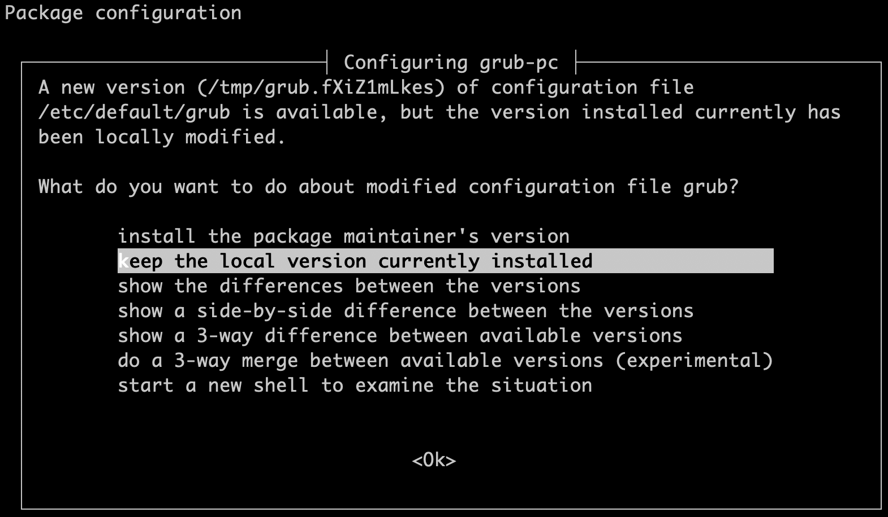

Debian repositories can be tracked either by codename (Wheezy, Jessie, etc.), or by status name (stable, testing, etc.). For example, Debian 9 Stretch is the *stable* release at the time of this writing; the status of Debian 8 (Jessie) is *oldstable*. Debian stable releases are eventually managed by the [Debian Long Term Support](https://wiki.debian.org/LTS/) (LTS) team for a total lifespan of about 5 years.

Linode offers Debian's [stable](https://wiki.debian.org/DebianStable) and [oldstable](https://wiki.debian.org/DebianOldStable) releases. When exclusively tracking the stable releases with APT, your system will upgrade whenever the stable release reaches its end of life. For example, if you're tracking the stable release of Debian 8 and it reaches its end of life, your system will make available a number of new packages which will upgrade you to Debian 9.

On the other hand, if you're currently tracking repositories by codename, as Debian does by default, you will never upgrade beyond that codename release. This is the safest option and you can still manually upgrade to a newer Debian codename or release status name at any time.


While upstream maintainers try to ensure cross-compatibility and problem-free upgrades, there is risk involved in upgrading operating system versions.


## Before You Begin

- You will need root access to your Linode, or a user account with `sudo` privileges.

- **Back up any important data stored on your Linode!** If you subscribe to the Linode Backups service, we recommend taking a [manual snapshot](/docs/platform/disk-images/linode-backup-service/#take-a-manual-snapshot) before upgrading your system. If you use a different backup service or application, you should do a manual backup now.

    
You may also want to back up your configuration files (usually located in `/etc/`) in case they have changed in later versions of the software you are using. See our [backup guides](/docs/security/backups/) for more information.


## Prepare to Upgrade

1.  Verify that you are booting with Debian's kernel using the *GRUB 2* [boot setting](/docs/guides/managing-the-kernel-on-a-linode/) in the Linode Cloud Manager. We recommend you use the distribution-supplied kernel unless you have a specific reason not to.

2.  Exit the SSH session if you're currently logged in to one and instead open a Lish session to your Linode. Lish will give you continuous access to your Linode whereas SSH could disconnect during the upgrade. Read more about Lish [here](/docs/guides/using-the-lish-console/).

3.  Install all available updates for your current Debian system:

        sudo apt update && sudo apt upgrade

4.  If you've set APT to pin any packages to a specific Debian version other than stable, You'll need to disable APT pinning for those packages if you want them upgraded to those offered in the newest release.

5.  You may want to stop services which are non-essential to the system but important to your setup, such as a database service. This would be to ensure a graceful shutdown of the service to prevent data loss or system locks from causing problems. To stop a service, enter the following command, replacing `mariadb` with the name of the service you want to stop:

        sudo systemctl stop mariadb

    You can view all enabled services with:

        sudo systemctl list-unit-files --state=enabled

    View all currently running services:

        sudo systemctl list-units --state=running

## Upgrade Debian

1.  Edit your `sources.list` file to change all instances of the current codename to the new release codename. The example of upgrading from Debian 8 (Jessie) to Debian 9 (Stretch) is used below, so `jessie` is changed to `stretch` (or, alternatively from `jessie` to `stable`).

    
deb http://mirrors.linode.com/debian stretch main
deb-src http://mirrors.linode.com/debian stretch main

deb http://mirrors.linode.com/debian-security/ stretch/updates main
deb-src http://mirrors.linode.com/debian-security/ stretch/updates main

# stretch-updates, previously known as 'volatile'
deb http://mirrors.linode.com/debian stretch-updates main
deb-src http://mirrors.linode.com/debian stretch-updates main


    
Ensure any third party repositories are also tracking `stretch`. You will need to check with the maintainers of each package to ensure that their own repositories have been updated.


1.  Update your package lists and remove any old packages which were previously downloaded for installation:

        sudo apt update
        sudo apt-get clean

1.  The Debian 8 release notes recommend a [two-part](https://www.debian.org/releases/stable/amd64/release-notes/ch-upgrading.en.html#minimal-upgrade) upgrade path to avoid removing packages you may want to keep. Perform the minimal upgrade.

        sudo apt upgrade

    - During the upgrade process, you will prompted whether you want to replace or keep the current GRUB 2 file. This is because Linode must edit `/etc/default/grub` from upstream to work properly with our infrastructure.

        

        Choose `Keep the local version currently installed`. Further prompts about installing GRUB should be answered with installing to `/dev/sda`, then `Continue without installing GRUB`. GRUB is not needed in your disk MBR because your Linode boots from a GRUB installation provided by Linode's host servers.

    - During the upgrade process, you'll be prompted to review configuration files which you've modified to decide whether to keep or replace them with the upstream default file. An example:

        
Configuration file '/etc/mysql/my.cnf'
==> Modified (by you or by a script) since installation.
==> Package distributor has shipped an updated version.
What would you like to do about it ?  Your options are:
Y or I  : install the package maintainer's version
N or O  : keep your currently-installed version
D     : show the differences between the versions


    -  If your system is running Fail2ban, the upgrade will end with the error shown below. This is a [known issue](https://bugs.debian.org/cgi-bin/bugreport.cgi?bug=860397). See the [troubleshooting](/docs/security/upgrading/upgrade-debian-to-the-newest-release/#fail2ban) section of this page to fix before proceeding further.

        
Errors were encountered while processing:
 fail2ban
E: Sub-process /usr/bin/dpkg returned an error code (1)


1.  Once the minimal upgrade above is completed, start the main upgrade:

        sudo apt dist-upgrade

1.  Reboot your system when the upgrade completes. You should still be in Lish. Monitor the Linode's console output for errors as the system shuts down and reboots. Your Linode is now running the newest version of Debian Stable.

1.  Remove old and unused packages:

        sudo apt-get autoremove

## Troubleshooting

Below are some known issues you may encounter when upgrading Debian. These are mainly just issues reported by our customers so you'll want to monitor the *[debian-announce](https://lists.debian.org/debian-announce/)* mailing list for more comprehensive information, and the lists of any third party packages you will install.

### Fail2ban

When upgrading from Debian 8 to 9, you may experience problems because of a duplicate configuration option in `/etc/fail2ban/jail.local` if you copied it directly from `/etc/fail2ban/jail.conf`. This is currently a [known issue](https://bugs.debian.org/cgi-bin/bugreport.cgi?bug=860397). To fix this:

1.  Comment out `port = anyport` in `/etc/fail2ban/jail.local` (around line 155). The block should look similar to below:

    
[pam-generic]

enabled  = false
# pam-generic filter can be customized to monitor specific subset of 'tty's
filter   = pam-generic
# port actually must be irrelevant but lets leave it all for some possible uses
port     = all
banaction = iptables-allports
#port     = anyport
logpath  = /var/log/auth.log
maxretry = 6


1.  Tell `dpkg` to reconfigure anything necessary:

        sudo dpkg --configure -a
        sudo apt-get install --fix-broken

### Upgrading Apache 2.2 to 2.4

Upgrading from Debian 7 to 8 moves Apache from version 2.2 to 2.4. This version change can break existing websites if you're already running Apache and requires adjusting configuration files. See our [Upgrading Apache](/docs/guides/updating-virtual-host-settings-from-apache-2-2-to-apache-2-4/) guide for more information.