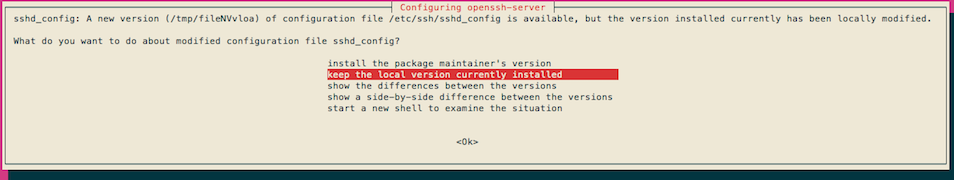

Ubuntu 18.04 is a Long-Term Support (LTS) release that is supported by Canonical until April 2023. This guide shows how to upgrade your Linode from Ubuntu 16.04 (Xenial Xerus) or Ubuntu 17.10 (Artful Aardvark) to Ubuntu 18.04 (Bionic Beaver).


Inline distribution upgrades can yield unpredictable results. Before continuing, read through our [Upgrading to the Latest Distribution (Clean Install)](/docs/guides/manually-upgrading-to-latest-distribution-version/) guide to learn more about your upgrade options, including performing a clean install of the latest distribution version.

The upgrade may be incomplete or your system may be corrupted if your internet connection is interrupted. Use [Lish](/docs/products/compute/compute-instances/guides/lish/) or [Glish](/docs/products/compute/compute-instances/guides/glish/) to perform this upgrade in a stable environment that does not rely on an active internet connection to your Linode.




If you are upgrading from Ubuntu 17.04 you must first upgrade to Ubuntu 17.10.


## Prepare to Upgrade to Ubuntu 18.04

The steps required in this guide require root privileges. Be sure to run the steps below as **root** or with the `sudo` prefix. For more information on privileges see our [Users and Groups](/docs/guides/linux-users-and-groups) guide.

In order to prepare your Linode for upgrade, the following steps guide you to:

1.  Install updates for Ubuntu 16.04.

2.  Backup your data.

3.  Ensure that the kernel version you're using is the latest.

4.  Stop non-critical services.

5.  Start a LISH session to ensure that the installation is not interrupted.

### Install Available Updates

Update package lists and install all updates:

    apt update && apt upgrade

### Back Up Your Linode

It's a good idea to back up your Linode before performing a major upgrade. That way, you can restore from backup if anything goes wrong during the upgrade process. If you subscribe to the [Linode Backup Service](/docs/products/storage/backups/), we recommend that you [take a manual snapshot](/docs/products/storage/backups/#take-a-manual-snapshot) before upgrading to Ubuntu 18.04 LTS. If you use another backup service or application, we recommend that you make a manual backup before continuing.

### Check Your Kernel

Verify that your Linode is using the latest supported kernel. See [Apply Kernel Updates](/docs/products/compute/compute-instances/guides/monitor-and-maintain/#apply-kernel-updates) for more information.

### Stop Services

We recommend that you stop as many services as possible before upgrading to Ubuntu 18.04 LTS. This includes web server daemons (Apache and NGINX), database servers (PostgreSQL and MySQL), and any other non-critical services.

1.  Get a list of services currently running on your system:

        systemctl | grep running

2.  To stop a service, enter the following command, replacing `apache2` with the name of the service you want to stop:

        systemctl stop apache2

You are now ready to install Ubuntu 18.04 LTS on your Linode.

## Upgrade from Ubuntu 16.04 LTS to Ubuntu 18.04 LTS

Remember to perform these steps in a Lish or Glish session:

1.  Install the `update-manager-core` package:

        apt install update-manager-core

2.  Open `/etc/update-manager/release-upgrades` and verify that the `Prompt` value is set to `lts` on Ubuntu 16.04 or `normal` on Ubuntu 17.10:

    
# Default behavior for the release upgrader.

[DEFAULT]
# Default prompting behavior, valid options:
#
#  never  - Never check for a new release.
#  normal - Check to see if a new release is available.  If more than one new
#           release is found, the release upgrader will attempt to upgrade to
#           the release that immediately succeeds the currently-running
#           release.
#  lts    - Check to see if a new LTS release is available.  The upgrader
#           will attempt to upgrade to the first LTS release available after
#           the currently-running one.  Note that this option should not be
#           used if the currently-running release is not itself an LTS
#           release, since in that case the upgrader won't be able to
#           determine if a newer release is available.
Prompt=lts



1.  You're now ready to begin the upgrade to Ubuntu 18.04 LTS.

        do-release-upgrade

    Follow the on-screen instructions to complete the installation process.

2.  Because Linode offers internal package mirrors for Ubuntu, you may see some combination of the following messages:

    * **No valid mirror found**

        
While scanning your repository information no mirror entry for the
upgrade was found. This can happen if you run an internal mirror or
if the mirror information is out of date.

Do you want to rewrite your 'sources.list' file anyway? If you choose
'Yes' here it will update all 'trusty' to 'xenial' entries.
If you select 'No' the upgrade will cancel.

Continue [yN]


        Type `y` and **Enter** to continue.

    * **Packages no longer supported**

        
3 installed packages are no longer supported by Canonical. You can
still get support from the community.

2 packages are going to be removed. 91 new packages are going to be
installed. 346 packages are going to be upgraded.

You have to download a total of 239 M. This download will take about
30 minutes with a 1Mbit DSL connection and about 9 hours with a 56k
modem.

Fetching and installing the upgrade can take several hours. Once the
download has finished, the process cannot be canceled.

 Continue [yN]  Details [d]


        Press `d` for more details (then `q` to exit the details), or `y` to continue.

    *  **Configuring openssh-server**: Press enter to choose `keep the local version currently installed`.

        

    *  **Remove obsolete packages?**: Enter `y`

5.  The upgrade requires a reboot. Enter `y` to continue:

    
System upgrade is complete.

Restart required

To finish the upgrade, a restart is required.
If you select 'y' the system will be restarted.

Continue [yN]


6.  Once the system has rebooted, verify that it's running Ubuntu 18.04:

        lsb_release -a

7.  You should see output that resembles the following:

    
No LSB modules are available.
Distributor ID:	Ubuntu
Description:	Ubuntu 18.04 LTS
Release:	18.04
Codename:	bionic


Your Linode is now running Ubuntu 18.04 LTS.

## Networking

[Netplan](https://netplan.io/) is used to configure networking in Ubuntu 18.04 and later. Ubuntu Server is packaged with `systemd-networkd` as the [backend](https://netplan.io/design#design-overview) for Netplan, while NetworkManager is used as the Netplan backend in Ubuntu Desktop. The `ifupdown` package has been deprecated, and `/etc/network/interfaces` is no longer used, but it's still possible to configure static networking with `/etc/systemd/network/*.network` files.

Once you have upgraded to Ubuntu 18.04 or later from an earlier version, you should run the following command to enable `systemd-networkd`:

    systemctl enable systemd-networkd

## Upgrading from Previous Ubuntu Releases

If your Linode is running a release of Ubuntu older than 16.04 LTS, use the upgrade guides in the [Upgrading section](/docs/guides/security/upgrading) to upgrade to Ubuntu 16.04 LTS first. You may then upgrade your Linode to Ubuntu 18.04 LTS.
