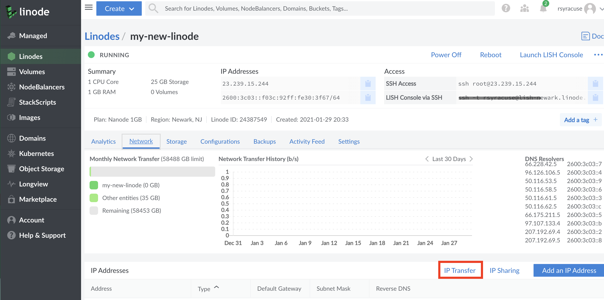
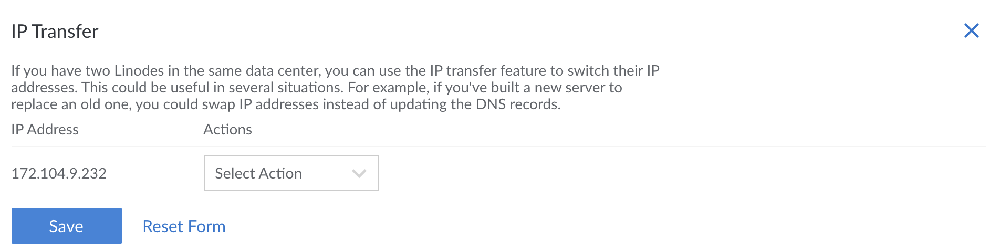

While there are many options available to users to upgrade a Linode to the latest distro of their choice, Linode recommends the following upgrade path for best results. This method involves creating a new Linode on the latest distro available, installing all of the packages you'll be using on the new distro, and then importing old data to the new Linode. This helps to avoid common package inconsistencies that can occur with a standard inline upgrade method, and enables users to move directly ahead to the latest version of their distro even if they're several versions behind the latest version of their Distro.

## Before you Begin

- You will need root access to your Linode, or a user account with sudo privileges.

- Back up any important data stored on your Linode! If you subscribe to the Linode Backups service, we recommend taking a manual snapshot before upgrading your system. If you use a different backup service or application, you should do a manual backup now.

- Create a new Linode using the image you'll be upgrading to **in the same datacenter** as the Linode that needs to be upgraded. If you'd like to upgrade to **Ubuntu 20.04 LTS** from **Ubuntu 18.04**  for example, select the **Ubuntu 20.04 LTS** image when creating your new Linode. For more information on creating a Linode, follow the steps in our [Getting Started Guide](/docs/guides/getting-started/), followed by our [Securing Your Server Guide](/docs/guides/securing-your-server/).

## Finding and Installing Software

Once the Linode is created, the next step is to install all of the software currently running on the original Linode onto the Linode that is hosting the upgraded distro. If your original software stack is LAMP for example, you would need to manually re-install the LAMP stack on the new Linode.

Finding all of the installed packages on a Linode can usually be handled by the package manager that's used for installation. Below are example commands for finding all installed packages using popular default package managers:

### Apt

        sudo apt list --installed

### Yum

     sudo yum list installed

### Pacman

        sudo pacman -Q


Many software packages are installed on a distro by default. For best results, the command for finding installed packages can be run on both the original Linode and the Linode that will host the upgraded software so that the output can be compared.


Many guides for installing any software needed can be found on the [Linode Docs Homepage](https://www.linode.com/docs/).

## Copying Configuration Files

Now that the Linode is upgraded to the latest version, copy or transfer any remaining configuration data from the original Linode, to the new Linode hosting the updated distro. Below is a list of recommended methods for completing this.

### Secure Copy Protocol (SCP)

You can use SCP to retrieve a specific directory or file via the command-line. SCP is installed by default on most macOS and Linux systems, and is available with [Cygwin or PuTTY](/docs/networking/ssh/using-ssh-on-windows) for Windows.

-   The syntax for using SCP to copy a file from your Linode into a directory on another computer is:

        scp your_linode_username@your_linode_ip:/path/to/your/file.txt /path/to/your/local/directory/

    The file will be saved inside `/path/to/your/local/directory/`.

-   To copy a file from your Linode to another computer and give it a specific name (in this case, `file.txt.backup`):

        scp your_linode_username@your_linode_ip:/path/to/your/file.txt /path/to/your/local/directory/file.txt.backup

-   To copy an entire directory:

        scp -r your_linode_username@your_linode_ip:/path/to/your/directory /path/to/your/local/directory

    If `/path/to/your/local/directory` already exists on your computer, then the copied directory will be placed inside `/path/to/your/local/directory` (i.e. `/path/to/your/local/directory/directory`).

    If `/path/to/your/local/directory` does not already exist, then the copied directory will be created with that name.

For example:

* Download an NGINX configuration file to your user's `/home` folder:

        scp your_linode_username@your_linode_ip:/etc/nginx/conf.d/example.com.conf ~/example.com.conf.backup

* Download an Apache configuration file to your `/home` folder:

        scp your_linode_username@your_linode_ip:/etc/apache2/sites-available/example.com.conf ~/example.com.conf.backup

* Copy the entire document root from a web server:

        scp -r your_linode_username@your_linode_ip:/var/www/html/ ~/html_backup

If you intend to repeat this process regularly, consider [using rsync](/docs/security/backups/backing-up-your-data/#understand-the-rsync-command) to create additional local copies of your data. rsync is capable of performing incremental file copies, which means you do not have to fully transfer each file every time you download your data.

### FileZilla

FileZilla is a popular free and open source FTP, FTPS, and SFTP client which has a GUI but can also take CLI arguments. In contrast to to SCP, SFTP can list directory contents, create or delete files, and resume interrupted file transfers.

See our [FileZilla guide](/docs/tools-reference/file-transfer/filezilla/) for more information.

### Downloading Data from a Database

Special care is needed when downloading data from a database. Before it can be downloaded, the data in a database needs to first be *dumped* to a file. This database dump file can then be transferred just as any other normal file type.

-   To create a dump of a MySQL (or MariaDB) database, [use the `mysqldump` command](/docs/databases/mysql/use-mysqldump-to-back-up-mysql-or-mariadb). **You can only use this tool if your database process is accessible and running.**

-   If your MySQL database won't run for some reason, follow the instructions for creating [*physical* backups](/docs/databases/mysql/create-physical-backups-of-your-mariadb-or-mysql-databases/).

-   If you use PostgreSQL, follow the [How to Back Up Your PostgreSQL Database](/docs/databases/postgresql/how-to-back-up-your-postgresql-database/) guide.

## Swap IP Addresses

To ensure that any configuration that's reliant on the original Linode, you may need to swap IP addresses between the original Linode and the upgraded Linode.

If this is needed, you can complete the process through the Linode Manager by following the steps below:


This process will only swap **IPv4** addresses, not IPv6.


Here's how to transfer IP addresses:

1.  Log in to the [Cloud Manager](https://cloud.linode.com).
2.  Click the **Linodes** link in the sidebar.
3.  Select a Linode. The Linode's detail page appears.
4.  Click the **Network** tab.
5.  Select the **IP Transfer** button in the IP Addresses table.

    

6.  Select an action from the dropdown menu. You can choose **move to** and **swap with**. "Swap with" switches the IP addresses of two Linodes. "Move to" moves an IP address from one Linode to another. To choose the "move to" option the Linode you are moving an IP address from needs to have more than one public IP address.

    

    
The menu only displays Linodes hosted in the same data center as the current Linode.


7.  Click **Save**. You have now transferred an IP address.

8.  Enable [Network Helper](/docs/platform/network-helper/) and reboot your Linode.

    Network Helper automatically configures static IP address configuration files, and will update them with the new IP address. It's turned on by default for newer Linodes. For older Linodes, unless you've modified the networking configuration, DHCP assigns the IP address on boot.

    If Network Helper is turned off *and* you've [configured a static IP address](/docs/networking/linux-static-ip-configuration/), you'll need to update the configuration for the new addresses, or turn Network Helper on.

    
If the IP is unreachable after a few minutes, you may need to notify the router directly of the IP change with the `arp` command run on your Linode:

    arping -c5 -I eth0 -S 198.51.100.10 198.51.100.1
    ping -c5 198.51.100.10 198.51.100.1

Replace `198.51.100.10` with your new IP address, and `198.51.100.1` with the gateway address listed in your Networking tab under "Default Gateways".
