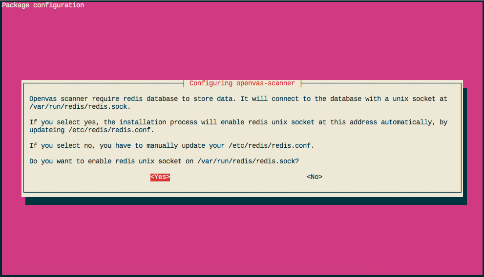
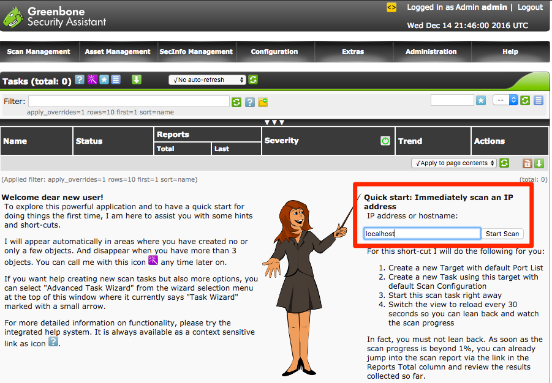
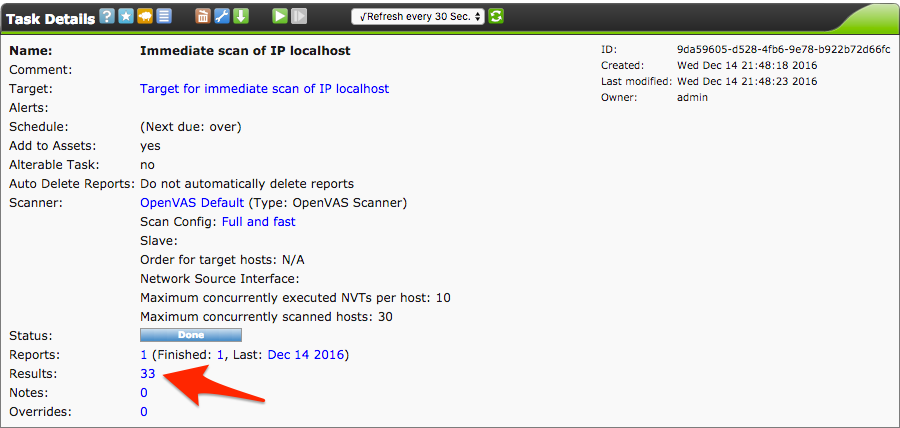
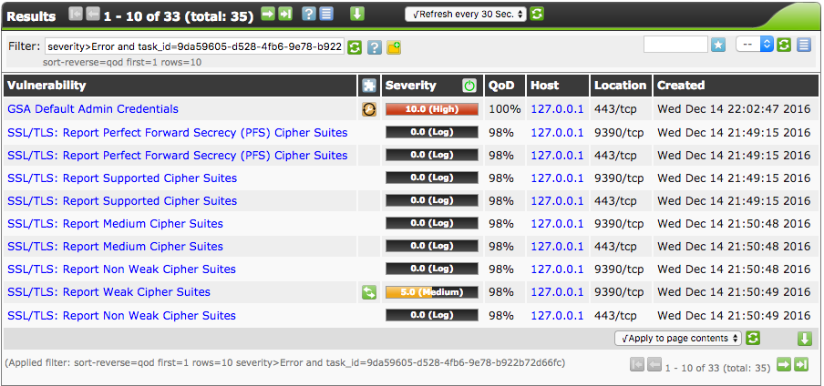
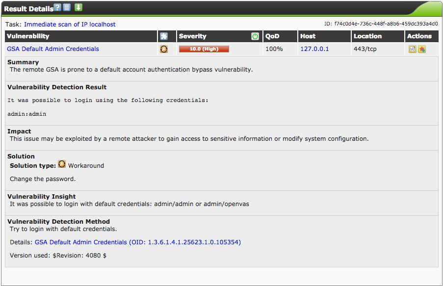

OpenVAS, the Open Vulnerability Assessment System, is a framework of tools that allow you to scan your system for thousands of known vulnerabilities. This guide will show you how to install OpenVAS 8 on Ubuntu 16.04.

OpenVAS consists of:

* a database that stores results and configurations;
* a regularly updated feed of Network Vulnerability Tests (NVTs);
* a scanner, which runs the NVTs;
* the Greenbone Security Assistant, a graphical interface that allows you to manage vulnerability scans from a web application.

For more information about the architecture of the software, refer to the [OpenVAS website](http://www.openvas.org/software.html).


OpenVAS is a powerful security tool that is capable of scanning remote hosts as well as your local machine. This guide is intended to allow you to monitor vulnerabilities on machines that you control or have permission to scan. If you use OpenVAS to scan remote servers owned by others, be sure that you have a full understanding of the responsibilities involved and the potential consequences.


## Before You Begin

1.  If you have not already done so, create a Linode account and Compute Instance. See our [Getting Started with Linode](/docs/guides/getting-started/) and [Creating a Compute Instance](/docs/guides/creating-a-compute-instance/) guides.

1.  Follow our [Setting Up and Securing a Compute Instance](/docs/guides/set-up-and-secure/) guide to update your system. You may also wish to set the timezone, configure your hostname, create a limited user account, and harden SSH access.


This guide is written for a non-root user. Commands that require elevated privileges are prefixed with `sudo`. If you’re not familiar with the `sudo` command, see the [Users and Groups](/docs/guides/linux-users-and-groups/) guide.


## Install OpenVAS

The `openvas` repository and its packages are not officially supported by Ubuntu. If you'd like to review its contents, signing key, and fingerprint before installing OpenVAS, you can do so in the [Ubuntu package archive](https://launchpad.net/~mrazavi/+archive/ubuntu/openvas).

1.  Since OpenVAS is not included in the default Ubuntu repositories, install its PPA:

        sudo apt install software-properties-common
        sudo add-apt-repository ppa:mrazavi/openvas

    The first command installs the `software-properties-common` package, which is required for adding certain repositories. The second command will output a list of instructions for how to install OpenVAS. We'll explain each of these instructions in the following steps. You don't need to explicitly import the GPG key, as it will be added to your keyring automatically with the second command. However, you should verify that your output includes:

        gpg: key 4AA450E0: public key "Launchpad PPA for Mohammad Razavi" imported

2.  After adding the repository, update your system packages and install the `openvas` package:

        sudo apt update
        sudo apt install openvas

    When installing `openvas`, you'll be prompted to configure a Redis database for application data, such as tasks and configurations. Select **Yes** when asked if you'd like to add a socket at `/var/run/redis/redis.sock`:

    

3.  Install the SQLite 3 database package. This is used to store the [Common Vulnerabilities and Exposures (CVE)](https://cve.mitre.org/) data we'll obtain in Step 5:

        sudo apt install sqlite3

4.  Sync the OpenVAS NVT feed. This allows your installation to access tests for the most current vulnerabilities and exposures:

        sudo openvas-nvt-sync

    
This feed is maintained by OpenVAS and is updated about once per week. To keep your NVT feed current, we recommend running this command regularly, or setting up a [cron job](/docs/guides/schedule-tasks-with-cron/) to automate the process.


5.  Sync Security Content Automation Protocol (SCAP) and Computer Emergency Readiness Team (CERT) vulnerability data to a local database. The synchronization will take several minutes, and you can monitor its progress in the output:

        sudo openvas-scapdata-sync
        sudo openvas-certdata-sync

6.  Restart the OpenVAS scanner and manager:

        sudo service openvas-scanner restart
        sudo service openvas-manager restart

7.  Finally, rebuild the OpenVAS database, so the manager can access the NVT data downloaded previously:

        sudo openvasmd --rebuild --progress

## Configure OpenVAS

### Remote Access

To access the Greenbone Security Assistant web interface remotely, you must configure it to listen on your Linode's public IP address. You can do so by editing its configuration file under the `/etc/init.d/openvas-gsa`, and specifying your public IP address on the `DAEMON_ARGS` line. Replace `198.51.100.221` with your Linode's public address:


DAEMON_ARGS= --listen "198.51.100.221"



Save your changes, then restart `openvas-gsa`:

    sudo service openvas-gsa restart

### User Authentication for OpenVAS

OpenVAS is now installed, and you're almost ready to start using it to scan for vulnerabilities. However, you should first change the default password to prevent unauthorized access.

From your Linode, replace `your_password` in the following example with your new password:

    sudo openvasmd --user=admin --new-password=your_password

This changes the password for the `admin` user to a value of your choosing. You can also create a new administrative user by replacing `new_user` in the following command:

    sudo openvasmd --create-user=new_user

This method creates a random password even if you specify one. To change the password for a newly created user, use the syntax of the first command, substituting the username and your desired password. To create a new guest user without admin privileges, use the `gsad` (Greenbone Security Assistant Daemon) tool:

    sudo gsad --guest-username=new_user --guest-password

Replace `new_user` and `your_password` with the appropriate values. For a complete list of administrative features available with the OpenVAS CLI, use `openvasmd --help` and `gsad --help`.

## Scan Your System with OpenVAS

Congratulations! OpenVAS is now ready to use. In this section, we'll provide a basic tutorial for both logging into the Greenbone Security Assistant (GSA) web application and running a basic vulnerability scan.

1.  On your local computer, navigate to your Linode's IP address or domain name in a web browser. You should be proxied to the GSA Login page.

    In most browsers, you will first encounter a security warning. This happens because OpenVAS generates a self-signed SSL certificate upon installation and your host is not recognized as a trusted certificate authority.

    To verify the certificate in Chrome:

    -   Click the warning icon next to `https://` in the URL bar, and choose "Details" under the message that is displayed.
    -   In the "Security Overview" pane, click the "View Certificate" button.
    -   A small window will appear with information about the self-signed certificate. Click "Details" to expand the window and show more information.
    -   Scroll to the bottom and find the `SHA 1` Fingerprint.
    -   On your Linode, run `sudo openssl x509 -noout -in /var/lib/openvas/CA/servercert.pem -fingerprint -sha1`.
    -   Compare the two fingerprints. If they match, it's safe to ignore the warning and proceed.

    To verify the certificate in Firefox:

    -   Click the "Advanced" button on the warning page in your browser.
    -   Additional details will be displayed, including an error code, which will be something like `SEC_ERROR_UNKNOWN_ISSUER`. Click the error code to view more information.
    -   A pane will be displayed with the "Certificate Chain" for your server.
    -   On your Linode, run `cat /var/lib/openvas/CA/servercert.pem` and look for the `-----BEGIN CERTIFICATE-----` line in the output.
    -   Compare the two certificates to ensure they match. If they do, it's safe to click "Add Exception" and proceed.

2.  The next page you see will be a login for the Greenbone Security Assistant, the graphical web interface for the OpenVAS manager. Once the page appears on you screen, enter the credentials for your `admin` user and click "Login."

    

3.  The welcome screen will display instructions on how to use the tool. OpenVAS uses "Tasks" to manage scans, but to start running one right away, simply enter a hostname or IP address in the text box under "Quick Start," and then click "Start Scan." This schedules a scan of the specified host to start immediately and sets the page contents to refresh every 30 seconds, so you can see the progress in real time.

    

    
The Quick Start screen will not appear on login after you've scheduled 3 or more tasks. To access this screen at any time, click the "Scan Management" tab at the top of the screen, select "Tasks," and hover over the purple magic wand icon in the top bar. From there, you can select "Task Wizard" or "Advanced Task Wizard" to create a new task quickly and easily.


4.  The reports showing results of your tasks can be accessed at any time while the scan is in progress. The time a scan takes to complete will depend on the services running on a host, and may vary significantly. To view the results of a scan, select "Scan Management" in the top navigation bar, and click "Reports."

    To view the details of a specific task, click its name under "Task." In the example below, it was called "Immediate scan of IP localhost" when we created it with the Task Wizard:

    

5.  A "Task Details" screen will be displayed, showing information such as status, and the number of vulnerabilities detected. To view the details of any vulnerabilities that were found, click the number next to "Results." In our example, there were 33:

    

6.  The "Results" page will list potential vulnerabilities found in the scan. To sort them, click the heading of any column at the top of the page. Note that if you run scans on multiple servers, you'll need to sort the results by host to determine which servers are affected by vulnerabilities.

    

    To view details of a vulnerability, such as the method of detection, impact to your system, and in some cases a solution, click the name of the vulnerability. In the example below, OpenVAS has detected that we haven't changed the default login credentials, and it tells us how to resolve the issue:

    

    Once you resolve a vulnerability, return to the "Tasks" screen, and click the green play button icon under "Actions" to run the scan again. When the task completes, the vulnerability should no longer be present in your results.

## Troubleshooting

Occasionally, you may receive a *502 Bad Gateway* error when you try to connect via browser. In most cases, this is caused by one of the OpenVAS daemons stopping.

To check for problems:

    sudo netstat -plntu

Your output should include the following lines:

    Proto Recv-Q Send-Q Local Address           Foreign Address         State       PID/Program name
    tcp        0      0 0.0.0.0:9391            0.0.0.0:*               LISTEN      3579/openvassd: Wai
    tcp6       0      0 :::443                  :::*                    LISTEN      7046/gsad
    tcp6       0      0 :::9390                 :::*                    LISTEN      3577/openvasmd

These lines represent the OpenVAS scanner, the Greenbone Security Assistant, and the OpenVAS manager, respectively. If one of these lines is not present, simply start the daemon and try to reconnect. For example, if the `gsad` program is stopped, run `sudo service openvas-gsa restart`. Here are the names of the relevant daemons, as well as the commands you can use to restart them:

| Program Name | Command to Restart                   |
| -------------|--------------------------------------|
| openvassd    | sudo service openvas-scanner restart |
| openvasmd    | sudo service openvas-manager restart |
| gsad         | sudo service openvas-gsa restart     |
