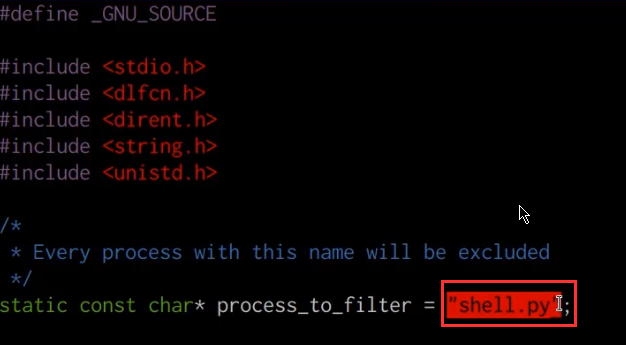





## Before You Begin

In order to follow along with the tools and techniques utilized in this document, you will need to use one of the following offensive Linux distributions:

- Kali Linux

- Parrot OS

The following is a list of recommended technical prerequisites that you will need in order to get the most out of this course:

- Familiarity with Linux system administration.

- Familiarity with Windows.

- Functional knowledge of TCP/IP.

- Familiarity with penetration testing concepts and life-cycle.

Note: The techniques and tools utilized in this document were performed on Kali Linux 2021.2 Virtual Machine

## MITRE ATT&CK Defense Evasion Techniques

Defense Evasion consists of techniques that adversaries use to avoid detection throughout their compromise. Techniques used for defense evasion include uninstalling/disabling security software or obfuscating/encrypting data and scripts. Adversaries also leverage and abuse trusted processes to hide and masquerade their malware. Other tactics’ techniques are cross-listed here when those techniques include the added benefit of subverting defenses.

The techniques outlined under the Defense Evasion tactic provide us with a clear and methodical way of evading detection on a target system.

The following is a list of key techniques and sub techniques that we will be exploring:

- Rootkits

## Scenario

Our objective is to hide our reverse shell connection process on the target Linux system in order to avoid detection.

## Hiding Linux Processes With Libprocesshider

We can leverage Rootkits on Linux systems to hide our processes from the process tree in order to avoid detection by system administrators or security analysts.

This can be very helpful during red team engagements on Linux targets, primarily because suspicious processes can be easily identified in the process tree and consequently terminated by the blue team or security analysts.

We can accomplish this through the use of various Linux rootkits, however, we also want to avoid setting up any advanced Rootkits that can be detected by Linux rootkit checkers or AV scanners.

For this reason, we will be utilizing an open-source Linux utility called Libprocesshider that will allow us to hide a process on a Linux target by leveraging the ld preloader.

GitHub Repository: https://github.com/gianlucaborello/libprocesshider

1. The first step in the process will involve cloning the Libprocesshider GitHub repository onto the target system. This can be done by running the following command:

        git clone https://github.com/gianlucaborello/libprocesshider.git

1. After cloning the repository you will need to determine the name of the process you would like to hide with Libprocesshider, this can be done by listing out the running processes on the system:

        ps aux

    In this case, I will be hiding the “shell.py” process as highlighted in the following screenshot.

    

1. In order to hide the “shell.py” process from the process tree, we will need to navigate to the Libprocesshider directory we just cloned and modify the “processhider.c” file. This can be done by running the following command:

        vim processhider.c

1. You will then need to modify the “process_to_filter” value to the name of the process you would like to hide as shown in the screenshot below.

    

    In this case, I will be hiding any occurrences of the “shell.py” process from the process tree. After making the change, you can save the file.

1. The next step will involve compiling the “processhider.c” file in to a shared object file, this can be done by running the following command:

        make

1. The compilation will produce a shared object file called “libprocesshider.so” as shown in the following screenshot.

    

1. We will need to transfer this shared object file into the /usr/local/lib directory, this can be done by running the following command:

        mv libprocesshider.so /usr/local/lib

1. We will then need to load the “libprocesshider.so” shared object with the global dynamic linker, this can be done by running the following command:

        echo /usr/local/lib/libprocesshider.so >> /etc/ld.so.preload

1. We can now confirm that the “shell.py” process is hidden from the process tree by executing the script and listing out the running processes:

        ./shell.py
        ps aux

    

    As shown in the preceding screenshot the active “shell.py” process is not displayed in the process tree and will therefore evade any detection by administrators or system analysts.