



## Before You Begin

In order to follow along with the tools and techniques utilized in this document, you will need to use one of the following offensive Linux distributions:

- Kali Linux

- Parrot OS

The demonstrations outlined in this document were performed against a vulnerable Linux VM that has been configured to teach you the process of exploitation and privilege escalation. It can be downloaded here: https://www.vulnhub.com/entry/raven-1,256/

The following is a list of recommended technical prerequisites that you will need in order to get the most out of this course:

- Familiarity with Linux system administration

- Familiarity with Windows

- Functional knowledge of TCP/IP

- Familiarity with penetration testing concepts and life-cycle

Note: The techniques and tools utilized in this document were performed on Kali Linux 2021.2 Virtual Machine

## MITRE ATT&CK Exploitation and Initial Access Techniques

Initial Access consists of techniques that use various entry vectors to gain their initial foothold within a network. Techniques used to gain a foothold include targeted spear phishing and exploiting weaknesses on public-facing web servers. Footholds gained through initial access may allow for continued access, like valid accounts and use of external remote services, or maybe limited use due to changing passwords.

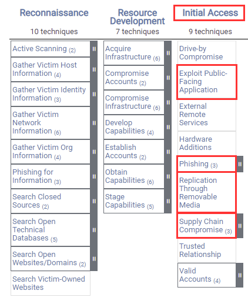

The techniques outlined under the Initial Access tactic provide us with a clear and methodical way of obtaining an initial foothold on the target system, however, as you may have noticed, some techniques such as “Trusted Relationship” will require physical contact with employees and the target organization. In this case, given the nature of our engagement, we will only be focusing on digital initial access vectors exploiting a public-facing Linux server.

The following is a list of key techniques and sub techniques that we will be exploring:

- Exploiting a public-facing application

In this case, we will be exploiting a public-facing Linux server that is used to host a web application.

## Attack Scenario

Our objective is to identify and exploit vulnerabilities in the target web application in order to obtain an initial foothold on our target system.

## Infrastructure

The following diagram illustrates the various operating systems we will using and their requirements.

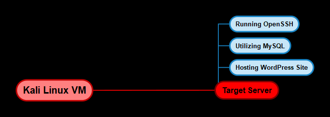

### Target System

Given that we are targeting a Linux server that is hosting a web application, we will require a target VM that has been set up to emulate a typical web server. In this case, we will be utilizing a vulnerable Linux VM that has been configured to teach you the process of exploitation and privilege escalation. It can be downloaded here: https://www.vulnhub.com/entry/raven-1,256/

Now that you have an idea of our infrastructure, we can begin the process by taking a look at how to gain initial access to our target system.

## Port Scanning

The first step in the exploitation phase will involve scanning the target server for open ports and enumerating the services and their respective service versions running on the open ports. We briefly explored port scanning in the reconnaissance phase, in this case, we will be taking a closer look at how to scan for open ports and performing enumeration with Nmap.

### Port Scanning with Nmap

We can scan the target server for open ports with Nmap by running the following command in Kali Linux:

    sudo nmap -sS -A -p- -T4 <SERVER-IP> -oN nmap_all.txt

This command will perform a SYN scan (stealth scan) on the entire TCP port range (65,535 ports) and will also enumerate the service versions of the services running on the open ports as well as perform operating system detection.

As shown in the following table and screenshot, the results of the scan revealed that the target server has 4 open ports running the following services:

| Port | Service |
|------|---------|
| 22 | OpenSSH 6.7p1 |
| 80 | Apache httpd 2.4.1.0 |
| 111 | RPC |
| 55995 | RPC |

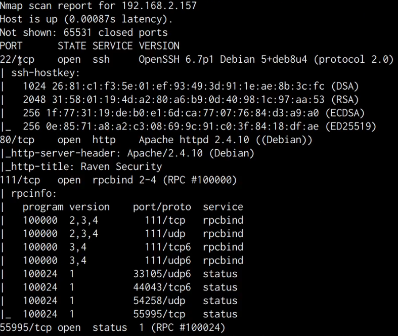

A closer look at the scan reveals that the target is running an Apache webserver on port 80 and is also running SSH on port 22.

We are also able to deduce from the service version banners that the target is running Debian, this information will come in handy during the privilege escalation phase.

In order to learn more about the web server and the web application that it is hosting, we will need to perform some web enumeration.

## Web Server Enumeration

The first step will involve accessing the web server from your browser, in this case the target server is hosting a simple HTML and Bootstrap landing page as shown in the following screenshot.

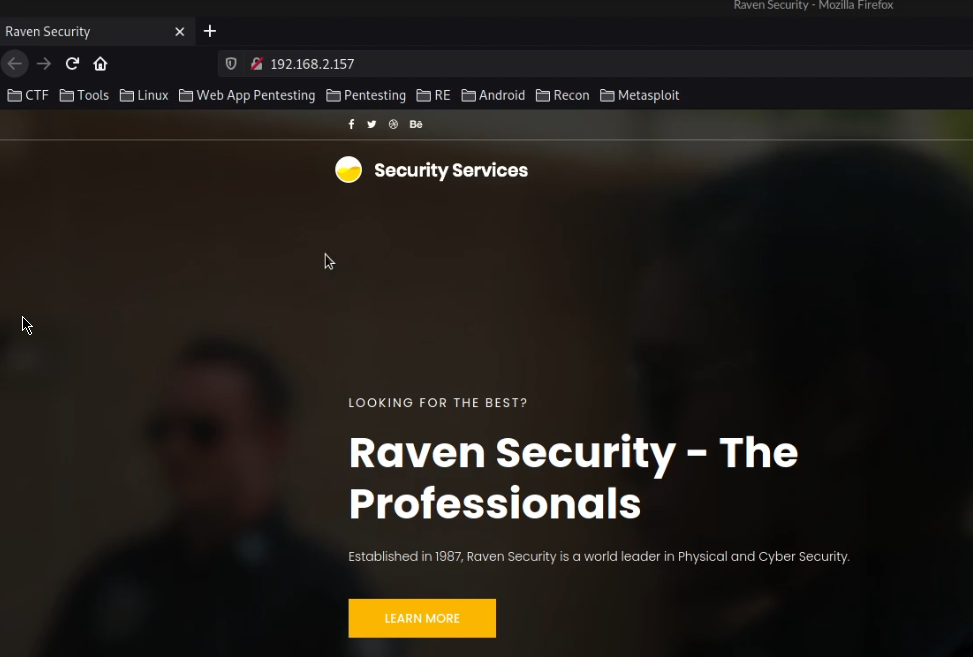

Accessing the robots.txt and sitemap.xml files does not yield any results, consequently, we can perform a directory brute force on the webserver to detect hidden files and directories.

### Directory Brute-Force

We can perform a directory brute-force in order to discover any hidden files and directories on the webserver, this can be facilitated through the use of tools such as:

- Dirb

- Dirbuster

- Gobuster

In this case, we will be using Gobuster as our directory brute-force tool of choice, furthermore, we will also require a collection of wordlists that we can use for our brute-force attack.

In this scenario, we will be using the popular wordlist collection called “SecLists”. You can download or clone this collection of wordlists into your /usr/share/ directory for standardized and easy access.

SecLists is the security tester's companion. It's a collection of multiple types of lists used during security assessments, collected in one place. List types include usernames, passwords, URLs, sensitive data patterns, fuzzing payloads, web shells, and many more. The goal is to enable a security tester to pull this repository onto a new testing box and have access to every type of list that may be needed.

SecLists GitHub Repository: https://github.com/danielmiessler/SecLists

Before you can use Gobuster, you need to make sure it is installed, as it doesn’t come pre-packaged with Kali. This can be done by running the following command:

    sudo apt-get install gobuster -y

We can perform the directory brute-force attack against the web server with Gobuster by running the following command:

    gobuster dir --url http://SERVER-IP --wordlist /usr/share/seclists/Discovery/Web-Content/big.txt

This command will perform a directory-brute force attack on the target web server and will utilize the “big.txt” wordlist that is part of the “SecLists” collection.

As highlighted in the following screenshot, the Gobuster results reveal a WordPress directory that presumably hosts a WordPress installation.

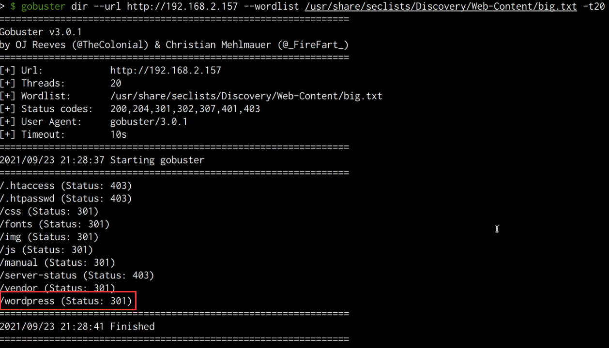

We can check the directory by accessing the directory with a browser, as shown in the following screenshot, accessing the `wordpress` directory reveals a WordPress installation that is still under construction.

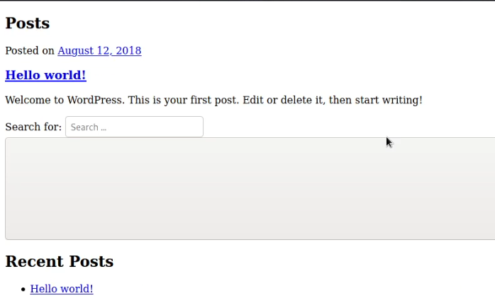

Like any other CMS (Content Management System), WordPress can provide us with a great initial access vector if it has been misconfigured or is outdated. Furthermore, WordPress also utilizes various third-party plugins to extend functionality, plugins can also be vulnerable to specific attacks if they have been poorly developed.

### WordPress Enumeration

We can scan the WordPress installation for vulnerabilities and enumerate important information like users by leveraging a tool called “WPScan”.

WPScan is a WordPress security scanner developed for security professionals and blog maintainers to test the security of their WordPress websites.

We can use WPScan to scan our target WordPress installation for vulnerabilities, additionally, we can also use WPScan to enumerate the user accounts for the WordPress installation. This can be done by running the following command:

    wpscan --url http://SERVER-IP/wordpress --wp-content-dir -at -eu

This command will scan the WordPress installation for vulnerabilities, enumerate installed plugins and enumerate the user accounts.

As highlighted in the following screenshot, the scan results do not reveal any vulnerabilities, however, we are able to obtain two account usernames.

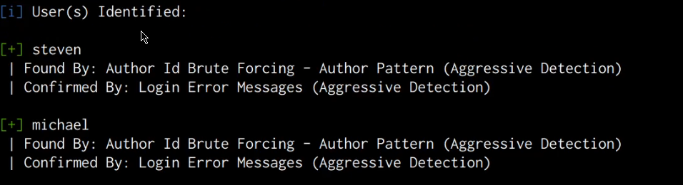

We can use these usernames to perform a brute-force attack on the WordPress authentication page in order to identify the passwords. However, in this case, it would be much more efficient to use these usernames to perform an SSH brute-force attack in order to crack the user account passwords.

Note: We are making an assumption that the WordPress users also have user accounts on the target server. In a real engagement, it is recommended to also perform a brute-force attack on the login page in order to gain access to the WordPress dashboard.

## Cracking SSH Passwords

We can use the usernames we were able to enumerate from the WordPress installation in order to perform an SSH brute-force attack with the hope of cracking the user account passwords for the users Michael and steven.

We can perform an SSH brute-force attack through the use of a utility called Hydra, Hydra is a parallelized network login cracker built in various operating systems like Kali Linux, Parrot and other major penetration testing environments. Hydra works by using different approaches to perform brute-force attacks in order to guess the right username and password combination.

The password we will be cracking first is that of the user “michael”. We can initiate the SSH brute-force attack by running the following command in Kali:

    hydra -l michael -P  /usr/share/wordlists/rockyou.txt ssh://SERVER-IP

Note: The wordlist we will be using for our dictionary brute-force attack is the “Rockyou” wordlist that comes pre-packaged with Kali Linux.

As shown in the following screenshot, the brute-force was successful, and are able to obtain the password for the user “michael”.

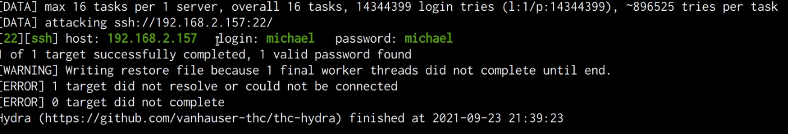

## Gaining Initial Access Via SSH

We can use the cracked password to legitimately connect to the server via SSH, this can be done by running the following command:

    ssh michael@<SERVER-IP>

Entering the cracked password successfully authenticates us with the server and you should now have obtained initial access on the target server as shown in the following screenshot.

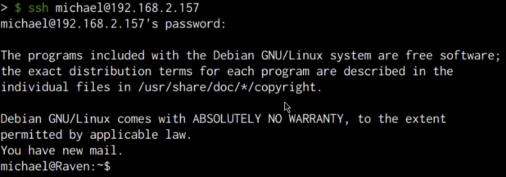

## Local Enumeration

After logging in to the target server, we will need to perform some local enumeration in order to obtain the following information:

- Kernel-version installed

- Distribution release version

- User accounts on the system

- Running services and their respective ports

The first step will involve enumerating the kernel version running on the target system, this can be done by running the following command:

    uname -a

As shown in the following screenshot, the target system is running an outdated Kernel, this information will come in handy during the privilege escalation phase.

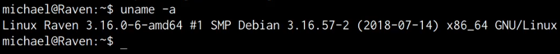

The next step will involve enumerating the Distribution release version, this can be done by running the following command:

    cat /etc/*release

As shown in the following screenshot, the target server is running Debian 8.

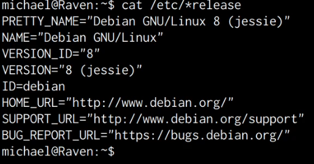

Now that we have an idea of what kernel and distribution is running on the target, we can enumerate the users on the system. This can be done by running the following command:

    cat /etc/passwd

As shown in the following screenshot, in addition to service accounts, we are also able to identify the standard root account and a user account for “steven”.

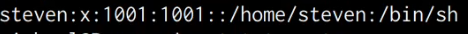

It is also vitally important to enumerate the services running on the target and their respective ports, this can be done by running the following command:

    netstat -antp

The netstat flags used in the preceding command and their functions are explained below:

- `-a` - All

- `-n` - Shows IPs instead of hostnames

- `-t` - Shows only TCP connections

- `-p` - Shows the process IDs and respective names

As shown in the following screenshot, we are able to identify the MySQL service port open and running, however, it appears to have been configured to run locally as opposed to being exposed to the internet.

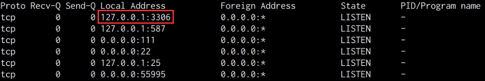

This means that we can authenticate to the MySQL server locally, however, we do not have any authentication credentials.

Upon closer inspection and research, we are able to discover that WordPress utilizes a database for the storage of data, consequently, in this case, it appears that the MySQL database server has been set up for the WordPress site.

## Taking Control Of The MySQL Server

WordPress stored the database credentials in a file called “wp-config.php”, we can navigate to the directory of the file by running the following command:

    cd /var/www/html/wordpress

After navigating the aforementioned directory, we can display the contents of the “wp-config.php” file by running the following command:

    cat wp-config.php

As shown in the following screenshot, we are able to identify the “root” credentials for the MySQL database.

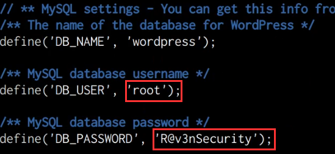

In this case, it appears that the administrator responsible for this server has utilized “root” credentials for the WordPress configuration, as a result, we can log in to the MySQL database server and essentially perform any action as we have the highest privileges. This can be done by running the following command on the target:

    mysql -u root -p

After running this command, you will be prompted to specify the password for the MySQL root user. After typing in the password obtained from the “wp-config.php” file, we are authenticated successfully and now have complete control over the MySQL database server.

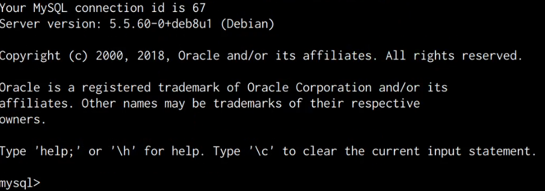

We have now been able to obtain an initial foothold on the target system and take control of the MySQL database server, the next steps will involve elevating our privileges and establishing persistence to maintain access. We will be taking a look at how to do this in the next sections.
