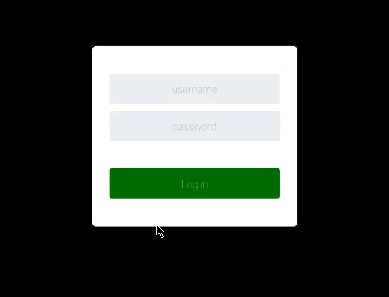





CALDERA™ is a cybersecurity framework designed to easily automate adversary emulation, assist manual red-teams, and automate incident response.

It is built on the MITRE ATT&CK™ framework and is an active research project at MITRE.

## Before You Begin

In order to install and configure Caldera, you will need to have a Linux server with the following tools and utilities installed:

- Python 3.6.1+
- Pip3
- Git

Caldera will also require the following hardware resources in order to function efficiently:

- 8GB+ RAM
- 2+ CPUs

The following is a list of recommended technical prerequisites that you will need in order to get the most out of this course:

- Familiarity with Linux system administration.
- Familiarity with Windows.
- Functional knowledge of TCP/IP.
- Familiarity with penetration testing concepts and life-cycle.

Note: The techniques and tools utilized in this document were performed on an Ubuntu 20.04 server.

Note: The content in this document is based on the official Caldera documentation, and can be accessed here: https://caldera.readthedocs.io/en/latest/index.html

## What is Red Teaming?

A Red team operation is a full-scope simulated attack designed to test the security of a company’s digital infrastructure, employees, applications, and physical security by simulating attacks and techniques used by real adversaries.

Red Team operations are used by companies to measure how well they can withstand an attack from a real adversary. Red Team operations can reveal multiple attack vectors or vulnerabilities that may not be found by performing a penetration test.

Red Team operations replicate the techniques used by real adversaries over a full attack lifecycle and provide actionable results to the company.

The results are then used by the company’s blue team to write signatures for specific malware or payloads in order to improve their detection, implement security safeguards, harden their infrastructure, patch vulnerabilities, and provide their employees with training to prevent social engineering attacks.

Note: A malware signature is a specific pattern that is used by cybersecurity systems and personnel to recognize malicious threats.

A Blue team is a group of security professionals responsible for identifying vulnerabilities, remediating these vulnerabilities and verifying the effectiveness of the remediations.

Red Team operations can also be used to emulate the techniques used by APT (Advanced Persistent Threat) attacks.

An advanced persistent threat (APT) is a term that is used to describe an attack where the intruder/intruders establish a covert long-term presence on a target network or system with the goal of exfiltrating or destroying sensitive data.

## Red Teaming vs Pentesting

| Red Teaming | Pentesting |
|-------------|------------|
| No defined scope | Defined scope |
| Emulates adversary behavior | Used to identify and exploit vulnerabilities |
| Used to assess the resilience of an organization against adversaries attacks. | Provides a report of findings that are consequently used by companies to patch, harden and secure their infrastructure |
| Provides actionable results that can be used for detection. | Preventative as opposed to detective. Penetration tests are useful at identifying vulnerabilities and threats, however, they do not provide actionable results that can be used for proactive detection of threats in the future. |

## What is Adversary Emulation?

Adversary emulation is the process of emulating the tactics, techniques, and behavior of a specific adversary.

The objective of adversary emulation is to assess and improve how resilient an organization is against specific adversary techniques/attacks.

 Adversary behavior is classified using Tactics, Techniques, and Procedures (TTP).

Adversary TTPs are used to outline how a specific adversary operates.

An adversary emulation should be based on the adversary TTPs, In order to facilitate an accurate adversary attack.

Adversary emulation should follow a structured methodology/kill chain.

## Red Team Kill-Chain

The *red team kill-chain* is a structured methodological cybersecurity model that is used to break down the structure of an attack into various phases. It is used to help cybersecurity teams and personnel understand how attacks work, how they are structured and the tactics utilized by adversaries at each stage.

We will be exploring the following stages of the Red Team kill-chain in this series:

1. Adversary emulation

1. Reconnaissance

1. Gaining access/initial compromise

1. Privilege escalation

1. Persistence

1. Lateral movement

## What is the MITRE ATT&CK Framework?

MITRE ATT&CK® is a globally accessible knowledge base of adversary tactics and techniques based on real-world observations. The ATT&CK knowledge base is used as a foundation for the development of specific threat models and methodologies in the private sector, in government, and in the cybersecurity product and service community. - (https://attack.mitre.org/)

## MITRE ATT&CK Tactics and Techniques

The MITRE ATT&CK framework provides us with a structured kill chain that we can utilize for our adversary emulation.

- Tactics categorize each step of the adversary’s attack methodology.

- Techniques represent the various steps/procedures that can be utilized for each tactic.

## MITRE Caldera

Caldera is a cybersecurity framework designed to easily automate adversary emulation, assist manual red teams, and automate incident response.

It is built on the MITRE ATT&CK framework and utilizes a client-server system, where the server is used to set up agents(clients) and initiate operations.

The framework consists of two components:

1. The core system. This is the framework code, consisting of what is available in this repository. Included is an asynchronous command-and-control (C2) server with a REST API and a web interface.

1. Plugins. These repositories expand the core framework capabilities and provide additional functionality. Examples include agents, reporting, collections of TTPs, and more.

- Caldera GitHub repository: https://github.com/mitre/caldera

- Caldera Documentation: https://caldera.readthedocs.io/en/latest/

## Caldera Essential Terminology

In order to fully realize the potential of the framework, you will need to familiarise yourself with the following terminology:

1. Ability – An ability is a specific ATT&CK tactic/technique implementation that can be executed on running agents. Abilities will include the command(s) to run, the platforms/executors the commands can run on (ex: Windows / PowerShell), payloads to include, and a reference to a module to parse the output on the CALDERA server.

1. Adversary – Adversary profiles are groups of abilities, representing the tactics, techniques, and procedures (TTPs) available to a threat actor. Adversary profiles are used when running an operation to determine which abilities will be executed.

1. Agents – Agents are software programs installed on target hosts/clients that connect back to CALDERA at certain intervals to get instructions. Agents communicate with the CALDERA server via a contact method, initially defined at agent install.

    Agents can be installed on the various target hosts/clients that you would like to run operations on.

1. Groups – Collection of agents, either based on OS or function. Agents can be placed into a group, either by installation through command-line flags or by editing the agent in the UI. These groups are used when running an operation to determine which agents to execute abilities on.

The following diagram outlines the Caldera infrastructure and how the Caldera server and agents interact with each other:

Now that you have an understanding of the terminology utilized by Caldera, we can begin the process of setting up and configuring Caldera on our server.

## Setting Up Caldera

Setting up Caldera is relatively simple, provided that you have installed the required dependencies on the target system.

In order to get Caldera up and running, follow the procedures outlined below:

1. The first step in this process will involve cloning the Caldera GitHub repository onto your Linux server, this can be done by running the following command:

        git clone https://github.com/mitre/caldera.git

1. After cloning the repository, you will now need to navigate into the Caldera directory we just cloned.

1. You will now need to install the various python modules and dependencies required for Caldera to function correctly, this can be done by running the following command:

        pip3 install -r requirements.txt

1. After installing the dependencies, you should be able to start the Caldera server, however, before starting the server, you should familiarise yourself with the Caldera configuration file. It can be found under the following directory:

        conf/default.yml

    Your configuration file should look similar to the code snippet below.

    
ability_refresh: 60
api_key_blue: BLUEADMIN123
api_key_red: ADMIN123
app.contact.dns.domain: mycaldera.caldera
app.contact.dns.socket: 0.0.0.0:8853
app.contact.gist: API_KEY
app.contact.html: /weather
app.contact.http: http://0.0.0.0:8888
app.contact.slack.api_key: SLACK_TOKEN
app.contact.slack.bot_id: SLACK_BOT_ID
app.contact.slack.channel_id: SLACK_CHANNEL_ID
app.contact.tunnel.ssh.host_key_file: REPLACE_WITH_KEY_FILE_PATH
app.contact.tunnel.ssh.host_key_passphrase: REPLACE_WITH_KEY_FILE_PASSPHRASE
app.contact.tunnel.ssh.socket: 0.0.0.0:8022
app.contact.tunnel.ssh.user_name: sandcat
app.contact.tunnel.ssh.user_password: s4ndc4t!
app.contact.ftp.host: 0.0.0.0
app.contact.ftp.port: 2222
app.contact.ftp.pword: caldera
app.contact.ftp.server.dir: ftp_dir
app.contact.ftp.user: caldera_user
app.contact.tcp: 0.0.0.0:7010
app.contact.udp: 0.0.0.0:7011
app.contact.websocket: 0.0.0.0:7012
crypt_salt: REPLACE_WITH_RANDOM_VALUE
encryption_key: ADMIN123
exfil_dir: /tmp/caldera
host: 0.0.0.0
plugins:
- access
- atomic
- compass
- debrief
- fieldmanual
- gameboard
- manx
- response
- sandcat
- stockpile
- training
port: 8888
reports_dir: /tmp
auth.login.handler.module: default
requirements:
  go:
    command: go version
    type: installed_program
    version: 1.11
  python:
    attr: version
    module: sys
    type: python_module
    version: 3.7.0
users:
  blue:
    blue: admin
  red:
    admin: admin
    red: admin


    The configuration file contains all relevant information pertaining to your Caldera server, you can customize the fields based on your environmental requirements.

    More information regarding the configuration file and the various Caldera server options that can be customized can be found here: https://caldera.readthedocs.io/en/latest/Server-Configuration.html

    It also allows you to configure the access credentials for the Caldera web interface, as highlighted in the code snippet below.

    
users:
  blue:
    blue: admin
  red:
    admin: admin
    red: admin


    It is recommended to change the default admin password with one that is stronger and secure.

1. After making changes to the file, save it and navigate back to the root of the Caldera directory, in this case, we will be utilizing the default configuration.

1. We can initialize the Caldera server by running the following command:

        python3 server.py --insecure

    This will start the server and provide you with diagnostic output that can be used to troubleshoot any errors or issues you may experience.

    If the Caldera server initiates correctly, you should receive output similar to the output shown in the screenshot below:

    

1. Once the server is started you can access the Caldera web interface by accessing your server’s public IP on port 80 as outlined below:

        http://server-ip:8888

    If Caldera was configured and set up correctly, you should be greeted by a login form similar to the one shown in the screenshot below.

    

1. You will need to log in using the following credentials: red/admin. You will then be directed to the Caldera web interface as shown in the screenshot below.

    

    Now that we have successfully set up Caldera, we can begin exploring the UI and the functionality.

## Getting Familiar with Caldera

The Caldera web interface is simple to use and provides the user with a well-categorized sidebar that contains all the relevant menu items sorted based on their functionality and relevance.

The sidebar is collapsed by default and can be expanded by clicking on the hamburger icon on the top-left of the screen as highlighted in the screenshot below.

Expanding the sidebar reveals a list of menu items grouped together based on their purpose and relevance to a red team operation or adversary emulation, as highlighted in the following screenshot.

The Campaigns category is composed of agents, adversaries, and operations and can be used to set up the various agents, adversaries, and operations pertinent to the red team operation or adversary emulation.

The Plugins category contains a list of all active plugins and provides you with a quick and easy way of accessing the functionality of the respective active plugins.

The Advanced category contains various reporting, planning, and stored data pages that can be used to manage, sort, and report data gathered from your operations.

The Administrative category is used to view startup errors and allows users to log out of their current session.

Now that you have an understanding of how the Caldera interface works and the various menu items that can be utilized, let us take a look at how to add agents.

## Adding Agents to Caldera

The following diagram illustrates the Caldera infrastructure and how agents interact with the Caldera server.

To deploy an agent:

1. Navigate to the Agents tab and click the “Click here to deploy an agent” button as highlighted in the following screenshot.

    

1. Choose an agent (Sandcat is a good one to start with) and a platform (operating system) as highlighted in the following screenshots.

    
Note: Sandcat, also referred to as 54ndc47 is a remote access agent written in GoLang for cross platform compatibility, and is the agent we will deploy on the endpoint(s) we want to execute our operations against.


    

    

1. Make sure the agent options are correct (ex: ensure app.contact.http matches the expected host and port for the CALDERA server).

    

    The `agents.implant_name` field is used to specify the base name of newly-spawned agents. If necessary, an extension will be added when an agent is created (ex: `splunkd` will become `splunkd.exe` when spawning an agent on a Windows machine).

1. Choose a command to execute on the target machine as highlighted in the following screenshot.

    

1. In order to execute the agent, paste the command into the terminal of the Linux target.

1. The new agent should appear in the table on the Agents tab, as highlighted in the following screenshot.

    

    To kill an agent, use the “Kill Agent” button under the agent-specific settings. The agent will terminate on its next beacon.

    Beacon Timers are used to set the minimum and maximum seconds the agent will take to beacon home. These timers are applied to all newly-created agents.

    Note: The terminate option is used to terminate the agent session and will prevent any callbacks.

    To remove the agent from CALDERA (will not kill the agent), click the red X. Running agents removed from CALDERA will reappear when they check-in.

    

### Agent Settings

You can customize the default agent options by navigating to the agents tab on the sidebar, after which you will be greeted with the agent options configuration panel as highlighted in the following screenshot.

- **Beacon Timers**: Set the minimum and maximum seconds the agent will take to beacon home. These timers are applied to all newly-created agents.

- **Watchdog Timer**: Set the number of seconds to wait, once the target agent is unreachable, before killing an agent. This timer is applied to all newly-created agents.

- **Untrusted Timer**: Set the number of seconds to wait before marking a missing agent as untrusted. Operations will not generate new links for untrusted agents. This is a global timer and will affect all running and newly-created agents.

- **Implant Name**: The basename of newly-spawned agents. If necessary, an extension will be added when an agent is created (ex: `splunkd` will become `splunkd.exe` when spawning an agent on a Windows machine).

- **Bootstrap Abilities**: A comma-separated list of ability IDs to be run on a new agent beacon. By default, this is set to run a command which clears command history.

- **Deadman Abilities**: A comma-separated list of ability IDs to be run immediately prior to agent termination. The agent must support deadman abilities in order for them to run.

Agents have a number of agent-specific settings that can be modified by clicking on the button under the ‘PID’ column for the agent as highlighted in the following screenshot.

- **Group**: Agent group

- **Sleep**: Beacon minimum and maximum sleep timers for this specific agent, separated by a forward slash (/)

- **Watchdog**: The watchdog timer setting for this specific agent

## Adversaries

Adversary profiles can be accessed by navigating to the Adversary tab and clicking on the “Select an existing profile” drop-down menu as highlighted in the following screenshot.

Selecting an adversary profile from the drop-down menu will display the adversary name, description, and abilities associated with the selected adversary profile.

Alternatively, you can also create your own adversary profile with custom abilities by clicking on the toggle button from “view” to “add” as highlighted in the following screenshot.

After you have provided your profile with a name and description, you can add abilities to the profile by clicking on the “add ability” button as highlighted in the preceding screenshot.

Abilities can be added to a custom profile by searching for an ability or by specifying a particular tactic pertinent to the functionality of the ability.

Once you have created your custom ability, you can utilize it for a specific operation. Alternatively, you can also utilize the pre-build adversary profiles if they meet your requirements.

## Operations

An operation can be started with a number of optional configurations as highlighted in the following screenshot.

The following list provides a list of the operation options you can modify and what their respective use cases are.

- **Group**: Which collection of agents would you like to run against.

- **Adversary**: Which adversary profile would you like to run

- **Auto-close**: Automatically close the operation when there is nothing left to do. Alternatively, keep the operation forever.

- **Run immediately**: Run the operation immediately or start in a paused state

- **Autonomous**: Run autonomously or manually. Manual mode will ask the operator to approve or discard each command.

- **Planner**: You can select which logic library - or planner - you would like to use.

- **Fact source**: You can attach a source of facts to an operation. This means the operation will start with “pre-knowledge” of the facts, which it can use to fill in variables inside the abilities.

- **Cleanup timeout**: How many seconds to wait for each cleanup command to complete before continuing.

- **Obfuscators**: Select an obfuscator to encode each command with, before they are sent to the agents.

- **Jitter**: Agents normally check in with CALDERA every 60 seconds. Once they realize they are part of an active operation, agents will start checking in according to the jitter time, which is by default 2/8. This fraction tells the agents that they should pause between 2 and 8 seconds (picked at random each time an agent checks in) before using the next ability.

- **Visibility**: How visible should the operation be to the defense. Defaults to 51 because each ability defaults to a visibility of 50. Abilities with a higher visibility than the operation visibility will be skipped.

After starting an operation, users can export the operation report in JSON format by clicking the “Download report” button in the operation GUI modal.

We have been able to successfully run our first adversary emulation exercise with Caldera, you should now be able to add an agent, add or customize a profile and run an operation against an agent with Caldera.
