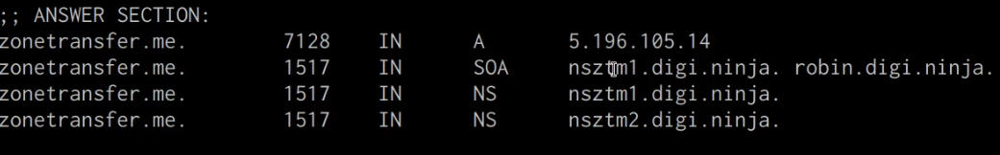
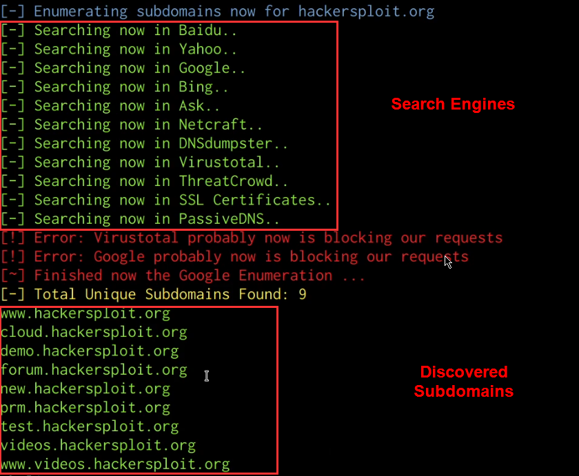





## Before You Begin

In order to follow along with the tools and techniques utilized in this document, you will need to use one of the following offensive Linux distributions:

- Kali Linux

- Parrot OS

The following is a list of recommended technical prerequisites that you will need in order to get the most out of this course:

- Familiarity with Linux system administration.

- Familiarity with Windows.

- Functional knowledge of TCP/IP.

- Familiarity with penetration testing concepts and life-cycle.

Note: The techniques and tools utilized in this document were performed on Kali Linux 2021.2 Virtual Machine

## What is Reconnaissance?

Reconnaissance consists of techniques that involve adversaries actively or passively gathering information that can be used to support targeting. Such information may include details of the victim organization, infrastructure, or staff/personnel. This information can be leveraged by the adversary to aid in other phases of the adversary lifecycle, such as using gathered information to plan and execute Initial Access, to scope and prioritize post-compromise objectives, or to drive and lead further Reconnaissance efforts. – MITRE Website

Reconnaissance is split up into 2 categories based on the type of interaction with the target:

1. Active reconnaissance – Actively engaging/interacting with the target network, hosts, employees etc. (Port scanning, vulnerability scans, web app scanning)

1. Passive reconnaissance – Utilizing publicly available information. (whois, OSINT, DNS, search engine dorks)

A search engine dork refers to search engine syntax which allows users to filter the type of results they get.

The objective of reconnaissance is to gather as much information as possible from the target in order to get a clear picture of the organizational structure, digital infrastructure and employees. This information is then utilized in preparation for initial access/exploitation.

We will be taking a look at the various tools and techniques that can be utilized to perform both passive and active reconnaissance, however, before we begin taking a look at the techniques, we need to get an understanding of the Reconnaissance MITRE ATT&CK framework tactic and the various techniques that fall under it.

## MITRE ATT&CK Reconnaissance Techniques

The techniques outlined under the Reconnaissance tactic provide us with a clear and methodical way of approaching reconnaissance, however, as you may have noticed, some techniques will involve physical reconnaissance of employees and physical addresses. In this case, given the nature of our engagement, we will only be focusing on digital reconnaissance.

The following is a list of key techniques and sub-techniques that we will be exploring:

1. Active Scanning

    - Port Scanning

    - Vulnerability scanning

    - Website Directory brute-force

1. Search Open Technical Databases

    - Search Engines

    - Social Networks

1. Search Open Website/Domains

    - Whois information

    - DNS records

    - Subdomain enumeration

    - Discover web technologies and stacks utilized

    - Identify vulnerabilities

1. Gather Victim Identity Information.

    - Emails

    - Credentials

    - Employee Names

1. Gather Victim Network Information

    - Domain properties

    - DNS

    - Third party domains

    - Network topology

    - IP addresses

    - Security infrastructure

The techniques outlined above will fall under passive or active recon based on the type of information we will be gathering and the nature of our engagement with the target organization’s digital infrastructure.

We will begin the recon process by taking a look at the various techniques and the manual tools that can be utilized to enumerate and scan for information. We will then conclude by exploring various scripts, tools and frameworks that can automate the entire recon process for us.

## Passive Recon Techniques

Passive reconnaissance involves utilizing publicly available information sources like search engines and databases to find and identify information about our target domain or organization.

Additionally, passive recon does not actively engage or interact with the company’s/target’s digital infrastructure, hence the name passive.

### Gathering Domain IP/DNS Information

The first step in this process is to identify the IP address and DNS records of your target domain, this can be done by utilizing the following tools:

1. Host utility

1. Nslookup

1. DNSRecon

1. Dig

#### Host utility

We can use the host utility on Linux/Unix systems to determine the IP address of our target domain, this can be done  by running the following command on your Kali Linux VM:

    host DOMAIN.COM

The host utility will output all relevant IPV4 and IPV6 addresses associated with the target domain, as highlighted in the following screenshot.

#### Nslookup

We can use the Nslookup utility to identify the IP address of our target domain, this can be done by running the following command:

    nslookup DOMAIN.COM

The Nslookup utility will output all relevant IPV4 and IPV6 addresses associated with the target domain, as well as the DNS servers utilized for the lookup.

Now that we have been able to identify the IP address of our target domain, we can begin enumerating the DNS information and records of our target domain.

#### DNSRecon

DNSRecon is an extremely useful utility that comes pre-packaged with Kali Linux and can be used to enumerate the DNS records for a particular domain, this information can reveal MX (Mail) server addresses as well as other useful DNS records that can expand our knowledge of the targets infrastructure. We can run the DNSRecon utility by running the following command:

    dnsrecon -d https://DOMAIN.COM

The DNSRecon utility should reveal all publicly accessible DNS records for the target domain as highlighted in the following screenshot.

From our results, we were able to identify that our target domain is utilizing CloudFlare’s DNS service for their domain. CloudFlare’s DNS service functions slightly differently than your typical DNS service provider as it also provides proxying and other security features that mask the real IP address of the target domain and acts like a web application firewall.

#### Dig utility

We can also utilize the DNS lookup utility dig, to identify the target domain’s IP address and DNS records, this can be done by running the following command:

    dig DOMAIN.COM

This command will reveal important information like the IP address of the target domain and the relevant nameservers as highlighted in the following screenshot.

You can also enumerate all the DNS records for a particular domain with dig. This can be done by running the following command:

    dig DOMAIN.COM ANY

#### WAF (Web Application Firewall) Detection With Wafw00f

We can identify whether our target domain is currently being protected by a WAF (Web Application Firewall)  by utilizing the Wafw00f utility on Kali Linux, this can be done by running the following command:

    wafw00f https://DOMAIN.COM

As you can see in the following screenshot, the target domain is protected by CloudFlare’s WAF.

### Gathering Domain/Website Information

Now that we have been able to identify our target’s domain IP addresses, name servers and DNS records, we can begin searching for the following information:

Domain registrar and ownership information.
Web technologies and frameworks used on the target website.

#### Whois information

WHOIS is a query and response protocol that is widely used for querying databases that store the registered users or assignees of an Internet resource, such as a domain name, an IP address block or an autonomous system, but is also used for a wider range of other information.

We can utilize the inbuilt whois query utility to identify the target domain’s registrar, ownership and expiry date. This can be done by running the following command:

    whois DOMAIN.COM

As highlighted in the preceding screenshot, we were able to identify the domain registrar, registrant and domain expiry date.

This information can give us an idea of how old the domain is, when it expires and could potentially reveal the hosting provider utilized.
#### Netcraft Site Report

We can also utilize the Netcraft site report tool to find out the infrastructure and technologies used by any site using results from internet data mining.

This can be done by accessing the website: https://sitereport.netcraft.com/ in your browser and typing in the domain of the target as highlighted in the following screenshot.

The results provided by Netcraft are extremely comprehensive and will give you all relevant information pertinent to a website, such as:

- Domain network information

- IP Delegation

- Site technology

As highlighted in the screenshot below, we are able to obtain the target domain’s registrar, registrant, IP address and hosting information.

#### DNS Dumpster

Another great online tool we can use to obtain DNS records, IP addresses and other information pertinent to a target domain is: https://dnsumpster.com.

This can be done by accessing the website: https://dnsdumpster.com in your browser and typing in the domain of the target as highlighted in the following screenshot.

DNS Dumpster will enumerate all the DNS servers, MX records and hosting records of our target domain as highlighted in the following screenshot.

#### Discovering Web Technologies With WhatWeb

WhatWeb identifies websites. Its goal is to answer the question, "What is that Website?". WhatWeb recognises web technologies including content management systems (CMS), blogging platforms, statistical/analytics packages, JavaScript libraries, web servers, and embedded devices. WhatWeb has over 1800 plugins, each to recognise something different. WhatWeb also identifies version numbers, email addresses, account IDs, web framework modules, SQL errors, and more.

We can use WhatWeb to discover what web technologies and HTTP headers the target domain is using. The WhatWeb command line utility comes pre-packaged with Kali Linux and can be utilized by running the following command:

    whatweb DOMAIN.COM

As shown in the preceding screenshot whatweb enumerates the web technologies, HTTP headers, cookies and CMS’s used on our target domain. This information gives us a better idea of what the target domain is running and how it has been configured. It can also reveal potential vulnerabilities in the hosting stack technologies utilized, for example, we can identify whether the PHP version running on the target domain is vulnerable to any attacks.

#### Browser Add-ons

We can also utilize various browser add-ons and plugins to identify the web technologies used on a target site. The following is a list of add-ons that can be used for web reconnaissance:

- Wappalyzer: https://wappalyzer.com/

- BuiltWith: https://builtwith.com/

### Gathering Employee Information

Now that we have been able to gather the target domain’s IP address, DNS records and information regarding the technologies used by the site, we can begin the process of enumerating the target’s employee information such as:

- Employee emails

- Employee names

This information is important as it gives us an idea of the organizational hierarchy and can be used to stage phishing attacks that can lead to compromise.

#### Gathering Employee Emails With theHarvester

We can identify the employees that work for our target company and their email addresses by utilizing search engine dorks, social networks and public databases. This process can be automated through the use of a tool called “theHarvester”

theHarvester is a very simple to use, yet powerful and effective tool designed to be used in the early stages of a penetration test or red team engagement. It can be used for open source intelligence (OSINT) gathering to help determine a company's external threat landscape on the internet.

The tool gathers emails, names, subdomains, IPs and URLs using multiple public data sources both actively and passively.

theHarvester comes pre-packaged with Kali Linux and can be used to identify a company’s employees and their respective email addresses by running the following command:

    theHarvester -d https://domain.com -b google,linkedin,bing,yahoo

The following command will search for any information pertinent to the domain you have specified on the data sources provided. In this case, we have specified Google, Bing, Linkedin, and Yahoo as the data sources.

As highlighted in the proceeding screenshot, theHarvester will search for any links or associations with individuals, emails, domains and subdomains on the data sources we provided.

You can also utilize search engine dorks with the harvester, this can be done by running the following command:

    theHarvester -d domain.com -b google -g

## Passive Subdomain Enumeration

Another important element of reconnaissance, both passive and active, is the process of identifying company subdomains.

### Passive Subdomain Enumeration With Sublist3r

We can enumerate subdomains passively through the use of a utility called Sublist3r.

Sublist3r is a python tool designed to enumerate subdomains of websites using OSINT. It helps penetration testers and bug hunters collect and gather subdomains for the domain they are targeting. Sublist3r enumerates subdomains using many search engines such as Google, Yahoo, Bing, Baidu and Ask. Sublist3r also enumerates subdomains using Netcraft, Virustotal, ThreatCrowd, DNSdumpster and ReverseDNS.

Sublist3r can be installed on Kali Linux by running the following command:

    sudo apt-get install Sublist3r -y

After you have installed Sublist3r, we can use it to enumerate the subdomains of our target domain by running the following command:

    sublist3r -d https://DOMAIN.COM

Sublist3r will enumerate the subdomains for a specific domain by utilizing various search engines and publicly available databases that store domain and subdomain information as highlighted in the following screenshot.

In this case, we have identified various subdomains associated with our target domain, you can now repeat the process outlined earlier to identify the IP addresses and DNS records of the subdomains.

### Subdomain Enumeration With Google Dorks

In addition to using automated tools like Sublist3r, we can also search for subdomains by leveraging various Google Dorks.

This can be done by specifying the site search filter and excluding the domain of your target. The following search term can be used to identify subdomains that have been indexed by Google:

    site:*.domain.com -site:www.site.com

As highlighted in the following screenshot the preceding search term will limit the search results to only the subdomains of the TLD.

Now that we have explored various passive recon techniques and tools, we can begin exploring active recon techniques.

## Active Recon Techniques

Active reconnaissance involves actively interacting or engaging with the target infrastructure in order to enumerate more information about our target domain or organization.

Unlike passive recon, active recon requires written permission and authorization from the target company as some of the techniques we will be utilizing can cause slow-downs, crashes and potential data loss.

### DNS Zone Transfers

The first active recon technique we will be taking a look at involves performing a DNS zone transfer. DNS zone transfer, also sometimes known by the inducing DNS query type AXFR, is a type of DNS mechanism that is used by administrators to replicate DNS databases across a set of DNS servers.

We can leverage this functionality to obtain a copy of DNS records for our target domain if the DNS zone transfer mechanism is active.

If successful, we will obtain a complete copy of all DNS records associated with our target domain, including records that may have been obscured during our earlier checks.

#### DNS Zone Transfer With DNSRecon

We can perform a DNS zone transfer by running the following command with DNSRecon:

    dnsrecon -d https://domain.com -t axfr

As highlighted in the following screenshot, if successful, you should receive a list of all DNS records, including internal DNS records.

This information can now be used during the initial exploitation and internal reconnaissance phase.

#### DNS Zone Transfer With Fierce

We can also perform a DNS zone transfer with the built-in fierce utility. First what Fierce is not. Fierce is not an IP scanner, it is not a DDoS tool, it is not designed to scan the whole Internet or perform any un-targeted attacks. It is meant specifically to locate likely targets both inside and outside a corporate network. Only those targets are listed (unless the `-nopattern` switch is used). No exploitation is performed (unless you do something intentionally malicious with the -connect switch). Fierce is a reconnaissance tool. Fierce is a PERL script that quickly scans domains (usually in just a few minutes, assuming no network lag) using several tactics.

We can perform a DNS zone transfer with fierce by running the following command:

    fierce --domain domain.com

### Subdomain Brute-force

In the previous section, we took a look at how to enumerate subdomains passively by utilizing search engines and public databases. We can also enumerate/discover subdomains by performing a brute-force attack with Knockpy.

#### Subdomain Brute-force with Knockpy

Knockpy is a python3 tool designed to enumerate subdomains on a target domain through dictionary attack.

A dictionary attack is a type of brute force attack that involves the  cracking of a password-protected security system with a “dictionary list” of common words and phrases used by businesses and individuals.

Knockpy GitHub Repository: https://github.com/guelfoweb/knock

Knockpy can be installed on Kali Linux by running the following command:

    sudo apt-get install knockpy -y

We can enumerate subdomains with Knockpy by running the following command:

    knockpy DOMAIN.COM

As shown in the following screenshot, this will perform a wordlist brute-force in order to identify subdomains.

### Port Scanning

Port scanning is the process of determining what ports on a target host or network are open and what service they are running. Port scanning can also be used to identify service vulnerabilities.

We have already been able to obtain various IP addresses that belong to the target company, we can use this list of active hosts and IP addresses to identify what ports are open and the services that are running.

The objective of port scanning is to identify the open ports and respective services running on the target host. It is also used to reveal the presence of security mechanisms such as a firewall.

There are various port scanning tools that can be used to scan for open ports and enumerate services, the following is a list of the most popular port scanners:

- Nmap: https://nmap.org/

- Masscan: https://github.com/robertdavidgraham/masscan

In this case, we will take a look at how to use Nmap to identify open ports on a target system.

#### Port Scanning With Nmap

Nmap comes pre-packaged with Kali Linux and can be used in multiple ways, in our case, we can utilize Nmap to scan our target for open ports.

#### Nmap Stealth Scan

    sudo nmap -sS -A -T4 -p- <TARGET-IP> -oN output.txt

The preceding command will perform a SYN scan (stealth scan) on the target IP and will scan all TCP ports (65,535), detect the services running on the open ports and output all results to an output file.

A stealth (SYN) scan is relatively unobtrusive and stealthy, since it never completes TCP connections.

#### Nmap Script Scan

You can also utilize Nmap scripts to enumerate information and scan for vulnerabilities with Nmap by running the following command:

    sudo nmap -sS -sV -p <TARGET-PORT> <TARGET-IP> --script=<SCRIPT-NAME>


Starting Nmap ( https://nmap.org )
Nmap scan report for flog (127.0.0.1)
PORT     STATE SERVICE
22/tcp   open  ssh
| ssh-hostkey: 1024 b1:36:0d:3f:50:dc:13:96:b2:6e:34:39:0d:9b:1a:38 (DSA)
|_2048 77:d0:20:1c:44:1f:87:a0:30:aa:85:cf:e8:ca:4c:11 (RSA)
111/tcp  open  rpcbind
| rpcinfo:
| 100000  2,3,4    111/udp  rpcbind
| 100024  1      56454/udp  status
|_100000  2,3,4    111/tcp  rpcbind
139/tcp  open  netbios-ssn

Host script results:
| smb-os-discovery: Unix
| LAN Manager: Samba 3.0.31-0.fc8
|_Name: WORKGROUP

Nmap done: 1 IP address (1 host up) scanned in 0.33 seconds


You can list out all available Nmap scripts by running the following command:

    ls -alps /usr/share/nmap/scripts

To learn more about Nmap and how it can be used for penetration tests and red team operations, check out [HackerSploit's Nmap series on YouTube](https://www.youtube.com/playlist?list=PLBf0hzazHTGM8V_3OEKhvCM9Xah3qDdIx)

### Directory Brute-Force

Directory brute forcing is a common attack used against websites and web servers in order to find hidden and often forgotten directories on a site.

There are various directory brute-force tools that can be used to discover hidden files and directories on a website. The following is a list of the most popular directory brute-force tools:

- Gobuster: https://github.com/OJ/gobuster

- Dirb: https://www.kali.org/tools/dirb/

- Dirbuster: https://github.com/KajanM/DirBuster

In this case, we will be attacking a look at how to use Gobuster.

For our wordlist, we will be utilizing the SecLists wordlist collection that can be found here: https://github.com/danielmiessler/SecLists

#### Directory Brute-Force With Gobuster

Gobuster is a tool used to brute-force:

- URIs (directories and files) in web sites.

- DNS subdomains (with wildcard support).

- Virtual Host names on target web servers.

- Open Amazon S3 buckets

Gobuster can be installed on Kali Linux by running the following command:

    sudo apt-get install gobuster

We can perform a directory brute-force attack on a website with Gobuster by running the following command:

    sudo gobuster dir --url https://domain.com -w /PATH-TO-WORDLIST


root@kali:~# gobuster -e -u http://192.168.0.155/ -w /usr/share/wordlists/dirb/common.txt

Gobuster v1.2                OJ Reeves (@TheColonial)
=====================================================
[+] Mode         : dir
[+] Url/Domain   : http://192.168.0.155/
[+] Threads      : 10
[+] Wordlist     : /usr/share/wordlists/dirb/common.txt
[+] Status codes : 301,302,307,200,204
[+] Expanded     : true
=====================================================
http://192.168.0.155/blog (Status: 301)
http://192.168.0.155/index.html (Status: 200)
http://192.168.0.155/index (Status: 200)
http://192.168.0.155/photo (Status: 301)
http://192.168.0.155/wordpress (Status: 301)
=====================================================


This will begin the directory brute-force attack and will the hidden files and directories that were discovered.

### Website Vulnerability Scanning

Website vulnerability scanning is the process of scanning a website in order to discover common web application vulnerabilities and server configuration issues.

#### Website Vulnerability Scanning With Nikto

Nikto is a free software command-line vulnerability scanner that scans web servers for dangerous files/CGIs, outdated server software and other problems. It performs generic and server type specific checks. It also captures and prints any cookies received.

You can scan a website/web server for vulnerabilities with Nikto by running the following command:

    nikto -h https://domain.com


 Nikto v2.1.6
---------------------------------------------------------------------------
+ Target IP:          192.168.0.102
+ Target Hostname:    192.168.0.102
+ Target Port:        80
+ Start Time:         2018-03-23 10:49:04 (GMT0)
---------------------------------------------------------------------------
+ Server: Apache/2.2.22 (Ubuntu)
+ Server leaks inodes via ETags, header found with file /, inode: 287, size: 11832, mtime: Fri Feb  2 15:27:56 2018
+ The anti-clickjacking X-Frame-Options header is not present.
+ The X-XSS-Protection header is not defined. This header can hint to the user agent to protect against some forms of XSS
+ The X-Content-Type-Options header is not set. This could allow the user agent to render the content of the site in a different fashion to the MIME type
+ No CGI Directories found (use '-C all' to force check all possible dirs)
+ "robots.txt" contains 1 entry which should be manually viewed.
+ Uncommon header 'tcn' found, with contents: list
+ Apache mod_negotiation is enabled with MultiViews, which allows attackers to easily brute force file names. See http://www.wisec.it/sectou.php?id=4698ebdc59d15. The following alternatives for 'index' were found: index.html
+ Apache/2.2.22 appears to be outdated (current is at least Apache/2.4.12). Apache 2.0.65 (final release) and 2.2.29 are also current.
+ Allowed HTTP Methods: GET, HEAD, POST, OPTIONS
+ 371 requests: 0 error(s) and 9 item(s) reported on remote host
+ End Time:           2018-03-23 10:50:44 (GMT0) (100 seconds)
---------------------------------------------------------------------------
+ 1 host(s) tested


#### CMS Vulnerability Scanning

When attacking a target you may run into websites that use Content Management Systems (CMSs) like WordPress or Joomla.

We can utilize various tools to automate the process of detecting security flaws of the most popular CMSs. The following is a list of useful CMS vulnerability scanners:

- CMSMap: https://github.com/Dionach/CMSmap

- WPScan: https://github.com/wpscanteam/wpscan

- JoomScan: https://github.com/OWASP/joomscan

## Automated Recon Frameworks

Now that we have explored the process of performing both passive and active recon manually, let us take a look at how to automate the reconnaissance process.

Frameworks we will be using:

- Sn1per: https://github.com/1N3/Sn1per

- OWASP Amass: https://github.com/OWASP/Amass

### Automated Recon With Sn1per

Sn1per is an open source reconnaissance and penetration testing framework used for information gathering and vulnerability scanning. The framework has a premium and a community version. The premium version has the exploitation features as well. The community version of Sn1per framework can be used to automate both passive and active reconnaissance.

Sn1per Wiki: https://github.com/1N3/Sn1per/wiki

#### Installing Sn1per

Sn1per can be installed on Kali Linux by following the procedures outlined below:

1. Download the Sn1per repository:

        git clone https://github.com/1N3/Sn1per

1. Navigate to the new Sn1per directory:

        cd Sn1per

1. Run Sn1per's install script:

        bash install.sh

#### Automating Passive Recon With Sn1per

Sn1per allows us to specify the type of recon we would like to perform, we can perform passive reconnaissance by running the following command:

    sniper -t <TARGET> -m stealth -o -re

This will automate all passive recon techniques and will output the results in to a report saved under: /usr/share/sniper/loot/workspace/DOMAIN

#### Automating Active Recon With Sn1per

We can perform active recon with Sn1per by running the following command:

    sniper -t <TARGET>

This will automate all active recon techniques and will output the results in to a report saved under: /usr/share/sniper/loot/workspace/DOMAIN

#### Sn1per Reports

Sn1per generates HTM reports that can be viewed in your browser, reports can be accessed in the following directory: /usr/share/sniper/loot/workspace/DOMAIN

Clicking on a report will display the results in your browser, the screenshot below is an example of a recon report.

### Automated Recon With OWASP Amass

The OWASP Amass Project performs network mapping of attack surfaces and external asset discovery using open source information gathering and active reconnaissance techniques.

Amass User Guide: https://github.com/OWASP/Amass/blob/master/doc/user_guide.md

#### Installing Amass

Amass can be installed on Kali Linux by running the following command:

    sudo apt-get install amass

#### Passive Subdomain Enumeration With Amass

We can automate the process of enumerating subdomains with Amass by running the following command:

    amass enum -d domain.com

As highlighted in the following screenshot, Amass will output the list of subdomains and ASNs.

We can also enumerate the subdomain IP addresses and sources by running the following command:

    amass enum -d domain.com -src -ip -dir /PATH-To-DIRECTORY/DOMAIN

The preceding command will also create an output directory and save all results in to the directory.

#### Active Subdomain Enumeration With Amass

We can also perform subdomain brute-forcing with Amass, this can be done by running the following command:

    amass enum -d domain.com -src -ip -brute -dir DOMAIN

#### Automating Passive Recon With Amass

In addition to performing manual checks and scans, we can also automate passive recon with Amass by using the enum subcommand as shown in the following command:

    amass enum -d domain.com -src -ip -dir DOMAIN

This command will perform passive reconnaissance on the target, resolve all IP addresses, display the sources and output results into the output directory specified.

#### Automating Active Recon With Amass

We can also automate active recon with Amass, this can be done by running the intel subcommand as shown in the following command:

    amass intel -d domain.com -active -src -ip -dir DOMAIN

#### Amass Reports

Amass reports can be generated through the use of the viz subcommand. The viz subcommand allows you to create enlightening network graph visualizations that add structure to the information gathered. This subcommand only leverages the 'output_directory' and remote graph database settings from the configuration file.

You can generate reports by specifying the viz subcommand and your preferred output format as highlighted in the following command:

    amass viz -dir DOMAIN -d3

In this case, we are generating a report in a D3.js v4 force simulation HTML file, after the report has been generated, you can access it by navigating to the output directory specified in earlier commands and opening the file with your browser.

You should now be familiar with how to perform both active and passive reconnaissance for red team operations.
