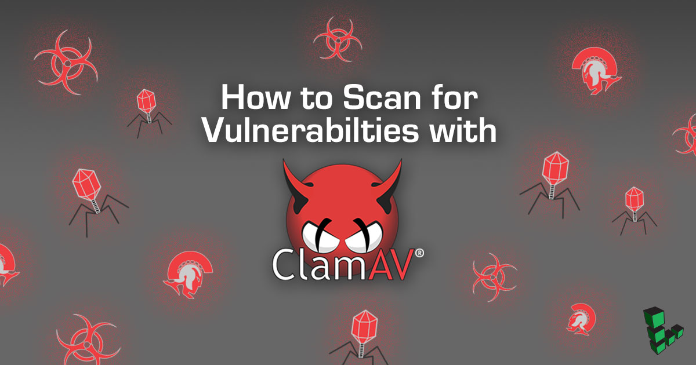

## Introduction
The following instructions show how to run a malware scan using [ClamAV](https://www.clamav.net/) on your system. Running a system scan using ClamAV can help you investigate a system that you suspect might be compromised or infected. This guide includes steps to use an automated script created by Linode that installs ClamAV and runs a system scan and also includes manual steps to install ClamAV and run a system scan.


This guide does not guarantee the removal of all possible compromises, only malware known by ClamAV.


## Before You Begin

1.  The steps in this guide require root privileges. This guide shows you how to boot into the [Finnix](https://www.finnix.org/) Linux recovery distribution, which uses the root user by default. If you are adapting these steps to run in a different environment, be sure to run the steps below as `root` or with the `sudo` prefix. For more information on privileges, see our [Users and Groups](/docs/guides/linux-users-and-groups/) guide.

1.  Boot your Linode into rescue mode. For more information about rescue mode, see the [Booting into Rescue Mode](/docs/troubleshooting/rescue-and-rebuild/#booting-into-rescue-mode) and [Connecting to a Linode Running in Rescue Mode](/docs/troubleshooting/rescue-and-rebuild/#connecting-to-a-linode-running-in-rescue-mode) sections of the [Rescue and Rebuild](/docs/troubleshooting/rescue-and-rebuild/#booting-into-rescue-mode) guide.

    The typical difference between rescue mode and booting your Linode is that in rescue mode, your Linode starts up from a separate Linux Distribution called Finnix, which does not automatically run any services that may be compromised. Finnix also uses a virtual disk that is kept in memory. Changes to this virtual disk are lost if you reboot your Linode.

1.  When you are in rescue mode, you can access your Linode’s disks, but you have to mount them first. The path to the disks will be different from what you see if you booted normally.


If your Linode has had networking restrictions imposed to prevent it from performing malicious activity, such as sending out SPAM or brute forcing other servers, you will need to contact Linode Support via a [support ticket](https://www.linode.com/contact), calling 855-454-6633 in the U.S. or +1 609-380-7100 from outside the U.S. The support team temporarily lifts these restrictions while you are in rescue mode.


## Automated ClamAV System Scanning

This section shows you how to run a Linode provided script which performs the following steps on your system:

- Installs and updates ClamAV
- Mounts your `/dev/sda` disk
- Performs a system scan and quarantines any infected files

1. If you have not yet done so, boot your Linode into rescue mode. Follow the steps in the [Booting into Rescue Mode](/docs/troubleshooting/rescue-and-rebuild/#booting-into-rescue-mode) and [Connecting to a Linode Running in Rescue Mode](/docs/troubleshooting/rescue-and-rebuild/#connecting-to-a-linode-running-in-rescue-mode) sections of the [Rescue and Rebuild](/docs/troubleshooting/rescue-and-rebuild/#booting-into-rescue-mode) guide.

1. From the Finnix rescue mode, run the automated script using the following command:

        linode_clam

    This operation might take some time to complete. When complete, a scan summary shows the number of infected files. All logs are located in the `/media/sda/clamav/log/scan.log` file and any malware found during the scan is found in the `/media/sda/clamav/quarantine/` directory.

    
1GB Linodes require additional RAM in order to complete the ClamAV installation. For this reason, a temporary 1GB swap file is created and activated on the system disk for scanning.  The file is removed automatically after the scan is completed.


## Manual ClamAV System Scanning

This section shows you how to install ClamAV on your system, mount your Linode's Disk, and perform a system scan using ClamAV.

### Install ClamAV

1. If you have not yet done so, boot your Linode into rescue mode. Follow the steps in the [Booting into Rescue Mode](/docs/troubleshooting/rescue-and-rebuild/#booting-into-rescue-mode) and [Connecting to a Linode Running in Rescue Mode](/docs/troubleshooting/rescue-and-rebuild/#connecting-to-a-linode-running-in-rescue-mode) sections of the [Rescue and Rebuild](/docs/troubleshooting/rescue-and-rebuild/#booting-into-rescue-mode) guide.

1.  Update your packages:

        apt update

1.  Install ClamAV into your temporary RAM disk:

        apt install clamav

1.  Create the mount directory.

        mkdir -p /media/sda

1.  Mount your Linode’s Disk:

        mount -o barrier=0 /dev/sda /media/sda

    
The following assumes that you have only one disk that you want to scan and you assigned that disk to `/dev/sda` when you booted into rescue mode. If you have more than one disk, repeat the following steps for each disk that you need to mount, replacing `/dev/sda` with the name of each disk.


## Scan Your System

1.  Create a quarantine directory to deposit any detected malware, so you can analyze it later:

        mkdir -p /media/sda/clamav/log/
        mkdir -p /media/sda/clamav/quarantine/

1.  Run the scan:

        clamscan -r --log=/media/sda/clamav/log/scan.log --move=/media/sda/clamav/quarantine /media/sda

    This operation might take some time to complete. When complete, a scan summary shows the number of infected files.

1. Review the ClamAV logs, located at `/media/sda/clamav/log/scan.log`. Any malware found during the scan can be found in `/media/sda/clamav/quarantine/`.
