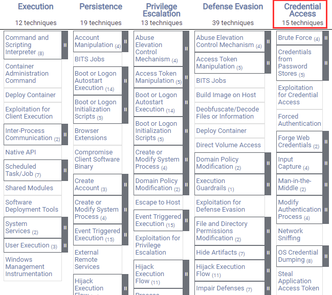
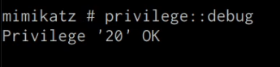
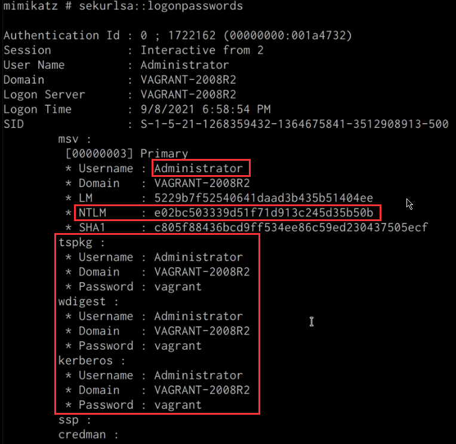
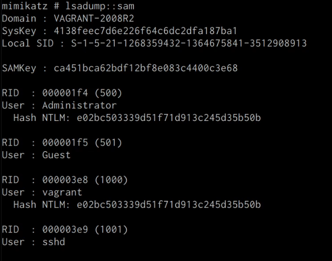
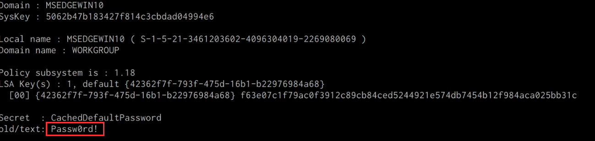





## Before You Begin

In order to follow along with the tools and techniques utilized in this document, you will need to use one of the following offensive Linux distributions:

- Kali Linux

- Parrot OS

The following is a list of recommended technical prerequisites that you will need in order to get the most out of this course:

- Familiarity with Linux system administration.

- Familiarity with Windows.

- Functional knowledge of TCP/IP.

- Familiarity with penetration testing concepts and life-cycle.

Note: The techniques and tools utilized in this document were performed on Kali Linux 2021.2 Virtual Machine

## MITRE ATT&CK Credential Access Techniques

Credential Access consists of techniques for stealing credentials like account names and passwords. Techniques used to get credentials include: keylogging or credential dumping. Using legitimate credentials can give adversaries access to systems, make them harder to detect, and provide the opportunity to create more accounts to help achieve their goals.

The techniques outlined under the Credential Access tactic provide us with a clear and methodical way of extracting credentials and hashes from memory on a target system.

The following is a list of key techniques and sub techniques that we will be exploring:

- Dumping SAM Database.

- Extracting clear-text passwords and NTLM hashes from memory.

- Dumping LSA Secrets

## Scenario

Our objective is to extract credentials and hashes from memory on the target system after we have obtained an initial foothold. In this case, we will be taking a look at how to extract credentials and hashes with Mimikatz.

Note: We will be taking a look at how to use Mimikatz with Empire, however, the same techniques can also be replicated with meterpreter or other listeners as the Mimikatz syntax is universal.

Meterpreter is a Metasploit payload that provides attackers with an interactive shell that can be used to run commands, navigate the filesystem, and download or upload files to and from the target system.

## Credential Access With Mimikatz

Mimikatz is a Windows post-exploitation tool written by Benjamin Delpy (@gentilkiwi). It allows for the extraction of plaintext credentials from memory, password hashes from local SAM/NTDS.dit databases, advanced Kerberos functionality, and more.

The SAM (Security Account Manager) database, is a database file on Windows systems that stores users’s passwords and can be used to authenticate users both locally and remotely.

The Mimikatz codebase is located at https://github.com/gentilkiwi/mimikatz/, and there is also an expanded wiki at https://github.com/gentilkiwi/mimikatz/wiki .

In order to extract cleartext passwords and hashes from memory on a target system, we will need an Empire agent with elevated privileges.

### Extracting Cleartext Passwords & Hashes From Memory

Empire uses an adapted version of PowerSploit’s Invoke-Mimikatz function written by Joseph Bialek to execute Mimikatz functionality in PowerShell without touching disk.

PowerSploit is a collection of PowerShell modules that can be used to aid penetration testers during all phases of an assessment.

Empire can take advantage of nearly all Mimikatz functionality through PowerSploit’s Invoke-Mimikatz module.

We can invoke the Mimikatz prompt on the target agent by following the procedures outlined below.

1. The first step in the process involves interacting with your high integrity agent, this can be done by running the following command in the Empire client:

        interact <AGENT-ID>/<NAME>

1. The next step is to Invoke Mimikatz on the Agent shell, this can be done by running the following command:

        mimikatz

    This will invoke Mimikatz on the target system and you should be able to interact with the Mimikatz prompt.

1. Before we take a look at how to dump cleartext credentials from memory with Mimikatz, you should confirm that you have the required privileges to take advantage of the various Mimikatz features, this can be done by running the following command in the Mimikatz prompt:

        privilege::debug

    If you have the correct privileges you should receive the message “Privilege ‘20’ OK” as shown in the following screenshot.

    

1. We can now extract cleartext passwords from memory with Mimikatz by running the following command in the Mimikatz prompt:

        sekurlsa::logonpasswords

    If successful, Mimikatz will output a list of cleartext passwords for user accounts and service accounts as shown in the following screenshot.

    

    In this scenario, we were able to obtain the cleartext password for the Administrator user as well as the NTLM hash.

    NTLM is the default hash format used by Windows to store passwords.

### Dumping SAM Database

We can also dump the contents of the SAM (Security Account Manager) database with Mimikatz, this process will also require an Agent with administrative privileges.

The Security Account Manager (SAM) is a database file used on modern Windows systems and is used to store user account passwords. It can be used to authenticate local and remote users.

We can dump the contents of the SAM database on the target system by running the following command in the Mimikatz prompt:

    lsadump::sam

If successful Mimikatz will output the contents of the SAM database as shown in the following screenshot.

As highlighted in the previous screenshot, the SAM database contains the user accounts and their respective NTLM hashes.

### LSA Secrets

Mimikatz also has the ability to dump LSA Secrets, LSA secrets is a storage location used by the Local Security Authority (LSA) on Windows.
You can learn more about LSA and how it works here: https://networkencyclopedia.com/local-security-authority-lsa/

The purpose of the Local Security Authority is to manage a system’s local security policy, as a result, it will typically store data pertaining to user accounts such as user logins, authentication of users, and their LSA secrets, among other things. It is to be noted that this technique also requires an Agent with elevated privileges.

We can dump LSA Secrets on the target system by running the following command in the Mimikatz prompt:

    lsadump::secrets

If successful Mimikatz will output the LSA Secrets on the target system as shown in the following screenshot.

So far, we have been able to extract both cleartext credentials as well as NTLM hashes for all the user and service accounts on the system. These credentials and hashes will come in handy when we will be exploring lateral movement techniques and how we can legitimately authenticate with the target system with the credentials and hashes we have been able to extract.
