



## Before You Begin

In order to follow along with the tools and techniques utilized in this document, you will need to use one of the following offensive Linux distributions:

- Kali Linux

- Parrot OS

Additionally, you will also need a Windows VM in order to configure the malicious Office documents.

The following is a list of recommended technical prerequisites that you will need in order to get the most out of this course:

- Familiarity with Linux system administration.

- Familiarity with Windows.

- Functional knowledge of TCP/IP.

- Familiarity with penetration testing concepts and life-cycle.

Note: The techniques and tools utilized in this document were performed on Kali Linux 2021.2 Virtual Machine

## MITRE ATT&CK Exploitation and Initial Access Techniques

Initial Access consists of techniques that use various entry vectors to gain their initial foothold within a network. Techniques used to gain a foothold include targeted spear phishing and exploiting weaknesses on public-facing web servers. Footholds gained through initial access may allow for continued access, like valid accounts and use of external remote services, or may be limited use due to changing passwords.

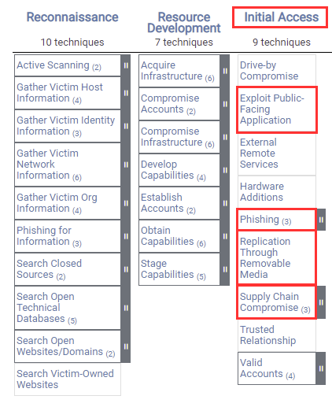

The techniques outlined under the Initial Access tactic provide us with a clear and methodical way of obtaining an initial foothold on the target system, however, as you may have noticed, some techniques such as “Trusted Relationship” will require physical contact with employees and the target organization. In this case, given the nature of our engagement, we will only be focusing on digital initial access vectors such as phishing.

The following is a list of key techniques and sub techniques that we will be exploring:

- Phishing

In this case, we will be utilizing the Phishing technique to obtain an initial foothold on the target network.

### What is Phishing?

Adversaries may send phishing messages to gain access to victim systems. All forms of phishing are electronically delivered by social engineering. Phishing can be targeted, known as spear phishing. In spear phishing, a specific individual, company, or industry will be targeted by the adversary. More generally, adversaries can conduct non-targeted phishing, such as in mass malware spam campaigns.

Adversaries may send victims emails containing malicious attachments or links, typically to execute malicious code on victim systems. Phishing may also be conducted via third-party services, like social media platforms. Phishing may also involve social engineering techniques, such as posing as a trusted source.

## Attack Scenario

Our objective is to generate a malicious office document that contains a macro that will provide us with a reverse shell on the target system when executed.

The following diagram outlines our attack methodology and the various steps involved in the process.

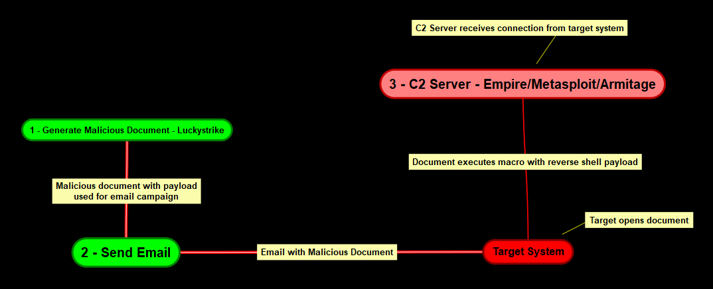

The attack methodology can be broken down into the following procedures:

1. Setup C2 server with Powershell Empire - C2 (Command and control) servers are used by attackers and adversaries to maintain communications with compromised systems on the target network.

1. Generate stager with Powershell Empire - A stager is used to establish a communication channel between the attacker and the victim.

1. Inject the payload into a document as a macro with Luckystrike.

1. Send the document to the target system via email.

1. Target opens the document and consequently runs the malicious macro.

1. Stager connects back to the empire listener.

Now that you have an understanding of the attack methodology we will be using, you will need to set up our infrastructure that will facilitate each step of the attack methodology.

## Infrastructure

The following diagram illustrates the various operating systems we will use and their requirements.

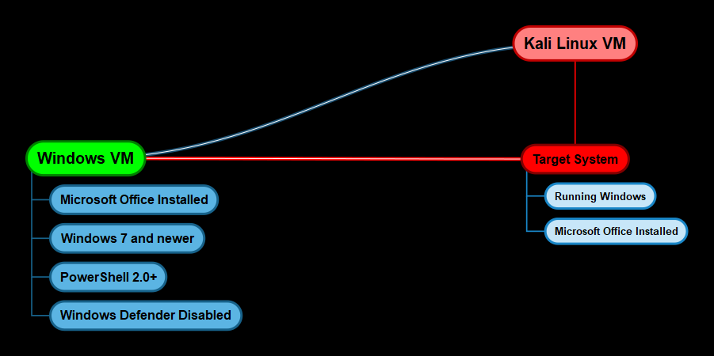

### Windows VM Configuration

In order to generate our malicious macro document, we will need a Windows VM with the following programs and configurations:

- Microsoft Office 2010 or newer installed

- Windows 7 or newer

- PowerShell 2.0+

- Windows Defender Enabled

### C2 Server - Kali Linux

We will be setting up Powershell Empire as our C2 server on a Kali Linux VM for ease of use, alternatively, you can also set up Empire on a  Linux server in the cloud.

Ensure that you use the latest version of Kali and ensure that you upgrade all packages to the latest version.

### Target System

Given that we are utilizing Phishing as our initial access vector, the target much meets the following requirements in order for the attack to work as intended:

- Windows 7 or newer.

- Microsoft Office Installed

Now that you have an idea of our infrastructure, we can begin the process by taking a look at how to install and configure Empire.

## PowerShell Empire

Empire is a pure PowerShell post-exploitation framework built on cryptological-secure communications and flexible architecture. Empire implements the ability to run PowerShell agents without needing powershell.exe, rapidly deployable post-exploitation modules ranging from keyloggers to Mimikatz, and adaptable communications to evade network detection, all wrapped up in a usability-focused framework.

PowerShell Empire recently received an update and is now officially support and maintained by Kali Linux, more information regarding the update can be found here: https://www.kali.org/blog/empire-starkiller/

In addition to being updated and modernized, BC Security, the company responsible for maintaining the Empire has also developed a companion to Empire called Starkiller. Starkiller is a Frontend for the Powershell Empire. It is an Electron application written in VueJS and provides users with an intuitive way of interacting with Empire.

In order to get an understanding of how Empire works and the components that make up the framework, I would recommend going through the official documentation which can be found here: https://www.powershellempire.com/?page_id=100

Now that you have an idea of what Empire is and what it is used for, we can take a look at how it can be installed on Kali Linux.

### Installing PowerShell Empire

PowerShell Empire and Starkiller can be installed on Kali Linux by following the procedures outlined below:

1. Update your repositories and packages, this can be done by running the following command:

        sudo apt-get update && sudo apt-get upgrade

1. The next step will involve installing PowerShell Empire and Starkiller, this can be done by running the following command:

        sudo apt-get install powershell-empire starkiller -y

1. After installing PowerShell Empire and Starkiller, you can start up the Empire server by running the following command:

        sudo powershell-empire server

    This will start up the server and will set up the Empire Restful API on port 1337 as shown in the screenshot below.

    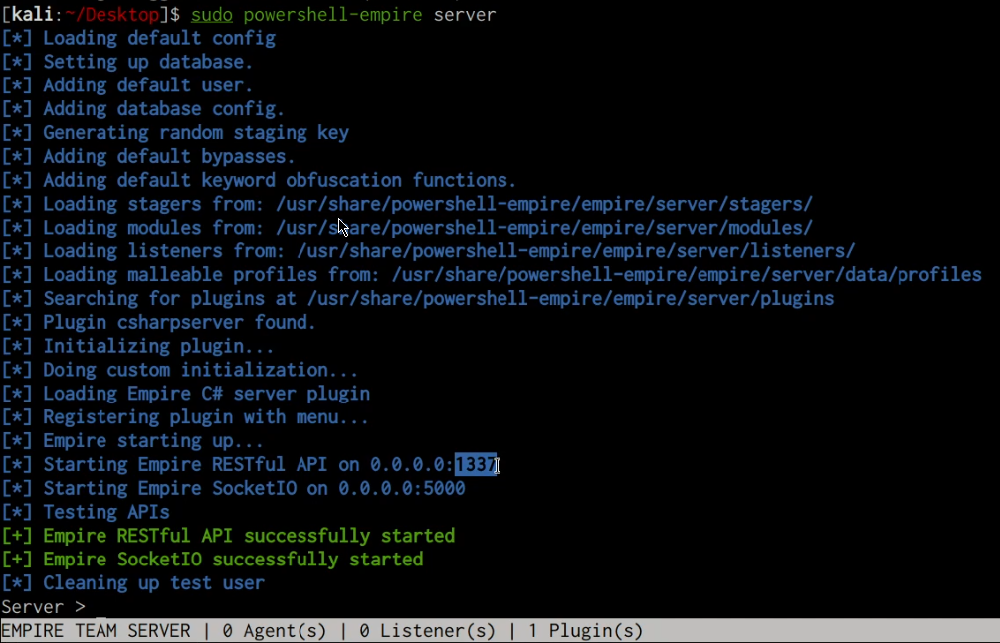

1. Once the Empire server is up and running, you can connect to the server through the Empire client by running the following command:

        sudo powershell-empire client

1. You can also startup Starkiller UI by searching for it as illustrated in the following screenshot.

    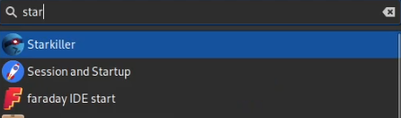

1. During the first launch, Starkiller will prompt you to authenticate with the Empire server. The default access credentials are `empireadmin`/`password123`

    Once logged in, you should see a similar interface to the one shown in the screenshot below.

    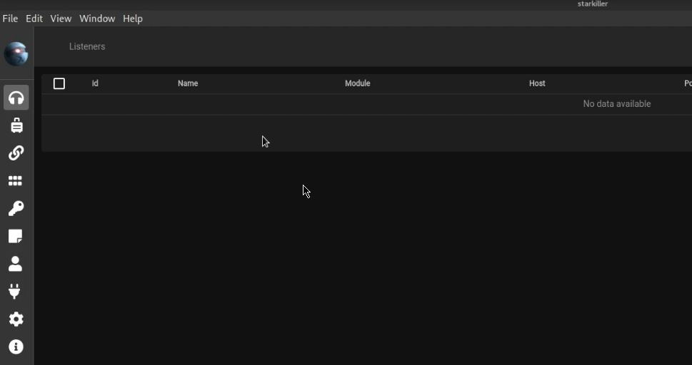

1. Now that we have set up PowerShell Empire as our C2 server, we can take a look at how to set up Luckystrike on our Windows VM.

## Luckystrike

Luckystrike is a PowerShell-based macro generator for malicious `.xls` and `.doc` documents Luckystrike provides you several infection methods designed to get your payloads to execute without tripping AV.

GitHub Repository: https://github.com/curi0usJack/luckystrike

### Luckystrike Requirements

- Make sure you are on a Win7-10 machine (32 or 64bit).

- You must be running a current version of PowerShell (v5+).

- You must have Microsoft Excel installed (2010+).

- Disable Windows Defender. You can learn more about disabling Windows Defender here: https://www.windowscentral.com/how-permanently-disable-windows-defender-windows-10

### Installing Luckystrike

Follow the procedures outline below to install Luckystrike.

1. Launch a PowerShell prompt as administrator.

1. Configure PowerShell to allow the execution of PowerShell scripts, this can be done by running the following command in PowerShell with administrative privileges:

        Set-ExecutionPolicy Unrestricted

1. The next step is to download Luckystrike to your Desktop, this can be done by running the following PowerShell command on your Desktop:

        iex (new-object net.webclient).downloadstring('https://raw.githubusercontent.com/curi0usJack/luckystrike/master/install.ps1')

    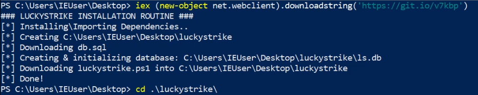

    This will download all the Luckystrike PowerShell scripts and files onto your Desktop.

1. The next step is to execute the luckystrike.ps1 script in a PowerShell prompt with administrative privileges. This can be done by running the following commands:

        cd .\luckystrike\
        .\luckystrike.ps1

1. You should be greeted with a screen similar to the one shown in the preceding screenshot. Enter `99` at the prompt to exit.

    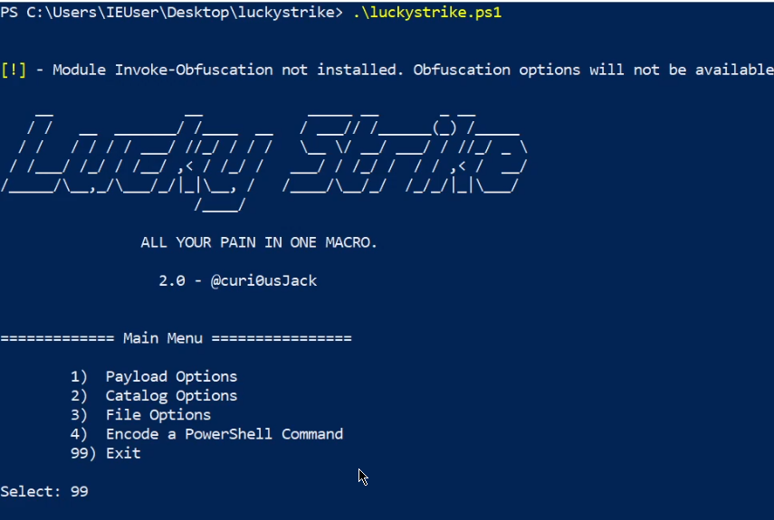

    To learn more about how Luckystrike works, refer to the official Wiki: https://github.com/curi0usJack/luckystrike/wiki

    Now that we have Luckystrike setup, we will need to set up our Empire listener and stager.

## Setting Up PowerShell Empire Listener and Stager

We will need to set up an Empire listener in order to receive the reverse connection from the target system, additionally, we will also need to generate a stager with Empire that will be used to generate our malicious macro document.

1. The first step is to set up a listener, in this case, we will set up an HTTP listener with Star killer, this can be done by navigating to the listener page and clicking on “create”.

    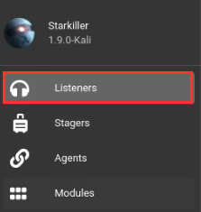

    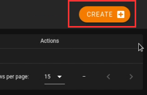

1. You will now need to specify the listener options, ensure that you specify your Kali IP in the host field as shown in the screenshot below.

    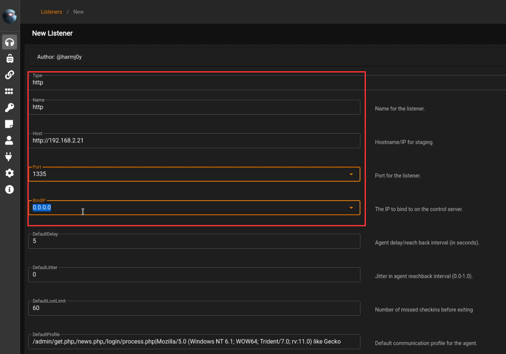

1. After setting up the listener, we will need to setup the stager, however, before we do that we will need to start the csharp server that will be used to compile the stager. This can be done by expanding the sidebar and clicking on plugins. After which you will need to click on the csharp plugin and start it as shown in the screenshot below.

    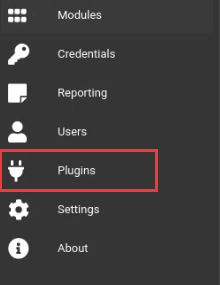

    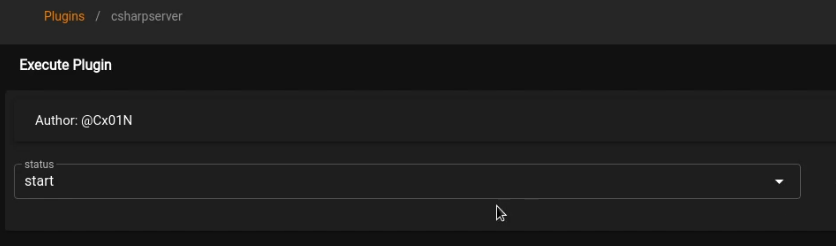

1. The next step will be to set up our stager, this can be done by expanding the sidebar and clicking on the stagers menu item. After which, you will need to specify the windows/csharp_exe stager as highlighted in the screenshot below.

    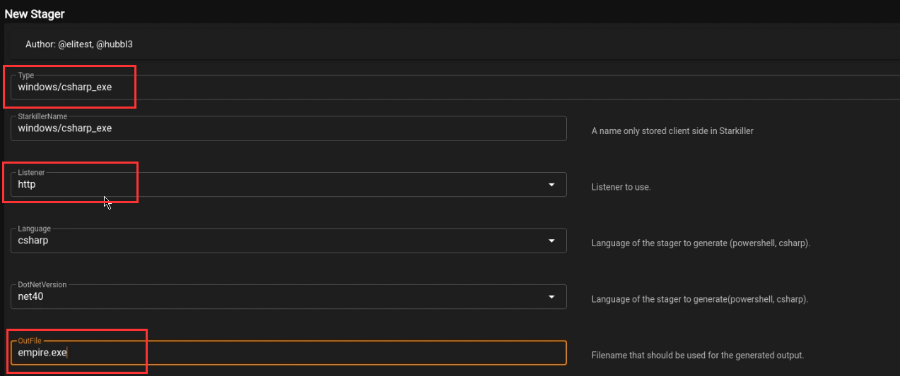

1. Ensure that you specify the listener we created in the Listener field. Additionally, you can also customize the OutFile field for the executable.

1. After creating the stager, you can download it by clicking on the menu button on the stager as highlighted in the screenshot below.

    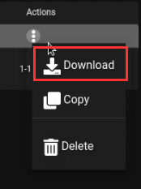

    After downloading the stager, you will need to transfer it to the Windows VM so that we can utilize it in the generation of our malicious document with Luckystrike.

## Generating Malicious Document with Luckystrike

After transferring over the stager from the Kali VM to the Windows VM, we can begin the process of generating the malicious macro document with Luckystrike.

1. The first step involves running the luckystrike.ps1 script in a PowerShell prompt with administrative privileges. This can be done by running the following commands:

        cd .\luckystrike\
        .\luckystrike.ps1

1. The next step is to add a payload to the catalog, this can be done by selecting option 2 as highlighted in the following screenshot.

    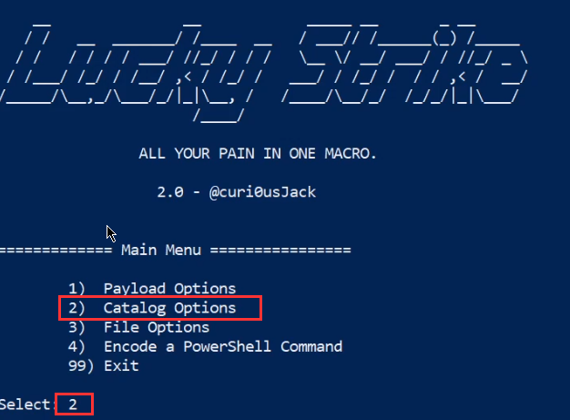

1. We will now need to add a payload to the catalog, this can be done by selecting option 1 as highlighted in the following screenshot.

    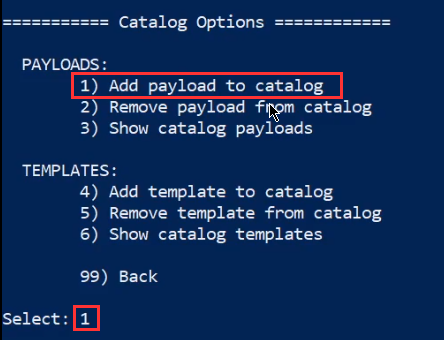

1. You will now need to specify a name for the payload and provide any relevant information pertinent to the payload as highlighted in the following screenshot.

    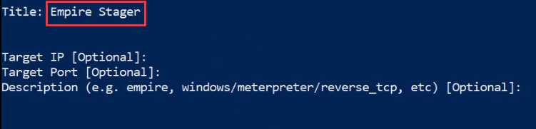

1. The next step is to choose a payload type, in our case, our stager is an executable so we will select option 3 as highlighted in the following screenshot.

    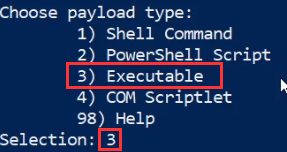

1. You will now need to specify the path to the Empire stager we created as highlighted in the following screenshot.

    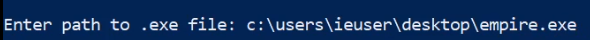

1. The payload should now be added to the Luckystrike catalog, you will now need to select the payload. This can be done by navigating back to the Luckystrike main menu and selecting option 1 as highlighted in the following screenshot.

    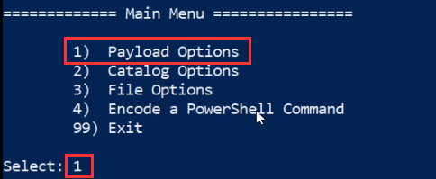

1. You can select the payload we created earlier by clicking on the “Select a payload” menu option and selecting the “Empire stager” payload we added to the catalog as highlighted in the following screenshot.

    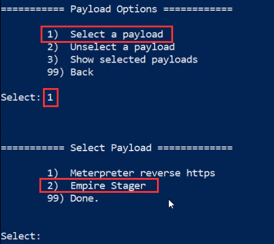

1. You will now be prompted to specify an infection method, in this case, we will be utilizing the “Certutil” method as highlighted in the following screenshot.

    The certutil infection method will utilize the inbuilt Windows utility “certutil” to download the payload on to the target system.

    The infection methods refer to the various techniques that can be utilized to download the payload on to the target system.

    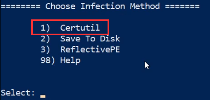

1. We can now generate the malicious document by navigating back to the Luckystrike main menu and selecting the “File Options” menu option as highlighted in the following screenshot.

    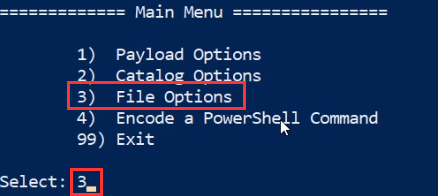

1. The next step will involve generating a new file, this can be done by selecting the “Generate new file” menu option as highlighted in the following screenshot.

    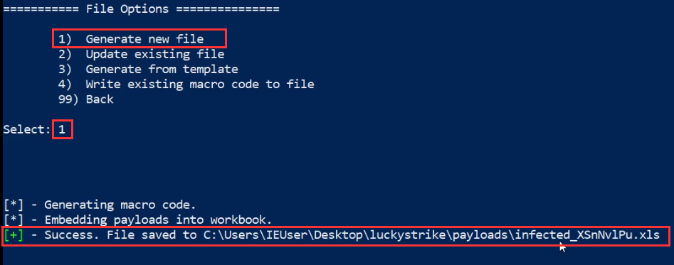

1. Your malicious macro document will be saved in the Luckystrike directory under the payloads folder, the next step will involve sending over the file to the target via a phishing email.

    Once the target opens the document and runs the malicious macro, we should receive an agent on the Empire server and client as well as Starkiller.

    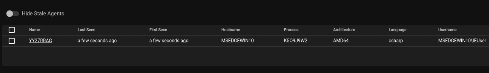

    Now that we have obtained an initial foothold on the target system, we can begin exploring the process of setting up persistence.
