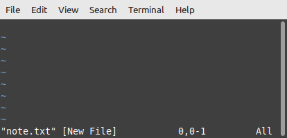
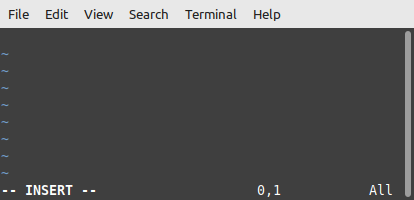
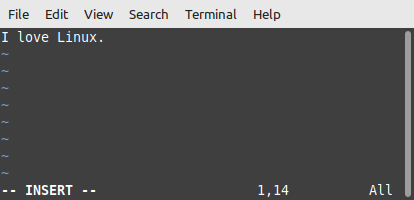
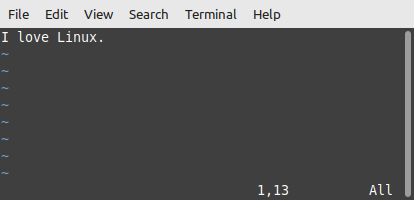
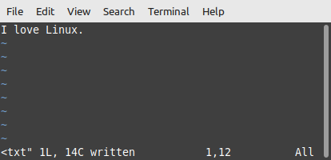
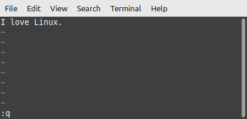
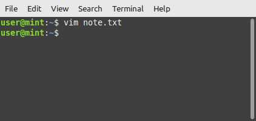

## Introduction 
Vim is a built-in command-line based text editor used for editing plain text and code-based programs. This guide teaches how to open, edit, and save a plain text file in Vim, as well as how to use more advanced keyboard shortcuts to maximize productivity.

## Vim vs. The Competition
As a pure text editor, Vim's main competition is Nano. While Nano has less of a learning curve, it fails to offer the advanced editing features that make Vim such an efficiency powerhouse (concurrent file viewing, autocompletion, macros, etc.). Learning the ins and outs of Vim definitely takes more time, but pays off tenfold in the long run when complex edits need to be made repeatedly in a systematic way. 

On the other hand, Vim's direct competition could be said to be full-blown Integrated Developement Environments (IDEs) like VS Code, often much more user-friendly as well. To even come close to matching Vim's level of speed and efficiency, however, multiple plug-ins and add-ons would need to be installed. Out of the box and pre-installed, Vim just works in all its glory without any setup other than knowledge of preconfigured keyboard shortcuts.

## Background Information
Derived from the original Vi text editor, Vim stands for "Vi IMproved".  
Notable differences between Vi and Vim include:

1. Multi-Level Undo
2. Multiple Windows Mode
3. Syntax Highlighting

## Modes - Input and Command
Vim has two main modes of operation: insert and command.
 

One can't write anything in Vim without first typing `i` to enter insert mode, since command mode is always the default.

### 1. Insert Mode
In insert mode, anything typed by the user is output to the opened file. However, the user can not give shortcut commands to alter text or return to the command line. 
 
For example, a user would use insert mode to type up a paragraph. However, a user would and could not use insert mode to give a command like `dl` to delete the line the cursor is on. 

Press `i` to enter insert mode.
 
Press `ESC` to exit insert mode and enter command mode.


Insert mode can be verified if an "- - INSERT - -" message is shown in the bottom-left hand corner of the screen.


### 2. Command Mode (Default)
In command mode, anything typed by the user is processed as a shortcut command to alter the contents of the file in some shape or form. While in command mode, Vim does not input plain text into the file itself.

For example, a user would use command mode to input a command like `/dog` to search all text contents for the word 'dog'. However, a user would not use command mode to type up a paragraph.

## How to Use - The Basics
| Step | Instructions | Screenshot  |
|:------------:|:-----:|:------------:|
| 1. Create a new file and open it in Vim.  | Type `vim note.txt` | 
| 2. Enter input mode. | Press the `i` key. |     
The - - INSERT - - status message in the bottom-left corner signals to us that we can now insert text. 

| 3. Write in some text. | Type in a message.  Example: I love Linux! |   
| 4. Exit insert mode. | Press the `ESC` key.   |    **Note**: The - - INSERT - - message has now dissapeared.
| 5. Write the file to the disk (save it). | Type `:w` + `ENTER`   |       The "w" in :w stands for "write", and we can see the file is now officially written to the disk, meaning saved.  
| 6. Quit Vim and return back to the command line. | Type `:q` + `ENTER`  |    Alternatively, typing `:wq` + `ENTER` writes the file and quits to the command line in one step. 

## Advanced Command Shortcuts

The best thing about Vim are its shortcuts.


Vim is case-sensitive, meaning it interprets the same letter as two entirely different commands based on upper or lower casing.
 

### Navigation
While navigation using the directional cursor keys or mouse is supported, it is recommended to use the following letter keys for quicker access to keyboard-based shortcuts:

|      Event      |    Command    
|:---------------:|:---------------:
| Scroll up              |`k`        
| Scroll left            |`h`
| Scroll down            |`j` 
| Scroll right           |`l`
| Scroll up half a window   |`CTRL-U`
| Scroll down half a window | `CTRL-D`

### Deleting Text
**Note**: The following commands may also be prepended with a number for a multiplication effect.
Move the cursor over the desired text and use the following: 

|      Event      |    Command    
|:---------------:|:--------------:
|Delete character |`x`
|Delete word      |`dw`
|Delete line      |`dd`
|Undo last operation |`u` 
|Redo last operation  |`CTRL-R`  or  `:redo` + `ENTER`

### Entering Text
|      Event      |    Command    
|:---------------:|:--------------:
|Insert blank line above and enter insert mode        |`O`
|Insert blank line below cursor and enter insert mode |`o`

### Useful Commands
|      Event      |    Command    
|:---------------:|:--------------:
Force quit without saving | `:q!` + `ENTER` 
Display line numbers      | `:set number` + `ENTER` 
Turn off line numbers     | `:set nonumber` + `ENTER` 
View help guides          | `:help`   

### Moving the Cursor by Criteria
Move the cursor to the...
|      Event      |    Command    
|:---------------:|:--------------:
next occurence of a specific character on the current line | `f` + `character`  
previous occurence of a specific character on the current line | `F` + `character` 
beginning of the next word | `w`
beginning of the previous word | `b`
end of the next word | `e` 
beginning of the next sentence | `)`
beginning of the current sentence | `)`
beginning of the next paragraph | `}`
beginning of the current paragraph | `{`
top line of the screen | `H`
middle line of the screen | `M`
bottom line of the screen | `L` 

## Searching for a String
|      Event      |    Command    
|:----------------:|:--------------:
Find the next occurence of a string | `/` + `string` + `ENTER`  
Find the previous occurence of a string | `?` + `string` + `ENTER` 
Repeat the last search | `n`  
Repeat the last search in the opposite direction | `N` 

