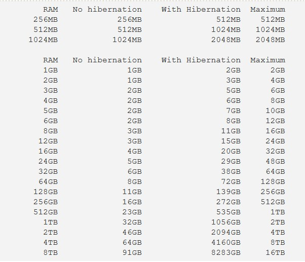

```bash
---
author:
  name: Linode
  email: docs@linode.com
description: 'Guide about Linux swap spaces, what they are, why they are used and how to create swap partitions and swap files through tools like fdisk, dd, swapon, mkswap, fallocate and swapoff.'
keywords: ["linux", "swapfile", "swap", "partition", "RAM"]
tags: ["quick-answers", "linux", "linux basics"]
license: '[CC BY-ND 4.0](https://creativecommons.org/licenses/by-nd/4.0)'
published: 2022-09-29
modified_by:
  name: Linode
title: 'How To Use Swap Spaces To Manage Memory In Linux'
contributor:
  name: Jan Slezak
  link: https://github.com/scumdestroy
external_resources:
  - '[SwapFaq - Ubuntu Community Help](https://help.ubuntu.com/community/SwapFaq)'
  - '[Wikipedia Page for Swap (computer programming)](https://en.wikipedia.org/wiki/Swap_(computer_programming))'
  - '[Wikipedia page for Memory Paging](https://en.wikipedia.org/wiki/Memory_paging#Unix_and_Unix-like_systems)'
  - "[Unix Man Page for swap](https://www.unix.com/man-page/linux/1m/swap/)"
  - "[Linux Man Page for swapon](https://man7.org/linux/man-pages/man8/swapon.8.html)"

---
```

# How To Use Swap Files To Manage Memory In Linux

## An Introduction to Linux Nemory Systems

Linux systems rely on two different types of memory to function smoothly.  *Rapid Access Memory* or RAM, stores all programs, services and other data that is actively being used by the system at runtime.  RAM is impermanent, quickly changing based on the needs of the user and system.  RAM is known as a *volatile memory*, which means that any data stored inside the RAM is lost when the system is shut off,  Physical, magnetic hard drives also store data that is nonvolatile, remaining on the physical disc when power is removed from the computer.  In order for the data to be processed, it must be copied to the RAM, where the *Central Processing Unit* (CPU) can access and interpret it.  This continuous process occurs immediately from boot, where system programs like `init` and the `kernel` are copied into RAM in order to be processed by the CPU, until the system is shut off.

The second type of memory utilized by Linux systems is swap space.  When RAM is filled and system performance begins to suffer, a Swap space can substitute some of the disc space it occupies to alleviate the load on the CPU.  In order to minimize disruption in performance, the kernel scans RAM for blocks of memory that are used infrequently, writing them into the swap space and removing them from the RAM.  The kernel continues tracking these blocks and can write them back into the RAM quickly if they are needed.  


*virtual Memory* referrs to the sum of a Linux system's RAM and its total swap space.



## Before You Begin

1.  If you have not already done so, create a Linode account and Compute Instance. See our [Getting Started with Linode](/docs/guides/getting-started/) and [Creating a Compute Instance](/docs/guides/creating-a-compute-instance/) guides.

2.  Follow our [Setting Up and Securing a Compute Instance](/docs/guides/set-up-and-secure/) guide to update your system. You may also wish to set the timezone, configure your hostname, create a limited user account, and harden SSH access. 


Managing system performance through interacting with partitions and swapfiles requires elevated privileges. Commands that require elevated privileges are prefixed with `sudo`. If you’re not familiar with the `sudo` command, see the [Users and Groups](/docs/guides/linux-users-and-groups/) guide.


## Types of Swap Spaces

Linux systems can utilize two types of swap spaces.  *Swap partitions* are standard in most Linux distributions and are typically configured during installation of the operating system.  A swap partition is a standard disk partition that has been designated to remain free until needed.  *Swap files* fulfill the same purpose with increased versatility, as they can be added to a live system as necessary, though allocating a file for swap space is not preferrable to a designated partition.

Although preferable, swap partitions may not always be an option.  When using virtual machines in a cloud or VPN, it is uncommon find swap partitions included in installed configuration.  Sometimes, the available RAM and the designed swap partition are both at capacity, requiring the creation of a swap file on the hard drive to retain functionality on the machine. Beyond evading potential issues, swap spaces can also provide a small performance boost and some piece of mind when using heavy applications that require extra RAM.

The ideal solution to these issue is to increase physical RAM, which has a much faster access time than physical memory.  Forcing Linux to allocate its memory towards swapping constantly will also have a negative effect on performance. 


Overloading your virtual memory can result in "thrashing", as the system spends nearly all of its resources moving blocks of memory between the RAM and swap space that it becomes unresponsive.



## Managing Swap Partitions

### Planning Your Swap Spaces

First, determine how much swap space is needed, based on RAM available on the Linux system.  Although some slight differences exist between various recommendations, the following chart provided by the official Ubuntu documentation should satisfy the needs of most users.



Altering partitions and creating swap files requires root privileges.  Switch to the root user via the following command.

    sudo su


In the following examples, a 2GB swap partition will be created and added into the system.


New partitions can only be created from unpartitioned disk space.


To view disk partitions and their unallocated space, type the following commands.

    parted  s
    print free

If `Free Space` appears under the `File system`, a swap partition can be added.  In the example below, a 2GB partition of free space can be seen at `/dev/sda`.



Disk /dev/sda: 53.7GB
Sector size (logical/physical): 512B/4096B
Partition Table: gpt
Disk Flags:

Number  Start   End     Size    Type     File system  Flags
        1024B   1049kB  1048kB           Free Space
 1      1049kB  51.7GB  53.7GB  primary  ext4         boot
        51.7GB  53.7GB  2.00GB           Free Space

 

 
 If `parted` is unavailable in your distribution, there are many other ways to get data on system disks.  Some alternative commands for querying information about local partitions include `df -h`, `free -h` and `fdisk -l` 
 

To list any swap spaces already present on your machine, enter the following command.

    swapon --show

The following output shows the existence of a swap partition and a swap file.  If no swap spaces are present, the command returns no output.


NAME           TYPE       SIZE USED PRIO
/dev/nvme0n1p4 partition 14.9G   0B   -2
/swapfile       file        2G   0B   -2



## Creating a Swap Partition

First, run the `free` command without any flags to check if any swap space is currently being used.

    free

Through quick analysis, it is evident that `0B` are being used by swap space in my current set-up. 


               total        used        free      shared  buff/cache   available
Mem:           1.9Gi       282Mi       1.0Gi        25Mi       640Mi       1.5Gi
Swap:          2.3Gi          0B       2.3Gi
Total:         4.3Gi       282Mi       3.4Gi


As no swap space is in use, it is safe to turn off all swap space across our system.

    sudo swapoff -a

In the previous section, we examined our available disc partitions to find a suitable location for a swap partition.  For example, if `/dev/sda` is the intended location of your swap partition, run `fdisk` in interactive mode as shown below.

    fdisk /dev/sda


Welcome to fdisk (util-linux 2.36.1).
Changes will remain in memory only, until you decide to write them.
Be careful before using the write command.


- Press `m` to see the help menu when needed.
- Press `p` to print the partition table to verify space available for the swap partition about to be created.  Partitioning disks is a very irreversible operation and choosing the wrong option can quickly result in a severe loss of data.



Disk /dev/sda: 100 GiB, 107374182400 bytes, 209715200 sectors
Disk model: VMware Virtual S
Units: sectors of 1 * 512 = 512 bytes
Sector size (logical/physical): 512 bytes / 512 bytes
I/O size (minimum/optimal): 512 bytes / 512 bytes
Disklabel type: dos
Disk identifier: 0xb699129f

Device     Boot     Start       End   Sectors  Size Id Type
/dev/sda1  *         2048 200941478 200939431 95.8G 83 Linux
/dev/sda2       200941479 209612509   8771031  2.2G 83 Linux 
 


- When ready to begin, create a new partition with the `n` key.
- For a swap partition, set `Partition type` to `p`.
- Partition number will be dependent on where the swap partition will be created.
- Typically, for `First sector`, the preferred option is the default, which will start the partition at the earliest point available on the disk.
- In the example below, for  `Last sector`, I entered `+2048M`, resulting in a swap partition of 2GB and leaving around 200MB or unused space on the disk.  Using the default value will use as the remaining space available on the disk.


Command (m for help): n
Partition type
   p   primary (2 primary, 0 extended, 2 free)
   e   extended (container for logical partitions)
Select (default p): p
Partition number (3,4, default 3): 
First sector (200941479-209612509, default 200941479): 
Last sector, +/-sectors or +/-size{K,M,G,T,P} (200941479-209612509, default 209612509): +2048M
 


If you make a mistake in fdisk - don't worry!  No changes are finalized until you hit `w` to write changes to disk and exit the interactive shell.  You can always press `q` to quit without saving or `CTRL + c` to kill the process.


- To see a list of over 100 possible partition types and their corresponding hex codes, use the `l` key.  To create a swap partition, the corresponding hex code is `82`.  
- While still in the fdisk shell, press `t` to change the partition time.    
- Choose the partition number that corresponds with the intended swap partition.
- For `Hex code`, type `82` for `Linux swap`.  
- Press `p` to print information about your partitions and verify that changing the partition type was succesful.


Command (m for help): t
Partition number (1-4): 3
Hex code (type L to list codes): 82
Changed system type of partition 83 to 82 (Linux swap)      
 

- If everything appears correct, take a deep breath and press the `w` key to finalize the swap partition.  

Although partition changes have been written, many commands will not list the new swap partition until after a system reboot.  To update system awareness of the new partition without a system reboot, enter the following command.

    partprobe

To mount the partition, use the `mkswap` command.  In the example below, `/dev/sda3` is used as the location of the swap partition and should be changed depending on local swap partition location.

    sudo mkswap /dev/sda3

The output from the aforementioned command should look similar to the following.


Setting up swapspace version 1, size = 2097148 KB
no label, UUID=3abdd413f-94ab-8820-daba4e6c06ca 
 

Finally, turn on the swap partition with the following command.  The `-U` flag requires the swap partition's UUID, which can be pulled from the output of the previous command and will not match the one shown in the example below.

    sudo swapon -U 3abdd413f-94ab-8820-daba4e6c06ca


## Creating a Swap File

To create a 2GB swap file, use the following command. Set the size desired by using the `-l` flag, followed by `[any number]MB` or `[any number]GB` as shown in the example below.  .  Swap files can be named arbitrarily, reside anywhere on the disk and there is no limit on how many swap spaces can be created.

    sudo fallocate -l <swap size desired> <output>
    sudo fallocate -l 2GB /swapfile

If `fallocate` is unavailable or if the command returns with an error that states `fallocate failed: Operation not supported`, it is possible to use `dd` to create a swap file instead.  

- The `dd` command is an acronym for *disk duplicator* and is used to copy low level data.
- The `if` parameter refers to the source that will be copied.  To make a swap file, we point this parameter at `/dev/zero`, a unique and special file that supplies an endless stream of zero bytes into our swap file.
- The `of` parameter refers to the output location and name of the new swap file.
- The `bs` parameter in the following example refers to the size of intended swap file in MB.  As before, creating a 2GB swap file would require a value of `bs=2048`.

    sudo dd if=/dev/zero of=/swapfile bs=2048 count=1048576
 
After the swap file is created, the default permissions set by the `fallocate` command are deemed insecure, preventing its use until they are changed.  Set the swap file's permissions to allow read and write privileges solely to the root user.

    sudo chmod 600 /swapfile

The following command will format the swap file and officially designate it as a swap space to the system.  

    sudo mkswap /swapfile 


Setting up swapspace version 1, size = 1024 MiB (1073737728 bytes)
no label, UUID=6e965805-2ab9-450f-aed6-577e74089dbf


Finally, enable the swap file with the following command.

    sudo swapon /swapfile

The newly created swap file will disappear after a reboot.  In order for the swap space to be permanent, append the following line into the `/etc/fstab` file as root with any text editor.



/swapfile swap swap defaults 0 0




Be extra careful when changing system settings as the root user.  It is a good idea to create backups of important or unfamiliar files, as slight changes can often break functionality and are often times irreversible.


To verify that the creation of the swap file was successful, the output of the following command will list it.

    sudo swapon --show

### Adjusting Swappiness

*Swappiness* is a memory management property in the Linux kernel that controls how often the system will utilize swap spaces.  Swappiness values are set between 0 and 100, with lower values correlating with behavior that avoids swapping as much as possible.  On Ubuntu, swappiness is set to 60 at default and can be viewed with the following command.

    cat /proc/sys/vm/swappiness

Changing swappiness can be done from the command line.  For example, to reduce swappiness to a value of 25, enter the following command. 

    sudo sysctl vm.swappiness=25

Alternatively, swappiness can also be set by writing its preffered value into `/proc/sys/vm/swappiness`.

    echo 25 > /proc/sys/vm/swappiness

Swappiness settings will reset after each reboot.  To avoid reverting swappiness to its default value across reboots, append the following line into `/etc/sysctl.conf` as the root user.


vm.swappiness=25


## Removing a Swap File

To begin the process of removing a swap file, begin by deactivating it with the following command.

    sudo swapoff -v /swapfile

Then, remove the swap file from your system via the following command.

    sudo rm /swapfile


If the swap file was given permenance through its addition into the `/etc/fstab` file, it will return after the next system reboot.  To prevent this behavior, remove its entry from the `/etc/fstab` file.



