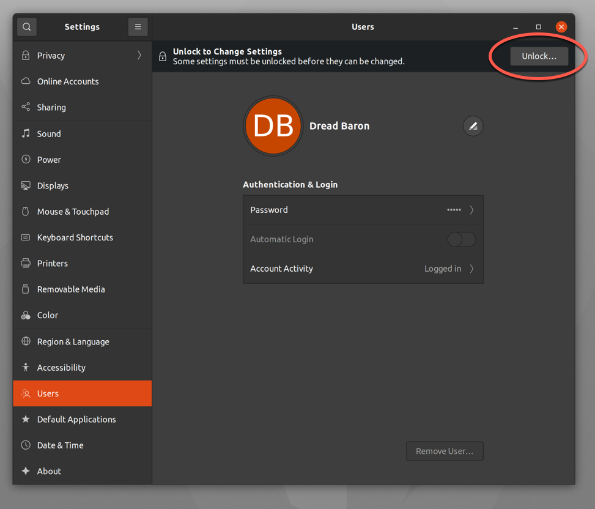
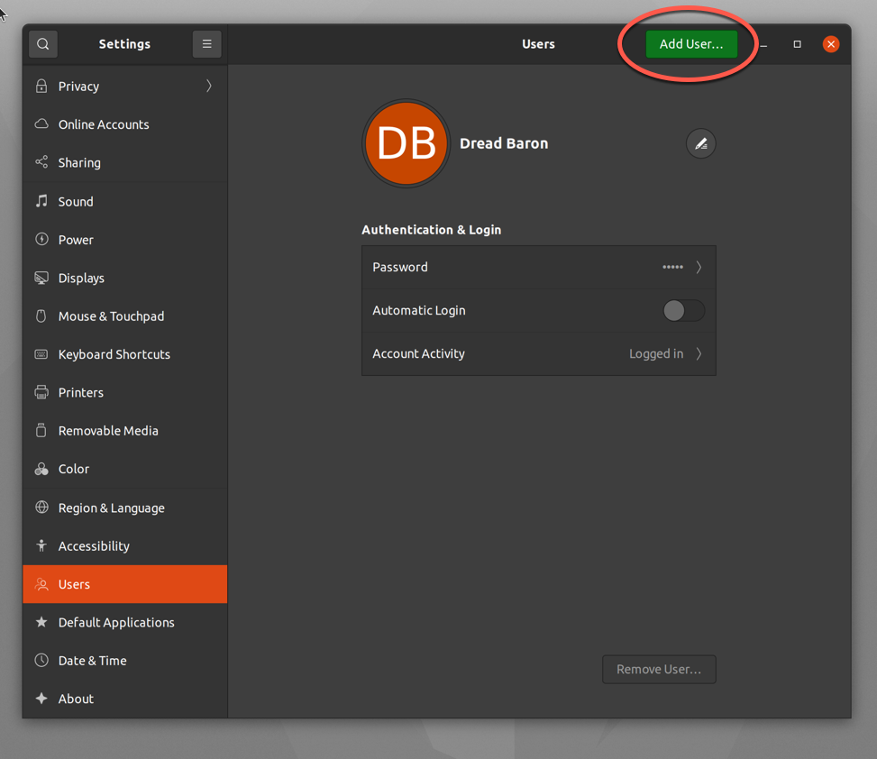
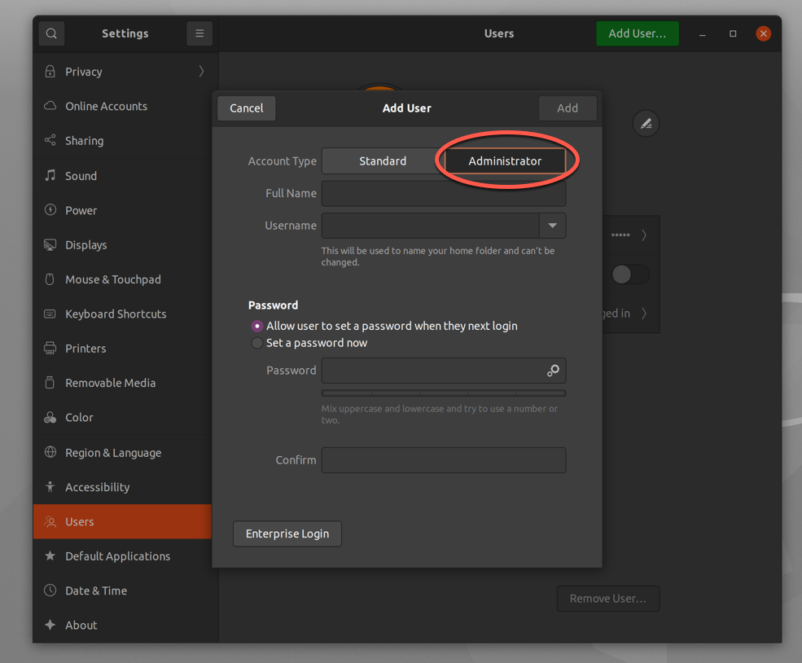
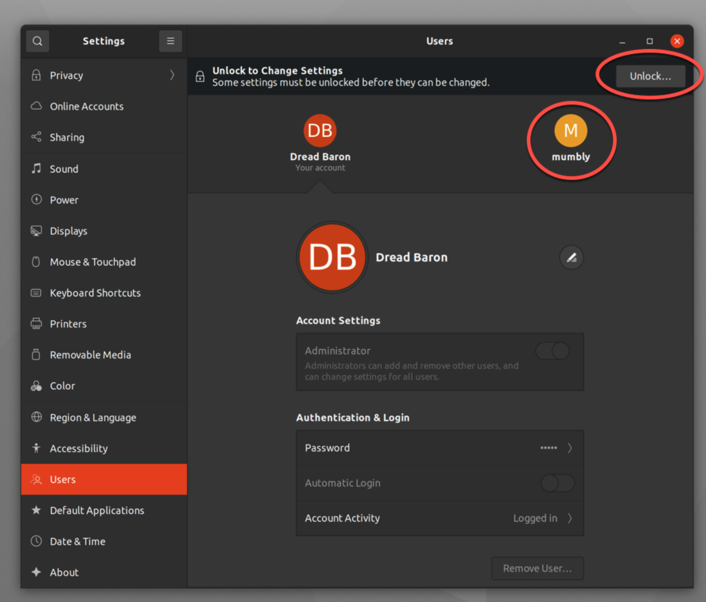
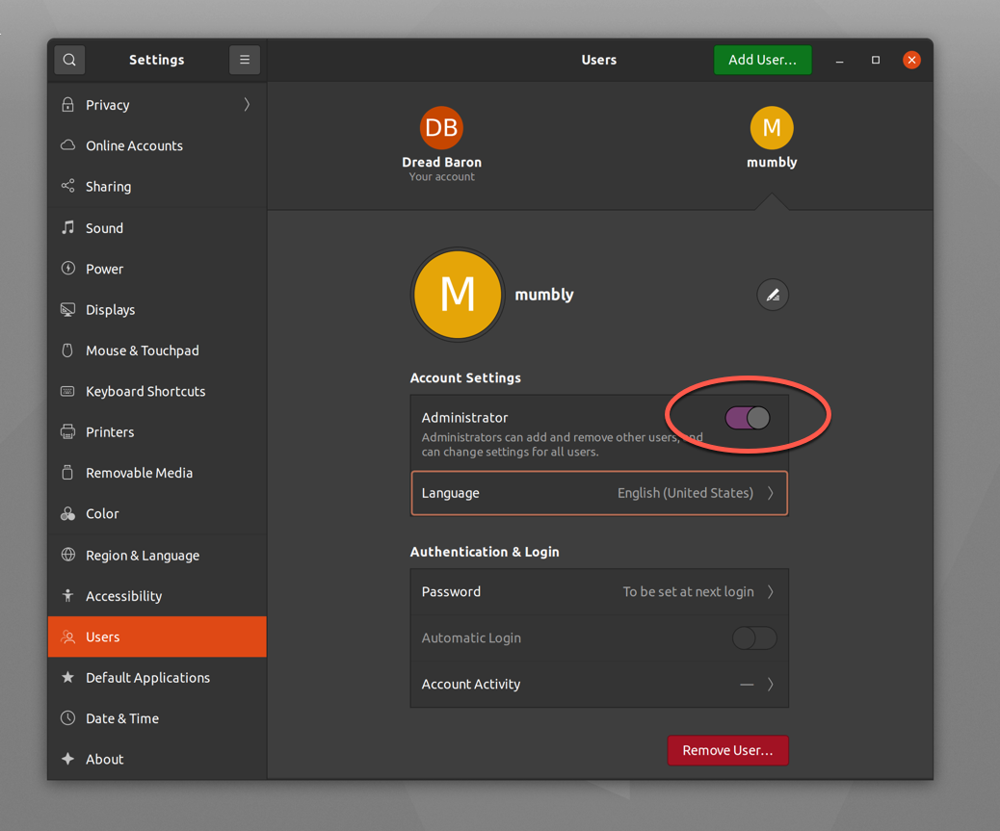

`sudo` ("su 'do'" or "substitute user 'do'") allows a system administrator to delegate permissions to specific users on the machine. There are multiple ways to do so. Ubuntu 20.10 is used in this guide as an example, but this should apply to almost any Linux distribution.

## Before You Begin

1.  If you have not already done so, create a Linode account and Compute Instance. See our [Getting Started with Linode](/docs/guides/getting-started/) and [Creating a Compute Instance](/docs/guides/creating-a-compute-instance/) guides.

1.  Follow our [Setting Up and Securing a Compute Instance](/docs/guides/set-up-and-secure/) guide to update your system. You may also wish to set the timezone, configure your hostname, create a limited user account, and harden SSH access.

1.  This guide assumes you are comfortable using the *command-line interface* (CLI) or have a graphical desktop environment to perform the tasks.


This guide is written for a non-root user. Commands that require elevated privileges are prefixed with `sudo`. If you’re not familiar with the `sudo` command, see the [Users and Groups](/docs/guides/linux-users-and-groups/) guide.


## Adding User Rights Through the sudoers File

Advanced users may want to restrict what can be done with `sudo`. These restrictions are defined in the file located at `/etc/sudoers` and should only be done by those who are familiar with the administrative tasks. As a general rule, editing `/etc/sudoers` should be to adjust permissions for the sudo group, not to give permissions to individual users. Linode suggests the following methods to grant access to users. If you want to explore options for `/etc/sudoers` further, see the [sudoers manual](https://www.sudo.ws/man/1.8.17/sudoers.man.html).

## Granting `sudo` Rights Through the Desktop Environment

If you aren't comfortable using the CLI and have access to a graphical desktop environment, this is the easiest option.

1.  Open the Settings window by clicking on the downwards arrow in the upper-right and choosing **Settings**.
    

2.  Select **Users** from the left panel.
    -   If you are creating a new user:
        1.  Click **Unlock**.
        
        2.  Click **Add User**.
        
        3.  Fill out the details on the new user, making sure to click **Administrator** and then click **Add**.
        

    -   If you are modifying a user:
        1.  Click the user you want to modify and then click **Unlock**.
        
        2.  Click the toggle button next to **Administrator**.
        

3.  Close the **Settings** window.

The user now has administrative and `sudo` rights.

## Granting sudo Rights Through the CLI

There are numerous ways to do this through the command line, the last being the most in-depth, but also the one giving a system administrator more granular control over what permissions a user has.

In all these cases, the user needs to exist already. Using the example of the user *mumbly*:

1.  Enter `sudo useradd -m mumbly` (the `-m` switch creates a home directory). A confirmation does not appear.
2.  Enter `sudo passwd mumbly` and provide the password when prompted and a new password for the user:
    
[sudo] password for dreadbaron:
New password:
Retype new password:
passwd: password updated successfully
    
3.  Make sure to give the user their password.

After the user is created, use one of the following methods to give them access to `sudo` or add them in the sudoers file.

### Using usermod

To grant `sudo` rights to the user *mumbly* using `usermod`:

1.  Enter the command `sudo usermod -aG sudo "mumbly"`

2.  Enter the password when prompted.

3.  A confirmation does not appear, so enter `groups mumbly` and the system displays an output similar to the following:
    
mumbly : mumbly sudo
    
    This implies that the user *mumbly* is part of the group *mumbly* and the group *sudo*.

### Using gpasswd

To grant `sudo` rights to the user "mumbly" using `gpasswd`:

1.  Enter the command `sudo gpasswd -a mumbly sudo`.

2.  Enter the password when prompted, and a confirmation appears:
    
[sudo] password for dreadbaron:
Adding user mumbly to group sudo
    

3.  To confirm, enter `groups mumbly` and the system displays the following:
    
mumbly : mumbly sudo
    
    This implies that the user *mumbly* is part of the group *mumbly* and the group *sudo*.

You can also remove `sudo` rights with `gpasswd`. If *mumbly* has abused the access, you can deny the access:

1.  Enter the command `sudo gpasswd -d mumbly sudo`.

2.  Enter the password when prompted, and a confirmation appears:
    
[sudo] password for dreadbaron:
Removing user mumbly from group sudo
    

3.  Confirm *mumbly* no longer has access with `groups mumbly` and the system displays the following:
    
mumbly : mumbly
    
    This implies that the user *mumbly* is part of the group *mumbly*, but no longer part of the group *sudo*.
