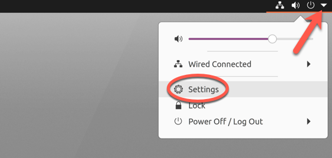
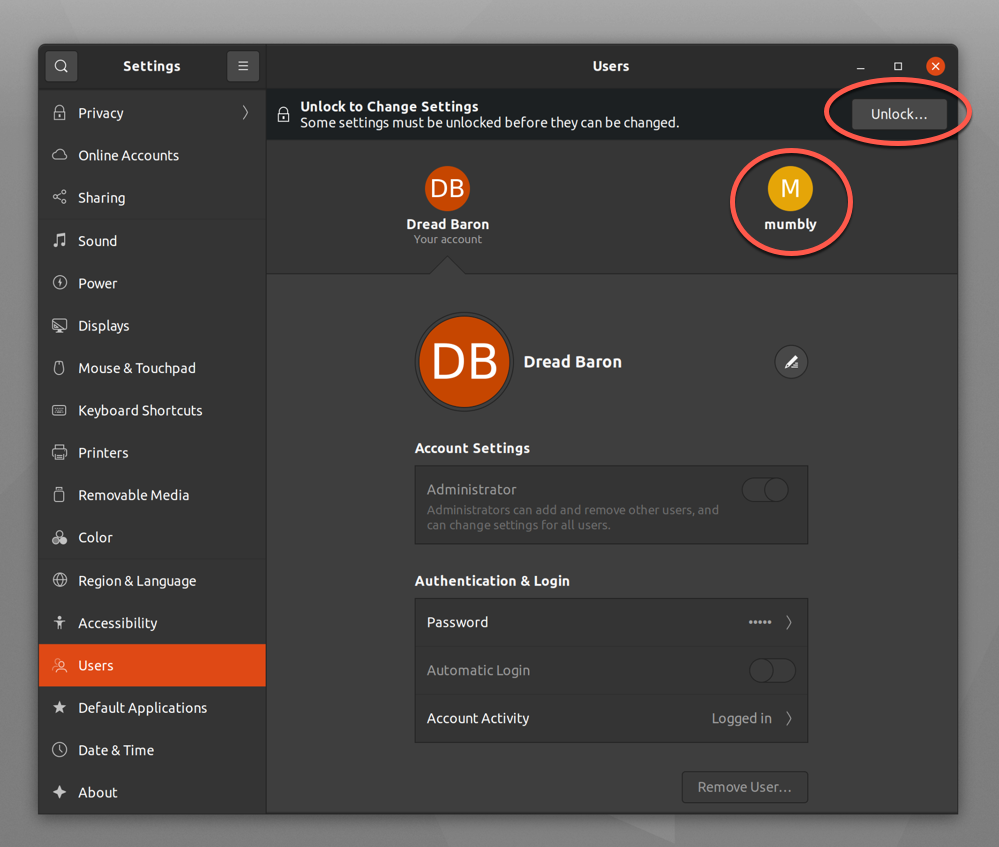

`sudo` ("su 'do'" or "substitute user 'do'") allows a system administrator to delegate permissions to specific users on the machine. There are multiple ways of doing so. Ubuntu 20.10 is being used for the examples below, but this should apply to almost any Linux distribution.

## Before You Begin

1.  Familiarize yourself with our [Getting Started](/docs/getting-started/) guide.

2.  This guide will use `sudo` wherever possible, which the system’s administrator should already have permission to use.

3.  This guide assumes you are comfortable using the *command-line interface* (CLI) or have a graphical desktop environment to do the following in.

3.  Update your system:

        sudo apt-get update && sudo apt-get upgrade


This guide is written for a non-root user. Commands that require elevated privileges are prefixed with `sudo`. If you’re not familiar with the `sudo` command, see the [Users and Groups](/docs/tools-reference/linux-users-and-groups/) guide.


## Adding User Rights Through the sudoers File

More advanced users may want to restrict what can be done with `sudo`. This is done in the file at `/etc/sudoers` and should only be done by those who are familiar with what they're doing. As a general rule, editing `/etc/sudoers` should be to adjust permissions for the sudo group, not to give permissions to individual users. We suggest the methods below for granting access to users. If you want to explore options for `/etc/sudoers` further, we recommend the [sudoers manual](https://www.sudo.ws/man/1.8.17/sudoers.man.html).

## Granting sudo Rights Through the Desktop Environment

If you aren't comfortable using the CLI and have access to a graphical desktop environment, this is the easiest option.

1.  Open the Settings by clicking on the downwards arrow in the upper-right and choosing **Settings**.
    

2.  Select **Users** from the left side.
    -   If you are creating a new user:
        1.  Click **Unlock**.
        
        2.  Click **Add User**.
        
        3.  Fill out the details on the new user, making sure to click **Administrator** and then click **Add**.
        

    -   If you are modifying a user:
        1.  Click on the user you want to modify and then click **Unlock**.
        
        2.  Click on the toggle next to **Administrator**.
        

3.  Close **Settings**.

The user now has administrative and `sudo` rights.

## Granting sudo Rights Through the CLI

There are numerous ways to do this through the command line, the last being the most in-depth, but also the one giving a system administrator more granular control over what permissions a user has.

In all these cases, the user needs to exist already. Using the example of the user *mumbly*:

1.  Enter `sudo useradd -m mumbly` (the `-m` switch creates a home directory). There will be no confirmation.
2.  Enter `sudo passwd mumbly` and provide your password (if prompted) and a new password for the user:
    
[sudo] password for dreadbaron:
New password:
Retype new password:
passwd: password updated successfully
    
3.  Make sure to give the user their password.

Once the user is created, use one of the methods below to give them access to `sudo` or put them in the sudoers file.

### Using usermod

To grant `sudo` rights to the user *mumbly* using `usermod`:

1.  Enter the command `sudo usermod -aG sudo "mumbly"`

2.  Enter your password (if prompted).

3.  There will be no confirmation, so enter `groups mumbly` and you should get this in response:
    
mumbly : mumbly sudo
    
    This means the user "mumbly" is part of the group "mumbly" and the group "sudo," which confirms you modified the user correctly.

### Using gpasswd

To grant `sudo` rights to the user *mumbly* using `gpasswd`:

1.  Enter the command `sudo gpasswd -a mumbly sudo`.

2.  Enter your password (if prompted), and a confirmation follows:
    
[sudo] password for dreadbaron:
Adding user mumbly to group sudo
    

3.  To double-check, enter `groups mumbly` and you should get this in response:
    
mumbly : mumbly sudo
    
    This means the user "mumbly" is part of the group "mumbly" and the group "sudo," which confirms you modified the user correctly.

You can also remove `sudo` rights with `gpasswd`. If *mumbly* has abused their access, take it away:

1.  Enter the command `sudo gpasswd -d mumbly sudo`.

2.  Enter your password (if prompted), and a confirmation follows:
    
[sudo] password for dreadbaron:
Removing user mumbly from group sudo
    

3.  Confirm *mumbly* no longer has access with `groups mumbly` and you should get this response:
    
mumbly : mumbly
    
    This means the user "mumbly" is part of the group "mumbly," but no longer part of the group "sudo".
