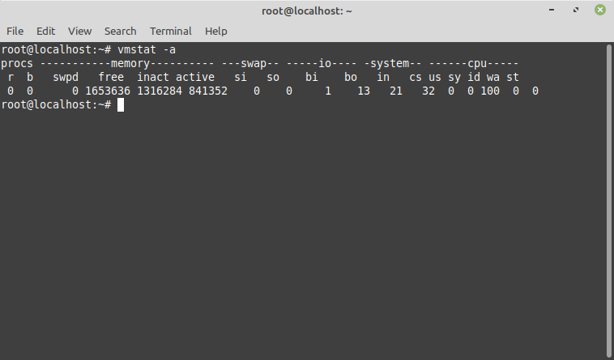
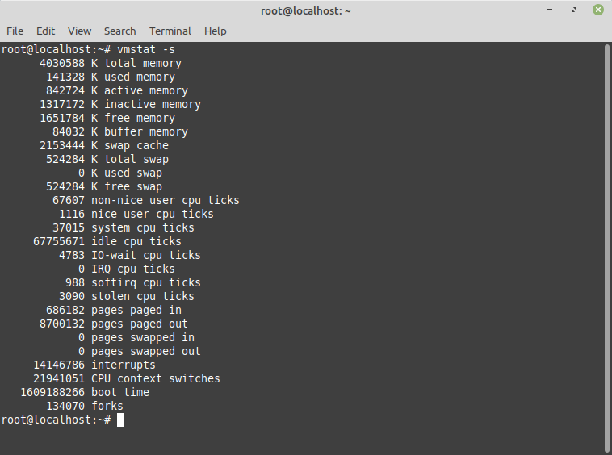
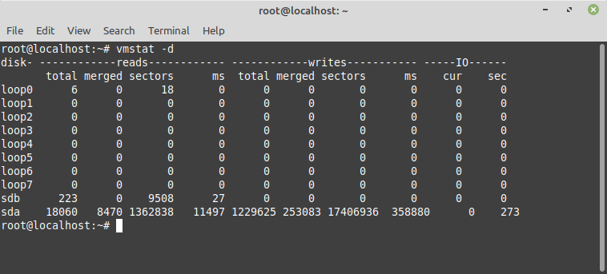
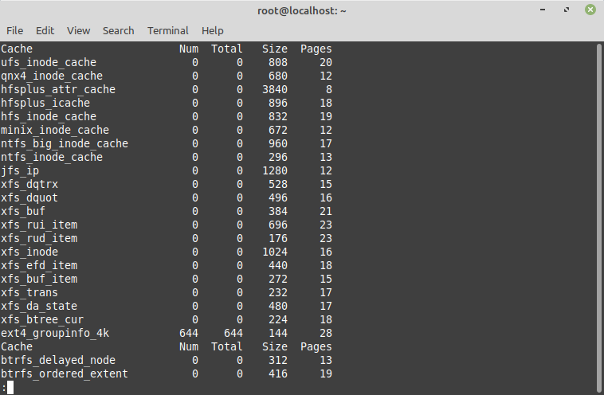

# Using vmstat

[Vmstat](https://linux.die.net/man/8/vmstat) is a built-in Linux system monitoring tool. Its primary job is measuring system usage of virtual memory.

No matter how powerful it is, a Linux server has a finite amount of random access memory (RAM). A Linux system can run out of RAM for several reasons, such as demands on the operating system and its running applications. When this happens, the Linux kernel &quot;swaps&quot; or &quot;pages&quot; out programs to the computer&#39;s storage devices, called &quot;swap space.&quot; Typically, this is a reserved area of hard drive or solid-state drive storage. It&#39;s used as virtual memory when RAM is unavoidable. As RAM is freed up, the swapped-out data or code is swapped back into the main RAM-based memory.

System performance drops drastically when swapping happens. That&#39;s because the server&#39;s swap I/O speed is much slower than RAM even if the hardware – such as fast SSD – is used for virtual memory. In addition, when Linux uses virtual memory it spends more of its CPU cycles on managing virtual memory&#39;s swapping.

That means that Linux system administrators have to pay attention to servers&#39; memory usage. Nobody wants a system to slow down. When it does, and admins need to troubleshoot, virtual memory is a likely culprit. Since virtual memory has an outsized impact on system performance, vmstat is essential for monitoring it.

But it does a bit more than that. In addition to monitoring virtual memory paging, vmstat also measures processes, I/O, CPU, and disk scheduling.

## Getting started with vmstat – at its simplest

You can run `vmstat` both as an interactive program and in shell programs.

When you run vmstat without any parameters, it shows system values based on the averages for each element since the server was last rebooted. These results are not a snapshot of current values.

By default, vmstat display the following measurements:


Here&#39;s a description of this display&#39;s meanings:

### Procs

`r`: The number of runnable processes (running or waiting for run time)

`b`: The number of processes in uninterruptible sleep

### Memory

`swpd`: the amount of virtual memory used

`free`: the amount of idle memory

`buff`: the amount of memory used as buffers

`cache`: the amount of memory used as cache

`inact`: the amount of inactive memory (-a option)

`active`: the amount of active memory (-a option)

### Swap

`si`: Amount of memory swapped in from disk (/s)

`so`: Amount of memory swapped to disk (/s)

### IO

`bi`: Blocks received from a block device (blocks/s)

`bo`: Blocks sent to a block device (blocks/s)

### System

`in`: The number of interrupts per second, including the clock

`cs`: The number of context switches per second

### CPU

These are percentages of total CPU time:

`us`: Time spent running non-kernel code (user time, including nice time)

`sy`: Time spent running kernel code (system time)

`id`: Time spent idle

`wa`: Time spent waiting for IO

`st`: Time stolen from a virtual machine

Obviously, as is common for Linux utilities, the command-line options provide more information. The vmstat syntax is simple.

```
$ vmstat [options] [delay] [count]]
```

- **Options**: vmstat command settings
- **Delay**: the time interval between updates. If no delay is specified, the report runs as an average since the last reboot.
- **Count**: the number of updates printed after the given delay interval. If no count is set, the default is an infinite number of updates every `x` seconds (where x = delay).

For example, consider

```
vmstat 5 5
```


Here, vmstat runs every five seconds for five times on an idle system.

## Commonly-used vmstat options

By default, vmstat displays memory and swap numbers in kilobytes. This can be changed to a thousand bytes, a million bytes, or a megabyte, using the `-S` flag modified by one of the following options:

- **k**: 1,000 bytes
- **K**: 1,024 bytes
- **m**: 1,000,000 bytes
- **M**: 1,048,576 bytes

To show the data updated five times every five seconds with the memory and swap statistics displayed in megabytes, use the command:

```
vmstat -S M 5 5
```


vmstat can be run continually without a count argument. To stop such a report, use the break character (`^C` or `Control+C`).

The `-a` option presents the systems&#39; active and inactive memory.



The `-f` option shows the number of forks (any process that spawns another process while still active) since the last system boot.


The `-s` option displays memory statistics and CPU and I/O event counters.



The `-d` option shows read/write stats for the server&#39;s storage devices.





To display [slabinfo](https://man7.org/linux/man-pages/man5/slabinfo.5.html), which Linux uses to manage memory above the page level, vmstat must be run as the root user with the -m flag.


Its output can be long, so in interactive mode it&#39;s often piped through the [less](https://man7.org/linux/man-pages/man1/less.1.html) command:

`sudo vmstat -m | less`


The output has five columns.

- Cache: Name of the cache
- Num: The number of currently active objects in this cache
- Total: The total number of available objects in this cache
- Size: The size of each object in the cache
- Pages: The total number of memory pages that have (at least) one object currently associated with this cache

To show a disk activity summary report, run vmstat with the `-D` flag.

Next time you have a virtual memory slowdown, you&#39;ll be ready to address the problem – once you are armed with information from vmstat.