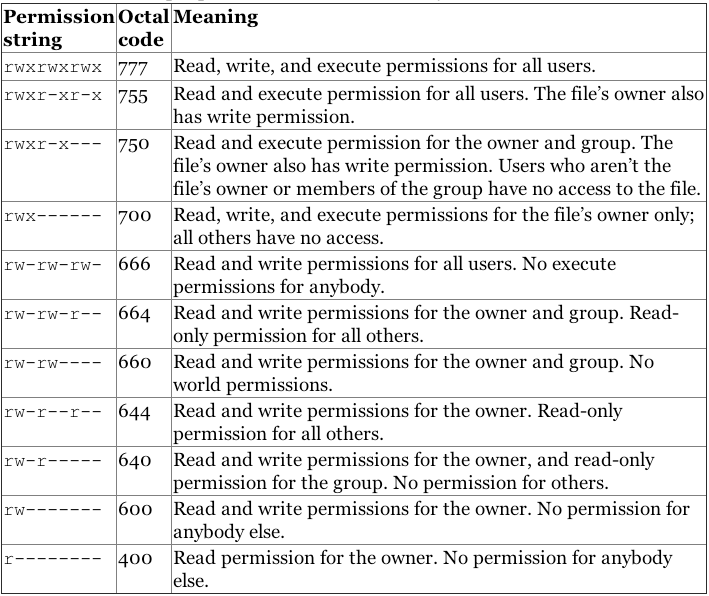

If you are new to Linux/Unix, then the concept of permissions may be confusing. This guide provides you with an explanation of what permissions are, how they work, and how to manage them. A number of examples are provided to illustrate how to set and change permissions for both users and groups.

## What are Linux User and Group Permissions?

Linux/Unix operating systems have the ability to multitask in a manner similar to other operating systems. However, Linux's major difference from other operating systems is its ability to have multiple users. Linux was designed to allow more than one user to have access to the system at the same time. In order for this multiuser design to work properly, there needs to be a method to protect users from each other. This is where permissions come in to play.

### Read, Write, & Execute Permissions

Permissions are the "rights" to act on a file or directory. The basic rights are read, write, and execute.

-   **Read**: a readable permission allows the contents of the file to be viewed. A read permission on a directory allows you to list the contents of a directory.
-   **Write**: a write permission on a file allows you to modify the contents of that file. For a directory, the write permission allows you to edit the contents of a directory (e.g. add/delete files).
-   **Execute**: for a file, the executable permission allows you to run the file and execute a program or script. For a directory, the execute permission allows you to change to a different directory and make it your current working directory. Users usually have a default group, but they may belong to several additional groups.

### Viewing File Permissions

To view the permissions on a file or directory, issue the command `ls -l <directory/file>`. Remember to replace the information in the `<directory/file>` with the actual file or directory name. Below is sample output for the `ls` command:



-rw-r--r-- 1 root root 1031 Nov 18 09:22 /etc/passwd


The first ten characters show the access permissions. The first dash (`-`) indicates the type of file (`d` for directory, `s` for special file, and `-` for a regular file). The next three characters (`rw-`) define the owner's permission to the file. In this example, the file owner has read and write permissions only. The next three characters (`r--`) are the permissions for the members of the same group as the file owner (which in this example is read only). The last three characters (`r--`) show the permissions for all other users and in this example it is read only.

## Working with Linux Groups, Users, and Directories

The following sections go over Linux groups and the commands needed to create, delete, and modify user accounts. The commands for creating and deleting directories are covered, as well.

### Linux Primary Groups

A primary group is the default group that a user account belongs to. Every user on Linux belongs to a primary group. A user's primary group is usually the group that is recorded in your Linux system's `/etc/passwd` file. When a Linux user logs into their system, the primary group is usually the default group associated with the logged in account.

You can find a user's primary group ID by viewing the contents of the your system's `/etc/passwd` file.

        cat /etc/passwd

The fourth column contains each user's primary group ID. In the example output, the primary group ID for `example_user` is `1001`:


postfix:x:106:113::/var/spool/postfix:/usr/sbin/nologin
example_user:x:1000:1001:,,,:/home/example_user:/bin/bash


You can also find a user's primary group information by using the `id` command. Replace `example_user` with one of your own system's users.

    id  example_user

Your output resembles the example, which displays the primary group as `example_group`.


uid=1000(example_user) gid=1001(example_group) groups=1001(example_group),27(sudo)


If you want a less verbose output that only shows your primary group name, run the following command:

    id -gn example_user

Your output in this case is the following:

    example_group

### Linux Secondary Groups

Once a user has been created with their primary group, they can be added to secondary groups. Linux system users can have a maximum of 15 secondary groups. A Linux system's groups are stored in the `/etc/group` file.

To find the group(s) a user belongs to, run the following command:

    groups example_user

The example output displays a user's primary and secondary group(s):

    example_user : example_group sudo

To add a user to a secondary group use the example command. Replace `second_example_group` with the group name and `example_user` with the name of the user to add to the group.

    sudo usermod -a -G second_example_group example_user

You can also add a user to multiple groups. The example command adds the user `example_user` to the groups `second_example_group`, `third_example_group`, and `fourth_example_group`. The `-a` and `-G` options ensure that the user is not removed from any group that the user already belongs to.

    sudo usermod -a -G second_example_group,third_example_group,fourth_example_group example_user

### What is the difference between Primary and Secondary groups in Linux?

A primary group is the group a user belongs to by default. Every user must belong to a primary group and a user can only belong to one primary group. Any new directories or files created by a user are automatically associated with a user's primary group.

A secondary group is a group that a user is added to after their user account is created. A user can belong to zero or more secondary groups.

### Creating and Deleting User Accounts

To create a new standard user, use the `useradd` command. The syntax is as follows:

    useradd <name>

The useradd command utilizes a variety of variables, some of which are shown in the table below:

| Option          | Description                                                        | Example                                    |
|:----------------|:-------------------------------------------------------------------|:-------------------------------------------|
| `-d <home_dir>` | home\_dir is used as the value for the user's login directory | `useradd <name> -d /home/<user's home>`    |
| `-e <date>`     | the date when the account expires                              | `useradd <name>** -e <YYYY-MM-DD>`        |
| `-f <inactive>` | the number of days before the account expires                      | `useradd <name> -f <0 or -1>`              |
| `-s <shell>`    | sets the default shell type                                        | `useradd <name> -s /bin/<shell>`           |

You need to set a password for the new user by using the `passwd` command. Note, you need root privileges to change a user password. The syntax is as follows:

    passwd <username>

The user is be able to change their password at any time using the `passwd` command with the syntax. Below is an example:

    $ passwd
    Changing password for lmartin.
    (current) UNIX password:
    Enter new UNIX password:
    Retype new UNIX password:
    passwd: password updated successfully

There is another way of creating user accounts that might be easier for first-time administrators. However, you may need to install a new package. The installation command for Debian/Ubuntu is as follows:

    apt-get install adduser

The adduser command automatically creates a home directory and sets the default group, shell, etc. To create a new standard user with the `adduser` command the syntax is as follows:

    adduser <name>

Once you enter the command you receive a series of prompts; most of this information is optional. However, you should include at least the user's name (for this example the user name is cjones) and a password.

    root@localhost:~# adduser cjones
      Adding user `cjones' ...
      Adding new group `cjones' (1001) ...
      Adding new user `cjones' (1001) with group `cjones' ...
      Creating home directory `/home/cjones' ...
      Copying files from `/etc/skel' ...
      Enter new UNIX password:
      Retype new UNIX password:
      passwd: password updated successfully
      Changing the user information for cjones
      Enter the new value, or press ENTER for the default
          Full Name []: Chuck Jones
          Room Number []: 213
          Work Phone []: 856-555-1212
          Home Phone []:
          Other []:
      Is the information correct? [Y/n] Y

It is important to note that security should always be taken very seriously. Therefore, it is strongly recommended to use unique passwords for each account. Never share or give your password to other users.

To remove a user account, enter the following command:

    userdel <name>

Issuing the command above only deletes the user's account. Their files and home directory are not be deleted.

To remove the user, their home folder, and their files, use this command:

    userdel -r <name>

### Understanding the Sudo Linux Group and User

`root` is the super user and has the ability to do anything on a system. Therefore, in order to have an additional layer of security, a `sudo` user is generally used in place of root. While `sudo` is used to give another user limited access to another user's account for the purpose of performing tasks (in most cases the `root` user or the superuser), `sudo` may be best explained as a tool that allows users and groups to have access to commands they normally would not be able to use. `sudo` enables a user to have administration privileges without logging in directly as root. A sample of the `sudo` command is as follows:

    sudo apt-get install <package>

Before using `sudo`, it may need to be installed if it is not part of your distribution. The command for Debian is as follows:

    apt-get install sudo

For CentOS, the command is as follows:

    yum install sudo

In order to provide a user with the `sudo` ability, they need to be added to a `sudo` enabled group, or their username needs to be added to the sudoers file with a set of permissions. This file is sensitive and important as an access and security control, and should not be edited directly with a text editor. If the sudoers file is edited incorrectly it could result in preventing access to the system or other unintended permission changes.


For instructions on adding a user to a default `sudo` enabled group, see our [Setting Up and Securing a Compute Instance](/docs/products/compute/compute-instances/guides/set-up-and-secure/) guide


The `visudo` command should be used to edit the sudoers file. At a command line, log into your system as `root` and enter the command `visudo`.

The following `sudoers` excerpt allows the listed users to execute any command they'd like by prefixing it with `sudo`, which gives the user full control of a system.


Users should never be added to the `sudoers` file or group with full permission if they are not trusted. You can optionally restrict what users can do with `sudo` as an additional layer of security; refer to the  [Whitelisting Commands With Sudo](#whitelisting-commands-with-sudo) for some examples on restricted usage syntax.



# User privilege specification
root    ALL=(ALL:ALL) ALL
cjones  ALL=(ALL:ALL) ALL
kbrown  ALL=(ALL:ALL) ALL
lmartin ALL=(ALL:ALL) ALL


After you have given your user account sudo privileges, save the sudoers file and log out as root. Now log in as your user and test the privileges as your user with sudo access. When a new user needs sudo access, you now are able to edit the sudoers file with your own login using the following command:

    sudo visudo

### Whitelisting Commands With Sudo

In many cases, while you want users to have elevated sudo permissions, you also want to follow the principle of least privilege and grant sudo users access only to the commands that they need. In the following example, the sudoers file has been edited to limit sudo usage to a few clearly defined commands:


    # User privilege specification
    root    ALL=(ALL:ALL) ALL
    sudousername   ALL=(ALL:ALL) ALL
    username ALL=/usr/bin/top, /usr/bin/apt-get
    # Allow members of group sudo to execute the less, ls, and apt commands
    %sudo ALL=/usr/bin/less, /usr/bin/ls, /usr/bin/apt


While the root and `sudousername` users still have full superuser permissions, the user `username` has been limited to only the `top` and `apt-get` commands as a sudo user. Additionally, all users added to the `sudo` group are separately limited only to the `less`, `ls`, and `apt` commands with sudo permissions. If you wanted to give the user `username` sudo access to the additional 3 commands allowed for the `sudo` group, you would just need to add them to the `sudo` group and they would still retain their own unique permissions, giving them sudo access to a total of 5 commands. This process can be repeated for as many users and groups as needed.


When allowing individual commands using the above syntax, it is important to use the absolute path to the command. The `which` command can be used to find this absolute path:

    which command-name


### Working with Groups

Linux uses groups as a way to organize users. Groups organize collections of accounts, primarily as a security measure. Control of group membership is administered through the `/etc/group` file, which shows a list of groups and its members. Every user has a default or primary group. When a user logs in, the group membership is set for their primary group. This means that when a user launches a program or creates a file, both the file and the running program is associated with the user's current group membership. A user may access other files in other groups, as long as they are also a member of that group and the access permissions are set. To run programs or create a file in a different group, the user must run the `newgrp` command to switch their current group. A sample of the newgrp command is as follows:

    $ newgrp <marketing>

If the user entering the above-referenced command is a member of the **marketing** group in the `/etc/group` file, then the current group membership changes. It is important to note that any files created are now be associated with the **marketing** group rather than the user's primary group.

### Creating and Removing Directories

To make a directory use the command:

    mkdir <directory name>

To make a directory and set the permissions at the same time, use the following option and syntax:

    mkdir -m a=rwx <directory name>

The **-m** option is short for mode, and **a=rwx** means that all users have read, write, and execute permissions on the directory. To see a complete list of all options for the mkdir command enter `man mkdir` at a command prompt.

To remove a file, use the following:

    rm <file>

To remove a directory:

    rm -r <directory name>

It is important to note that if you remove a directory all the files inside are deleted as well.

### Changing Directory and File Permissions

To view file permissions and ownership on files and directories, use the `ls -al` command. The `a` option is to show hidden files or all files, and the `l` option is for the long listing. The output is similar to the following:

    drwxr-xr-x 2 user user 4096 Jan  9 10:11 documents
    -rw-r--r-- 1 user user  675 Jan  7 12:05 .profile
    drwxr-xr-x 4 user user 4096 Jan  7 14:55 public

The first column with the ten letters and dashes shows the permissions of the file or directory. The second column (with the single number) indicates the number of files or directories contained in the directory. The next column indicates the owner, followed by the group name, the size, date, and time of last access, and finally the name of the file . For example, using the first line from the output above, the details are as follows:

    `drwxr-xr-x` are the permissions
    `2` is the number of files or directories
    `user` is the owner
    `user` is the group
    `4096` is the size
    `Jan  9 10:11` is the date/time of last access
    `documents` is the directory


Since a directory itself is a file, any directory shows `4096` as it's size. This does not reflect the size of the contents of the directory.


### Chmod Command

The command `chmod` is short for change mode. Chmod is used to change permissions on files and directories. The command `chmod` may be used with either letters or numbers (also known as octal) to set the permissions. The letters used with chmod are in the table below:

| Letter | Permission                                                   |
|:-------|:-------------------------------------------------------------|
| r      | Read                                                         |
| w      | Write                                                        |
| x      | Execute                                                      |
| X      | Execute (only if file is a directory)                        |
| s      | Set user or group ID on execution                            |
| t      | Save program text on swap device                             |
| u      | Current permissions the file has for owner                   |
| g      | Current permissions the file has for users in the same group |
| o      | Current permissions the file has for others not in the group |

It is important to remember that the first character of the first column of a file listing denotes whether it is a directory or a file. The other nine characters are the permissions for the file/directory. The first three characters are for the user, the next three are for the group, and the last three are for others. The example **drwxrw-r--** is broken down as follows:

> **d** is a directory
>
> **rwx** the user has read, write, and execute permissions
>
> **rw-** the group has read and write permissions
>
> **r--** all others have read only permissions

Note that the dash (-) denotes permissions are removed. Therefore, with the "all others" group, r-- translates to read permission only, the write and execute permissions were removed.

Conversely, the plus sign (+) is equivalent to granting permissions: `chmod u+r,g+x <filename>`

The example above translates as follows:

    u is for user
    r is for read
    g is for group
    x is for execute

In other words, the user was given read permission and the group was given execute permission for the file. Note, when setting multiple permissions for a set, a comma is required between sets.

### Chmod Octal Format

To use the octal format, you have to calculate the permissions for each portion of the file or directory. The first ten characters mentioned above correspond to a four digit numbers in octal. The execute permission is equal to the number one (1), the write permission is equal to the number two (2), and the read permission is equal to the number four (4). Therefore, when you use the octal format, you need to calculate a number between 0 and 7 for each portion of the permission. A table has been provided below for clarification.

Although octal format may seem difficult to understand, it is easy to use once you get the gist of it. However, setting permissions with r, w, and x may be easier. Below are examples of how to use both letters and octal format to set permissions on a file or directory.

> Sample syntax: `chmod <octal or letters> <file/directory name>`
>
> Letter format: `chmod go-rwx Work` (Deny rwx permission for the group and others)

The output of ls -al after the chmod command above would looks as follows:

    dr-------- 2 user user 4096 Dec 17 14:38 Work

Octal format: `chmod 444 Work`

The output of ls -al after the chmod command above would look as follows:

    dr--r--r-- 2 user user 4096 Dec 17 14:38 Work

An octal table showing the numeric equivalent for permissions is provided below.

### Additional File Permissions

In addition to the most common read/write/execute file permissions, there are some additional modes that you might find useful, specifically the *+t* mode (*sticky bit*) and the *+s* mode (*setuid bit*). These functions describe the behavior of files and executables in multi-user situations.

When set on a directory, the *sticky bit*, or *+t* mode, means that only the owner (or root) can delete or rename files within that directory, regardless of which users have write access to the directory by way of group membership or ownership. This is useful when a directory is owned by a group through which a number of users share write access to a given set of files.

It's important to note that setting the sticky bit on a *file* does not prevent a user with write permissions to the enclosing directory from deleting or renaming the file—the sticky bit must be set on the enclosing *directory*. The sticky bit has no function on modern Linux systems when set on files.

To set the sticky bit on a directory named `/root/sticky`, issue the following command:

    chmod +t /root/sticky

To remove the sticky bit from a file or directory, use the `chmod -t` command. Note, to change the sticky bit, you need to be either root or the file/directory owner. The root user is able to delete directories and files within them regardless of the status of the sticky bit.

The *setuid* bit, or *+s*, when set on files allows users with permissions to execute a given file the ability to run that file with the permissions of file owner. For instance, if the file `work` was owned by the `root` user and the `marketing` group, members of the `marketing` group could run the `work` program as if they were the root user. This may pose potential security risks in some cases and executables should be properly evaluated before receiving the `+s` flag. To set the `+s` bit on a file named `/usr/bin/work`, issue the following command:

    chmod g+s /usr/bin/work

In contrast to the *+s* mode for the ownership of a file, the effect of the *+s* mode on a directory is somewhat different. Files created in *+s* directories receive the ownership of that directory's user and group, rather than the ownership of the user that created the file and their default group. To set the *setguid* (group id) option on a directory, use the following command:

    chmod g+s /var/doc-store/

To set the *setuid* (user id) for a directory named `/var/doc-store`, issue the following command:

    chmod u+s /var/doc-store/

### Changing File Ownership

By default, all files are "owned" by the user who creates them and by that user's default group. To change the ownership of a file, use the `chown` command in the `chown user:group /path/to/file` format. In the following example, the ownership of the "list.html" file is changed to the "cjones" user in the "marketing" group:

    chown cjones:marketing list.html

To change the ownership of a directory and all the files contained inside, use the recursive option with the `-R` flag. In the following example, change the ownership of `/srv/smb/leadership/` to the "cjones" user in the "marketing" group:

    chown -R cjones:marketing /srv/smb/leadership/

## Leveraging Linux Users and Groups

In many cases, user permissions are used to provide your system with greater security without any direct interaction. Many operating systems create specific system user accounts for different packages during the installation process.

The best practice is to give each user their own login to your system. This protects each user's files from all other users. Furthermore, using specific accounts for users allows more accurate system logging, particularly when combined with tools like `sudo`. We recommend avoiding situations where more than one individual knows the password for a user account for maximum security.

In contrast, groups are useful for allowing multiple independent user accounts to collaborate and share files. If you create groups on a machine for common tasks on a per-task basis (e.g. web editors, contributors, content submitters, support) and add relevant users to the relevant groups, these users can all edit and run the same set of files without sharing these files with the world. Use of the `chmod` command with file permissions of 770 and 740 would help accomplish this goal.