When you need to run a custom image on Akamai Cloud, most of the time the [image upload](/docs/products/tools/images/guides/upload-an-image/) feature provides a smooth solution. Upload an operating system's disc image, and in many cases Akamai Cloud can handle the deployment from there.

But in some cases the system image you need to deploy needs some additional help. Whether the system has a complex installation or you need custom software before deployment, these images require more manual intervention.

For such images, you can deploy to Akamai Cloud from a local virtual machine. Get the advantage of fine tuning the set up and configuration while still being able to run your desired system in the cloud.

This tutorial explains more about deploying from virtual machines and shows you everything you need to know to do it yourself. Whatever system you are looking to run — from Windows 10 to a custom Linux distribution — this tutorial's instructions can help you do it.

## Why Deploy from a Virtual Machine?

The process of deploying a virtual machine image involves quite a few steps, more than just deploying a disk image (`.iso` or `.img`) directly. Already, Akamai Cloud can deploy many Linux distributions through its [image upload feature](/docs/products/tools/images/guides/upload-an-image/).

But not all operating system images readily fit that process. Further, some operating system use cases benefit from running a local instance first. Among other things, that can give you a graphic interface for making initial configurations.

A prominent example is the Windows 10 disk image. By default, Windows's set up runs graphically, making it difficult to automatically deploy to a cloud server. And on a related note, you likely want to conduct some initial configuration before doing so. For instance, installing a VNC server on the Windows system to allow remote desktop usage later.

Similar cases apply with Linux distributions that either use graphical installation wizards or otherwise do not map well directly to cloud deployments

## How to Deploy a Virtual Machine Image to Akamai Cloud

The process of deploying a custom image to a Compute Instance involves some coordinated steps between your local machine and your Akamai Cloud Manager. You need to set up the virtual machine locally and prepare a blank instance that can accept the image.

The steps covered in this tutorial have been tested and referenced periodically in [community responses](https://www.linode.com/community/questions/19257/how-to-upload-an-iso-using-virtual-box-to-a-linode).

This tutorial, however, makes these steps generalized for a wide range of operating system images. Additionally, the steps are organized to help make the coordinated tasks between local and cloud setups easier to discern and navigate.

### Preparing the Virtual Machine

Locally, the most significant step involves creating and configuring the virtual machine. This virtual machine runs a local instance of the image you want to deploy to Akamai Cloud. Local steps on the virtual machine ensure that the operating system's installation steps have been completed and any necessary settings are in place.

The local virtual machine is also where you can install software like remote desktop and VNC servers to remotely access the system's desktop later.

Within the steps that follow, the tutorial shows you how to use [VirtualBox](https://www.virtualbox.org/) to run a local virtual machine of your chosen image. From there, the steps show how to prepare that virtual machine for deployment.

#### Install VirtualBox

The steps for installing VirtualBox vary depending on your operating system. For that reason this tutorial only covers the broad strokes, with links to the VirtualBox documentation for detailed steps. That said, the process tends to be straightforward regardless of operating system.

1.  Navigate to the [VirtualBox downloads](https://www.virtualbox.org/wiki/Downloads) page, and download the binary package for your operating system.

1.  Review the [VirtualBox installation instructions](https://www.virtualbox.org/manual/ch02.html) for your operating system, and follow the steps given there. For Windows and macOS, the main step is double-clicking on the downloaded executable (`.exe` or `.dmg`, respectively).

1.  Verify that you can run VirtualBox. You should see some version of the VirtualBox VM manager when VirtualBox starts up.

#### Download a Virtual Machine Image

If you have not done so already, you need to download the image for the operating system you intend to run on your Compute Instance. The options are expansive, from Windows to the gamut of Linux distributions.

To follow along with this tutorial, you can choose a Windows 10 image. The underlying steps for other operating systems should be similar, and Windows provides a great example of the versatility of the process.

Here are two great sources for a Windows 10 image (ISO) that you can use.

-   The [official Windows 10 disc image](https://www.microsoft.com/en-us/software-download/windows10ISO) provides the full Windows 10 installation. Follow the prompts on that page, and select to download the 64-bit edition of Windows 10 Home.

-   The [Tiny10](https://archive.org/details/tiny-10_202301) packages a minimalist installation of Windows 10. The core is Windows 10, just as with the official installation. But with Tiny10 the included software has been stripped down to give you a smaller and lighter operating system. Use the **ISO Image Files** menu to select a version for you, like the `tiny 10 23h1 x64.iso` file, for instance.

The tutorial assumes you have downloaded one of these, and the examples that follow use the Tiny10 image for its convenience.

#### Setting Up the Virtual Machine

Now comes the important part with the local virtual machine. You need to run through the full set up for the operating system. Typically, this means booting up the virtual machine image, following the installation prompts, and verifying that the system runs as expected.

As with all of the virtual machine steps, the details vary based on your chosen operating system. But the steps here cover the process as concretely as possible, and the differences between operating systems should only appear in the actual installation steps.

1.  Open VirtualBox, and from the **Machine** menu at the top select **New**.

1.  In the prompt, enter a name for the virtual machine, and use the **ISO Image** drop down to select *Other...* and locate your downloaded disc image. Verify that **Type** and **Version** roughly match your downloaded image, then select to **Skip Unattended Installation**.

    [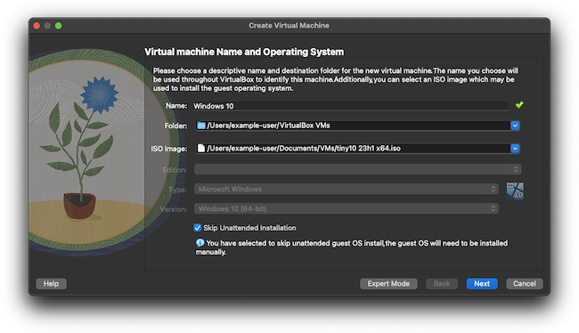](virtualbox-setup-image.png)

1.  Keep the default options for the **Hardware** prompt.

    [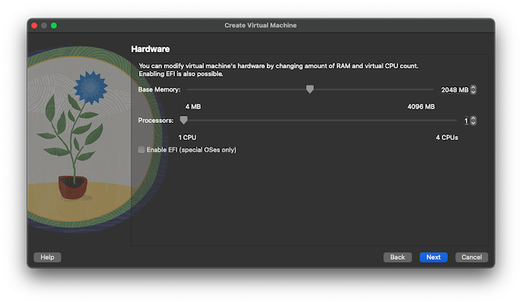](virtualbox-setup-hardware.png)

1.  For the **Virtual Hard Disk** prompt, select **Create a Virtual Hard Disk Now** and set the **Disk Size** to at least 20 GB. Do not pre-allocate, however.

    [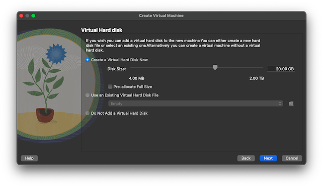](virtualbox-setup-disk.png)

1.  Review the settings, and complete the virtual machine configuration.

1.  With the new virtual machine highlighted, select the **Start** option from the VirtualBox VM manager. The virtual machine should begin running.

1.  For the kinds of system images being covered in this tutorial, you can now expect an operating-system installation wizard. You need now to complete the installation process.

    The required steps for installation vary based on the operating system, so follow the prompts and the appropriate documentation for the system.

    [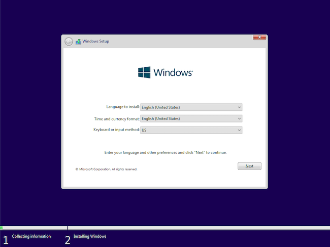](vm-windows-setup.png)

1.  Once the installation has finished, you should be taken into the operating system. Consider now how you intend to access the system from the Compute Instance. The Akamai Cloud Manager provides a GLish console, where you can access the system's desktop environment. But if you want remote access otherwise, you should install a VNC server or enable remote desktop on the system.

    -   For Windows, you can enable remote desktop by following the [official documentation](https://learn.microsoft.com/en-us/windows-server/remote/remote-desktop-services/clients/remote-desktop-allow-access)

    -   For Linux, you can install a VNC server, such as [TigerVNC](https://tigervnc.org/). You can refer to our guide [Install VNC on Ubuntu](/docs/guides/install-vnc-on-ubuntu-20-04/) for helpful steps on setting up TigerVNC, including steps for running the VNC server on system start up.

1.  Verify that things are as you expect, and then shut down the system. On Windows, you can shut down from the **Start** menu.

    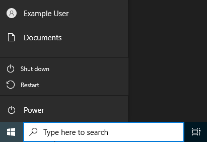

1.  In the VirtualBox VM manager, with the virtual machine highlighted, select the **Settings** option. Navigate to the **Storage** tab, and locate the mounted disk image. Right-click the image, and select **Remove Attachment**.

    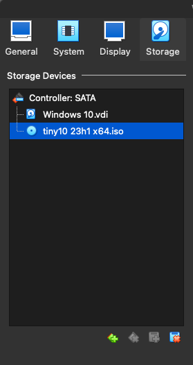

Your operating system's image is now ready. Leave the virtual machine powered off for the time being. Later, a special boot process allows you to migrate the operating system to your Compute Instance.

### Preparing a Compute Instance

The parallel steps on the cloud side of the process require you to create an empty Compute Instance. By default, Compute Instances come with a Linux distribution and a loaded disk. So much of the work here involves removing those defaults and implementing a custom configuration that can support an incoming image.

1.  If you have not already done so, sign up for a Linode account. See our [Getting Started with Linode](/docs/guides/getting-started/) guide.

1.  Create a new Compute Instance. The distribution image does not matter, but you should select a minimum of a **Linode 8GB** instance. This tutorial used the *Debian 11* image and a **Linode 8GB** instance, named `custom-image-linode`.

    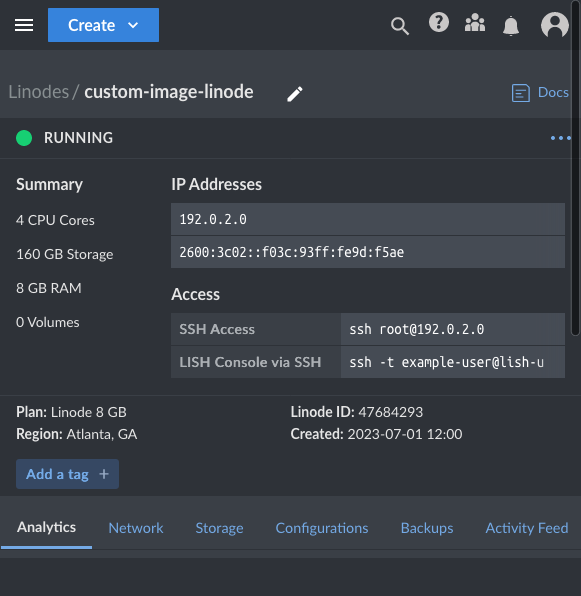

1.  Once the instance has a *Running* status, power it down using the **Power Off** option within the Akamai Cloud Manager.

    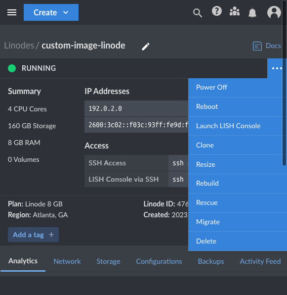

1.  Navigate to the page for the instance, and select the **Storage** tab. Under **Disks**, locate the primary disk, usually with the *ext4* type, and select **Delete** from the disk's menu.

    [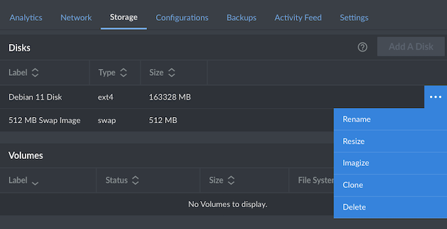](cloud-manager-instance-storage-menu.png)

1.  Afterward, the **Add A Disk** option becomes available. Select that button, and complete the prompt as follows to create a new disk for the instance.

    -   Choose **Create Empty Disk**

    -   Provide a label to describe the disk

    -   Ensure that the **Filesystem** is *ext4* and the **Size** is the maximum allowed, both of which should be default

    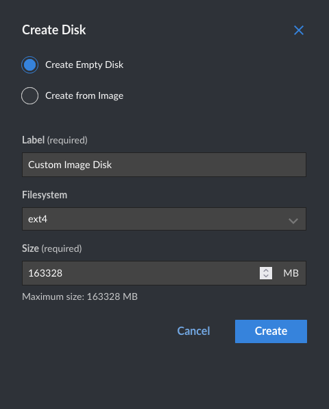

1.  Navigate to the instance's **Configurations** tab, and select **Add Configuration**. In the form, use the options described here.

    -   Give the configuration a descriptive **Label**

    -   For **VM Mode**, choose *Full Virtualization*

    -   Under **Boot Settings**:

        -   **Select a Kernel** needs to be *Direct Disk*

        -   **Run Level** needs to be *Run Default Level*

        -   **Memory Limit** needs to be *Do not set any limits on memory usage*

    -   Under **Block Device Assignment**:

        -   Select for **/dev/sda** the empty disk you created

        -   Ensure **/dev/sdb** is set to the *Swap Image* disk

        -   Set **initrd** to *None*

    -   Do not **Use Custom Root**, and ensure the **Root Device** is */dev/sda*

    -   Have **eth0** set to *Public Internet*, and leave the other **Network Interfaces** at *None*

    -   Leave all **Filesystem/Boot Helpers** on except for **Auto-configure Networking**, which you need to disable

1.  Locate the default configuration profile, and select the **Delete** option from its menu. You can leave the default configuration profile, but it makes things easier to remove it now.

All of that leaves you with an empty Compute Instance, ready to be loaded with a custom image.

### Deploying the Image

Both sides of the setup have been prepared — the local virtual machine and the cloud instance. What remains requires you to coordinate both of these to transfer the virtual machine disk to the empty disk on the Compute Instance.

This is where the [Finnix](https://www.finnix.org/) distribution comes in. Finnix works well as a boot manager and for boot utilities, and it is used for that purpose in the Akamai Compute Instances' rescue mode.

Booting both the virtual machine and the cloud instance into live-booted Finnix systems allows you to sync the disks between the two locations. Afterward, your cloud instance can run the image you had set up in the virtual machine.

#### Get the Finnix Distribution

As mentioned above, Finnix is already part of the Compute Instance. When, in the next section, the instance gets booted into rescue mode, it runs a live-booted Finnix system.

What remains is to have the Finnix system locally for booting with your virtual machine. For that, download the [Finnix distribution](https://www.finnix.org/Download) disc image. A later step shows you how to mount this image onto the virtual machine for live booting.

#### Placing the Instance in Rescue Mode

To receive the virtual machine image from your local system, the Compute Instance needs to be running in rescue mode. Rescue mode runs a live Finnix system on the instance. The steps below then use this live system to allow temporary access to the empty disk you set up earlier.

1. Navigate back to the page for the empty Compute Instance in the Akamai Cloud Manager. Choose the **Rescue** option from the instance menu. This gives you a prompt to boot the instance into rescue mode.

    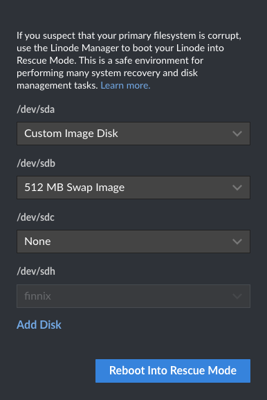

1.  Ensure that **/dev/sda** is the empty disk you created and that **/dev/sdb** is the *Swap Image* disk. The **/dev/sdc** option should be *None*. Then select to **Reboot into Rescue Mode**.

1.  From the instance page again, use the **Launch LISH Console** option. You are taken to a console into the Finnix boot manager on the Compute Instance.

    ```output
    Finnix 121 (ttyS0)

    finnix login: root (automatic login)

    Linux finnix 5.7.0-2-amd64 #1 SMP Debian 5.7.10-1 (2020-07-26) x86_64
    root@finnix:~#
    ```

1.  Enter the command `passwd` and follow the prompts to create a temporary password for the Finnix system.

1.  Run the command here to start up the SSH service to temporarily allow SSH connections into the Finnix system.

    ```command
    service ssh start
    ```

Leave the Compute Instance running in this way until the transfer of the new operating system is finished. Later, the steps pick back up with the instance and help you boot into the new system.

#### Transferring the Virtual Machine Image

With the Compute Instance in rescue mode and allowing access to the empty disk, you can start a disk transfer from your local virtual machine. To do so, you need to similarly boot the virtual machine into a live Finnix system. From there, a set of commands over SSH begin the transfer.

1.  Open the VirtualBox VM manager, highlight the virtual machine, and select the **Settings** option.

1.  Navigate to the **Storage** tab, right-click on the **Controller**, and select **Optical Drive**.

1.  In the prompt, select **Add** and locate the downloaded Finnix disk image file. With the Finnix image selected, complete the prompt to mount Finnix to the virtual machine.

    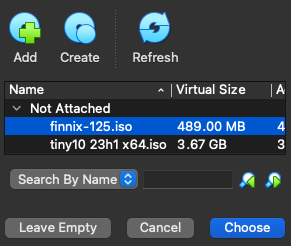

    [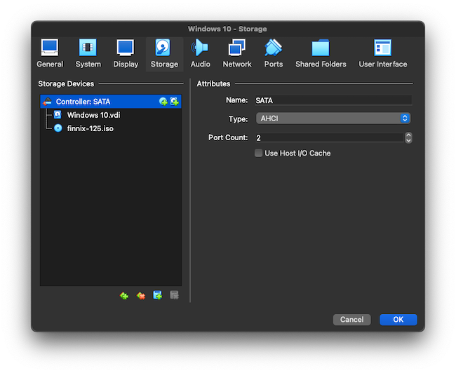](virtualbox-mounted.png)

1.  With the virtual machine highlighted, select the **Start** option within the VM manager.

1.  You should see the Finnix boot manager. Select the **Live system** option to start into the Finnix system.

1.  Once the Finnix system boots up, enter the following command to begin transferring the virtual machine onto the Compute Instance disk. Replace `192.0.2.0` in this example command with your Compute Instance's public IP address.

    ```command
    dd if=/dev/sda | pv | gzip -9 | ssh root@192.0.2.0 "gzip -d | dd of=/dev/sda"
    ```

    You are prompted to enter a password for the SSH connection. Use the temporary password you set on the Compute Instance's Finnix boot manager.

1.  Wait for the transfer to finish, which may take several minutes depending on your connection speed. At the end of the transfer, verify that the local Finnix instance indicates that 20 GB has been transferred.

1.  Power down the virtual machine.

At this point, you should be done with the local virtual machine. Still, it is a good idea to leave everything intact until you verify the deployment in the next step. Afterward, you can safely do what you would like with the local machine and its related files.

### Accessing the Deployed System

Your custom image has now been deployed, and should be running on your Compute Instance. If you set up a remote desktop or VNC server, you should be able to access the cloud instance's desktop environment using that.

But probably the quickest way to verify that the instance has deployed as expected is through the Akamai Cloud Manager. There, you can access the Glish console, which lets you access an instance's graphical output from within your browser. No need to manually set up a remote desktop or VNC.

The steps that follow show you how to access the instance's desktop environment, verifying the deployment, using the Glish console.

1.  Navigate back to the Compute Instance, exiting the LISH console if it is still open and making your way back to the instance's page in the Akamai Cloud Manager.

1.  Select the **Power Off** option for the instance. Once the shut down has finished, select the **Power On** option to start the instance back up again. This time, the instance should be starting from the newly-transferred image.

    
    If you retained the instance's original configuration profile, you should ensure that you are using the custom configuration for start up. One way to do so is by locate the custom configuration profile and using the **Boot** option on that when starting the instance back up.
    

1. Give it a short while, and the instance should be fully started up. Navigate to the **Launch LISH Console** option, and select the **Glish** tab to connect to the instance's graphical display.

From there, you should be able to interact with the instance just as you had interacted with the operating system as a local virtual machine. Using the same startup and login processes you had locally to get started.

## Conclusion

And with that you have the full process for deploying custom images to Akamai Cloud. The examples have referenced Windows 10, but the same process can be used for a wide range of operating systems. Whether you have a system image that is incompatible with automatic installation or you want to install custom software before deployment. Keep this tutorial ready to get any system onto the cloud as needed.
