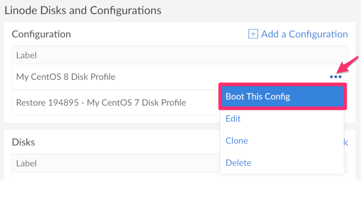

[CentOS](https://www.centos.org) is a Linux distribution derived from [Red Hat Enterprise Linux (RHEL)](https://www.redhat.com/en/technologies/linux-platforms/enterprise-linux). Some key features new for [CentOS 8](https://wiki.centos.org/Manuals/ReleaseNotes/CentOS8.1905) are:

- Default [desktop environment](https://www.gnome.org) installation.
- TCP Networking Stack version 4.16.
- Default packet filtering with [nftables](https://en.wikipedia.org/wiki/Nftables).
- Improved security with [OpenSSL 1.1.1](https://www.openssl.org/news/openssl-1.1.1-notes.html) which includes TSL 1.3.

When upgrading from CentOS 7 to CentOS 8, the cleanest path to migration is to spin up a new installation and move your data. While Red Hat provides an upgrade tool for upgrading to RHEL 8, there is currently no reliable equivalent for CentOS usage. Therefore, upgrading in place is not recommended. This guide will show you how to make the clean install and migration process as quick and easy as possible.

## In This Guide
This guide will walk you through the steps to migrate from CentOS 7 to CentOS 8 by:

- [Backing up your CentOS 7 installation](#back-up-your-data)
- [Creating a new CentOS 8 installation](#create-a-new-deployment)
- [Mounting your old CentOS 7 backup](#mount-the-disk)
- [Moving your data to the CentOS 8 installation](#copy-the-files)
- [Cleaning Up](#clean-up)

## Prepare Your Linode

### Back Up Your Data
For this guide you will need a backup of your existing CentOS 7 installation. You can back up your Linode in two ways.

- You can enroll in [Linode's Backup Service](/docs/products/storage/backups/). This will take automatic regular backups for you, and give you the option of taking a [Manual Snapshot](/docs/products/storage/backups/#take-a-manual-snapshot) at any time.
- For alternative backups solutions, see our [Backing Up Your Data](/docs/guides/backing-up-your-data/) guide.

When creating your backup, it's recommended that you [Resize Your Disk](/docs/guides/resize-a-linode-disk/) to the smallest size possible in advanced in order to ensure that you are able to allocate an extra disk in a later step.



It is important to note that automatic backups using Linode's Backup Service will be overwritten after between 8-14 days have passed. If you would like a backup of your Linode to be preserved for a longer time period, it is recommended that you take a [Snapshot](/docs/products/storage/backups/#take-a-manual-snapshot) which will never expire unless manually overwritten.



### Create a New Deployment

1.  In Cloud Manager, click on the Linode that currently has CentOS 7 installed.

1.  Click on the **Rebuild** tab.

1.  From the **Images** drop down menu, select the CentOS 8 image and enter a Root Password. Optionally, add an SSH key.

1.  Click the **Rebuild** Button. This will create a new CentOS 8 disk and configuration profile. You can read more about configuration profiles in the [Managing Configuration Profiles on a Linode](/docs/guides/linode-configuration-profiles/) guide.

1.  Shut down the Linode by clicking on the status icon and choosing **Power Off** from the drop down menu.

1.  Click the **Disks/Configs** tab.

1.  Resize the CentOS 8 Disk by clicking the **More Options Ellipses** and choosing the Resize option from the drop down menu.

    

1.  Leave enough space to make a new disk for your backup.

1.  Click the **Backups** tab, followed by the **More Options Ellipses** next to the backup you created, and select **Restore to Existing Linode** from the drop down menu.

    

     

If your Linode's disks have been using the entirety of allocatable space available to your Linode, then you will either need to [Resize Your Disk](/docs/guides/resize-a-linode-disk/) so that you can take a new [Snapshot](/docs/products/storage/backups/#take-a-manual-snapshot), or [Resize Your Linode](/docs/guides/resizing-a-linode/)



1.  Select the current Linode and leave the box for **Overwrite Linode** unchecked. Then click the **Restore** button.

    

1.  This will create two new disks, one for the main disk and one swap, and a new configuration profile. All will have *Restore* at the beginning of their names.

    

## Move Your Data

### Prepare the Disk Configuration

1.  When the restore has completed, click the **Disks/Configs** tab.

1.  Edit the CentOS 8 Disk Configuration by clicking the **More Options Ellipses** and choosing **Edit** from the drop down menu.

1.  The Edit Linode Configuration Panel will open. In the **Block Device Assignment** section add the *Restore CentOS 7* disk to `/dev/sdc`. Click the **Submit** button to save this change.

    

1.  Click the **More Options Ellipses** for the CentOS 8 Disk Configuration and select **Boot This Config** from the drop down menu.

    

1.  Now you can SSH into your server. Don't forget to [secure your new installation](/docs/guides/set-up-and-secure/).

### Mount the Disk

1.  Use the `lsblk` command to view the filesystem attached to your system.

        lsblk

1.  The output should look similar to this:

    
NAME MAJ:MIN RM  SIZE RO TYPE MOUNTPOINT
sda    8:0    0  2.1G  0 disk /
sdb    8:16   0  512M  0 disk [SWAP]
sdc    8:32   0 24.5G  0 disk


    Notice how `sdc` doesn't have a mountpoint specified, this is because it isn't mounted yet.

1.  Mount your old CentOS 7 drive:

        mount /dev/sdc /media

    Feel free to change the directory to something other than `/media`. However, any content in the directory you choose will be inaccessible while you have a filesystem mounted to it.

1.  Check that this was successful by running the `lsblk` command again:

    
sda    8:0    0  2.1G  0 disk /
sdb    8:16   0  512M  0 disk [SWAP]
sdc    8:32   0 24.5G  0 disk /media


1.  Your files should be listed under the directory `/media`.

### Copy the Files

1.  You can copy them with `cp`. For example:

        cp -r /home/media/home/username/MyFiles /home/username/MyFiles

  - The `-r` option tells this to copy directories recursively. Omit this if you only want to copy one directory without its child directories, or if you are copying single files.
  - The first location is the source on the mounted drive.
  - The second location is the destination on your new installation.

1.  Unmount the disk when you are finished copying your files:

        umount /dev/sdc

## Clean Up

### Remove the Backup Disks and Configuration
When you are sure you've copied all your files, you can delete the disks and configurations created by the backup restore.

1.  Power down your Linode.

1.  Click the **Disks/Configs** tab.

1.  Click the **More Options Ellipses** next to the backup disk and select **Delete** from the drop down menu.

    

1.  Do the same for the swap disk and the configuration that was created from the backup restore.

### Resize Your Disk

Optionally, you can resize the CentOS 8 Disk to expand to the size remaining on your Linode.

1.  From the **Disks/Configs** tab, click on the **More Options Ellipses** for the CentOS 8 disk and select **Resize** from the drop down menu.

1.  Enter the maximum size allowed as provided under the field.

    

1.  Click the **Resize** button.
