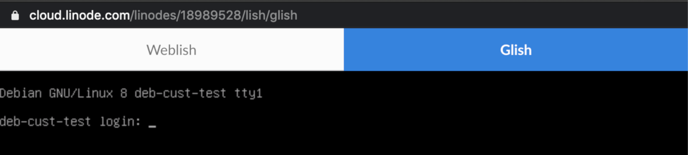

This guide shows you how to install and configure a custom distribution on your Linode.

For the sake of organization, it has been split into two main sections:

*  [Install a Custom Distribution](#install-a-custom-distribution): shows you how to use the advantages of **Direct Disk Boot** to easily install the custom distribution.

*  [Linode Manager Compatibility](#linode-manager-compatibility): builds upon the steps in the first section, and offers instructions to make your custom distribution work with features of the Linode Manager such as disk resizing, helpers, and the [Linode Backup Service](/docs/products/storage/backups/).

This guide uses Debian 8 (Jessie) as an example, but the steps provided are generic in nature and should work with most distributions.

## Advantages of KVM on Linode

Linodes running on our KVM hypervisor offer several advantages, particularly for those looking to install a custom operating system:

*  **Direct Disk Boot:** Direct disk booting allows you to boot from any disk with a Master Boot Record (MBR). This can be especially useful for operating systems that do not make use of the Grub bootloader, such as [FreeBSD](/docs/guides/install-freebsd-on-linode/).

*  **Full Virtualization:** Our KVM hypervisor offers a full virtualization option that simulates the experience of running directly from hardware. This can be useful for non-standard configurations.

*  **Glish:** KVM introduces the [Glish](/docs/guides/using-the-linode-graphical-shell-glish/) graphical console, which makes it easy to access your distribution's installer directly from a disk.

## Install a Custom Distribution

In this section you install your custom distro onto a raw disk, with the *direct disk boot* option. The end result is a working custom install; however, it does not support disk resizing from within the Linode Manager, nor is it compatible with the Backup Service.

### Prepare your Linode

1.  Log into the [Cloud Manager](https://cloud.linode.com)
1.  Click the **x** button next to the default *Debian* image in the **Images** dropdown to create a Linode without a distribution.
    
 When you create a Linode without a distribution you are not prompted to create a root password for your Linode. Continue to choose the region, plan, Linode label, and select **Create**.


1.  After the Linode is finished provisioning, power it down.

1.  Click the **More Options Ellipsis**, and select the **Resize** option.

1. In the Resize menu uncheck the **Auto Resize Disk** option at the bottom of the screen.

1.  Next, exit the resize screen and click the **Storage** tab and click **Add a Disk** to create two unformatted disks.

1.  [Create two raw, unformatted disk images](/docs/guides/disks-and-storage/#creating-a-disk) from the Linode's Dashboard:

    * A disk labeled **Installer**. The size of this disk depends upon the size of your distribution's installer, but it's recommended to make it slightly larger than the space taken up by the install media itself. For this example, the installer disk is 100MB in size, giving us plenty of room for the Debian network installer.
    * A disk labeled **Boot**. If you *don't* plan to complete the next section on Linode Manager compatibility, this can take up the rest of the free space available on your Linode.

        
        You can always check how much space your disk is actively using and would therefore require by entering the `df -h` command when it's mounted.
       

    
If you intend to continue to the next section on [Linode Manager Compatibility](#linode-manager-compatibility), you should make your boot disk no larger than necessary - in this example we'll install Debian to a 2000MB disk.


1.  [Create two configuration profiles](/docs/guides/linode-configuration-profiles/#creating-a-configuration-profile) and disable the options under **Filesystem / Boot Helpers** for each of them, as well as the [Lassie](/docs/guides/monitoring-and-maintaining-your-server/#configuring-shutdown-watchdog) shutdown watchdog under the **Settings** menu. Both profiles use the **Direct Disk** option from the **Kernel** dropdown menu:

    **Installer profile**

    - Label: Installer
    - Kernel: Direct Disk
    - /dev/sda: *Boot* disk image.
    - /dev/sdb: *Installer* disk image.
    - root / boot device: Standard /dev/sdb

    **Boot profile**

    - Label: Boot
    - Kernel: Direct Disk
    - /dev/sda: *Boot* disk image.
    - root / boot device: Standard /dev/sda

### Download and Install Image

1.  Boot into [Rescue Mode](/docs/guides/rescue-and-rebuild/#booting-into-rescue-mode) with your *Installer* disk mounted to `/dev/sda`, and connect to your Linode using the [Lish Console](/docs/guides/using-the-lish-console/).

1.  Once in Rescue Mode, download your installation media and copy it to your *Installer* disk. In this example we're using the Debian 10.11 network installer, but you can replace the URL in the following command with the location of the image you want to install:

    
As an additional security step, you can use the keys provided in the same directory as the `iso` to [verify the authenticity](https://www.debian.org/CD/verify) of the image.


        wget http://ftp.debian.org/debian/dists/Debian10.11/main/installer-amd64/current/images/netboot/mini.iso
        dd if=mini.iso of=/dev/sda

    
If you would prefer to write the installer directly to the disk as it downloads, use:

    curl http://ftp.debian.org/debian/dists/Debian10.11/main/installer-amd64/current/images/netboot/mini.iso | dd of=/dev/sda


1.  Empty the cache so that you have enough space to unpack and install the image.

        sync; echo 3 > /proc/sys/vm/drop_caches

1.  Close the Lish window and go back to Cloud Manager. Reboot into your *Installer* configuration profile and open the [Glish](/docs/guides/using-the-linode-graphical-shell-glish/) graphical console. You see your distribution's installer, and you can begin the install process.

1.  During your installer's partitioning/installation phase, be sure to instruct it to use the `/dev/sda` volume. Most installers create separate root and swap partitions, but you can adjust this as needed.

    
Some installers offer an option to place `/boot` on a separate partition. If you intend to make use of the steps in the [second part](#linode-manager-compatibility) of this guide for Linode Manager compatibility, it's important that your `/boot` directory is located on the same partition as your root filesystem.


1.  Once the installation completes, close the Glish window and return to the Cloud Manager. Reboot into your *Boot* profile and open the Glish console. You have access to a login prompt:

    

### Configure Grub for Lish Access

At this point you can connect to your Linode via the Glish graphical console and SSH if it is enabled and included by default. However, you can not connect to your Linode using the Lish serial console. To fix this, update the following settings in your `/etc/default/grub` file:


GRUB_TIMEOUT=10
GRUB_CMDLINE_LINUX_DEFAULT=""
GRUB_CMDLINE_LINUX="console=ttyS0,19200n8 net.ifnames=0"


Once you've finished editing `grub`, issue the appropriate command to apply your changes to your Grub configuration:

*   Ubuntu and Debian:

        sudo update-grub

*   CentOS and Fedora:

        grub2-mkconfig -o /boot/grub2/grub.cfg

*   Arch Linux and Gentoo:

        grub-mkconfig -o /boot/grub/grub.cfg


If you're still not able to access your Linode via Lish after updating your GRUB configuration, a reboot may be required. If this is the case, make sure you're rebooting into your *Boot* configuration profile.

Additionally, in some cases, SSH will not be enabled or included by default as part of your installation. In Debian 10 for example, the `openssh-server` package will need to be installed manually with the following command before connecting to your Linode over SSH:

    sudo apt install openssh-server


## Linode Manager Compatibility

If you've followed the steps so far, you should have a working custom distribution with raw disks, using the *direct disk* boot option. While this setup is functional, it's not compatible with several features of the Linode Manager that require the ability to mount your file system, such as:

*  **Disk Resizing:** Since the Linode Cloud Manager cannot determine the amount of *used* storage space on a raw disk, it can only **increase** the size. The Linode Cloud Manager cannot be used to make a raw disk smaller, and it cannot resize the file system on the disk - this would need to be done manually. Also, some ext4 features like enabled `metadata_csum` are not supported for custom distribution images.

*  **Backups:** The Linode Backup Service needs to be able to mount your filesystem, and does not support partitioned disks.

*  **Helpers:** Several helpful features within the Linode Manager, such as [root password resets](/docs/guides/reset-the-root-password-on-your-linode/) and [Network Helper](/docs/guides/network-helper/), need access to your file system in order to make changes.

This section covers how to move your custom installation over to an **ext4** formatted disk so it can take advantage of these tools.


These features are not available even if you formatted the disk to *ext4* during installation because *direct disk* was selected during disk creation.


### Prepare your Linode

1.  Create some room for two new disks. One formatted *ext4* to move the file system to and one for *swap*.

1.  [Create a new ext4 disk](/docs/guides/disks-and-storage/#creating-a-disk). The new disk should be large enough to accommodate the root file system that was created on your raw disk (2000 MB). You can make this as large as you'd like, but you should leave enough space for a separate swap partition. For this example, name this disk *Boot-New*.

1.  Create the second new disk and choose *swap* for the disk type. The size of this disk depends upon your needs, but it's recommended that you make it between 256-512MB to start. Label this disk *Swap*.

1.  [Create a new configuration profile](/docs/guides/linode-configuration-profiles/#creating-a-configuration-profile) with a name of your choice. For this example, call the new profile *Installer-New* and it uses the following options:

    **Installer-New profile**

    - Label: Installer-New
    - Kernel: GRUB 2
    - /dev/sda: *Boot-New* disk image.
    - /dev/sdb: *Swap* disk image.
    - root / boot device: Standard /dev/sda

### Update your fstab

1.  You should still be booted into your *Boot* profile using direct disk boot; if not, boot into it now.

1.  Before you update your `/etc/fstab` file, make sure you know the current root partition of your custom distribution. You can use the `lsblk` command to confirm which partition has `/` as its mount point:

    
root@custom-kvm:~# lsblk
NAME   MAJ:MIN RM  SIZE RO TYPE MOUNTPOINT
fd0      2:0    1    4K  0 disk
sda      8:0    0  7.8G  0 disk
└─sda1   8:1    0  7.5G  0 part /
sr0     11:0    1 1024M  0 rom


    In this case, you can see that the `/dev/sda1` partition is the location of your root filesystem.

1.  Next, update your `/etc/fstab` file to match the following:

    
# &lt;file system&gt; &lt;mount point&gt;   &lt;type&gt;  &lt;options&gt;                  &lt;dump&gt;  &lt;pass&gt;
    proc        /proc           proc    defaults                    0       0
    /dev/sda    /               ext4    noatime,errors=remount-ro   0       1
    /dev/sdb    none            swap    sw


    Depending upon your distribution, it may use different parameters for your root disk under the "options" section. These can be adjusted as needed. Note that you're using `/dev/sda` instead of the `sda1` root partition that was identified previously.

### Configure Grub

1.  Confirm the location of your `grub.cfg` file. Some distributions (notably, CentOS and Fedora) place this file under the `/boot/grub2` directory, while others have it under `/boot/grub`. Your new setup uses our *Grub 2* mode, which looks for a configuration file under `/boot/grub/grub.cfg`. You can confirm if your `grub.cfg` is located in the necessary spot with the `ls` command:

        ls -la /boot/grub/grub.cfg

    If your distro places its Grub configuration under this directory, you should receive output similar to the following:

        root@custom-kvm:~# ls -la /boot/grub/grub.cfg
        -r--r--r-- 1 root root 5235 Dec 28 08:05 /boot/grub/grub.cfg

1.  If the Grub config is located under `/boot/grub2` instead, create a symlink to provide the correct configuration to the bootloader:

        mkdir /boot/grub
        ln -s /boot/grub2/grub.cfg /boot/grub/grub.cfg

1.  Update your `grub.cfg` file, replacing all instances of `/dev/sda1` with `/dev/sda`. Note that this command needs to be adjusted if your root file system is located on a partition other than `/dev/sda1`:

        sed -i -e 's$/dev/sda1$/dev/sda$g' /boot/grub/grub.cfg

    Keep in mind that if your `grub.cfg` is located under `/boot/grub2`, you should adjust this command to reflect that.

### Transfer your Root File System to your Ext4 Disk

Now that you've updated the necessary configuration files, you're ready to move your root file system to the ext4 disk you created previously. To get started, boot your Linode into [Rescue Mode](/docs/guides/rescue-and-rebuild/) with the following disk assignments:

*  *Boot* disk mounted to `/dev/sda`
*  *Boot-New* disk mounted to `/dev/sdb`

In Rescue Mode, connect via Lish and transfer your root file system from the `/dev/sda1` partition to your new ext4 disk:

    dd if=/dev/sda1 of=/dev/sdb bs=1M

Once the transfer completes, reboot into your *Installer-New* profile. You now have a custom distribution that works with the Linode Manager's extra features. In order to make use of the Backup Service, you need to remove the raw disks that were used during the installation process.

### Linode Images

Linode offers an image feature. The feature allows users to quickly deploy custom or preconfigured distribution images to new Linodes. Review the [Images](/docs/products/tools/images/) documentation to learn more.
