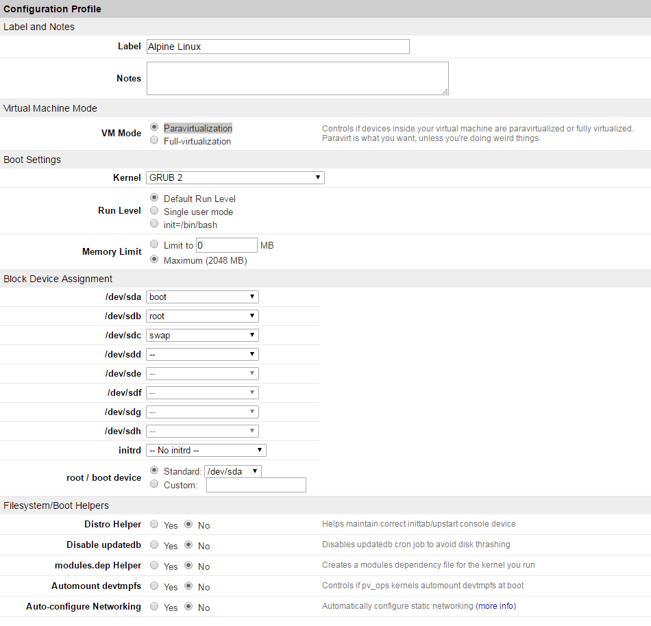

[Alpine Linux](http://www.alpinelinux.org/) is a small, security-oriented Linux distro.
It's regularly updated with security patches, and runs on the [grsecurity](https://grsecurity.net/) kernel. All binaries are statically linked and built against [musl libc](http://www.musl-libc.org/intro.html).

## Before You Begin

1.  Familiarize yourself with [Lish](/docs/products/compute/compute-instances/guides/lish/), as most of this guide will require an out-of-band connection.

2.  Installing Alpine in this manner will destroy all existing data on the installation target disks. Back up *all* data on the disks which you intend to install Alpine on.

3.  The initial portion of this guide involves creating the disk images, so you make sure you have plenty of free space for them. A minimal installation of Alpine requires less than 1 GB, but depending on your needs, you may want to allow for more.

4.  This guide assumes a consistent present working directory, meaning all commands should be run from the same directory. In most cases, it will be `/alpine` or a chroot of said directory.


While this guide will provide you with a fully operational Alpine installation, be aware that Linode does not provide official support for Alpine Linux and cannot guarantee its stability or security. Please consider this before proceeding.


## Prepare the Linode

### Disk Images

In this section, we'll create the disk images necessary to install Alpine Linux. Although it is not strictly necessary, giving each disk a descriptive name upon creation will make it easier to keep track of its role in the system.

1.  Log in to the [Linode Manager](https://cloud.linode.com/linodes/) and select the Linode to install Alpine Linux on.

2.  Create your boot disk image by selecting **Create a new Disk** under the Disks section. The size should be between 128 and 256 MB, and the type should be **ext4**.

    
Boot drives (disk images) will need to store your kernel and your initramfs. Currently, Alpine will need about 21 MB for each kernel/initramfs combination, so even 128 MB is enough for several kernel versions, just remember to keep an eye on the available storage in `/boot` when you perform upgrades of the kernel.


3.  Create your root disk image with as much space as you need, although if you want a swap disk image, make sure you leave room for it. The root disk image should be of the **ext4** type as well.

4.  Optionally, create a swap disk image with type **swap**.

    
Between 256 and 512 MB of swap is a good estimate. Many sources recommend much more than this, but a new installation of Alpine will use less than 50 MB of RAM when fully booted.


### Configuration Profile

Create a new configuration profile for your Linode. Choose **GRUB 2** from the kernel menu, which will use the GRUB 2 bootloader to boot Alpine's kernel from your disk image. Set your boot disk image as `/dev/sda`, your root disk image as `/dev/sdb`, and your swap disk image, if you created one, as `/dev/sdc`.

Turn off all the **Filesystem/Boot Helpers**. The rest of the settings can be left at their default values.

## Install Alpine Linux

### Boot into Rescue Mode

1.  From the Linode Cloud Manager, boot your Linode into [Rescue Mode](/docs/products/compute/compute-instances/guides/rescue-and-rebuild/), with your boot disk image as `/dev/sda`, your root disk image as `/dev/sdb`, and your swap as /`dev/sdc`.

2.  Once the Linode has booted, connect to it via Lish. If you are not familiar with Lish, there is a simple web interface for it in the Linode Cloud Manager. Access it by clicking the **Launch Console** link from the Linode's dashboard.

### Mount Drives

1.  Create the `/alpine` directory. This will serve as a mount point for the root disk image:

        mkdir /alpine

2.  Mount the root disk to the new `/alpine` directory and navigate to it:

        mount /dev/sdb /alpine
        cd /alpine

3.  Create a `boot` directory and mount the boot disk image to it:

        mkdir boot
        mount /dev/sda /alpine/boot

### Download APK Tools

1.  Update the CA Certificates package so `curl` can verify the download:

        update-ca-certificates

2.  Select your desired Alpine Linux release. In most cases, you can use the [latest stable release](http://nl.alpinelinux.org/alpine/latest-stable/)

3.  Identify the current version of the `apk-tools-static` package. You will need to navigate into the `main/x86_64` directory of your chosen release in your web browser.

    For example, the latest stable version's `apk-tools-static` package can be found at `http://nl.alpinelinux.org/alpine/latest-stable/main/x86_64/`. From there, simply search for `apk-tools-static`. Once you've found it, copy the file's location. To do this in most browsers, right click the filename and select **Copy Link Address**.

4.  Download and extract the `apk-tools-static` package to your Linode. You should still be working in the `/alpine` directory when performing this step. Replace `address` in the following command with the address you copied in the previous step:

        curl -s address | tar xz

5.  Perform the initial distro installation. This will use the latest stable build of Alpine:

        ./sbin/apk.static --repository https://nl.alpinelinux.org/alpine/latest-stable/main/ --update-cache --allow-untrusted --root /alpine --initdb add alpine-base alpine-mirrors

    This should output a series of installation messages, followed by a message showing how many packages were installed and their sizes.

### System Configuration

In this section, we will modify critical system files. It is recommended that you make backup copies before making changes.

1.  Configure your filesystem table (*fstab*), entering a single hard tab between each column. This file specifies how each disk is initialized or mounted into the overall filesystem:

    
/dev/sdb    /       ext4    defaults,noatime    0   0
/dev/sda    /boot   ext4    defaults,noatime    0   1
/dev/sdc    swap    swap    defaults    0   0



2.  Uncomment the line below to enable a serial console output. This gives you visibility over Lish when booting the installed system.

    
# Put a getty on the serial port
ttyS0::respawn:/sbin/getty -L ttyS0 115200 vt100



3.  Create the GRUB 2 boot configuration directory:

        mkdir /alpine/boot/grub

    Create a new file, `grub.cfg` within this directory, and add the following contents. This file specifies configuration options for GRUB 2 to use during the boot process:

    
set root=(hd0)
set default="Alpine Linux"
set timeout=0

menuentry "Alpine Linux" {
    linux /vmlinuz-vanilla root=/dev/sdb modules=sd-mod,usb-storage,ext4 console=ttyS0 quiet
    initrd /initramfs-vanilla
}



4.  Create a `mkinitfs` directory:

        mkdir /alpine/etc/mkinitfs

    Create a new file, `mkinitfs.conf`, within this directory and add the following contents. This file specifies options for building the initial RAM file system (*initramfs*):

    
features="ata ide scsi virtio base ext4"



5.  Copy the recovery system's `resolv.conf` file into `/alpine/etc`. Optionally, you can fill in your own choice of DNS resolvers.

        cp /etc/resolv.conf /alpine/etc

6.  If you want to allow root logins over Lish, add `ttyS0` to `securetty`:

        echo ttyS0 >> /alpine/etc/securetty

### Install the Kernel

1.  Bind the `/proc` and `/dev` directories to the `/alpine` directory:

        mount --bind /proc /alpine/proc
        mount --bind /dev /alpine/dev

2.  Enter the Alpine [chroot](https://en.wikipedia.org/wiki/Chroot) jail:

        chroot /alpine /bin/sh

3.  Select a mirror to use when downloading or updating packages:

        setup-apkrepos

    You can select a mirror by entering its corresponding number, or `f` to automatically pick the fastest mirror.

4.  Update your packages:

        apk update

5.  Set your hostname, replacing `example` with a hostname of your choice:

        setup-hostname -n example

6.  Configure important services to start automatically using Alpine's [OpenRC](https://en.wikipedia.org/wiki/OpenRC) init system:

        rc-update add networking boot
        rc-update add urandom boot
        rc-update add crond

    If you'll need other services, you can also add them now. The above is intended to serve as a starting point.

7.  Install the kernel:

        apk add linux-vanilla

8.  Exit the chroot jail:

        exit

## Configure Alpine Linux

### Reboot into Alpine

1.  Reboot into the Alpine Linux configuration you made earlier by selecting the button next to the profile in the Linode Manager and clicking **Reboot**. If this is the only configuration profile, this can also be accomplished directly in Lish using the `boot 1` command. If there are other profiles, you can substitute `1` with the list position of your Alpine profile.

    
During boot, the output in Lish that networking fails to start. This is expected, and will be fixed shortly.


2.  Use Lish to log in as `root`. You will not be prompted for a password since it has not yet been set.

### Configuration

1.  Set up and start networking. Alpine has a handy script that will configure the network interface file for you and guide you through the various options. It's capable of advanced configuration, like bridging and bonding, but for a basic setup, its defaults should be sufficient.

        setup-interfaces

    Press **enter** 3 times to accept the defaults of `eth0`, `dhcp`, and `no`, then restart the networking service:

        service networking restart

    Your Linode should now have a functional network connection.

2.  Set a root password:

        passwd

3.  Create a limited user account to avoid using root for all commands. Replace `example-user` with a username of your choice:

        adduser example-user

4.  Install the `sudo` package:

        apk add sudo

5.  Add your new user to the `wheel` group:

        adduser example-user wheel

6.  Allow the `wheel` group to temporarily elevate their privileges with sudo:

        sed -i '/%wheel/s/^# //' /etc/sudoers

7.  Install and configure the SSH daemon (SSHD). Alpine has a simple setup script to handle this:

        setup-sshd

    We recommend the `openssh` server if you want full SFTP access. `dropbear` is a more lightweight option, although it only provides SSH access.

## Next Steps

At this point, you should be able to connect to your server via SSH. Alpine is very lightweight, and doesn't install very much unless you ask it to.

## Install Packages

Alpine's website provides a searchable library of [available packages](https://pkgs.alpinelinux.org/packages).

A few packages to consider:

-  Text editor: `nano` or `vim`
-  Web server: `lighttpd`, `apache2`, or `nginx`
-  Scripting languages: `php`, `perl`, or `python`
-  Database servers: `mysql` or `postgresql`

Note that some of these combinations may require additional dependencies. To install a new package, use the following command, replacing `package` with the package name(s):

    apk add package

For example, to add Apache, PHP, and MySQL:

    apk add apache2 php mysql

For more information, see Alpine's wiki page on [package management](https://wiki.alpinelinux.org/wiki/Alpine_Linux_package_management).

## Secure Your Server

Before using your Linode in a development or production capacity, make sure you've taken some basic security precautions. Our [Securing Your Server](/docs/products/compute/compute-instances/guides/set-up-and-secure/) guide provides a good starting point but you should also research additional, Alpine-specific security options. Keep in mind that most security packages (e.g. `iptables`.) will need to be installed.

For more information, refer to their wiki page on [security](https://wiki.alpinelinux.org/wiki/Category:Security).
