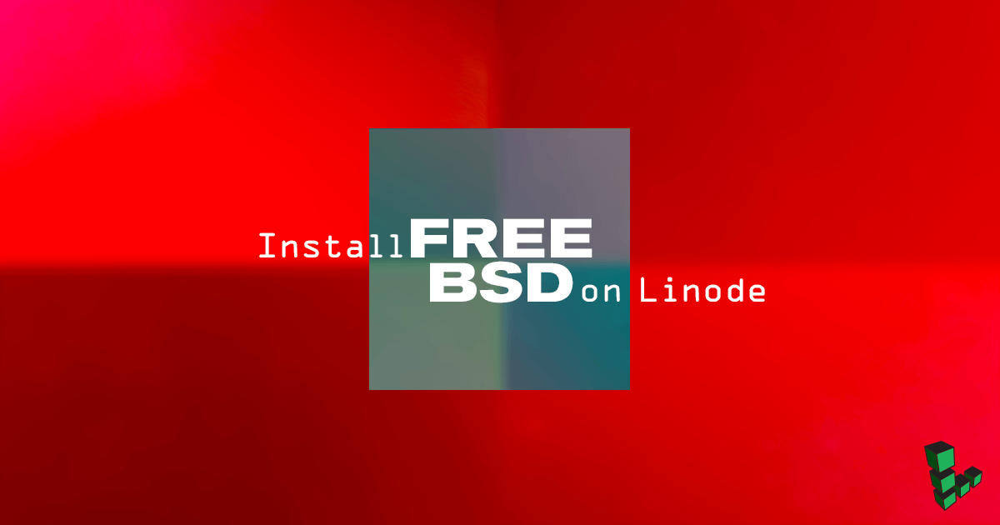

## Introduction to FreeBSD

[FreeBSD](https://www.freebsd.org/) is a free and open-source operating system based on the [Berkeley Software Distribution](https://en.wikipedia.org/wiki/Berkeley_Software_Distribution) originally developed at Berkeley Computer Systems Research Group from the late 1970's. BSD originally started as a series of addon programs and tweaks to Bell Labs UNIX, implementing features and new programs like the venerable [vi](https://en.wikipedia.org/wiki/Vi) editor's first release. Today FreeBSD is used all over the world, including in some major video game consoles!

## FreeBSD vs. Linux

FreeBSD is often compared to Linux. So what's the difference?

Briefly, Linux is a term used for a group of operating systems that all use the Linux kernel, GNU coreutils and various distribution-specific tools. Linux OS's are offered in *distributions* and usually released under the GNU General Public License. [CentOS](https://www.centos.org/), [Debian](https://www.debian.org/) and [Ubuntu](http://www.ubuntu.com/) make up Linode's *core distribution* offerings, while Arch, Gentoo, OpenSUSE and Slackware are other popular distributions also available with Linode.

Though FreeBSD grew out of the original UNIX codebase, no UNIX code currently remains. Every part of FreeBSD is developed in the same source tree and code is released under the more permissive FreeBSD License as opposed to the GNU GPL's copyleft stance. More information on the differences between these operating systems is available in the FreeBSD [Quickstart Guide for Linux Users](https://www.freebsd.org/doc/en/articles/linux-users/article.html).


FreeBSD is not officially supported by Linode at this time. This means that the [Linode Backup](/docs/platform/backup-service) service would be unavailable to you and issues with FreeBSD on your Linode would be outside the scope of Linode Support.


## Preparing Your Linode

Begin by creating the Linode and making some preliminary changes.

1.  Create your Linode in your preferred data center. For the purposes of this tutorial, we recommend turning [Lassie](/docs/uptime/monitoring-and-maintaining-your-server/#configuring-shutdown-watchdog) *off* to prevent the watchdog from attempting to restart your Linode without your input. You can disable Lassie in the **Settings** tab of the Linode Manager under **Shutdown Watchdog**.

2.  [Create two disk images](/docs/guides/disks-and-storage/#creating-a-disk); both should be in the RAW format.

    - The first should be a 1024 MB image labeled *Installer*.
    - The second should use the Linode's remaining space. Label it *FreeBSD*.

3.  Create two configuration profiles with the following settings. In each profile, you will need to disable all of the options under **Filesystem/Boot Helpers**.

    **Installer profile**

    - Label: Installer
    - Kernel: Direct Disk
    - /dev/sda: FreeBSD disk image.
    - /dev/sdb: Installer disk image.
    - root / boot device: Standard /dev/sdb

    **Boot profile**

    - Label: FreeBSD
    - Kernel: Direct Disk
    - /dev/sda: FreeBSD disk image.
    - root / boot device: Standard /dev/sda

4.  [Boot into **Rescue Mode**](/docs/troubleshooting/rescue-and-rebuild/#booting-into-rescue-mode) with the installer disk mounted to `/dev/sda` and access your Linode using [Lish via SSH](/docs/guides/using-the-lish-console/) by clicking on the **Launch Console** link from your Linode's dashboard of the Linode Cloud Manager.

5.  Once in Rescue Mode, run the following command, replacing latest with the latest `memstick.img` file from the [FreeBSD download page](ftp://ftp.freebsd.org/pub/FreeBSD/releases/amd64/amd64/ISO-IMAGES/):

        curl $latest | dd of=/dev/sda

    As of this guide's writing, the latest release is version 12.0. The following command will download the 12.0 release image to your Linode:

        curl ftp://ftp.freebsd.org/pub/FreeBSD/releases/amd64/amd64/ISO-IMAGES/12.0/FreeBSD-12.0-RELEASE-amd64-memstick.img | dd of=/dev/sda

6.  When the command finishes, reboot into your **Installer profile**.

7.  Go to the **Networking** tab in the Linode Cloud Manager. Access your Linode using [Glish](/docs/guides/using-the-linode-graphical-shell-glish/) to start the installation. Note that Glish **must** be used to complete the installation of FreeBSD.

## Installing FreeBSD

1.  The first thing Glish will show you is the FreeBSD welcome screen. Press **Enter** to boot into multi-user mode.

    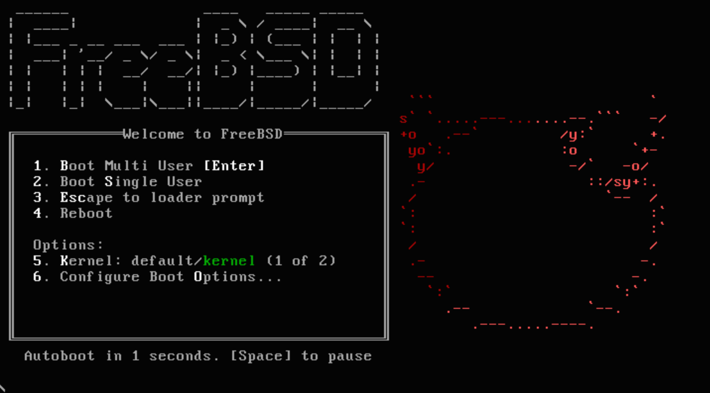

2.  Follow through the prompts to start the installer, choose your keymap and set a hostname if you want one.

3.  For beginners, we suggest selecting to install 32-bit libraries (lib32) and source code (src). Deselect *games* if you have no use for them.

    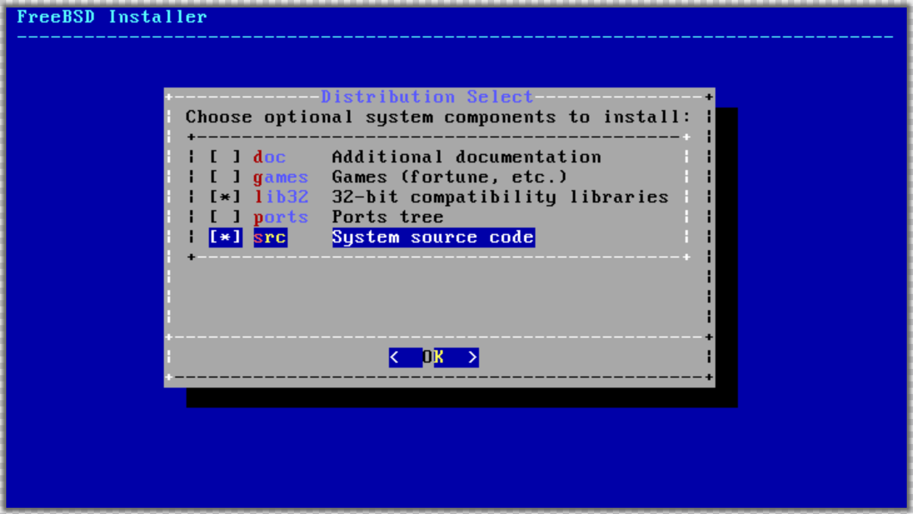

4.  Choose your partitioning and storage options. We recommend using *ZFS (auto)* for the filesystem and partitioning setup.

    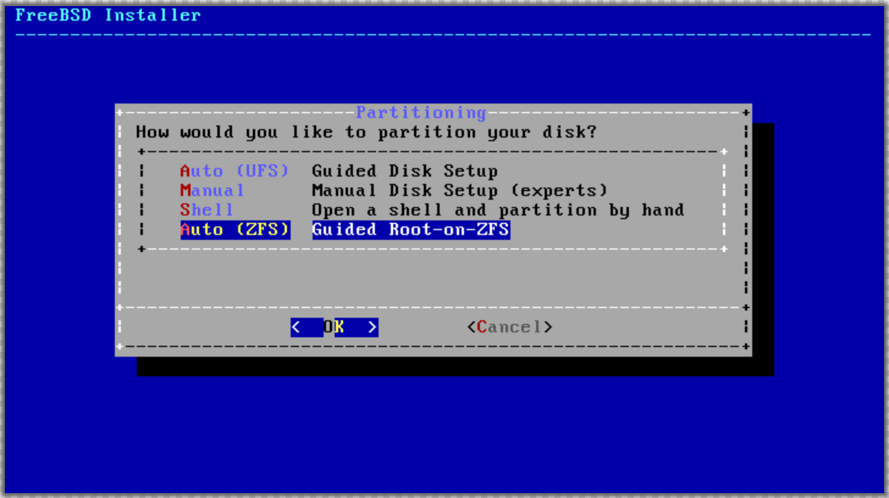

    Configure any additional ZFS options you may want.

    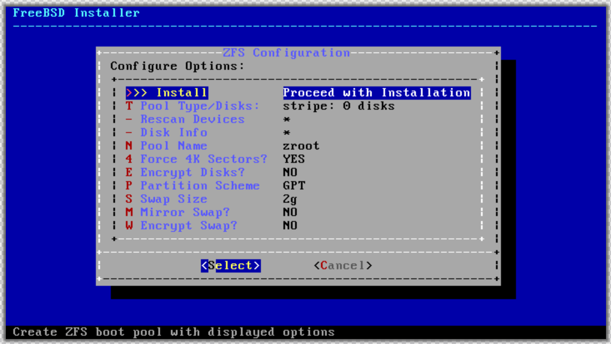

    Select the *striped* disk type, as we're only using a single disk.

    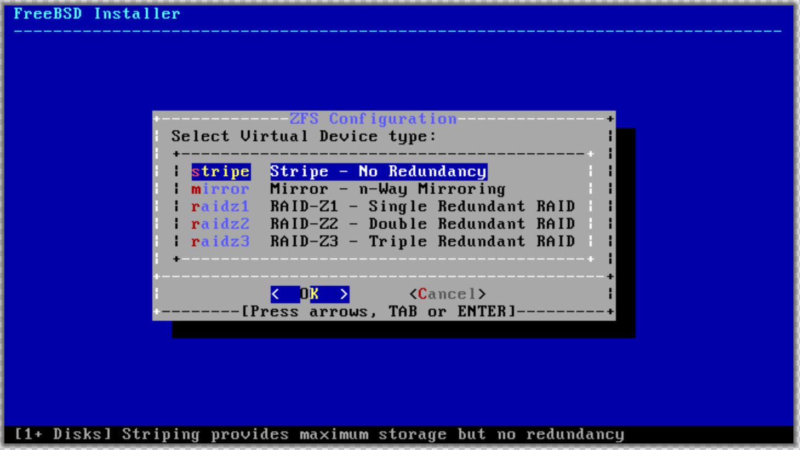

    Select the `da0` virtual disk and then confirm that you do want to destroy its contents.

    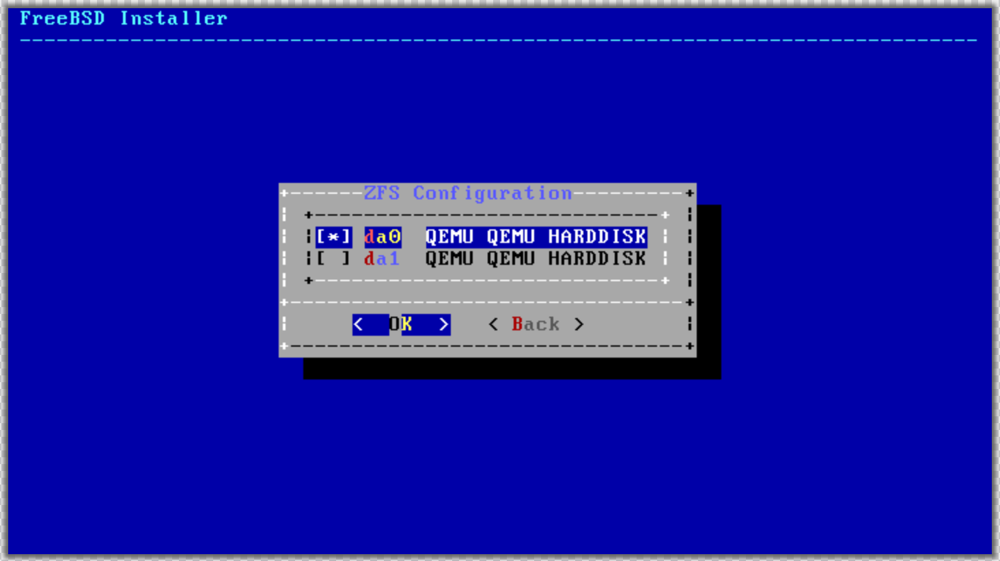

5.  At this point, the distribution files will extract and install. You'll then be asked to set a `root` user password.

    
SSH logins for `root` are disabled by default in FreeBSD but standard system users have SSH access.


6.  You'll next be presented with options for configuring networking. For beginners, answer **Yes** when asked if you want to use IPv4 with DHCP and IPv6 with SLAAC.

    DHCP and SLAAC will provide the default DNS resolvers. Add or edit these options as needed.

    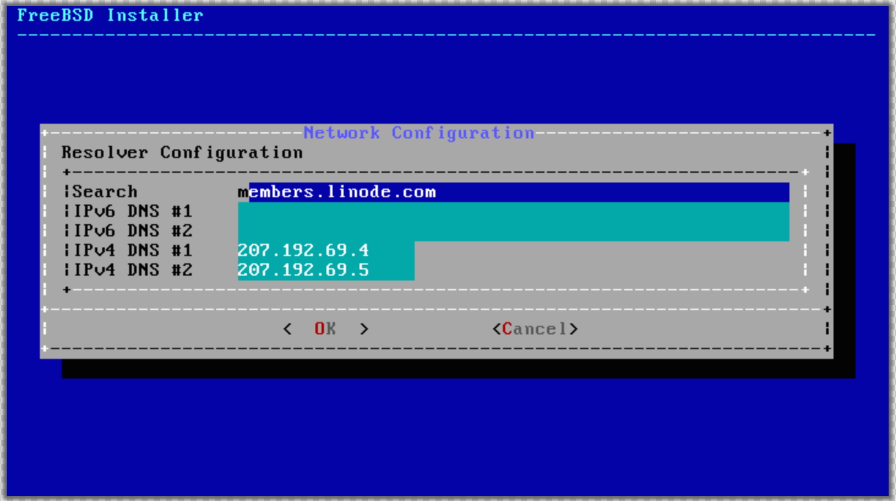

7.  Ensure that your clock is set to local time rather than UTC. Choose **No** to set FreeBSD to a timezone of your choice.

    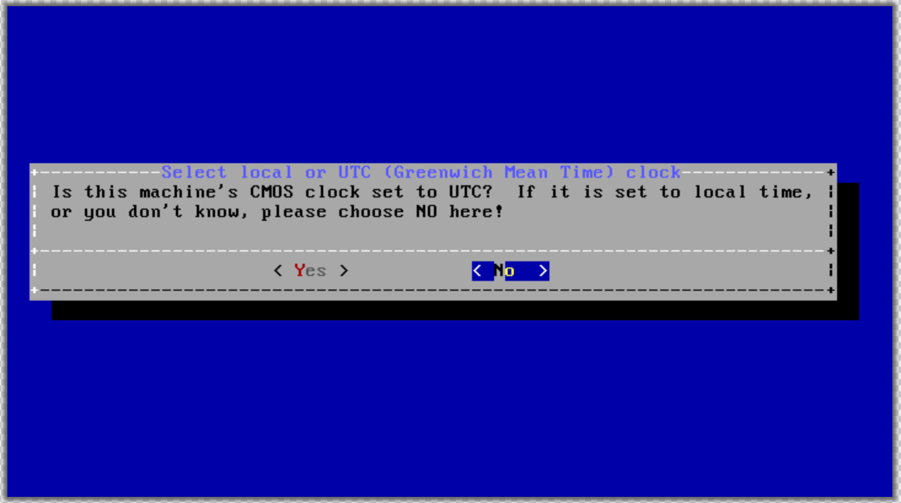

8.  Select the services that you wish to run on boot. We recommend that beginners use the default choices.

    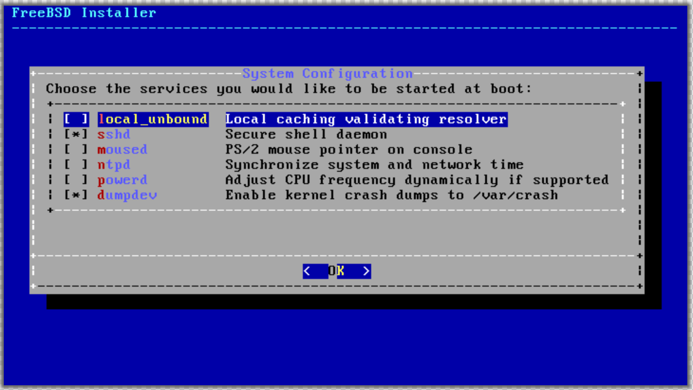

9.  Add an additional user for SSH access safer system administration. To give your new user superuser privileges, add the user to the `wheel` group when asked to invite the user to any other groups. The other fields can be left default.

    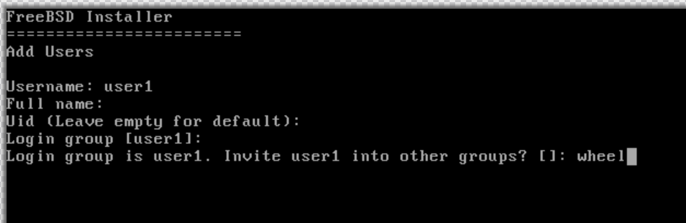

10.  At the next prompt, choose to **Apply configuration and exit installer**. You'll then be asked if you'd like to drop into a shell before rebooting. Choose **Yes** here.

     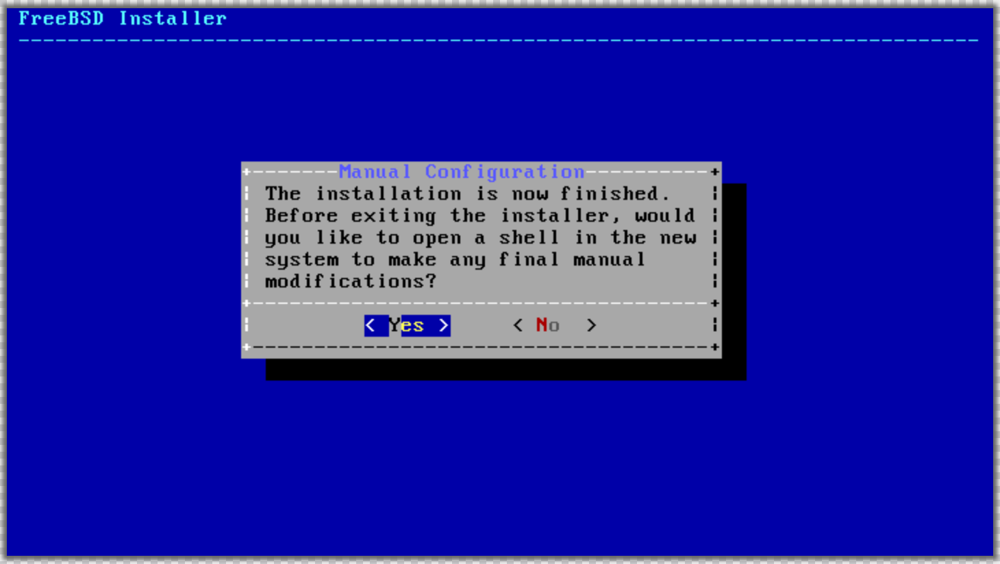

11.  This final step is required to enable Lish, Glish, and make a few other changes. Use your favorite text editor and insert the following at the bottom of `/boot/loader.conf`. (FreeBSD ships with `ee` and `nvi`, linked as `vi`)

     
boot_multicons="YES"
boot_serial="YES"
comconsole_speed="115200"
console="comconsole,vidconsole"


12.  Exit Glish, return to the Linode Manager and reboot into the FreeBSD profile. You should have full SSH and administrative access as the user you created in Step 9.

