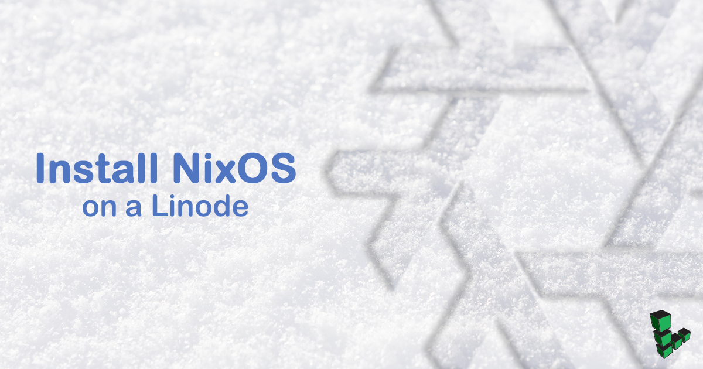

[NixOS](https://nixos.org) is a Linux distribution built on the [Nix](https://nixos.org/nix) package manager. Nix focuses on functional programming concepts, such as immutability and determinism, that enable powerful system management techniques.

While Nix can be installed on any Linux system, NixOS takes these ideas a step further by extending them to the entire system, allowing configuration files and active state to be managed as well. This unique approach to system management has many advantages that can make deploying software and application updates easier.


NixOS is not officially supported by Linode at the time of publishing this guide. Any issues with NixOS on your Linode are outside the scope of Linode Support. In addition, certain Linode tools, such as Network- and Boot-Helpers, will not work with NixOS.


## Before You Begin

Familiarize yourself with [LISH](/docs/networking/using-the-linode-shell-lish) and [GLISH](/docs/networking/use-the-graphic-shell-glish) to connect to your Linode. You will use them throughout this guide.

The [NixOS manual](https://nixos.org/nixos/manual/) is the main reference for NixOS. It explores the concepts at a high level and serves as a reference for some system configuration concepts. This should have everything you need to know to get started, but there may be some deeper concepts that are not thoroughly addressed. For more in-depth information, visit the [NixOS](https://nixos.org/nixos/manual/) and [Nixpkgs](https://nixos.org/nixpkgs/manual/) manuals.

## Prepare Your Linode

You can use a pre-existing Linode, or you can create a new one. If you're using a pre-existing Linode, go to the [Create Disks for Nix](#create-disks-for-nix) section, and resize your images into that approximate format.

### Create a new Linode

To create a new Linode, go to the [Create Linode page](https://cloud.linode.com/linodes/create). Under Images, deselect the default by clicking X. Then select a region, plan, label, and tags (if desired). Click the **Create** button to start the server.

### Create Disks for Nix

[Create three disk images](/docs/guides/disks-and-storage/#creating-a-disk): One for the installer, one for a swap partition, and one for the root partition. Label them:

* **Installer**: A type `ext4` disk, 1024 MB in size.
* **Swap**: A `swap` disk no larger than 512 MB.
* **NixOS**: A type `ext4` disk which takes up all remaining space.

### Create Configuration Profiles

[Create two configuration profiles](/docs/guides/linode-configuration-profiles/#creating-a-configuration-profile), one for the installer and one to boot NixOS. For each profile, disable all of the options under **Filesystem/Boot Helpers** and set the **Configuration Profile** to match the following:

  * **Installer profile**
    * **Label:** Installer
    * **Kernel:** Direct Disk
    * **/dev/sda:** *NixOS*
    * **/dev/sdb:** *Swap*
    * **/dev/sdc:** *Installer*
    * **root / boot device:** Standard: /dev/sdc

  * **Boot profile**
    * **Label:** NixOS
    * **Kernel:** GRUB 2
    * **/dev/sda:** *NixOS*
    * **/dev/sdb:** *Swap*
    * **root / boot device:** Standard: /dev/sda

### Prepare the Installer

1.  In your browser, navigate to the [NixOS download page](https://nixos.org/nixos/download.html) and copy the URL from the **Minimal installation CD, 64-bit Intel/AMD** link.

1.  [Boot your Linode into rescue mode](/docs/troubleshooting/rescue-and-rebuild#booting-into-rescue-mode) with the **Installer** disk mounted as `/dev/sda`.

1.  Once in rescue mode, click the **Launch Console** link to launch the Finnix rescue console and run the following commands, replacing the URL with the latest 64-bit minimal installation image copied from the [NixOS download page](https://nixos.org/nixos/download.html):

        # Update SSL certificates to allow HTTPS connections:
        update-ca-certificates

        # set the iso url to a variable
        iso=<URL for nixos download>

        # Download the ISO, write it to the installer disk, and verify the checksum:
        curl -L $iso | tee >(dd of=/dev/sda) | sha256sum

1.  The checksum should be the same as that in the contents of the checksum file linked next to the download link. Verify it before proceeding.

## Install NixOS

Now that you have created the installer disk, you need to boot with the installer.

### Boot the Installer

In your Linode's dashboard, boot into your **Installer** configuration profile. Since the installer image isn't configured to support SSH or the LISH console, connect to your Linode using [GLISH](/docs/networking/use-the-graphic-shell-glish).

### Set up the Install Environment

1.  Use sudo to become the root user for interactive use:

        sudo -i

1.  Mount the NixOS disk to which you are installing the distro as `/mnt`:

        mount /dev/sda /mnt

1.  Enable the swap disk you created earlier:

        swapon /dev/sdb

1.  Generate a starter configuration:

        nixos-generate-config --root /mnt

## Configure NixOS

Change to the configuration directory:

    cd /mnt/etc/nixos

Within this directory there are two files: `configuration.nix` and `hardware-configuration.nix`. When realizing its configuration, NixOS only uses `configuration.nix`. It is common practice to keep a separate Nix file with hardware specific configuration and have the `configuration.nix` file source its contents.

### Rewrite Device Identifiers

The `nixos-generate-config` command in the [Set up the Install Environment](#set-up-the-install-environment) section generated the configuration from hardware details it gathered automatically. It prefers to use UUIDs to identify disks, but since Linode is a virtual platform you can choose the device identifiers that disks get attached to.

Since you can modify these later, it is better to use the `/dev/sdX` identifiers where `X` is the assigned volume, like `sda` or `sdb`, to allow you to easily swap in backup disks without having to boot into rescue mode and rewrite the UUID to match the new disk:

Replace the contents of the `fileSystems` and `swapDevices` sections with the following:


fileSystems."/" =
  { device = "/dev/sda";
    fsType = "ext4";
  };

swapDevices =
  [ { device = "/dev/sdb"; }
  ];



### Enable LISH

The LISH console requires certain kernel and GRUB options to be configured in the hardware configuration. Place these lines anywhere within the curly braces `{ }` that contain most of the existing configuration. Order doesn't matter for Nix files, so group settings in a way that makes sense to you:


boot.kernelParams = [ "console=ttyS0,19200n8" ];
boot.loader.grub.extraConfig = ''
  serial --speed=19200 --unit=0 --word=8 --parity=no --stop=1;
  terminal_input serial;
  terminal_output serial
'';


### Configure GRUB

1.  When GRUB detects a partitionless disk, it will warn about the unreliability of blocklists. To force NixOS to ignore the warning and then continue, configure GRUB to use the `forceInstall` option. GRUB will run from the host machine and will read the GRUB file from the disk, so the GRUB on disk will never be used.

        boot.loader.grub.forceInstall = true;

1.  Set the timeout for GRUB to be lengthy enough to accommodate LISH connection delays. The following hardware configuration example sets a 10 second timeout. Again, these lines can be placed anywhere within the curly braces `{ }`:

    
boot.loader.grub.device = "nodev";
boot.loader.timeout = 10;


### Edit NixOS Configuration

At the end of the guide, you will create an image from this disk, which will allow you to deploy NixOS on Linode like any other distro. For this purpose it is better to make a general all-purpose image, so you won't make any system-specific configuration changes, like adding users and SSH keys.

Most of these changes bring the NixOS defaults in line with how Linode's standard images work for most distributions. These aren't necessarily best practices, but they make a system that works as expected.

### Configure the SSH daemon

Root logins via SSH are disabled by default. To access your Linode, enable root login during installation by editing the `services.openssh` lines as follows:


services.openssh = {
  enable = true;
  permitRootLogin = "yes";
};


After installation, create a user with limited permissions, then set `permitRootLogin` to `"no"`.

### Disable Predictable Interface Names

1.  Most of Linode's default images have had systemd's predictable interface names disabled. Because of this, most of [Linode's networking guides](/docs/networking/) assume an interface of `eth0`. Since your Linode runs in a virtual environment and will have a single interface, it won't encounter the issues that predictable interface names were designed to solve. This change is optional, but may help troubleshooting later; add the following line:

    
networking.usePredictableInterfaceNames = false;


1.  You will also need to change the name of the interface that DHCP is used on. Replace the contents of the existing block around `networking.useDHCP` with the following:

    
networking.useDHCP = false; # Disable DHCP globally as we will not need it.
# required for ssh?
networking.interfaces.eth0.useDHCP = true;


### Install Diagnostic Tools

These tools are included on most Linode images, and are frequently used by Linode support when troubleshooting networking and host level issues. Add the following to your configuration to ensure these tools are installed:


environment.systemPackages = with pkgs; [
    inetutils
    mtr
    sysstat
];


## Create a non-root user

Create a user to login as non-root as per the [docs](https://nixos.org/nixos/manual/#sec-user-management):


users.users.alice = {
  isNormalUser = true;
  home = "/home/alice";
  description = "Alice Foobar";
  extraGroups = [ "wheel" "networkmanager" ];
  openssh.authorizedKeys.keys = [ "ssh-dss AAAAB3Nza... alice@foobar" ];
};


(Use a secure set of keys such as that generated by `ssh-keygen -t ed25519 -a 100` with no passphrase.)

## Run the NixOS Installer

Install NixOS using the settings you configured:

    nixos-install

Once complete, the installer will prompt you to set a root password.

NixOS is now installed and can be booted from the **Boot** profile created in [Create Configuration Profiles](#create-configuration-profiles).

## Give your user a password and turn off ssh for root

1.  Boot using the NixOS configuration, and give your user a password, for example:

        passwd alice

1.  `ssh` in with the user to test, then set `permitRootLogin` to "no" in `/etc/nixos/configuration.nix`, and rebuild your config:

        sudo nixos-rebuild switch

## Create an Image of your Linode

In this optional section, you'll create a deployable disk image of NixOS.

1.  [*Linode Images*](/docs/platform/linode-images) allows you to take snapshots of your system. These snapshots are limited to 2GB in size. The NixOS installation includes packages that were essential for the installation process, but aren't needed for the running system. These can be removed after installation:

        nix-collect-garbage -d

    The `nix-collect-garbage` command tells Nix to "garbage collect," to remove any packages that the running system isn't depending on. Usually when you upgrade or install packages, Nix will leave old versions intact so that you can easily roll back to them. The `nix-collect-garbage` command invokes Nix's garbage collector which automatically cleans up old packages.

1.  You may also want to go through and remove any log files that may be in `/var/log`. While these are usually pretty small, because you are creating an image, it's good to have as blank of a disk as possible:

        cd /var/log

1.  Create an image of the **NixOS** disk using the [Linode Images](/docs/platform/linode-images#capturing-your-image) guide. Label the image according to the release of NixOS you installed. Now that you have created an image, you can select it in the distribution menu whenever you deploy a Linode.

## Delete the Installer Disk and Profile

If you're not confident with your install configuration, you can keep the installer and boot from it to reinstall adjusted configuration repeatedly.

Otherwise, you can now delete the installer disk and profile from your Linode using the [Deleting a Configuration Profile](/docs/guides/linode-configuration-profiles/#deleting-a-configuration-profile) and [Deleting a Disk](/docs/guides/disks-and-storage/#deleting-a-disk) guides.

Remove the **Installer** disk and reclaim the storage that the NixOS installation was using:

  1. Go to your Linode's dashboard and shutdown your Linode.
  2. [Remove the *Installer* disk](/docs/guides/disks-and-storage/#deleting-a-disk).
  3. [Resize the *NixOS* disk](/docs/guides/disks-and-storage/#resizing-a-disk) to the maximum possible size.

## Enable Longview Agent (optional)

After installation, Longview can be set up for your NixOS instance.

1.  Add the following [options](https://nixos.org/nixos/options.html#longview) to your `/mnt/etc/nixos/configuration.nix`:

    
services.longview = {
  enable = true;
  apiKeyFile = "/var/lib/longview/apiKeyFile";
};


1.  You will then have to create the directory and file from the above configuration and write your Longview api key to the file.

        sudo mkdir /var/lib/longview
        export longview_key="01234567-89AB-CDEF-0123456789ABCDEF" # This is an example, fill with your own key
        echo $longview_key > /var/lib/longview/apiKeyFile | sudo tee /var/lib/longview/apiKeyFile

    Replace the value of `longview_key` above with the one you got from [Longview](https://cloud.linode.com/longview/clients).
