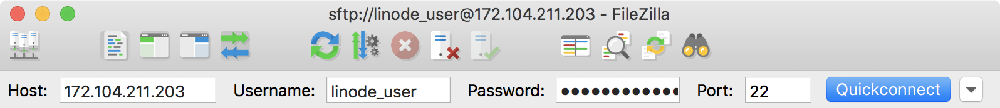
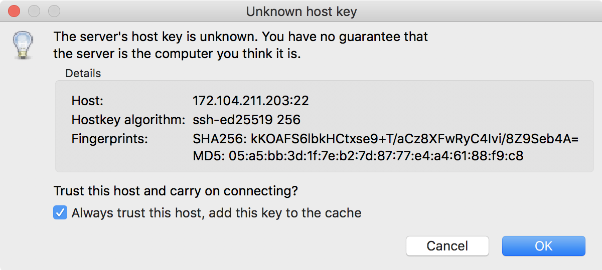

[FileZilla](https://filezilla-project.org/) is a free and open source multi-platform file transfer application. It implements several file transfer protocols, most notably SFTP via SSH. SFTP encrypts both your login credentials and files before sending over a network, while FTP clients communicates only as plaintext.

## Before You Begin

- You will need root access to your Linode, or a user account with `sudo` privilege. Note that if you transfer files as `root`, you may need to change file [ownership and permissions](/docs/guides/linux-users-and-groups/) afterwards.
- Set your system's [hostname](/docs/products/compute/compute-instances/guides/set-up-and-secure/#configure-a-custom-hostname).
- Update your system.

## Install FileZilla

1.  Download FileZilla [here](https://filezilla-project.org/download.php) for macOS and Windows. Use your distribution's package manager to install FileZilla on Linux:

     - CentOS:

            sudo yum install filezilla

     - Debian / Ubuntu:

            sudo apt install filezilla

## Using FileZilla

1.  Launch FileZilla and enter your Linode's IP address or domain name in the `Host` field. Enter the username and password for the account on the Linode you want to connect as and enter "22" in the `Port` field. Click **Quickconnect** to initiate the file transfer session.

    

1.  If this is the first time you've connected to your Linode by SSH or SFTP, you'll receive a warning that the host key is unknown. Verify the host key fingerprints and if valid, check the box next to `Always trust this host, add this key to the cache`. This prevents further warnings unless the key presented to FileZilla changes, which should only happen if you reinstall the remote server's operating system.

    

1.  Click the **OK** button to proceed. You'll be presented with a split view, with your local filesystem on the left and your Linode's filesystem on the right. You can transfer files by dragging and dropping them from one side to the other.

## FileZilla with Public Key Authentication

If you followed our [Securing Your Server](/docs/products/compute/compute-instances/guides/set-up-and-secure/) guide, you won't be able to connect to your Linode using a password. If you are using Linux or macOS, the SSH keypair generated while following that guide will be automatically used for authentication.


If you are using macOS, the passphrase for your key will need to be stored in your keychain to successfully connect using an SSH keypair. FileZilla will not be able to use a key that was generated without a passphrase to connect to your Linode.


If you are using Windows, you'll need to follow a few additional steps to enable key based authentication. The instructions below assume that you have already completed the guide for [generating your SSH key with Putty](/docs/guides/use-public-key-authentication-with-ssh/#windows-operating-system).

1.  Install Pageant from the [Putty site](http://www.chiark.greenend.org.uk/~sgtatham/putty/download.html)

1.  Start Pagent from your Start menu. In your system tray, you'll see the Pageant icon appear.

1.  Right-click the icon and select `Add Key`.

1.  Navigate to the location where you stored your keys and select your private key (PPK) file. You will be prompted for your passphrase if you provided one when creating the key.

1.  Launch FileZilla and connect to your server with your username and an empty password.  Your key will be used as authentication as long as the Pagent software is running.
