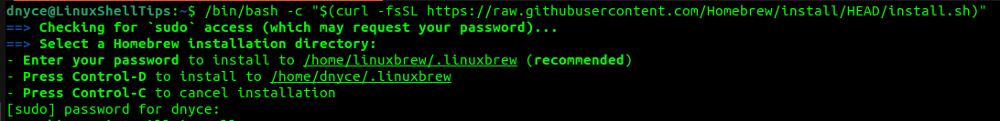
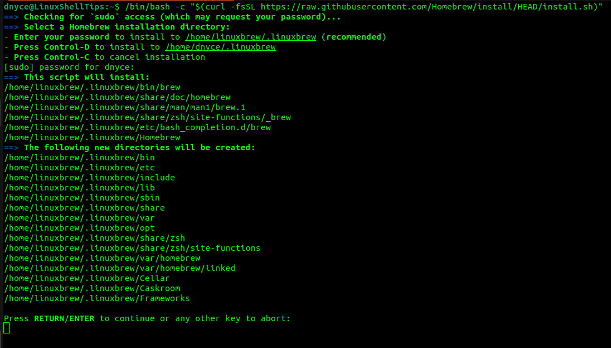

# How to Manage Packages with Homebrew on Linux
---
author:
  name: Linode
  email: docs@linode.com
description: 'This guide explains how to install and configure Homebrew, access and use its most common features and discusses some reasons why you may want to add another package manager to your system.'
keywords: ["linux", "terminal", "homebrew", "package manager"]
tags: ["homebrew", "linux"]
license: '[CC BY-ND 4.0](https://creativecommons.org/licenses/by-nd/4.0)'
published: 2022-08-19
modified_by:
  name: Linode
title: 'How To Install and Use the Homebrew Package Manager on Linux'
contributor:
  name: Jan Slezak
  link: https://github.com/scumdestroy
external_resources:
  - '[Official Homebrew Repository at Github](https://github.com/Homebrew)'
  - '[Official Website for Homebrew Package Manager](https://brew.sh/)'
  - '[Homebrew Documentation](https://docs.brew.sh/Manpage)'
---

[**Homebrew**](https://brew.sh/) is a popular package manager that grants access to an extensive set of available open-source software (or packages).  Though the project was started to provide developers with Linux Tools on their MacOS systems, some Homebrew packages are actually better maintained than the versions native to some Linux distributions.  To prevent dependency conflicts across applications, Homebrew packages do not rely on any of your host's libraries and are installed in the user's `/home` directory without the need for `sudo`, designed for per-user functionality.  Therefore, updates from Homebrew and your Linux distribution's default package manager (likely APT, YUM, Pacman, Zypper, DNF or RPM) exist in isolation from each other and will not cause apps to break across your system.  

### Do you really need an additional package manager?
In most cases, the default package manager are sufficient in providing quick and easy access to software from a trusted and maintained source, but they are not always the best solution for every possible scenario.  For example, if you have used [**Python**](https://www.python.org/) or [**Node.js**](https://nodejs.dev/en/) within your Linux environment, it is likely you have installed `pip` or `npm`, to access and install program dependencies to your local system in a quick and convenient way.  Certain applications may only offer installation through `brew` or via compiling their source code, whereas the former would be the more appealing option in terms of efficiency, comfort and security.  In many cases, **Homebrew** packages are better maintained and exist in isolated unanimity with the applications that precede them.

## Before You Begin

Before running the commands within this guide, you will need:

1. **A system running any Linux distribution.** Homebrew should work on any Linux distribution. Review the [Creating a Compute Instance](/docs/guides/creating-a-compute-instance/) guide if you do not yet have a compatible system.

2. **Login credentials to the system** It is recommended to use standard user account (belonging to `sudo` group is not necessary) and the ability to access the system through [SSH](/docs/guides/connect-to-server-over-ssh/) or [Lish](/docs/guides/using-the-lish-console/). Review the [Setting Up and Securing a Compute Instance](/docs/guides/set-up-and-secure/) guide for assistance on creating and securing a standard user account.

3. **Build tools installed** It is very likely that your Linux distribution has the following dependencies already.  Running the following script will install or update the necessary dependencies if they are missing,

**Debian and Ubuntu**

        sudo apt-get install build-essential procps curl file git

**Fedora, CentOS and RedHat**

        sudo yum groupinstall 'Development Tools'
        sudo yum install procps-ng curl file git
        sudo yum install libxcrypt-compat # needed by Fedora 30 and up

## Installation

The preferred method of installing Homebrew is by running the following script in your Linux shell prompt.

        /bin/bash -c "$(curl -fsSL https://raw.githubusercontent.com/Homebrew/install/HEAD/install.sh)"

The script above is very efficient at installing **Homebrew** to your system safely, regardless of pre-existing configurations inherent in your setup. The script explains what it is about to do and awaits your confirmation before continuing at each step.  

- If the user installing **Homebrew** is part of the `sudo` group, a new user named `linuxbrew` will be created and **Homebrew** will be installed at `/home/linuxbrew/.linuxbrew`.  
- Otherwise, **Homebrew** will be installed in the user's home directory at `~/.linuxbrew`. In either case, `sudo` is not used by **Homebrew** after installation.  
All packages are installed to the user's directory and then symlinked to `/usr/local` to avoid any potentially unwanted changes to the system's functionality.  

Copy and paste the following to add **Homebrew** to your `PATH` and to your shell's profile script, typically `~/.profile` on Debian/Ubuntu based systems and `~/.bash_profile` on CentOS, RedHat and Fedora systems.

        test -d ~/.linuxbrew && eval "$(~/.linuxbrew/bin/brew shellenv)"
        test -d /home/linuxbrew/.linuxbrew && eval "$(/home/linuxbrew/.linuxbrew/bin/brew shellenv)"
        test -r ~/.bash_profile && echo "eval \"\$($(brew --prefix)/bin/brew shellenv)\"" >> ~/.bash_profile
        echo "eval \"\$($(brew --prefix)/bin/brew shellenv)\"" >> ~/.profile

Check to verify that installation worked without any issues.  If no errors are returned, you are ready to begin using **Homebrew**!

        brew doctor


Although **Homebrew** strongly recommends the auto-installer script, they do offer instructions for alternate installation methods in their documentation [**here**](https://docs.brew.sh/Installation)


## Installing Packages

Use the following command to install a package.  Throughout the following examples, I will use the package `nmap`, a port scanning utility for securing large networks, though you would replace it with the package of your choice. 

        brew install nmap

Feel free to verify the installation location to ensure it will not interfere with your default package manager.  Output should match what you expect, based on the installation script.
sh
        which nmap
        > /home/linuxbrew/.linuxbrew/bin/nmap

Verify an installation worked by checking an app's version.

        nmap --version


Unfortunately, Homebrew has not added autocompletion to package names, therefore you must know the package's full name to install it.  However, completion functionality is available for commands and can be found [**here for zsh, bash and fish**](https://docs.brew.sh/Shell-Completion)


## Upgrading Packages

Upgrade individual packages via:

        brew upgrade nmap

To upgrade all brew packages simultaneously, run:

        brew upgrade

## Discovering Packages

A list of available packages through **Homebrew** is available at: https://formulae.brew.sh/formula/
Search for packages with:

        brew search nmap

Get information about a package, including its dependencies, author, basic usage and more.

        brew info nmap

List all installed packages via:

        brew list 

## Removing Packages and Uninstalling Package Managers

Remove installed brew packages via:

        brew remove nmap

**Homebrew** provides an efficient uninstallation script if you need to remove the package manager from your Linux machine.  The following command downloads the script t your local directory.

        curl -fsSL -o uninstall.sh https://raw.githubusercontent.com/Homebrew/install/master/uninstall.sh

Run the script with the `--help` flag to see uninstallation options.  

        bash uninstall.sh --help

        Homebrew Uninstaller
        Usage: uninstall.sh [options]
            -p, --path=PATH  Sets Homebrew prefix. Defaults to /usr/local.
                --skip-cache-and-logs
                     Skips removal of HOMEBREW_CACHE and HOMEBREW_LOGS.
            -f, --force      Uninstall without prompting.
            -q, --quiet      Suppress all output.
            -d, --dry-run    Simulate uninstall but don't remove anything.
            -h, --help       Display this message.

Finally, run the script without any arguments to remove **Homebrew** completely.

        bash uninstall.sh

