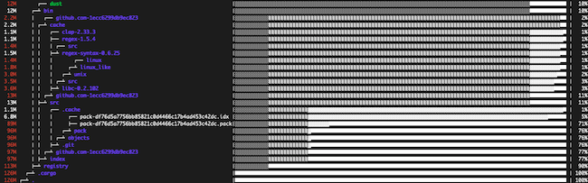

Hard drive space on a system can fill up quickly, especially when new software is installed. System administrators frequently have to review disk space utilization and see what files or directories are using up the most storage. This can be accomplished using the Linux `du` command, but many users find it cumbersome and awkward to use. The open-source [*dust*](https://github.com/bootandy/dust) program offers a new way of looking at disk space usage more intuitively and straightforwardly. This guide explains how to install and use the dust utility on Linux and how it functions as a du replacement.

## An Introduction to dust

Dust was developed as an alternative to the `du` command to allow users to quickly check disk usage on Linux systems. The name of the application is a portmanteau of "du" and Rust, the programming language it is written in. The name of the utility is intentionally left uncapitalized. Dust can be installed by using the Homebrew or Cargo package managers.

Dust reports on the disk utilization and graphically presents the results. It provides an instant overview of the file system with no further sorting or piping of commands. Dust emphasizes the largest directories and intelligently parses the directory tree to find large subdirectories. This allows users to quickly determine which directories are using the most space and where these directories are located within the file hierarchy. Dust operates on specific directories and handles both directories and files.

Dust's interface uses a monochromatic scale to illustrate how deep in the hierarchy a directory is and the location of its parent directories. Darker tints correspond to base-level directories near the root of the file system. Lighter shades of grey indicate subdirectories several levels deep in the hierarchy.

Dust has several flags and command options to organize the output and determine what entries to display. It examines the size of the terminal window to decide how many items to display.

### A Comparison Between dust and the Linux du Command

Disk space statistics have traditionally been retrieved using the `du` (disk usage) and `df` (disk free) commands. Both of these commands are part of the standard Linux command syntax. These commands supply many options to filter and organize the output, but inexperienced users often find them cryptic and difficult to use. They often have to be combined with `grep` or `sort` to be truly useful. Consult the [*man page for du*](https://pubs.opengroup.org/onlinepubs/9699919799/utilities/du.html) for a list of all of the `du` command options.

The `du` command provides a highly detailed view of the disk space consumed by each file and subdirectory. However, it often returns thousands of lines of information. It is difficult to skim this information or easily discern the file directory structure.

    du


12 ./.cargo/registry/index/github.com-1ecc6299db9ec823/.git/logs/refs/remotes/origin
...


For this reason, the results of the `du` command are often piped to other commands. For example, the following command calculates the total size of all the files in each directory. It then sorts and displays the directories by total disk space usage.

    du -hs *  | sort -h

The `df` command is used to provide a quick overview of the space available on each hard drive. However, it provides only a brief summary without much additional information.

    df


Filesystem     1K-blocks    Used Available Use% Mounted on
udev              972504       0    972504   0% /dev
tmpfs             203540     672    202868   1% /run
...
tmpfs             203536       0    203536   0% /run/user/1000


By contrast, the `dust` command allows users to quickly and easily determine how disk space is being used. Although flags and options are available, they are not necessary to effectively use the command. The output is presented in a graphical format, which is not available for the `du` or `df` commands.

A good strategy is to use dust to get a quick overview of the system's disk space allocation. Then use `du` on specific directories or files, sorting and filtering the output as necessary.

## Before You Begin

1.  If you have not already done so, create a Linode account and Compute Instance. See our [Getting Started with Linode](/docs/guides/getting-started/) and [Creating a Compute Instance](/docs/guides/creating-a-compute-instance/) guides.

1.  Follow our [Setting Up and Securing a Compute Instance](/docs/guides/set-up-and-secure/) guide to update your system. You may also wish to set the timezone, configure your hostname, create a limited user account, and harden SSH access.


The steps in this guide are written for non-root users. Commands that require elevated privileges are prefixed with `sudo`. If you are not familiar with the `sudo` command, see the [Linux Users and Groups](/docs/guides/linux-users-and-groups/) guide.


## Install Dust

There are three main ways of installing Dust. Either use the Cargo or Homebrew package managers or download a release and unzip it. The following commands are geared towards Ubuntu users but are generally applicable for all Linux distributions.

### Install dust Using Cargo

The easiest way to install Dust is by using the Cargo utility. Cargo is the package manager for [*Rust*](https://www.rust-lang.org/), a popular high-performance programming language. If Rust is already installed on the system, then Cargo is installed too. If not, Cargo can be installed as a stand-alone application by using `apt`.

1. Ensure the system is fully updated using the instructions in the [Before You Begin](/docs/guides/dust-command-on-linux-installation/#before-you-begin) section. Install Cargo using `apt`.

        sudo apt install cargo

1. Use the `--version` option to verify the release and confirm Cargo has been installed correctly.

        cargo --version

    
cargo 1.51.0
    

1. Use Cargo to install dust. Cargo confirms the application has been installed and also provides a warning about the path variable.

        cargo install du-dust

    
   Installed package `du-dust v0.7.0` (executable `dust`)
    

1. To run Dust from anywhere without specifying the full pathname to the binary, add it to your `.bashrc` file. Open this file in any text editor.

        vi ~/.bashrc

1. Add the following line to the end of the file.

    
export PATH=$PATH:$HOME/.cargo/bin
    

1. Source the `.bashrc` file to apply the changes.

        source ~/.bashrc

1. To verify the installation, use the `-V` flag to see what release of Dust is installed. If there is an error, ensure you have updated the `~/.bashrc` file correctly.

        dust -V

    
Dust 0.7.0
    

### Install dust Using Homebrew

Dust can also be installed using [*Homebrew*](https://brew.sh/). Homebrew is a package manager that installs new programs into their own directory and adds the appropriate link to the `/usr/local` directory. This eliminates the requirement to edit the `.bashrc` file. To install dust using Homebrew, follow the instructions below.

1. If Homebrew is not already installed, download and install it using the following command. The installation program allows you to install the program either in its own directory or in your user directory.

        /bin/bash -c "$(curl -fsSL https://raw.githubusercontent.com/Homebrew/install/HEAD/install.sh)"

1. Add the Homebrew executable to your profile. Substitute your username for `userid` in the first command below.

        echo 'eval "$(/home/linuxbrew/.linuxbrew/bin/brew shellenv)"' >> /home/userid/.profile
        eval "$(/home/linuxbrew/.linuxbrew/bin/brew shellenv)"

1. (**Optional**) Homebrew recommends installing the `build-essential` package to enhance functionality.

        sudo apt-get install build-essential

1. Install `gcc` to avoid warnings and errors.

        brew install gcc

1. To verify Homebrew is installed and working properly, use the `brew doctor` command.

    
To see all of the Homebrew commands, use the `brew help` command.
    

        brew doctor

    
Your system is ready to brew.
    

1. Install dust using Homebrew.

        brew tap tgotwig/linux-dust && brew install dust

1. To verify the installation, use the `-V` flag to see what release of Dust is installed.

        dust -V

    
Dust 0.7.0
    

    
Homebrew can also be used on the macOS. To install Homebrew on a Mac, see the [Homebrew page](https://brew.sh/) for instructions. To install dust on a Mac using Homebrew, use `brew install dust`. The `tap` command is not necessary for macOS.
    

### Install dust from an Executable File Download

You can download the dust executable directly and unzip it.

1. Download the executable to install from the [dust GitHub downloads page](https://github.com/bootandy/dust/releases).

        sudo wget https://github.com/bootandy/dust/archive/refs/tags/v0.7.0.tar.gz

1. Use the `tar` utility to unzip the file. Substitute the name of the actual `.gz` file in the following command.

        tar -xvf v0.7.0.tar.gz

1. Move the executable to the correct location.

        sudo mv dust-0.7.0 /usr/local/bin/

1. To verify the installation, use the `-V` flag to see what release of Dust is installed.

        dust -V

## How to Use dust to Show Disk Usage on Linux

The examples in this section illustrate how to use the `dust` command to check disk space usage on any Linux-based system. To review disk space usage for your home directory, enter `dust` without any additional parameters.

    dust

If the terminal window is large enough, dust displays a gray-scale representation of the directory structure in the form of an ASCII bar. Directories at the same level are represented with the same pattern. Breaks in the patterns can be used to identify the subdirectories within any given directory. For example, for the `index` directory, locate the dividing line between the gray and white portions of its ASCII bar. Follow this discontinuity upwards to locate all the directories inside `index`.

To exclude the ASCII bars and the percentages, add the `-b` option. The bars are also excluded if the terminal is too small to display them. For a monochrome display, append the `-c` option.

    dust -bc


  12M       ┌── dust
  12M     ┌─┴ bin
 2.2M     │   ┌── github.com-1ecc6299db9ec823
 2.2M     │ ┌─┴ cache
 1.1M     │ │   ┌── clap-2.33.3
 1.1M     │ │   ├── regex-1.5.4
 1.4M     │ │   │ ┌── src
 1.5M     │ │   ├─┴ regex-syntax-0.6.25
 1.4M     │ │   │       ┌── linux
 1.8M     │ │   │     ┌─┴ linux_like
 3.0M     │ │   │   ┌─┴ unix
 3.5M     │ │   │ ┌─┴ src
 3.6M     │ │   ├─┴ libc-0.2.102
  13M     │ │ ┌─┴ github.com-1ecc6299db9ec823
  13M     │ ├─┴ src
 1.1M     │ │   ┌── .cache
 6.8M     │ │   │     ┌── pack-df76d5a7756bb85821c0d4466c17b4ad453c42dc.idx
  89M     │ │   │     ├── pack-df76d5a7756bb85821c0d4466c17b4ad453c42dc.pack
  96M     │ │   │   ┌─┴ pack
  96M     │ │   │ ┌─┴ objects
  96M     │ │   ├─┴ .git
  97M     │ │ ┌─┴ github.com-1ecc6299db9ec823
  97M     │ ├─┴ index
 113M     ├─┴ registry
 126M   ┌─┴ .cargo
 126M ┌─┴ .


### Using dust on One or More Specific Directories

To show the disk space for a single directory, append the directory name to the end of the `dust` command in the format `dust <dir_name>`. Files can be specified in a relative or absolute manner.

    dust /usr/bin

Two or more directories can be specified in the same command. In this case, the largest files in each directory are displayed.

    dust /usr/bin ~/.cargo


  12M       ┌── dust
  12M     ┌─┴ bin
  13M     │   ┌── github.com-1ecc6299db9ec823
  13M     │ ┌─┴ src
  89M     │ │         ┌── pack-df76d5a7756bb85821c0d4466c17b4ad453c42dc.pack
  96M     │ │       ┌─┴ pack
  96M     │ │     ┌─┴ objects
  96M     │ │   ┌─┴ .git
  97M     │ │ ┌─┴ github.com-1ecc6299db9ec823
  97M     │ ├─┴ index
 113M     ├─┴ registry
 126M   ┌─┴ .cargo
 6.8M   │ ┌── mysqlcheck
 6.8M   │ ├── mysqlslap
 6.9M   │ ├── mysql_migrate_keyring
 6.9M   │ ├── mysql_upgrade
 6.9M   │ ├── mysqldump
 7.0M   │ ├── mysql
 7.1M   │ ├── mysqlbinlog
 7.2M   │ ├── mysqlpump
 8.1M   │ ├── gdb
  10M   │ ├── cargo
  22M   │ ├── snap
 262M   ├─┴ bin
 389M ┌─┴ (total)


### Ignore Files and Directories in dust Output

To ignore files or directories with a certain name, use the `-X` flag followed by the name to ignore. The full path of the item to ignore must be provided. The following command skips over any directory with the name `lib` as well as any files and directories contained in the directory.

    dust -X lib
    dust -X .cargo/registry/index

To exclude all hidden files and directories from the output, use the `-i` option.

    dust -i

### Show More Than the Default Number of Directories in dust

By default, dust takes into account the terminal height when determining how many entries to display. To adjust the number of rows in the display, use the `-n` option. For example, the command below displays 30 directories instead of the default number.

    dust -n 30

### Other Helpful Options in dust

Dust has some additional flags and options. To view a full list of the options, including usage information, use the command `dust --help`.

To show the full path for each file, add the `-p` option.

    dust -p


  12M       ┌── ./.cargo/bin/dust
  12M     ┌─┴ ./.cargo/bin
 2.2M     │   ┌── ./.cargo/registry/cache/github.com-1ecc6299db9ec823
 2.2M     │ ┌─┴ ./.cargo/registry/cache
 1.0M     │ │   ┌── ./.cargo/registry/src/github.com-1ecc6299db9ec823/rayon-1.5.1
 1.1M     │ │   ├── ./.cargo/registry/src/github.com-1ecc6299db9ec823/clap-2.33.3
 1.1M     │ │   ├── ./.cargo/registry/src/github.com-1ecc6299db9ec823/regex-1.5.4
 1.4M     │ │   │ ┌── ./.cargo/registry/src/github.com-1ecc6299db9ec823/regex-syntax-0.6.25/src
 1.5M     │ │   ├─┴ ./.cargo/registry/src/github.com-1ecc6299db9ec823/regex-syntax-0.6.25
 1.4M     │ │   │       ┌── ./.cargo/registry/src/github.com-1ecc6299db9ec823/libc-0.2.102/src/unix/linux_like/..
 1.8M     │ │   │     ┌─┴ ./.cargo/registry/src/github.com-1ecc6299db9ec823/libc-0.2.102/src/unix/linux_like
 3.0M     │ │   │   ┌─┴ ./.cargo/registry/src/github.com-1ecc6299db9ec823/libc-0.2.102/src/unix
 3.5M     │ │   │ ┌─┴ ./.cargo/registry/src/github.com-1ecc6299db9ec823/libc-0.2.102/src
 3.6M     │ │   ├─┴ ./.cargo/registry/src/github.com-1ecc6299db9ec823/libc-0.2.102
  13M     │ │ ┌─┴ ./.cargo/registry/src/github.com-1ecc6299db9ec823
  13M     │ ├─┴ ./.cargo/registry/src
 1.1M     │ │   ┌── ./.cargo/registry/index/github.com-1ecc6299db9ec823/.cache
 6.8M     │ │   │     ┌── ./.cargo/registry/index/github.com-1ecc6299db9ec823/.git/objects/pack/pack-df76d5a7..
  89M     │ │   │     ├── ./.cargo/registry/index/github.com-1ecc6299db9ec823/.git/objects/pack/pack-df76d5a7..
  96M     │ │   │   ┌─┴ ./.cargo/registry/index/github.com-1ecc6299db9ec823/.git/objects/pack
  96M     │ │   │ ┌─┴ ./.cargo/registry/index/github.com-1ecc6299db9ec823/.git/objects
  96M     │ │   ├─┴ ./.cargo/registry/index/github.com-1ecc6299db9ec823/.git
  97M     │ │ ┌─┴ ./.cargo/registry/index/github.com-1ecc6299db9ec823
  97M     │ ├─┴ ./.cargo/registry/index
 113M     ├─┴ ./.cargo/registry
 126M   ┌─┴ ./.cargo
 126M ┌─┴ .


To display the directories in reverse order, with the largest directories at the top, use the `-r` option.

    dust -r

To constrain the number of levels of subdirectories that are shown, use `dust -d <num_directories>`.

    dust -d 3

To order the directories by the number of files they contain rather than their disk space usage, use the `-f` flag.

    dust -f


37              ┌── .cache
50            ┌─┴ github.com-1ecc6299db9ec823
50          ┌─┴ index
36          │   ┌── du-dust-0.7.0
39          │   ├── bitflags-1.3.2
40          │   ├── rayon-core-1.9.1
41          │   ├── regex-syntax-0.6.25
44          │   ├── crossbeam-channel-0.5.1
35          │   │ ┌── src
48          │   ├─┴ memchr-2.4.1
41          │   │ ┌── src
59          │   ├─┴ clap-2.33.3
85          │   ├── regex-1.5.4
56          │   │   ┌── iter
90          │   │ ┌─┴ src
118         │   ├─┴ rayon-1.5.1
42          │   │     ┌── bsd
73          │   │     │ ┌── linux
87          │   │     ├─┴ linux_like
153         │   │   ┌─┴ unix
179         │   │ ┌─┴ src
191         │   ├─┴ libc-0.2.102
1,102       │ ┌─┴ github.com-1ecc6299db9ec823
1,102       ├─┴ src
1,185     ┌─┴ registry
1,189   ┌─┴ .cargo
1,197 ┌─┴ .


## Alternatives to dust

For those looking for more choices, there are a few other open-source utilities that can be used to graphically illustrate disk space usage.

The [*du-tree*](https://github.com/nachoparker/dutree) program is very similar to dust. It even has a similar interface. It can be installed using the command `cargo install dutree`. [*ncdu*](https://dev.yorhel.nl/ncdu) is a simpler utility designed for speed and efficiency. Unfortunately, it is not available through any common package manager and must be downloaded.

## Conclusion

Dust provides a nice alternative to the Linux `du` command. The `dust` command allows users to quickly check disk space usage on any Linux system and see the results in an intuitive graph-based format. Dust can be installed using the **Cargo** and **Homebrew** utilities. It can also be downloaded as an `gz` file.

Dust provides several options to allow users to see the most relevant results in the appropriate format. The number of results can be adjusted, multiple directories can be combined, and specific entries can be ignored. As alternatives to dust, several similar free open source programs are also available.
