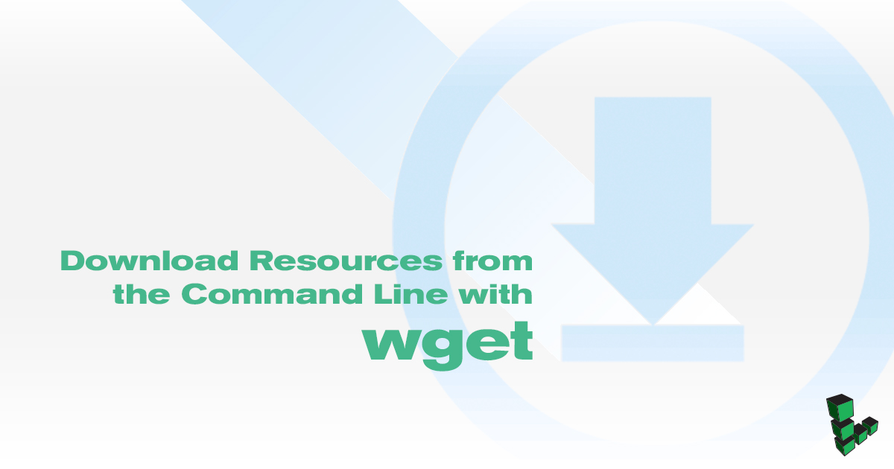

## What is wget?

`wget` is a command line utility that retrieves files from the internet and saves them to the local file system. Any file accessible over HTTP or FTP can be downloaded with `wget`. `wget` provides a number of options to allow users to configure how files are downloaded and saved. It also features a recursive download function which allows you to download a set of linked resources for offline use.

## Using wget

The `wget` command uses the following basic syntax:

    wget [OPTIONS] [URL]

When used without options, `wget` will download the file specified by the `[URL]` to the current directory:

    wget https://www.linode.com/docs/assets/695-wget-example.txt


--2018-05-18 19:40:17--  https://www.linode.com/docs/assets/695-wget-example.txt
Resolving www.linode.com (www.linode.com)... 2600:3c00::12, 2600:3c00::32, 2600:3c00::22, ...
Connecting to www.linode.com (www.linode.com)|2600:3c00::12|:443... connected.
HTTP request sent, awaiting response... 200 OK
Length: 522 [text/plain]
Saving to: ‘695-wget-example.txt.1’

695-wget-example.txt.1                              100%[=================================================================================================================>]     522  --.-KB/s    in 0s

2018-05-18 19:40:17 (67.7 MB/s) - ‘695-wget-example.txt.1’ saved [522/522]


This will download an example file on the Linode Docs website. You can view the contents of the file with `cat`:

    cat 695-wget-example.txt


This is an example resource for the `wget` document
<http://www.linode.com/docs/tools-reference/tools/download-resources-from-the-command-line-with-wget>, located
in the Linode Docs.

There are four lines of random characters at the end of this file.

y7tWn6zZRFAX1cXyQzzSBhTDC+/SpN/RezhI2acW3qr3HGFDCM7PX9frUhna75wG
6lOvibL5/sHTKP8N7tRfszZq1MaGlmpeEQN1n5afK6Awh0rykc5FMn2xb3jf0klF
wVPjuxsptT/L05K6avRI81Edg2+8CkS8uA16u+bXqRn1BBQutRvxwrWwrKuP10pR
uCf3HehndIeRghOAmXPc61cfUrHZ+MEqXYmSoKw4E0hI7GWXkwAyByCFPBVB9Fbe


## Examples

### Download Content to Standard Output

The `-O` option controls the location and name of the file where `wget` writes the downloaded content. To download the file as `example.txt` and save it to the `mydir` directory:

    wget -O mydir/example.txt https://www.linode.com/docs/assets/695-wget-example.txt

If you specify the file name as `-` as in `wget -O -`, `wget` will output the downloaded file to the terminal. Add the `-q` flag to suppress the status output:

    wget -q -O - https://www.linode.com/docs/assets/695-wget-example.txt


This is an example resource for the `wget` document
<http://www.linode.com/docs/tools-reference/tools/download-resources-from-the-command-line-with-wget>, located
in the Linode Docs.

There are four lines of random characters at the end of this file.

y7tWn6zZRFAX1cXyQzzSBhTDC+/SpN/RezhI2acW3qr3HGFDCM7PX9frUhna75wG
6lOvibL5/sHTKP8N7tRfszZq1MaGlmpeEQN1n5afK6Awh0rykc5FMn2xb3jf0klF
wVPjuxsptT/L05K6avRI81Edg2+8CkS8uA16u+bXqRn1BBQutRvxwrWwrKuP10pR
uCf3HehndIeRghOAmXPc61cfUrHZ+MEqXYmSoKw4E0hI7GWXkwAyByCFPBVB9Fbe


### View HTTP Headers

To view the HTTP header information attached to the resource, use the `-S` flag. Header information is often helpful for diagnosing issues with web server configuration.

    wget -S https://www.linode.com/docs/assets/695-wget-example.txt


--2018-05-18 20:19:30--  https://www.linode.com/docs/assets/695-wget-example.txt
Resolving www.linode.com (www.linode.com)... 2600:3c00::22, 2600:3c00::12, 2600:3c00::32, ...
Connecting to www.linode.com (www.linode.com)|2600:3c00::22|:443... connected.
HTTP request sent, awaiting response...
  HTTP/1.1 200 OK
  Server: nginx
  Date: Fri, 18 May 2018 20:19:30 GMT
  Content-Type: text/plain
  Content-Length: 522
  Connection: keep-alive
  Vary: Accept-Encoding
  Last-Modified: Thu, 19 Apr 2018 23:17:41 GMT
  ETag: "5ad92395-20a"
  Accept-Ranges: bytes
  Strict-Transport-Security: max-age=31536000
  X-Frame-Options: DENY
Length: 522 [text/plain]
Saving to: ‘695-wget-example.txt.5’

695-wget-example.txt.5                              100%[=================================================================================================================>]     522  --.-KB/s    in 0s

2018-05-18 20:19:30 (75.1 MB/s) - ‘695-wget-example.txt.5’ saved [522/522]


To view only the headers, add the `-q` flag as before to suppress the status output:

    wget -Sq https://www.linode.com/docs/assets/695-wget-example.txt


HTTP/1.1 200 OK
Server: nginx
Date: Fri, 18 May 2018 19:42:16 GMT
Content-Type: text/plain
Content-Length: 522
Connection: keep-alive
Vary: Accept-Encoding
Last-Modified: Thu, 19 Apr 2018 23:17:38 GMT
ETag: "5ad92392-20a"
Accept-Ranges: bytes
Strict-Transport-Security: max-age=31536000
X-Frame-Options: DENY


### Authenticate a Request

If you need to download a file that requires HTTP authentication, you can pass a username and password with the `--http-user` and `--http-password` options:

    wget --http-user=[USERNAME] --http-password=[PASSWORD] [URL]

`wget` will not send the authentication information unless prompted by the web server. Use the `--auth-no-challenge` option to force `wget` to send the authentication credentials under every circumstance.

### Accept Self Signed Certificates

To download a file on a site that is protected with a self-signed SSL certificate, specify the `--no-check-certificate` option.
Information is still encrypted, but the authenticity of the certificate is not confirmed.

### Recursively Download Files

The `-r` option allows `wget` to download a file, search that content for links to other resources, and then download those resources. This is useful for creating backups of static websites or snapshots of available resources. There are a wide range of additional options to control the behavior of recursive downloads.

    wget -r -l 3 -k -p -H https://example.com/

The options `-r -l 3 -k -p -H` have the following functionality:

-   `-r` enables recursive downloading.
-   `-l 3` allows `wget` to follow links three levels "deep". Specify `0` for an infinite level of recursion.
-   `-k` converts links in downloaded resources to point to the locally downloaded files. The resulting "mirror" will not be linked to the original source.
-   `-p` forces `wget` to download all linked sources, including scripts and CSS files, required to render the page properly.
-   `-H` allows recursive operations to follow links to other hosts on the network. Unless specified, `wget` will only download resources on the host specified in the original domain.

### Background Download

Use the `-b` option to background the download process if you do not want `wget` to occupy your terminal process.

    wget -b https://www.linode.com/docs/assets/695-wget-example.txt


Continuing in background, pid 953.
Output will be written to ‘wget-log’.


Output will be written to `wget-log` for you to review later:

    cat wget-log

### Avoid Redundant Downloads

`wget` includes a number of options designed to conserve bandwidth by avoiding redundant operations.

-   `-nc` is the "no clobber" option, which prevents `wget` from downloading a file if it would overwrite an existing file.
-   `-N` prevents `wget` from downloading a file if a newer file of the same name exists on the local machine.
-   `-c` allows `wget` to continue downloading a file that was partially downloaded.

### Rate Limit

If you need to control how much bandwidth `wget` uses, you can specify a "rate limit" with the `--limit-rate=[RATE]` option. `[RATE]` is specified in bytes per second unless a `k` is appended to specify kilobytes.

    wget --limit-rate=3k https://www.linode.com

This command downloads the `1285786486.tar.gz` file with the operation limited to consume no more than 3 kilobytes a second. The method used to rate limit downloads is more effective for bigger files than for small downloads that complete rapidly.
