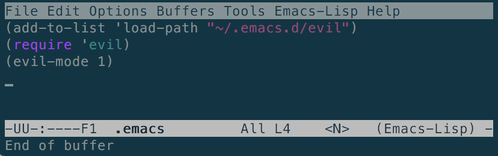
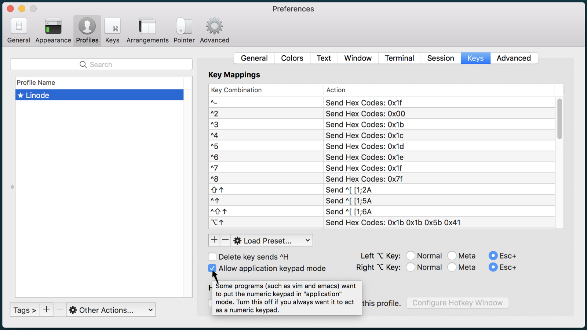

## A Vi/m Layer Makes Emacs Evil

Emacs is an endlessly versatile text editor. Every aspect can be customized, and new features can be added both globally and within specific modes.

Emacs Evil mode is an extensible Vi layer for Emacs. It adds a set of Vi(m) key bindings and features to Emacs to give it a more modal feel, and lets you rely less on the pinky-accessed CTRL key when manipulating text. Where Emacs uses more key combinations and commands, Evil mode brings Vi's operators and motions to execute text operations.

This guide shows how to get started with Emacs Evil mode and is not a comprehensive guide on how to use Emacs or Vi.

## Why Use Emacs Evil?

On its own, Emacs is an excellent text editor with an extraordinary list of available tools and plugins like a [calendar](https://www.emacswiki.org/emacs/CalendarMode), [Org Mode](https://orgmode.org/), [chess](https://www.emacswiki.org/emacs/ChessMode), and [Tetris](https://www.emacswiki.org/emacs/TetrisMode).

Emacs users value the editor's ability to be everything they need for a full day of work, without ever needing to leave Emacs or touch a mouse. Any repetitive function can be simplified by [writing a function in elisp](https://www.gnu.org/software/emacs/manual/html_node/elisp/Defining-Functions.html).

Evil mode expands on Emacs by adding the modes, motion, and text manipulation features of Vi. Once Evil is installed and enabled, the default *Normal* state allows you to navigate Emacs like in Vi, moving back and forth between words with `b` and `w` or to the first word of the next sentence with `)`. Evil adds Vi's *Visual* and *Insert* modes as well as additional, [uniquely Evil modes](#evil-states).

## Install Emacs Evil

1.  Install Emacs and Git if they aren't already:

        sudo apt update && sudo apt install emacs git

2.  Clone the `emacs-evil` repository into its own directory:

        git clone https://github.com/emacs-evil/evil ~/.emacs.d/evil

3.  Edit the [Emacs initialization file](https://www.gnu.org/software/emacs/manual/html_node/emacs/Init-File.html) to add the Evil plugin and load it when Emacs starts:

        emacs ~/.emacs.d/init.el

    
(add-to-list 'load-path "~/.emacs.d/evil")
(require 'evil)
(evil-mode 1)


4.  Save the file and reload the buffer to load the plugin:

        C-x S, M-x eval-buffer

    The `<N>` tag in the status bar shows that Emacs is now in Evil's Normal state:

    

5.  Kill the buffer with:

        C-x k.

## Get Started with Evil Mode

### Evil States

Now that Evil is active, Emacs starts in Normal state. Navigate the way you would in Vi.

Since *modes* refer to a different function in Emacs, Evil calls its different modes *states*. The available states and how to reach them from the default Normal state are:

* Emacs: `<E>`
    * Enter state with **CTRL-z**
    * Navigate as you normally would in Emacs.
    * **CTRL-z** or `M-x evil-normal-state` to return to Normal.
* Insert: `I`
    * Enter state with `i`.
    * Edit and modify text.
    * **ESC** to return to Normal.
* Motion: `<M>`
    * Enter state with `:evil-motion-state`.
    * Navigate the file with Vi keys, without risk of modifying the contents.
* Normal Vi: `<N>`
    * Emacs Evil starts in Normal state by default.
    * Vi bindings and operators.
* Operator-Pending: `<O>`
    * Enter state with `:evil-operator-state`.
    * Rewrite operator-pending mappings to fit your needs.
    * **ESC** to return to Normal.
* Replace: `<R>`
    * Enter state with `R`.
    * Overwrite text.
    * **ESC** to return to Normal.
* Visual: `<V>`
    * Enter state with:
            * `v` for characterwise.
            * `V` for linewise.
            * **CTRL-V** for blockwise.
    * Visually select text.
    * **ESC** to return to Normal

### Change the Default Emacs Evil Start State

To force Emacs to start in another state, add `evil-default-state` to `.emacs`:


(setq evil-default-state 'emacs) ;; changes default state to emacs


## Use Emacs and Vim Together

Vi has a number of keyboard shortcuts that help speed frequent operations:

* `ZZ` to save and quit;
* `QZ` don't save, just quit,

Operations in Vi are often commands strung together to take the form of a sentence.

These operations take the syntax: *operator* + *motion* + *object*

For example, `CI"` will delete everything inside the next set of quotation marks and enter insert mode.

Practice combining some Emacs and Vi by splitting a paragraph into one sentence per line. Use a paragraph from the beginning of this guide as an example:


Emacs Evil mode is an extensible Vi layer for Emacs. It adds a set of Vi(m) key bindings and features to Emacs which gives it a more modal feel, and lets you rely less on the pinky-accessed CTRL key when manipulating text. Where Emacs uses more key combinations and commands, Evil mode brings Vim's operators and motions to execute text operations.


1. Type `M-h` to highlight the paragraph under the pointer

1. Use `:` to bring up the *command-line*.

    The command-line functions similarly to Emacs's `M-x`, and allows you to enter a combination of operations to execute. In this example, substitute each instance of a `. ` (period, space) with a `.⏎` (period, return symbol):

        :s/\. /.\n/g

## Fix iTerm and macOS Meta Keybinding Issues

If the Meta key acts inconsistently in iTerm, enable **Allow application keypad mode** in the Profiles tab of iTerm preferences. This screenshot shows both left and right Alt keys set to **Esc+**:

## Fix Emacs Evil and Special Mode Key Binding Conflicts

Because Emacs has a variety of special modes with their own key bindings (like Org Mode and Calendar), some may conflict with Emacs Evil. For example, `q` exits most Emacs special modes, but records macros in Vi. Install the [Evil Collection](https://github.com/emacs-evil/evil-collection) to apply a consistent set of bindings across modes.

## Integrate Emacs Evil with Org Mode

Install [org-evil](https://github.com/GuiltyDolphin/org-evil) for more useful key binding integrations with Evil and Org Mode.
