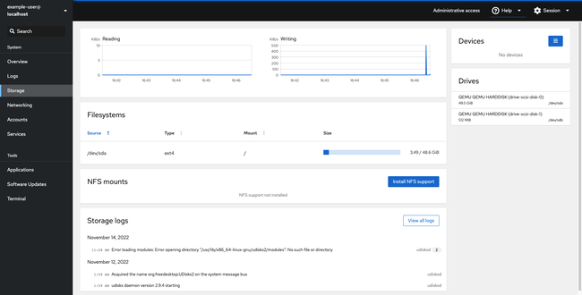

It can be frustrating to manage a Linux server solely from the terminal, so users are always searching for an easier and more intuitive option. One of the more promising applications in this area is [Cockpit](https://cockpit-project.org/). Cockpit allows users to monitor and configure a server through a graphical user interface. This guide explains how to use Cockpit on Linux for server management and provides some background about the application.

## What is Cockpit?

Cockpit is a server management tool that is available as a Linux plugin. It allows users to manage Linux systems using a web-based graphical interface and dashboard. Cockpit is designed for all users, both those who are new to Linux and experienced administrators. Cockpit is efficient, lightweight, and easy to use.

Cockpit provides a wrapper for Linux commands and uses existing system APIs, rendering it more robust against change. There is no requirement to remember the syntax of any command. Many tasks can be accomplished with a single click. Cockpit can co-exist with a web server, but a web server is not required to use Cockpit.

Here are some of Cockpit's advantages and features:

-   It is a free and open source application. Cockpit for Linux is available under the GNU Lesser General Public License.
-   It features an intuitive design. Each aspect of the server is separated into a different screen.
-   It allows users to change network settings, manage storage, configure a firewall, browse system logs, upgrade software, oversee user accounts, and enable system services.
-   It includes tools for monitoring performance and diagnosing network problems. It provides metrics for CPU utilization, memory use, network activity, and storage availability.
-   It incorporates a built-in terminal to allow users to toggle between the command line and GUI.
-   It can manage virtual machines, and download and run containers.
-   Cockpit allows users to quickly switch between multiple servers.
-   It is efficient and does not use resources when not active.
-   It provides multi-user support, allowing a team to manage a server.
-   It is compatible with existing tools like Ansible. Users can switch back and forth between tools as required.
-   Cockpit supports many optional and third-party extensions. These applications extend Cockpit's capabilities even further. A full list can be found on the [Cockpit applications page](https://cockpit-project.org/applications.html).
-   Cockpit includes a "starter kit" for creating custom and user-defined modules.

## Cockpit vs Other Server Management Tools

Cockpit is one of many available server management tools. Some of the other options include [Webmin](https://www.webmin.com/), [Netdata](https://www.netdata.cloud/), and [cPanel](https://cpanel.net/). Each of these tools can be contrasted with Cockpit in terms of its own relative strengths and weaknesses.

-   **Netdata**: Netdata is a free and open source application for managing both systems and applications. It is known for its high-quality visualization and interactive tools. Netdata is considered a strong alternative to Cockpit, but it is more focused on real-time monitoring.
-   **Webmin**: Webmin is also a web-based system configuration tool. It can manage both Windows and Linux/UNIX systems. In addition to managing servers, Webmin can also modify applications and LAMP stack components. However, Cockpit is considered to have a more intuitive user interface.
-   **cPanel**: cPanel is best known as a web host manager. However, it can also manage many server configuration tasks. cPanel is very well known because many web hosting services provide it to their users at no extra cost. However, it does not focus on server management like Cockpit does. cPanel is a paid service, not a free or open source alternative.

Other tools including Ansible, Strapi, and Portainer serve complementary roles. They provide container management and IT automation tools, or serve primarily as *content management systems* (CMS). They can be used in conjunction with Cockpit to provide stronger capabilities in their area of expertise. In particular, Ansible and Cockpit are often used together, with Ansible providing an automation framework. Users can choose the best application for their current task.

## Before You Begin

1.  If you have not already done so, create a Linode account and Compute Instance. See our [Getting Started with Linode](/docs/products/platform/get-started/) and [Creating a Compute Instance](/docs/products/compute/compute-instances/guides/create/) guides.

1.  Follow our [Setting Up and Securing a Compute Instance](/docs/products/compute/compute-instances/guides/set-up-and-secure/) guide to update your system. You may also wish to set the timezone, configure your hostname, create a limited user account, and harden SSH access.


This guide is written for a non-root user. Commands that require elevated privileges are prefixed with `sudo`. If you are not familiar with the `sudo` command, see the [Users and Groups](/docs/guides/linux-users-and-groups/) guide.


## How to Install Cockpit on Ubuntu 22.04 LTS

These instructions are designed for Ubuntu 22.04 LTS, but are generally valid for Ubuntu releases 20.xx and 18.xx as well. For other Linux distributions, refer to the [Cockpit installation instructions](https://cockpit-project.org/running.html).

### Installing Cockpit

To install Cockpit on Linux, follow these steps.

1.  Ensure software packages for the system are up to date. If prompted, press **Y** to continue and restart the system if necessary.

    ```command
    sudo apt update && sudo apt upgrade
    ```

2.  Use `apt` to install Cockpit and press **Y** to continue.

    ```command
    sudo apt install cockpit
    ```

3.  The Ubuntu server does not start Cockpit automatically. Launch the Cockpit service using the `systemctl` service. Both the `cockpit` and `cockpit.socket` processes must be started.

    ```command
    sudo systemctl start cockpit cockpit.socket
    ```

4.  Confirm Cockpit is now running using the `systemctl status` command. When done, press **CTRL+C** to close the `systemctl status` output.

    ```command
    sudo systemctl status cockpit
    ```

    
cockpit.service - Cockpit Web Service
    Loaded: loaded (/lib/systemd/system/cockpit.service; static)
    Active: active (running) since Thu 2022-05-05 15:55:21 UTC; 5s ago
TriggeredBy: ● cockpit.socket
    

    
Cockpit becomes dormant after a period of inactivity. In this case, it might display a status of `inactive (dead)`. Cockpit automatically wakes up when a user accesses it through its web interface. To confirm it is installed correctly, restart it using the previous instruction.
    

5. **(Optional)** To automatically activate Cockpit at start up, use the following command.

    ```command
    sudo systemctl enable cockpit cockpit.socket
    ```

6.  To allow Cockpit connections through the firewall, allow port `9090` in `ufw`. Ensure `ufw` is configured to allow `OpenSSH` before it is enabled. Enable the firewall after entering all commands and press **Y** to proceed.

    ```command
    sudo ufw allow OpenSSH
    sudo ufw allow 9090
    sudo ufw enable
    ```

7.  Verify the firewall status. `ufw` should have a status of `active` and port `9090` should be allowed through the firewall.

    ```command
    sudo ufw status
    ```

    
Status: active

To                         Action      From
--                         ------      ----
OpenSSH                    ALLOW       Anywhere
9090                       ALLOW       Anywhere
OpenSSH (v6)               ALLOW       Anywhere (v6)
9090 (v6)                  ALLOW       Anywhere (v6)
    

8. Cockpit is now ready to use. In a web browser, enter the IP address of the server, the `:` symbol, and port number `9090`. The Cockpit login page is then displayed.

    ```command
    https://Ip_address:9090/
    ```

    
If HTTPS is not enabled, the web browser displays a warning and tells the user the connection might not be safe. To bypass this warning, Click **Advanced** and then accept the certificate. The actual instructions vary depending on the browser.
    

    

### Configuring Your Server

Many server components can be configured directly from Cockpit without any Linux commands or access to a terminal console. The [Cockpit documentation](https://cockpit-project.org/guide/latest/) provides complete instructions on how to use the application. For a brief overview of Cockpit's configuration capabilities, follow these introductory steps.

1.  To start configuring a Linux server, first log in to Cockpit. To add the server to Cockpit, enter the user name of the server account and the password. The account must have `sudo` access. Alternatively, log in using the root server account. Although it is not necessary, a new account can be created to manage the Cockpit account.

    

2.  Upon first login, you may find a yellow banner across the top of the screen that reads "Web console is running in limited access mode." Click the blue **Turn on administrator access** button and re-enter your user password to enable full access.

    

3.  After validating the account credentials, Cockpit redirects the browser to the main Cockpit dashboard. The main **Overview** screen serves as the system dashboard. It provides a quick overview of the system. Each subsystem is listed in a menu bar on the left. The overview provides a summary of the basic status and health of the system, along with the CPU and memory usage.

    

4. From the overview page, several options are available. To add a new account, click on the **Accounts** link in the left menu. This screen displays details about all user accounts associated with the system.

    

5.  Click on any account to view details about the account. To create an account, select the **Create new account** button. At the next screen, enter the account details. Add a user name and password for the new account. Click **Create** to add the account or **Cancel** to cancel.

    

6.  Use the Networking window to add bridges, VLANs, and other network components. Click on the **Networking** option in the left-hand menu. This screen displays the rate at which the system is transmitting and receiving data. It also lists the managed and unmanaged interfaces. Cockpit displays the network logs at the bottom of the screen underneath the other widgets. Scroll downwards to view the logs in reverse chronological order.

    

7.  To add a bridge or VLAN, use the corresponding button on the right side of the Networking window. For example, choose the **Add VLAN** button to add a VLAN. Then add the details about the new service. A bridge can be added through the **Add bridge** button.

    


To add a new server to Cockpit, click the arrow next to the user account details in the upper-left corner. You can either add a new host or select/search for an existing host.


### How to Use Cockpit to Manage Your Server

Cockpit also makes it easy for administrators to manage and monitor an Ubuntu server. The following Cockpit server management options are available.

-   **System Monitoring**: On the main **Overview** screen, Cockpit provides a quick snapshot of the CPU and Memory usage. From the **Overview** page, click **View details and history** to view more performance metrics.

    

-   **Service Management**: Cockpit lets users manage and add new services. To access this page, click **Services** on the left-hand navigation panel. This screen displays a list of all the services. At the very top, Cockpit highlights any services that have failed to launch or have crashed.

    

-   **Manage an Individual Service**: To manage a service, click on the service name. This displays a screen with more information about the service and the service logs. Click the button next to the service name to stop/disable or start/enable the service. The three dots next to the service name enables more options, such as "Restart". In the following screenshot, Cockpit displays information about the `mysql` service.

    

-   **Upgrade Software**: Cockpit allows users to automatically upgrade their software. Select **Software Updates** from the left-hand menu to see what updates are available. Click **Install all updates** to automatically upgrade the system.

    

-   **View Disc Usage**: Click on the **Storage** link in the menu to see how much system storage is being used. This screen lists each file system and allows users to see how often the storage drives are accessed. Configure a RAID device using the blue box in the upper-right corner, or mount an NFS drive by clicking the blue **Install NFS Support** button. Click on the name of a file system to view more information about it. This page also displays logs related to the storage system or the individual drives.

    

-   **Analyze Logs**: To view all the system logs, click **Logs** from the left-hand menu bar. This screen allows users to filter the logs based on time, priority, process ID, or another search phrase. Click on any log item to learn more about it.

    

-   **Terminal Access**: Cockpit allows users to toggle between its user interface and a system terminal for command line access. Click **Terminal** in the left-hand sidebar to open a system terminal. The user does not have to log in again.

    

## A Summary of the Linux Cockpit Application

Cockpit is a server management tool for Linux-based systems. It provides an intuitive and easy to use graphical user interface. Cockpit permits multi-user access and can switch between servers. It is very efficient and does not use much memory or CPU when not active. Cockpit can be installed on Ubuntu using the `apt` utility.

Cockpit allows users to perform Linux system configuration tasks. It provides the ability to add, remove, or delete network services, user accounts, and user services. It also supplies some sophisticated system monitoring tools. Users can see a snapshot of CPU and memory utilization, upgrade software components, view storage consumption, and read the system logs. It can even open a terminal window to the server right within the GUI. For more information about Cockpit, consult the [Cockpit website](https://cockpit-project.org/).