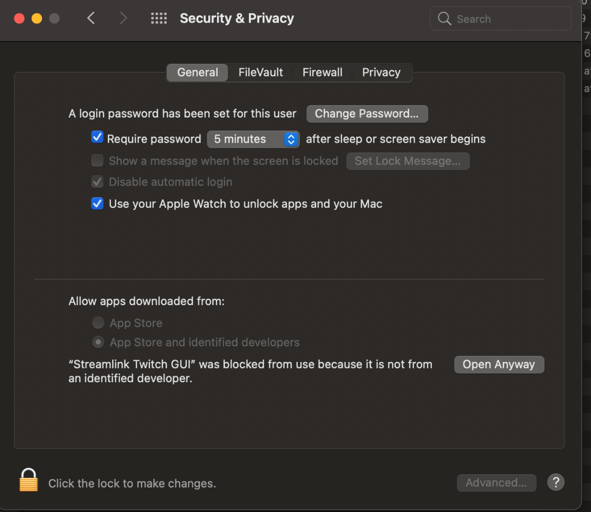
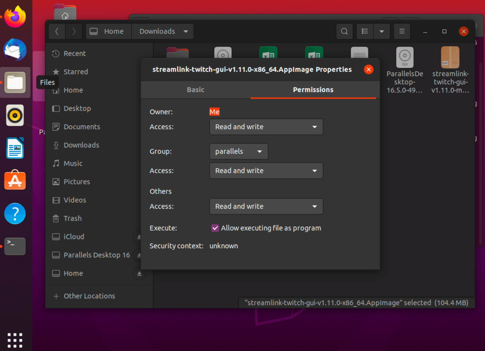
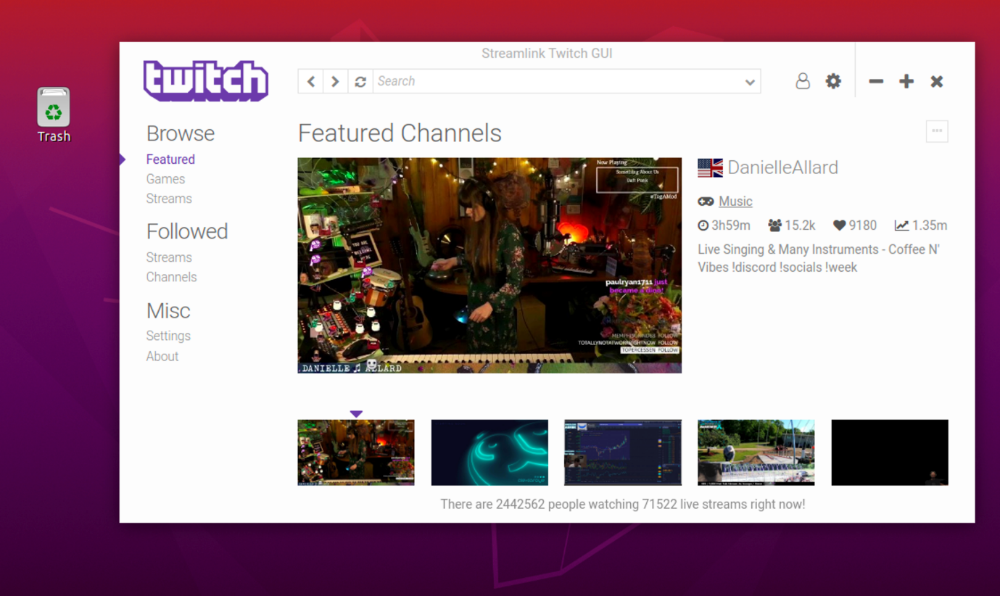
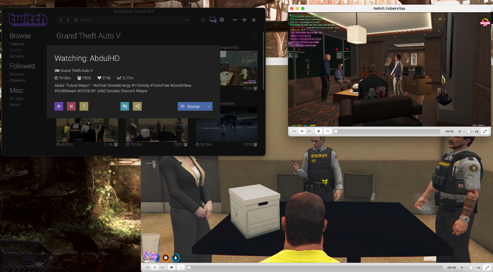
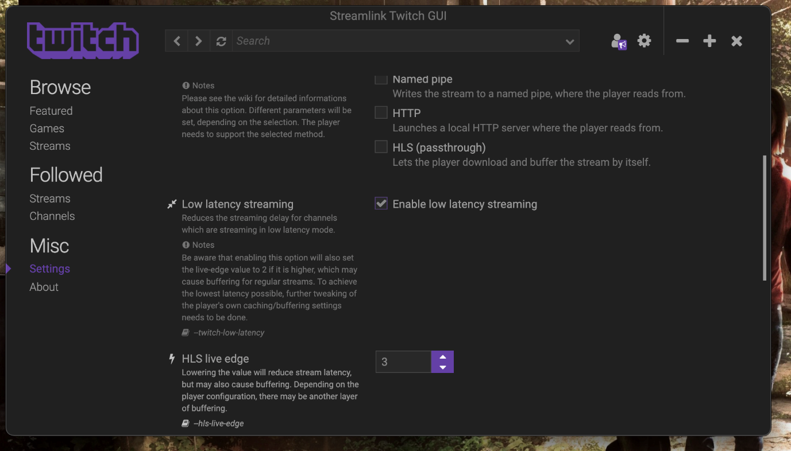
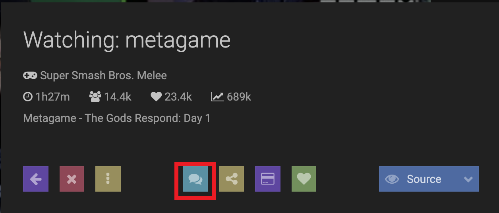

Streamlink allows you to watch your favorite Twitch Streams through the most popular media players on Linux and macOS. This guide shows you how to get Streamlink on your machine and play your streams using the CLI.

To make things easier, the [Streamlink Twitch GUI GitHub](https://streamlink.github.io/streamlink-twitch-gui/) project gives you a straightforward GUI on top of StreamLink with a focus on Twitch streams only. You can also watch multiple streams at once and manage your favorite Twitch streamers in a single, clean UI.

In this guide, we show you how to install and use the GUI for StreamLink on macOS and Linux (Debian/Ubuntu).

## Install Streamlink Twitch GUI

### How to Install Streamlink GUI on macOS

1. Go to [Streamlink's releases page on GitHub](https://github.com/streamlink/streamlink-twitch-gui/releases) and pick the right installer for macOS.

1. Extract the archive and open up the **Streamlink Twitch GUI** application file. macOS prevents the file from being installed so you have to allow it under **System Preferences** and **Security & Privacy**.

    

1. Click on **Open Anyway** and confirm the next security dialogue.

1. The Streamlink UI launches and you can get started.

### How to Install Streamlink GUI on Linux

1. Go to [Streamlink's releases page on GitHub](https://github.com/streamlink/streamlink-twitch-gui/releases) and pick the right installer for your Linux system.

1. Once downloaded, right-click on the file and select Permissions.

    

1. Then, check **Allow executing file as program** and give it **Read and write permissions**. Once done, you can open and start using the Streamlink Twitch GUI.

    

## Configure the Streamlink Twitch GUI

Now that Streamlink Twitch GUI is installed, here’s a walkthrough of its most important and best features.

1. **Connect to your Twitch account**: You can watch streams via Streamlink Twitch GUI, but do so with your own account. Click on the **Login** button and then click **Authorize** to connect.

1. **Watch multiple streams at the same time**: You can watch as many streams as your bandwidth permits. To do that, click on any stream and hit the **play** button. Wait for VLC to launch. Now, hit the **purple back arrow** and select another stream – and once again, hit the **play** button.

    

1. **Enable low-latency streaming**: Most game channels stream use the low latency mode. This reduces the delay between the streamer and your player as well as the chat delays. You should enable this feature in Streamlink Twitch GUI as well. To do so, go to **Settings** and switch over to the **Streaming** tab. Check **Enable low latency** streaming. You may experience some hiccups when streaming regular streams – however, low latency is the default in Twitch so it’s unlikely you encounter any issues.

    

1. **Disable ads**: Twitch streamers are ad-supported. However, if you want to skip ads, do so by enabling the **Skip advertisement embedded into streams** feature found in the **Settings\Streaming** section.

1. **Open a chat**: Since your game is streamed through your media player (e.g. VLC or MPV), the only way to chat with your fellow viewers or the streamer is through a separate small browser window. To open this, click on a **stream** and then on the **chat** icon.

    

With the above configurations, you should be able to watch your favorite Twitch streams using the Streamlink GUI.
