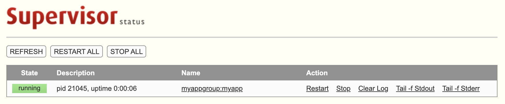

[**Supervisor**](http://supervisord.org/) is a process control system based on the client/server model. It can be used to simplify process management by providing a centralized location for process control. It's most often deployed to control services that don't have initialization, auto-start, or management scripts. Remote process control is also supported via [Remote Procedure Calls](https://man7.org/linux/man-pages/man3/rpc.3.html), or RPC.

As an example, if you have written a custom Node.js web application, Supervisor could be used to ensure that it starts on boot. As well, Supervisor could restart the application if it quits unexpectedly.


This guide uses a Python program called `app.py` as an example for process control. Supervisor can control Python applications, Node.js applications, or programs written in other languages or runtimes.


## In this Guide

This guide shows how to:

- [Set up an example app](#set-up-the-example-app) that illustrates Supervisor's functions

- [Install and configure supervisor](#install-and-configure-supervisor), including the syntax for individual process configuration files

- [Run Supervisor](#run-supervisor) and interact with it via `supervisorctl`

- Optionally, [enable HTTP access](#enabling-http-access-optional) and view Supervisor's web interface

## Before You Begin

1.  If you have not already done so, create a Linode account and *CentOS 8* Compute Instance. See our [Getting Started with Linode](/docs/guides/getting-started/) and [Creating a Compute Instance](/docs/guides/creating-a-compute-instance/) guides.

1.  Follow our [Setting Up and Securing a Compute Instance](/docs/guides/set-up-and-secure/) guide to update your system. You may also wish to set the timezone, configure your hostname, create a limited user account, and harden SSH access.

    
Commands that require elevated privileges are prefixed with `sudo`. If you’re not familiar with the `sudo` command, see the [Users and Groups](/docs/guides/linux-users-and-groups/) guide.


1.  [Install Python 3.6 or newer](/docs/guides/how-to-install-python-on-centos-8/).

## Set Up the Example App

Supervisor is usually configured to run important components of your project's software. The example in this guide is simplified so that it just illustrates Supervisor's functions:

1. Log into your CentOS 8 server.

1. Create the directory that the application is stored in:

        sudo mkdir /opt/myapp/

1. Create the `app.py` program file inside this directory with the text editor of your choice. You need to use `sudo` with your text editor to create the file. For example, to create it with the `nano` text editor, run:

        sudo nano /opt/myapp/app.py

1. Paste the content of this snippet into the file:

    
#!/usr/bin/python3

import sys
import random
import time
from datetime import datetime

failure_chance = .01
sleep_interval = .1
sleep_counter = 0

# Execute loop until random() generates a number less than the failure chance
# that was specified. Also, don't exit the loop in the first second, even
# if a random number is generated under the failure chance during the first second
while random.random() > failure_chance or sleep_counter * sleep_interval < 1:
    time.sleep(sleep_interval)
    sleep_counter += 1

    # Print the current date/time and the number of seconds that the program
    # has been running for to the system's standard output
    print(f"{datetime.now().strftime('%Y-%m-%d %H:%M:%S')}: Alive for {round(sleep_counter * sleep_interval,1)} seconds", file = sys.stdout)
    sys.stdout.flush()

print("---", file = sys.stdout)

# Print the current date/time and the number of seconds that the program
# ran the loop for to the system's standard error output
print(f"{datetime.now().strftime('%Y-%m-%d %H:%M:%S')}: Died after {round(sleep_counter * sleep_interval,1)} seconds", file = sys.stderr)


    This program will run for a random amount of time before quitting. Each cycle of the program's main loop will have a chance to exit equal to the `failure_chance` on line 8. Each time the program's main loop runs, it will output how long the loop has been running to the system's standard output. At the end, it will output how long the program ran to the system's standard error output.

1. Set your `myappuser` user as the owner of the program directory:

        sudo chown -R myappuser:myappuser /opt/myapp

1. Make the new program executable:

        sudo chmod u+x /opt/myapp/app.py

## Install and Configure Supervisor

Supervisor is in the [EPEL package repository](https://fedoraproject.org/wiki/EPEL#What_is_Extra_Packages_for_Enterprise_Linux_.28or_EPEL.29.3F) for CentOS. Install this package repository, then install Supervisor:

    sudo yum install epel-release
    sudo yum install supervisor

### (Optional) Configure Supervisord.service

If you intend to use Supervisor to manage processes that require the network to be online, edit the `/usr/lib/systemd/system/supervisord.service` file. Add `network-online.target` to the `After` parameter of the `[Unit]` section. For example:


[Unit]
Description=Process Monitoring and Control Daemon
After=rc-local.service nss-user-lookup.target network-online.target

...


### (Optional) Set the Location of Process Configuration Files

In this guide, individual processes have their own `.ini` configuration files placed in `/etc/supervisord.d/`. This location is specified in `/etc/supervisord.conf` by default:


[include]
files = supervisord.d/*.ini


If you prefer to store configuration files elsewhere, edit the `[include]` section of `/etc/supervisord.conf` to point to the directory of your choice.

### Add Process Configuration Files

Process configurations can be added directly in `/etc/supervisord.conf`. However, configuration management can be simplified by placing individual configuration files in `/etc/supervisord.d/`.

1. Use `sudo` to create a `myapp.ini` configuration file in `/etc/supervisord.d/`. Paste this snippet into the new file:

    
[group:myappgroup]
programs=myapp

[program:myapp]
directory=/opt/myapp                     ; Location of application
command=python3 app.py                   ; The command to execute
autostart=true                           ; Start this application when supervisord starts
autorestart=true                         ; Restart this application if it crashes
stderr_logfile=/var/log/myapp/app.err.log  ; Make sure this directory exists
stdout_logfile=/var/log/myapp/app.log      ; Make sure this directory exists
stopsignal=INT                           ; Signal sent to the application when halting
user=myappuser                           ; setuid to this UNIX account to run the program


    The configuration file defines a [group](http://supervisord.org/configuration.html#group-x-section-settings). Groups help you manage several processes as a single unit from Supervisor.

    It then defines a [program](http://supervisord.org/configuration.html#program-x-section-settings), with several settings that control when and how the program is run.

1. The example program configuration provides logging of `stderr` and `stdout` to locations specified in `stderr_logfile` and `stdout_logfile`. The directory specified for these logs (`/var/log/myapp/`) needs to be created before starting/restarting `supervisord`. Create this directory:

        sudo mkdir /var/log/myapp

    
If you do not create this directory, the following error appears when you try to load the new Supervisor configuration:


ERROR: CANT_REREAD: The directory named as part of the path /var/log/myapp/app.log does not exist in section 'program:myapp' (file: '/etc/supervisord.d/myapp.ini')



## Run Supervisor

1.  Enable and start the `supervisord` service:

        sudo systemctl enable supervisord
        sudo systemctl start supervisord

1.  Once `supervisord` has been started you can access it via the command line with the `supervisorctl` command. Run the `status` action for `supervisorctl` to check the uptime of your program:

        sudo supervisorctl status

    
myappgroup:myapp                 RUNNING   pid 16407, uptime 0:00:09


1.  You can invoke the `supervisorctl` command on its own to bring up a command prompt:

        sudo supervisorctl

    
myappgroup:myapp                 RUNNING   pid 18833, uptime 0:00:10
supervisor> status


    Once this prompt appears, you can type the name of action to perform it:

        status

    
myappgroup:myapp                 STARTING


    Enter `quit` to leave the prompt.

1.  You can also see that logs are being written to the log files specified earlier:

        tail /var/log/myapp/app.log

    
2021-02-22 16:11:46: Alive for 4.3 seconds
2021-02-22 16:11:46: Alive for 4.4 seconds
2021-02-22 16:11:46: Alive for 4.5 seconds
2021-02-22 16:11:46: Alive for 4.6 seconds
---
2021-02-22 16:11:47: Alive for 0.1 seconds
2021-02-22 16:11:47: Alive for 0.2 seconds
2021-02-22 16:11:47: Alive for 0.3 seconds
2021-02-22 16:11:47: Alive for 0.4 seconds
2021-02-22 16:11:47: Alive for 0.5 seconds


        tail /var/log/myapp/app.err.log

    
2021-02-22 16:12:22: Died after 13.1 seconds
2021-02-22 16:12:30: Died after 6.2 seconds
2021-02-22 16:13:16: Died after 45.0 seconds
2021-02-22 16:13:23: Died after 6.4 seconds
2021-02-22 16:13:26: Died after 2.0 seconds
2021-02-22 16:14:01: Died after 32.4 seconds
2021-02-22 16:14:05: Died after 3.0 seconds
2021-02-22 16:14:08: Died after 1.7 seconds
2021-02-22 16:14:15: Died after 5.6 seconds
2021-02-22 16:14:26: Died after 10.7 seconds


    
Optionally, you can install and use the [logrotate](/docs/guides/use-logrotate-to-manage-log-files/) tool to manage the log files created by Supervisor.


### Other supervisorctl Actions

Here's the syntax for a few other basic commands:

1. Stop your program with the `stop` action. Specify the group it belongs to and the program name:

        sudo supervisorctl stop myappgroup:myapp

    
myappgroup:myapp: stopped


1. Reference all of the programs in a group with the `groupname:*` syntax. Run this `start` action to start all the programs in the `myappgroup` group (which is just the single example program in this guide):

        sudo supervisorctl start myappgroup:*

    
myappgroup:myapp: started


1. Restart programs with the `restart` action:

        sudo supervisorctl restart myappgroup:myapp

    
myappgroup:myapp: stopped
myappgroup:myapp: started


1. If you have made a configuration change to a Supervisor process, you can run the `reread` command to reload the changes:

        sudo supervisorctl reread

1. The `reread` command does not restart programs. Run the `update` command to both reload any configuration changes and restart programs:

        sudo supervisorctl update

A full list of actions and other `supervisorctl` documentation can be found at [Running Supervisor — Supervisor 4.2.1 documentation](http://supervisord.org/running.html#running-supervisorctl).

## Enabling HTTP Access (Optional)

You may want to add HTTP access to `supervisord`, either to enable the web interface or to allow remote RPC calls.


Enabling HTTP access exposes `supervisord` to the internet at large. If you choose to enable HTTP access, make sure to configure firewall rules that limit access to trusted IPs. As well, configure a user name and a long, complex, and unique password for service access.


1. To enable HTTP access, uncomment the `[inet_http_server]` in `/etc/supervisord.conf`. Update the `port`, `username`, and `password` settings:

    
[inet_http_server]
port=*:9001              ; IP address and port to bind to. Use *:9001 to listen on all interfaces.
username=super                 ; Service user name
password=A!VeryS3cuReP@5sw0rd  ; Service password, make it a good one.


1.  Enable a firewall rule to allow access for your remote IP or a trusted network. Replace the value for `address` with your IP address or network range:

        sudo firewall-cmd --permanent --zone=public --add-rich-rule='
          rule family="ipv4"
          source address="4.3.2.1/32"
          port protocol="tcp" port="9001" accept'
        sudo firewall-cmd --reload

1. Restart `supervisord`

        sudo systemctl restart supervisord

1. You should now be able to visit `http://<yourIPOrDomain>:9001` and log in with the configured user name and password. A listing of your programs appears. This interface allows you to view your programs' uptime, restart and stop your programs, and view the programs' logs:

    