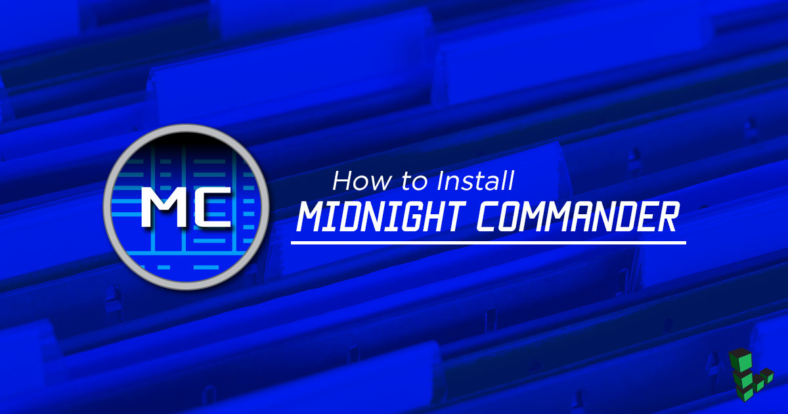
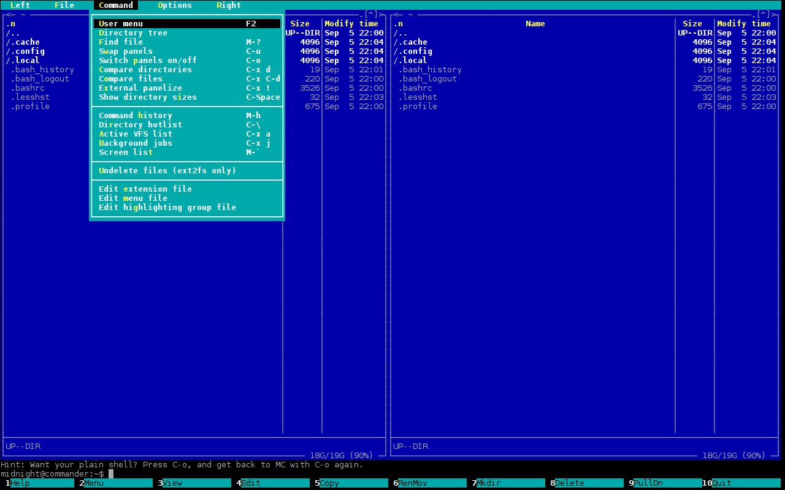
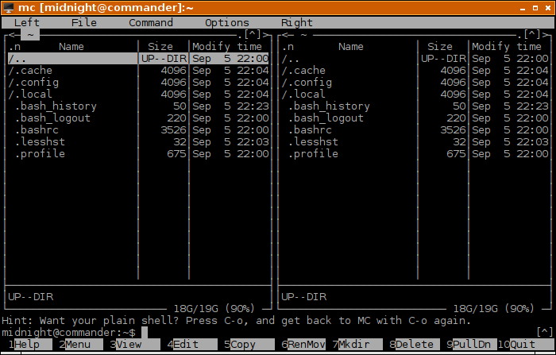
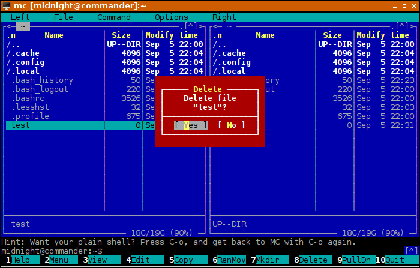
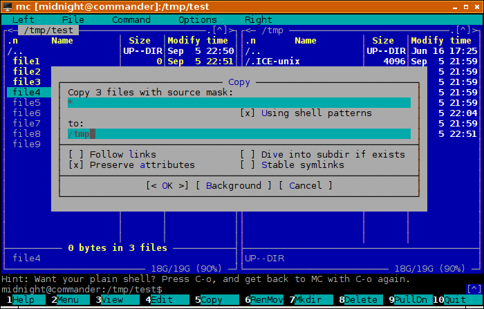
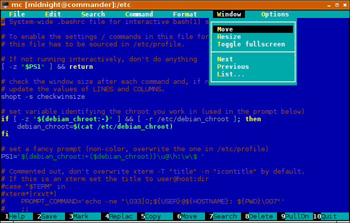
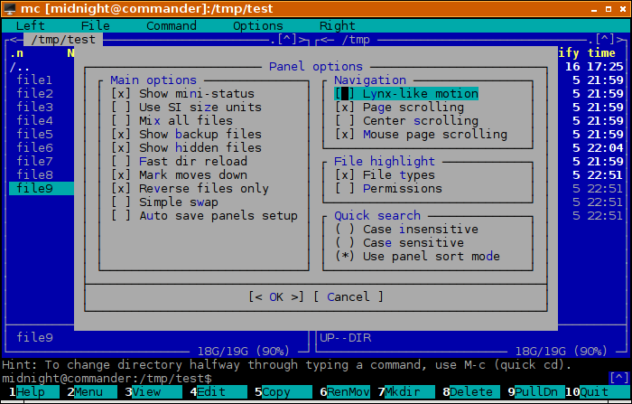
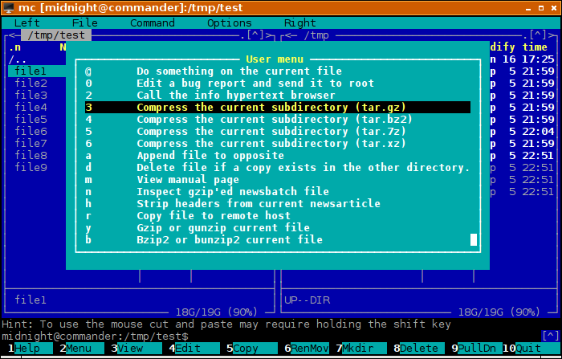
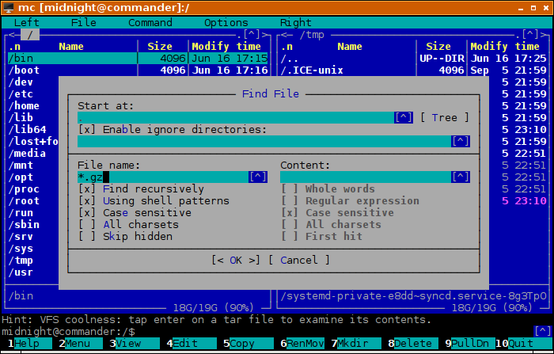

## Introduction

For beginners, managing files on their Linux servers from the command line can be intimidating, time-consuming, and sometimes even risky. More experienced users might want to switch to better suited tools for dealing with files and directories in many different locations. One tool that can help both Linux newbies and veterans is Midnight Commander, a *Text User Interface* (TUI) file manager.

A TUI facilitates interaction between users and their systems in a visually oriented way instead of typing commands. While lacking in visual components compared to a graphical user interface (GUI), a TUI offers windows, panels, menus, and mouse support.

## Before You Begin


This guide is written for a non-root user. Commands that require elevated privileges are prefixed with `sudo`. If you’re not familiar with the `sudo` command, see the [Users and Groups](/docs/guides/linux-users-and-groups/) guide.


The methods in this tutorial have been tested on Debian 9. There is no special requirement to install Midnight Commander, and it works on all Linux distributions. While this file manager should work in almost identically on all Linux distributions, a particular distro may not package the exact same Midnight Commander version (4.8.18, in this case). This may result in small behavioral differences on other operating systems.

## Install Midnight Commander

First, install the utility:

1.  On Debian or Ubuntu run:

        sudo apt-get install mc

2.  On CentOS, the command is:

        sudo yum install mc

## Launch Midnight Commander

1.  To start Midnight Commander with the command prompt:

        mc

    Keep in mind that running as root is not a good idea unless you need to modify or delete files/directories owned by this user. In most cases, reading or copying objects owned by root doesn't require special privileges, so try to run `mc` as a regular user.

    

2.  By default, Midnight Commander uses a blue background color and highlights important menu items. To turn off color:

        mc --nocolor

## Interact With Screen Elements

1.  The file manager is vertically split into two panels. The logic behind this is that copy and move operations are done from one place to another. At the bottom, you will see ten labeled rectangles:

       **Help**, **Menu**, **View**, (+ 7 more)

    The numbers preceding each label represent the function key you need to press to perform those actions. For example pressing **F10** will quit the program and return to your shell.

2.  Above those ten buttons, you'll see `your_user@your_hostname:~$`. This allows you to type commands in your current working directory. Try it now, type:

        touch test

    After you press **ENTER**, you'll see a new file appear in your active panel. Now, delete it without typing any commands. Use the arrow keys, pressing **UP** or **DOWN** until the file named `test` is highlighted. Now press **F8**. A dialog box pops up and asks for confirmation. Press **ENTER**. If you press **F8** by mistake this gives you chance to cancel the action.

    

3.  At the top of the screen, you can see a colored bar with text:
**Left**, **File**, **Command**, **Options**, **Right**.

    These are drop-down menus that can be accessed by pressing **F9** and then navigating with your arrow keys. Press **F9** and then the **DOWN** arrow key multiple times until **Tree** is highlighted. Press **ENTER**. The panel has now changed to tree view.

4.  Once you hit the **F9** key, some letters get highlighted, e.g., **C** in Command. These are keys that you can press to navigate the menus faster. Let's return to your previous view: press **F9** then **l** (L) and then **g** to get back to **File listing**. When an input field is selected, hold **ALT** down before pressing on the highlighted letter.

5.  Shortcut keys are a combination of keys pressed together that allow you to quickly access specific actions. For example, try pressing **CTRL+O**. This lets you focus on the command line or see previous command output while Midnight Commander runs in the background. You can quickly return to its interface by hitting the same key combination.

6.  You can also use your mouse pointer to click on interface elements.

## Use the Two Panels to Work with Files and Directories

1.  Switch between the left and the right vertical panels by pressing **TAB**.

2.  Close Midnight Commander by pressing **F10**. Open a temporary working directory in both panels:

        cd /tmp && mc

    This is a directory containing temporary files that will be deleted at next boot, so we can experiment freely here.

3.  Create a directory by pressing **F7**. Name this `test`.

4.  Using your arrow keys, navigate to `test` and press **ENTER** (after creating a directory, this should already be highlighted).

5.  Create nine empty files:

        touch file{1..9}

6. Say you want to copy three files from `/tmp/test` to `/tmp`. Use the arrow keys to navigate to `file1`. Once it's highlighted press **INSERT** three times. Pressing **F5** and then **ENTER** will copy all three files to the working directory opened in the opposite panel.

    

    Alternate ways to make selections are: holding down **SHIFT** and then pressing **UP** or **DOWN** arrow key.

    - `*` to inverse the selection
    - `-` to deselect all objects that match a pattern (e.g., typing `f*` will deselect every file or directory whose names start with "f")
    - `+` to select by pattern

    In these patterns, `*` stands for zero or more characters while `?` stands for one character. So `f*e` would match `fe`, `file`, `fiiiile` or anything else starting with "f" and ending with "e". `a?c` would match `abc`, `adc`, `azc` but will not match `ac`. There needs to be exactly one character between "a" and "c."

    If you prefer to use the mouse, then right clicking will make individual selections. Holding down the right click and dragging will select multiple entries.

7.  Pressing **F4** will open a file in the default editor. On Debian you will get this output if you never used an editor before:

    
Select an editor.  To change later, run 'select-editor'.
1. /bin/nano        <---- easiest
2. /usr/bin/mcedit
3. /usr/bin/vim.basic
4. /usr/bin/vim.tiny

Choose 1-4 [1]:


    It's recommended you choose **2** here since `mcedit` integrates with Midnight Commander and is easier to use than `nano`. A large amount of functions can be accessed by pressing **F9** to activate the editor's menu. Press **F10** to exit the utility or **ESC** two times.

    

    
Actions can be cancelled in MC by pressing the **ESC** key twice.


## Useful Tips and Tricks

1.  Accessing the parent directory or "going up" one level can be a bit tedious because you have to scroll/navigate all the way up to the **/..** entry. Press **F9**, followed by **o** and then **p**. This will take you to **Panel options** where you can activate **Lynx-like motion**. (Highlight it and press space or click it with your mouse.) With this on, you can now go up a directory by simply pressing your **LEFT** arrow key and enter a directory by pressing the **RIGHT** arrow key.

    

2. Another tool that can save you time is Midnight Commander's user menu. Go back to `/tmp/test` where you created nine files. Press **F2** and bring up the user menu. Select **Compress the current subdirectory (tar.gz)**. After you choose the name for the archive, this will be created in `/tmp` (one level up from the directory being compressed). If you highlight the .tar.gz file and press **ENTER** you'll notice it will open like a regular directory. This allows you to browse archives and extract files by simply copying them (**F5**) to the opposite panel's working directory.

    

3.  To find out the size of a directory (actually, the size of all the files it contains), highlight the directory and then press **CTRL+SPACE**.

4.  To search, go up in your directory tree until you reach the top level, `/`, called root directory. Now press **F9**, then **c**, followed by **f**. After the **Find File** dialog opens, type `*.gz`. This will find any accessible gzip archive on the system. In the results dialog, press **l** (L) for **Panelize**. All the results will be fed to one of your panels so you can easily browse, copy, view and so on. If you enter a directory from that list, you lose the list of found files, but you can easily return to it with **F9**, **l** (L) then **z** (to select **Panelize** from the **Left** menu).

    

5.  Managing files is not always done locally. Midnight Commander also supports accessing remote filesystems through SSH's *Secure File Transfer Protocol, SFTP*. This way you can easily transfer files between servers.

    Press **F9**, followed by **l** (L), then select the **SFTP link** menu entry. In the dialog box titled **SFTP to machine** enter `sftp://example@203.0.113.0`. Replace `example` with the username you have created on the remote machine and `203.0.113.1` with the IP address of your server. This will work only if the server at the other end accepts password logins. If you're logging in with SSH keys, then you'll first need to create and/or edit `~/.ssh/config`. It could look something like this:

    
Host sftp_server
    HostName 203.0.113.1
    Port 22
    User your_user
    IdentityFile ~/.ssh/id_rsa



    You can choose whatever you want as the **Host** value, it's only an identifier. **IdentityFile** is the path to your private SSH key.

    After the config file is setup, access your SFTP server by typing the identifier value you set after **Host** in the **SFTP to machine** dialog. In this example, enter `sftp_server`.

## Conclusion

Midnight Commander has many more features than those presented here. Before making many customizations to the default settings, it's a good idea to backup your settings by copying `~/.config/mc/` to your local computer. You can also clone these settings to other servers by copying them to the same location.
