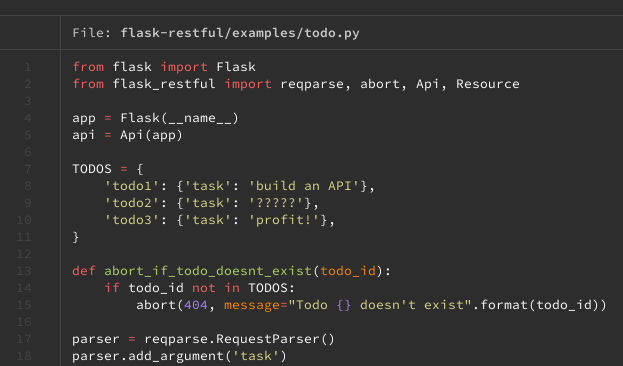
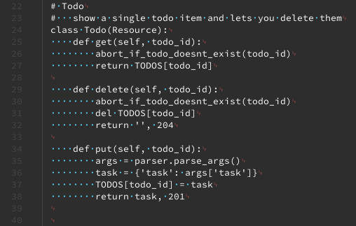
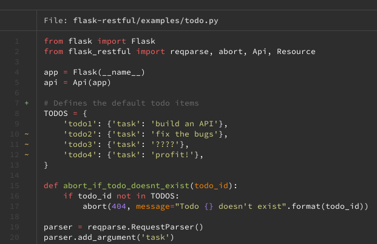
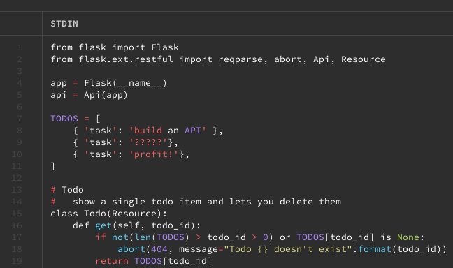
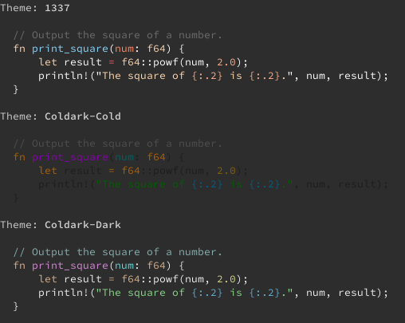

`bat` is a clone of the ubiquitous `cat` command. It modernizes `cat` with a more readable design and features like syntax highlighting and Git integration. This guide details how `bat` compares with its predecessor and shows you how to install and start using it on your Linux system.

## Before You Begin

1. Familiarize yourself with our [Getting Started](/docs/getting-started/) guide, and complete the steps for setting your Linode's hostname and timezone.

1. This guide uses `sudo` wherever possible. Complete the sections of our [Securing Your Server](/docs/security/securing-your-server/) guide to create a standard user account, harden SSH access, and remove unnecessary network services.

1. Update your system.

    - On Debian and Ubuntu, you can do this with:

            sudo apt update && sudo apt upgrade

    - On AlmaLinux and CentOS, use:

            sudo yum update

    - On Fedora, use:

            sudo dnf upgrade


This guide is written for a non-root user. Commands that require elevated privileges are prefixed with `sudo`. If you’re not familiar with the `sudo` command, see the [Users and Groups](/docs/tools-reference/linux-users-and-groups/) guide.


## bat vs. cat

You may be familiar with the `cat` command on Linux. It is included on most distributions by default and gets referenced frequently as a quick way of viewing file contents on the command line.

Like `cat`, `bat` also gives you a simple command-line method for displaying file contents. But `bat` comes with a more modern display and several added features that set it apart.

For one, `bat` adds syntax highlighting. This, combined with other display enhancements — easier-to-follow formatting, pagination, graphical non-printing characters — makes `bat` exceptional for reading files with code in them.

`bat` also comes ready to integrate with several other command-line tools, chief among them Git. Automatically, `bat` provides annotations to indicate modified lines for files in Git repositories. You can even use `bat` to view past versions of files in Git repositories.

## How to Install bat

You can, for many Linux distributions, just get `bat` from the package manager. This is the case for Debian, Ubuntu, and Fedora distributions.

- For Debian and Ubuntu:

        sudo apt install bat

- For Fedora:

        sudo dnf install bat

However, this is not the case for AlmaLinux and CentOS. For those distributions, follow the steps below to download the appropriate `bat` release and install it.

1. If you do not already have it, install `tar`, which you use to extract the `bat` package in a later step:

        sudo yum install tar

1. Check what CPU architecture your Linux system is using:

        uname -a

    Here is an example of what your output might look like:

    
Linux hostname 4.18.0-305.7.1.el8_4.x86_64 #1 SMP Thu Jul 1 02:00:00 EDT 2021 x86_64 x86_64 x86_64 GNU/Linux
    

    In this example — and in the commands that follow — the CPU architecture is **x86_64**.

1. Identify the latest release on [the list of `bat` releases](https://github.com/sharkdp/bat/releases), and find the corresponding `.tar.gz` package with your CPU architecture followed by `unknown-linux-musl` in the name. Copy the URL for that release package, and use it in the command in the next step.

1. Copy the package's URL, and use a command like the one below to download the package as `bat.zip`:

        curl -o bat.zip -L https://github.com/sharkdp/bat/releases/download/v0.18.2/bat-v0.18.2-x86_64-unknown-linux-musl.tar.gz

1. Extract the package:

        tar -xvzf bat.zip

1. Move the `bat` files to `/usr/local`:

        sudo mv bat-v0.18.2-x86_64-unknown-linux-musl /usr/local/bat

1. Add an alias for `bat` to your `.bashrc` file. Likely, the file is located in your user's home directory, as in: `~/.bashrc`. You can create the alias by adding the following line to the end of the file:

    
[...]

alias bat="/usr/local/bat/bat"
    

Once you have installed `bat`, by whatever method, you can verify the installation with:

    bat --version


bat 0.18.2


## How to Use bat

Getting started with `bat` is about the same as with `cat`. You just need to give the command followed by the path to a file you want to see.

To really show off the capabilities of `bat`, this guides uses some example code provided in a GitHub project — the Flask-RESTful project. You can get the code by installing Git (if you do not already have it) and cloning the repository. Replace `apt` with `dnf` if you are on Fedora or with `yum` if you are on AlmaLinux or CentOS:

    sudo apt install git
    git clone https://github.com/flask-restful/flask-restful.git

Now, you can open up one of the Python files in this repository using `bat`:

    bat flask-restful/examples/todo.py

By default, `bat` uses `less` to paginate its results. However, you can also have `bat` print to the command line, just like in `cat`. Just use the `--paging=never` flag:

    bat --paging=never flask-restful/examples/todo.py

Like `cat`, `bat` gives the option to show non-printing characters, making it easier to track spaces, tabs, line breaks, etc. But `bat` has the added advantage of using special characters and highlighting to represent non-printing characters more clearly:

    bat --show-all flask-restful/examples/todo.py

### Git Integration

`bat` also provides Git integration. To see it at work, open the `todo.py` file with your preferred text editor, and make some changes to it. Then, open the file again with `bat`. You can see that `bat` includes Git annotations on the modified lines.

Using a command combination between Git and `bat`, you can even use `bat` to view past versions of files in a Git repository.

The method uses Git's `show` command, which requires you to specify a file version. Refer to the [Specifying Revisions](https://git-scm.com/docs/gitrevisions#_specifying_revisions) section of Git's revisions documentation for the various ways of doing that.

The example below looks at past commits on the `todo.py` file shown above. It then gets a past version of the file using one of the commit's identifiers.

1. Change into the repository's directory. This example assumes you cloned the repository to your current user's home directory (`~`):

        cd ~/flask-restful

1. Get a list of commits on the file:

        git log examples/todo.py

    
commit 871f4e69e7758cb983056b469ec4ae40963ed1bb
Author: Josh Friend <josh@example.com>
Date:   Mon Jul 20 09:28:15 2015 -0400

    Fix examples using type=str

    closes #461

commit 8bdba92ef54645ada501a39edc0bc68d34127b64
Author: Josh Friend <josh@example.com>
Date:   Sat Mar 21 22:57:40 2015 -0400

    fix references to flask.ext.* (fixes #420)

commit 566431a24dac4dcf236fe06850fe96a9a3ab1890
Author: Victor Neo <victor@example.com>
Date:   Mon Dec 24 01:46:18 2012 +0800

    Update documentation full example and sync with todo.py example.

commit a4465e3e9cc4c30e7f53e0b908f734a42ed32da4
Author: Ryan Horn <ryan@example.com>
Date:   Tue Oct 16 21:07:16 2012 -0700

    Flask-RESTful
    

1. Decide on a version you want; this example uses the earliest commit listed. Copy its commit identifier, and use that identifier in the following command:

        git show a4465e3e9cc4c30e7f53e0b908f734a42ed32da4:examples/todo.py | bat -l rs

    

## How to Customize Syntax Highlighting in bat

You can customize the syntax highlighting in `bat`. Whether you want a different color palette for the highlighting or you have a language you need highlighting on, `bat` gives you options.

### Setting the Highlighting Theme for bat

`bat` comes with a host of themes for syntax highlighting. You can get a list of them, along with samples, using this command:

    bat --list-themes

If you see one you like, you have a few ways to use it:

- Use the `--theme` flag when running `bat`. With this method, you have to use the flag each time you run the `bat` command:

        bat --theme="Solarized (dark)" ~/flask-restful/examples/todo.py

- Set the `BAT_THEME` environment variable for the shell session. This approach keeps the theme so long as your shell session is alive:

        export BAT_THEME="Solarized (dark)"

- Set the `BAT_THEME` environment variable in your `.bashrc` to make the theme selection persistent across your shell sessions:

    
[...]

export BAT_THEME="Solarized (dark)"
    

### Adding Languages for Syntax Highlighting in bat

You can get a list of languages that your `bat` installation currently has syntax highlighting for with the `--list-languages` option:

    bat --list-languages

If `bat` lacks highlighting for a language you want, you can add it yourself. `bat` supports Sublime Text syntax files — `.sublime-syntax`. [Package Control](https://packagecontrol.io/), a package manager for Sublime Text, is a great place to start looking.

The following steps show you how to add a language once you find a `.sublime-syntax` file you want to use. This example uses a package found on Package Control for the [Fennel](https://fennel-lang.org/) programming language.

1. Create a `syntaxes` directory in the `bat` configuration directory:

        mkdir -p "$(bat --config-dir)/syntaxes"

1. Place the `.sublime-syntax` file in this directory. This example clones the Git repository for the Fennel language package, which has the syntax file in its base:

        cd "$(bat --config-dir)/syntaxes"
        git clone https://github.com/gbaptista/sublime-text-fennel.git

1. Have `bat` parse the syntax files:

        bat cache --build

1. Verify that your language option — Fennel, in this case — has been added to the list of languages in `bat`:

        bat --list-languages

    
[...]
Fennel                            fnl
[...]
    
