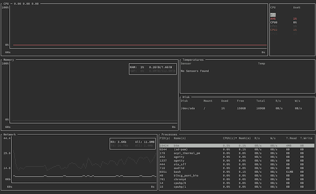
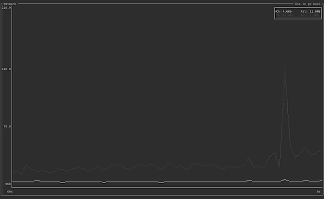
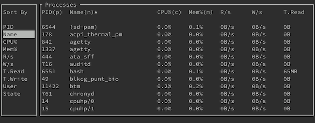
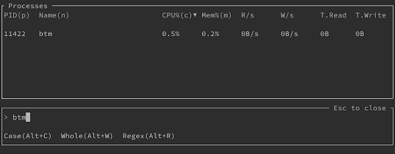
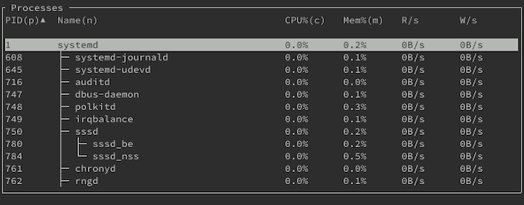
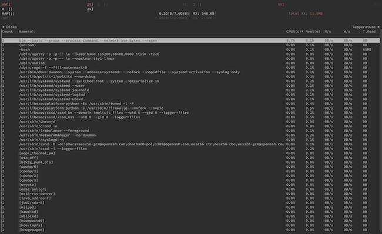

`bottom` is a terminal-based graphical dashboard for system monitoring. It comes with a range of customization options and display features that set it apart from other system monitoring dashboards.

This guide tells you more about `bottom`, comparing it to similar tools like `htop` and `gtop`. From there, the guide shows you how to install `bottom` and how to get started using it on your Linux system.

## Before You Begin

1. Familiarize yourself with our [Getting Started with Linode](/docs/getting-started/) guide and complete the steps for setting your Linode's hostname and timezone.

1. This guide uses `sudo` wherever possible. Complete the sections of our [How to Secure Your Server](/docs/security/securing-your-server/) guide to create a standard user account, harden SSH access, and remove unnecessary network services.

1. Update your system.

    - On **Debian** and **Ubuntu**, you can do this with the following command:

          sudo apt update && sudo apt upgrade

    - On **AlmaLinux**, **CentOS** (8 or later), or **Fedora**, use the following command:

          sudo dnf upgrade


The steps in this guide are written for non-root users. Commands that require elevated privileges are prefixed with `sudo`. If you’re not familiar with the `sudo` command, see the [Linux Users and Groups](/docs/tools-reference/linux-users-and-groups/) guide.


## What is bottom?

`bottom` is a graphical system monitoring dashboard for the terminal. What sets it apart from similar tools is the high degree of customization options and features for exploration that `bottom` gives you. Whether you want to get a quick graphical summary of your system or dive through its running processes, `bottom` has your needs covered.

### bottom vs gtop

`bottom`, like `gtop`, follows in the legacy of `htop`, a popular alternative to the `top` command that comes by default on most Unix systems. Where `htop` adds more graphical and interactive features to `top`, `gtop` leans even further into the graphical direction. `gtop` thus provides an easy-to-read dashboard for getting quickly updated on your system's performance.

`bottom` follows `gtop` in emphasizing graphical display. However, `bottom` adds layers of customization and navigation features. While `gtop` can be simple and easy to use, `bottom` opts to give the user immense control of the dashboard while keeping the readability of graphical displays.

In short, prefer `bottom` if you want a graphical system monitoring dashboard for the terminal that gives you control of every detail of the display. `gtop`, on the other hand, should be your tool of choice if you want uncomplicated system monitoring and find the default display useful.

You can learn more about `gtop`, and more details about how it compares to `top` and `htop`, in our [How to Install and Use gtop](/docs/guides/installing-and-using-gtop-on-linux) guide.

## How to Install bottom

Currently, `bottom` is not available in the default package managers for most major Linux distributions. However, it is still easy to get `bottom` installed on your system. Just follow the instructions in the section for your Linux distribution below.

### On Debian and Ubuntu

Use the following commands to install `bottom` on Debian or Ubuntu distributions:

    curl -LO https://github.com/ClementTsang/bottom/releases/download/0.6.3/bottom_0.6.3_amd64.deb
    sudo dpkg -i bottom_0.6.3_amd64.deb

Check the `bottom` [releases page](https://github.com/ClementTsang/bottom/releases), and replace the version number above (`0.6.3`) with the latest version number you find in the releases page.

### On AlmaLinux, CentOS, and Fedora

Use the following commands to install `bottom` on AlmaLinux, CentOS, or Fedora distributions. This uses DNF's `Copr` plugin to enable the repository for `bottom`.

    sudo dnf copr enable atim/bottom
    sudo dnf install bottom

## How to Use bottom

You can start `bottom` with the following command. `bottom` opens with an array of widgets for you to immediately start monitoring your system's performance.

    btm

You learn more about the display, how to navigate it, and how to customize `bottom` in the following sections.

### Widgets in bottom

By default, `bottom` displays the following widgets:

- The **CPU** widget shows a graph of CPU usage over the last minute. Additionally, the widget includes the current percentage usage for each CPU and an average among them.
- The **Memory** widget graphs memory usage over the last minute and shows current RAM and swap memory usage percentages.
- The **Temperatures** widget displays current temperatures for any temperature sensors in your machine. However, the widget only displays information if you have at least one temperature sensor.
- The **Disk** widget lists your system's drives and provides usage information for each.
- The **Network** widget shows received (**RX**) and transmitted (**TX**) network traffic, both in a graph over the last minute and in a current percentage.
- The **Processes** widget lists running processes with their usage information, a simplified version of the process listing you could expect from the `top` command.

You can, additionally, customize the `bottom` display with a **Battery** widget, which gives information on your machine's battery, or batteries, if it has one. The widget's information includes current charge and usage percentage, time until empty, and health percentage.

You can enable this widget by adding the `--battery` flag when running the `btm` command. (And you can learn more about command-line flags in `bottom` in the [Command-line Flags](/docs/guides/how-to-use-bottom/#command-line-flags) section below).

### Navigating bottom

The following is not an exhaustive list, but here you can find some useful keys to keep in mind for navigating `bottom`. Note that you can use the **?** key in `bottom` to get a help menu, which shows you all keyboard shortcuts.

- Navigate among the widgets using the **Shift** and arrow keys together. If the widget has a list, you should see an item in its list selected when the widget gets selected. Otherwise, you may not be able to tell that a widget is selected until you use one of the widget-related key combinations explained in the subsequent steps.
- Use the arrow keys to navigate the list in a widget, if the widget has one. This includes the **Disk**, **Temperatures**, and **Processes** widgets.
- You can more quickly navigate to the beginning of a list using the **g** + **g** key combination and to its ending using **G**.
- The **e** key allows you to expand a widget's contents to fill the display. You can see an example below with the **Network** widget. Pressing **e** again reduces the widget.

    

- You can control the zoom level of the graph in a selected widget using the **+** and **-** keys. Pressing **=** resets the zoom level to its default.
- Use the **q** key to exit `bottom`.

The **Processes** widget has numerous additional keybindings to help you navigate the often extensive list. Below, while not an exhaustive list, highlights the most commonly useful keybindings.

- Use the **s** key to bring up a sort menu. Selecting an item on the sort menu and pressing **Enter** updates the list using the selected criteria for its sort order.

    

- Use the **/** key to open the search menu. You can type a search string there to start filtering the processes by matching names. Pressing **Esc** exits the search menu, but keeps your filtering. You need to open the search menu and remove your search string to remove the filtering.

    

- Use the **Tab** key to toggle grouping processes with the same name. `bottom` then replaces the **PID** field with a **Count** field, showing the number of processes under that name. You can use the sort feature to sort by the **Count** field when you have grouped processes in this way.
- Use the **P** key to toggle showing the full commands used to run each process. This is useful if you want to see what options were used for running processes.
- Use the **t** key to toggle displaying the process list in tree mode. In tree mode, processes are nested beneath their parent processes.

    

## How to Configure bottom

`bottom` allows for extensive customization, whether you want command-line options to get a one-time display or you want to set the default behavior.

### Command-line Flags

`bottom` has numerous command-line flags to customize your experience. You can get a full list of flags, along with descriptions of each, using the command below:

    btm --help

Following is an example of how you could use the command-line flags with `bottom`.

    btm --basic --group --process_command --network_use_bytes --regex

The options in the above example run `bottom` with:

- Basic mode (`--basic`), which disables graphs and uses a minimalist display.
- Processes grouped (`--group`) and their full commands displayed (`--process_command`) by default.
- Network usage shown in bytes (`--network_use_bytes`).
- Regex enabled by default on the search menu for the **Processes** widget (`--regex`).

### Configuration File

`bottom` also has a configuration file that defines its default behavior. You can find it at `~/.config/bottom/bottom.toml`. The file comes with an extensive array of options, all already present but commented-out. So, it is relatively easy to jump in and start tinkering with it.

Most of the command-line flags are available as flags in the configuration file. You can, thus, use this file to obviate using a series of command-line flags each time you run `bottom`. You can get a full list of flags for the configuration file on the dedicated [page for configuration file flags](https://clementtsang.github.io/bottom/0.6.3/configuration/config-file/flags/) within the `bottom` documentation.

But the configuration file shines in allowing you to tightly manage how the display in `bottom` is arranged and themed. Using the appropriate tagging pattern, you can completely control the arrangement of widgets and the coloring in `bottom`.

To help you see how this works, below is the default widget arrangement. You can find a version of this commented-out in the default configuration file, `bottom.toml`. This example also includes the brief explanation of each tag's role that is also included in the default configuration file.



# Layout - layouts follow a pattern like this:
# [[row]] represents a row in the application.
# [[row.child]] represents either a widget or a column.
# [[row.child.child]] represents a widget.
#
# The default widget layout:
[[row]]
  ratio=30
  [[row.child]]
  type="cpu"
[[row]]
    ratio=40
    [[row.child]]
      ratio=4
      type="memory"
    [[row.child]]
      ratio=3
      [[row.child.child]]
        type="temperature"
      [[row.child.child]]
        type="disk"
[[row]]
  ratio=30
  [[row.child]]
    type="network"
  [[row.child]]
    type="processes"
    default=true


You can learn more about the possible `type` values and `ratio` usage in the official documentation's [page on configuring layouts](https://clementtsang.github.io/bottom/0.6.3/configuration/config-file/layout/) in `bottom`.

`bottom` also allows you to customize the color theme via the configuration file. The easiest way to customize the color theme is through the `color` option in the configuration file, which accepts one of the following pre-defined color themes: `default`, `default-light`, `gruvbox`, `gruvbox-light`, `nord`, and `nord-light`.

But, if you want more control over your theme for `bottom`, you can set individual colors under the `[color]` tag in the configuration file. The default configuration file shows you the default settings, all commented-out and ready for you to provide custom values. You can get a list of the options, along with descriptions of each and possible color values, in the official documentation's [page on configuring themes](https://clementtsang.github.io/bottom/0.6.3/configuration/config-file/theming/) in `bottom`.
