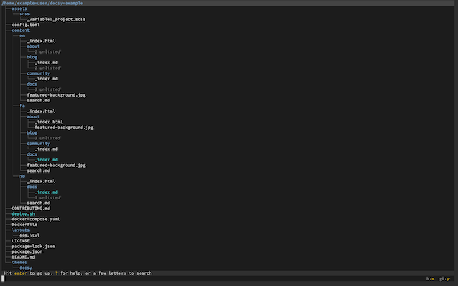
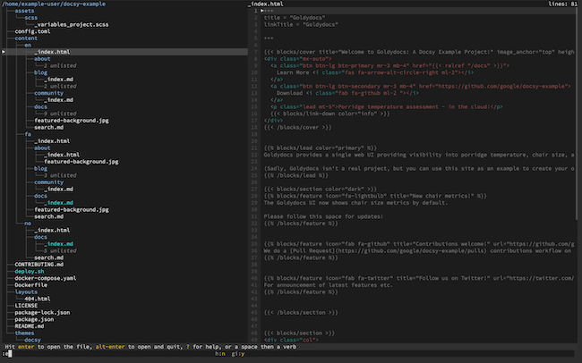
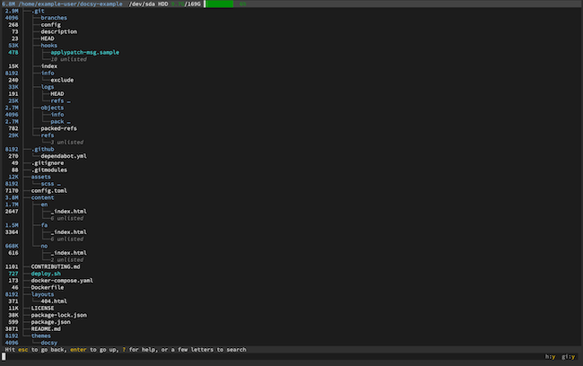
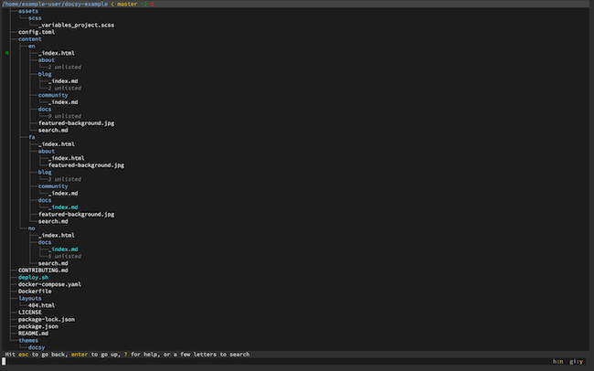
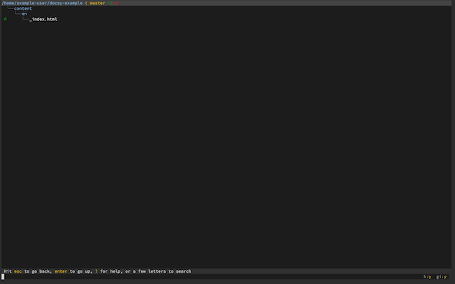
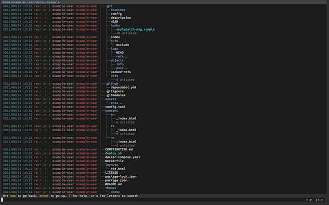
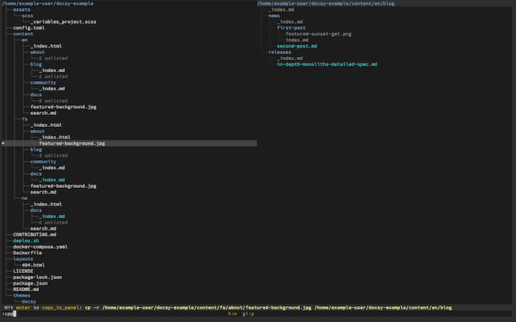

`broot` is a modern approach to directory trees in the command line. It renders the tree in a brief and intuitive layout that makes getting around and getting the gist quicker and easier. Even more, `broot` comes with advanced features for getting details about and managing your files and directories, all from within one tool.

This guide shows you how to install and get started using `broot` on your Linux system.

## Before You Begin

1. Familiarize yourself with our [Getting Started with Linode](/docs/getting-started/) guide, and complete the steps for setting your Linode's hostname and timezone.

1. This guide uses `sudo` wherever possible. Complete the sections of our [How to Secure Your Server](/docs/security/securing-your-server/) guide to create a standard user account, harden SSH access, and remove unnecessary network services.

1. Update your system.

    - On Debian and Ubuntu, you can do this with:

            sudo apt update && sudo apt upgrade

    - On AlmaLinux and CentOS, use:

            sudo yum update

    - On Fedora, use:

            sudo dnf upgrade


This guide is written for a non-root user. Commands that require elevated privileges are prefixed with `sudo`. If you’re not familiar with the `sudo` command, see the [Users and Groups](/docs/tools-reference/linux-users-and-groups/) guide.


## What is broot?

The `broot` tool gives you a convenient and capable directory tree. It specializes it making directories easy to navigate and get an overview of — even when the directory is massive and complex. `broot` accomplishes this with features like abbreviated subdirectory contents and an advanced file search that does not lose your place in the tree.

But `broot` also brings a lineup of file management features you can use right from in the directory tree, making it much more than a tool for reviewing directory contents. For instance, in `broot` you can copy and move files between side-by-side panels and preview file contents.

## How to Install broot

1. Download the `broot` binary for your system from the [`broot` installation page](https://dystroy.org/broot/install/).

    If you are on Debian, Ubuntu, or Fedora, use the link for [x86_64-linux](https://dystroy.org/broot/download/x86_64-linux/broot).

    If you are on AlmaLinux or CentOS, use the link for [x86_64-unknown-linux-musl](https://dystroy.org/broot/download/x86_64-unknown-linux-musl/broot).

    You can complete the download using the command line. Just copy the link's URL and use it in a command like the following:

        curl -o broot -L https://dystroy.org/broot/download/x86_64-linux/broot

1. Move the `broot` binary to the `/usr/local/bin`, and give the file executable permission:

        sudo mv broot /usr/local/bin
        sudo chmod +x /usr/local/bin/broot

1. Run `broot`. It prompts you to install the `broot` shell function. Choose **Yes** (**Y**) to do so:

        broot

1. Restart your shell session by exiting and logging back in, or source your `~/.bashrc` file:

        source ~/.bashrc

1. Verify your installation:

        br --version

    
broot 1.6.3
    

## How to Navigate the File System with broot

You can start `broot` simply with the `br` command, or, optionally, you can provide a path to a directory you want to start `broot` in.

These and the following examples run `broot` in a cloned Git repository as an example. This makes it easier to show further on how `broot` integrates with Git. You can get the repository used here by running the following commands in your user's home directory. Replace `apt` with `yum` on AlmaLinux and CentOS or with `dnf` on Fedora:

    sudo apt install git
    git clone https://github.com/google/docsy-example.git

Now, you can open `broot` in that repository's directory with:

    br ~/docsy-example

Here are some useful commands for exploring the file tree once you are in `broot`.

- Navigate the `broot` file tree with the up and down arrows. Press **Enter** on a given directory to make it the new root of your directory tree. Pressing it on the current root (at the top of the tree) moves the tree's root up a directory.

- You can search the directory tree by typing at any point. `broot` dynamically updates the tree to show the matching files and directories as you type. Pressing **Esc** resets the search form.

    `broot` also comes with some more advanced search options. Among them, you can do a "fuzzy" search on file names by typing `f/` followed by the text to search for. You can also do a full regular expression (regex) search by typing `/` followed by your regex.

- `broot` can `cd` you into a directory. Select the directory, then press **Alt** + **Enter**. `broot` changes your shell's current working directory and exits you back into the shell.

- Use the combination of **Ctrl** and the right arrow key to open a separate panel for the selected file or directory.

    If you used the combination on a file, the new panel previews the file's contents, even images. You can use the combination again to focus on the file contents, which you can then navigate with the up and down arrow keys:

    

    If you used the combination on a directory, the new panel gives a directory tree with its root in the selected directory:

    

    Use the **Ctrl** and left arrow key combination to shift focus back to the original panel, if the focus was on the new panel. Then, use the combination again to close the new panel.

## How to Use broot Commands

`broot`, in addition to using assigned keyboard keys, has a dedicated command system. Typing a space or colon while the search field is blank starts a command entry, similar to the system in the Vi text editor. Pressing **Enter** then executes the command.

One of the most useful commands available here is the exit command. Typing `:q` and pressing **Enter** exits `broot`, putting you back in the shell in the same working directory where you started.

You can get a full list of commands for `broot` by pressing **?** when the search/command form is empty.

However, you can also find a selection of especially useful commands in the next couple of sections. These should help you get started managing files and directories in `broot`.

## How to Get Information on Files and Directories in broot

`broot` has numerous options to display more information about files and directories. You have access to everything from Git annotations to the level of detail provided in the `ls -al` command.

- Use the `:sizes` command to have `broot` list usage information alongside files and directories.

    

- When you are in a directory for a Git repository, the `:gf` command shows Git annotations, allowing you to quickly assess what files have changed.

    

    You can also isolate the modified files in a Git repository using the `:gs` command.

    

- Similar to the shell's `ls` command, `broot` is capable of giving a high level of detail about the files and directories it displays. Here's an example with results similar to the `ls -al`:

    Use the `:dates` command to show last modified dates, then the `:perm` command to show permissions information. Finally, use `:h` to show hidden files. The result is something like:

    

## How to Manage Files and Directories with broot

One of the things setting `broot` apart is its file management capabilities. You get a suite of file-management options right along with the easy-to-read tree. Here are some examples that can cover most day-to-day file-management needs.

- Press **Enter** on a file to have `broot` attempt to call a program to open the file. You can also use the `:e` command to have `broot` attempt to open the file with the default editor program.

    
`broot` uses the `$EDITOR` environmental variable to determine what editor to use. If you do not have this variable set, you can set it with a shell command like the one below. This example sets the default editor to Vim:

    export EDITOR=$(which vim)

You can add this command to your `~/.bashrc` file to make the setting persistent.
    

- Copy a file or directory using the `:cp` command followed by the location to copy to (relative to the location of the file/directory being copied).

    Likewise with moving files and directories. Use the `:mv` command and the location to move to.

- However, `broot` has a more convenient method for copying and moving files if you are using panels.

    Open a panel for the directory you either want to copy/move an item into or out of. Select the file or directory you want to copy/move. Then, use the `:cpp` command to copy the item to the root of the other panel's directory tree. Use the `:mvp` command to move the item to the other panel.

    

- Use the `:rm` command within `broot` to delete a selected file or directory.

- Create a new directory within the one you currently have selected using the `:md` command followed by the name for the new directory.

## Conclusion

`broot` has many more features and capabilities to explore. Whether you are wanting more search options, the ability to export directory trees, or you want some `broot` options at launch, `broot` is able.

You can keep going with some of the basics of `broot` by referring to [their GitHub readme](https://github.com/Canop/broot).

Wanting to go deeper and start learning some of the advanced features `broot`? Take a look at the [official documentation](https://dystroy.org/broot/) for `broot`, which is thorough and sure to help you navigate the furthest reaches of `broot`.
