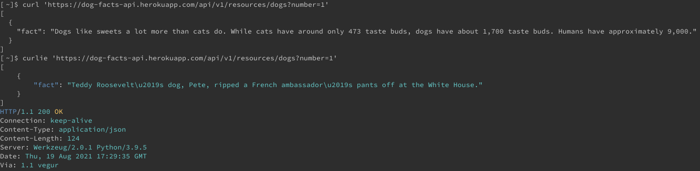

[Curlie](https://github.com/rs/curlie) is a frontend to the ubiquitous command-line HTTP client cURL. With curlie, you get all of the features and versatility of cURL with a modern and user-friendly interface similar to the HTTP client, [HTTPie](/docs/guides/installing-and-using-httpie-on-linux/). In this guide, you learn about the benefits of curlie and how to install and start using it on a Linux system.

## Before You Begin

1.  If you have not already done so, create a Linode account and Compute Instance. See our [Getting Started with Linode](/docs/guides/getting-started/) and [Creating a Compute Instance](/docs/guides/creating-a-compute-instance/) guides.

1.  Follow our [Setting Up and Securing a Compute Instance](/docs/guides/set-up-and-secure/) guide to update your system. You may also wish to set the timezone, configure your hostname, create a limited user account, and harden SSH access.


The steps in this guide are written for a non-root user. Commands that require elevated privileges are prefixed with `sudo`. If you’re not familiar with the `sudo` command, see the [Linux Users and Groups](/docs/guides/linux-users-and-groups/) guide.


## What is curlie?

curlie is a command-line frontend for cURL that takes inspiration from HTTPie. HTTPie is a an HTTP client designed with readability and modern web APIs in mind. You can learn more about HTTPie from our [How to Install and Use HTTPie on Linux](/docs/guides/installing-and-using-httpie-on-linux/) guide.

### How Is Curlie Different From HTTPie

Like HTTPie, curlie provides an HTTP client that works with modern web APIs and is focused on displaying readable and user-friendly output. Unlike HTTPie, curlie keeps the performance and rich array of features you find in cURL. This makes curlie more versatile and appropriate for general use when compared to HTTPie.

Additionally, curlie processes output on the fly. This makes it easier to debug streamed data with curlie. In contrast, HTTPie processes output when the request is completed.

## How to Install curlie

1. Identify whether your system's CPU architecture is 32-bit or 64-bit using the following command:

        getconf LONG_BIT

   The following sample output indicates a 64-bit CPU architecture.

    
64
    

1. Take a look at the [curlie releases page](https://github.com/rs/curlie/releases/). Find the latest release, and locate the `.tar.gz` file matching your system based on the following:

    - If your system is 64-bit, copy the URL for the file ending in `linux_amd64.tar.gz`.

    - If your system is 32-bit, copy the URL for the file ending in `linux_386.tar.gz`.

    Then, copy the URL for that matching `.tar.gz` file.

1. Download the `.tar.gz` using the command below. Replace the URL below with the one you copied in the previous step.

        curl -o curlie.tar.gz -L https://github.com/rs/curlie/releases/download/v1.6.0/curlie_1.6.0_linux_amd64.tar.gz

1. Install `tar` if you do not already have it. Replace `apt` in the command below with `yum` if you are using **AlmaLinux** or **CentOS**; replace it with `dnf` if you are using **Fedora**.

        sudo apt install tar

1. Make a directory for the curlie files, then extract the files to that directory. The following command creates the new directory in the current user's home directory.

        mkdir ~/curlie
        tar -xvf curlie.tar.gz -C ~/curlie

1. Move the curlie binary file into the path for your current user's shell.

        sudo mv ~/curlie/curlie /usr/local/bin

1. Verify your installation. The output should show your system's current version of cURL, which indicates that curlie is successfully acting as its frontend.

        curlie --version

    
curl 7.61.1 [...]
    

## How to Use curlie

You can use curlie much like how you use cURL. Any cURL options you provide on a `curlie` command get passed on for execution by cURL. This means that you can use any `curl` command options in your `curlie` commands.

Curlie also simplifies many cURL operations, especially when it comes to handling headers and JSON data. This makes curlie much better for working with web APIs than the default `curl` command.

### Basic Usage

The most basic usage of curlie is for GET requests. Like cURL, curlie just requires the request's endpoint — you do not need to specify the request method with `GET`.

The example below fetches random dog facts from a web service. It also includes a URL parameter specifying the number of facts being requested.

    curlie dog-facts-api.herokuapp.com/api/v1/resources/dogs?number=1


[
    {
        "fact": "Teddy Roosevelt\u2019s dog, Pete, ripped a French ambassador\u2019s pants off at the White House."
    }
]
HTTP/1.1 200 OK
Connection: keep-alive
Content-Type: application/json
Content-Length: 124
Server: Werkzeug/2.0.1 Python/3.9.5
Date: Thu, 19 Aug 2021 17:29:35 GMT
Via: 1.1 vegur


As you can see from the output, curlie automatically includes the response header information in the output. Curlie also applies syntax highlighting to its output. You can see output from curlie contrasted with output from cURL in the screenshot below:

The command interface for curlie sets itself apart from cURL as requests get more complicated. The example below fetches a random "dad joke" using a GET request with required header data. While cURL requires that you specify when you are providing header data, curlie can automatically parse header data included after the URL.

    curlie -L icanhazdadjoke.com/ 'Accept: application/json'


HTTP/1.1 301 Moved Permanently
Date: Thu, 19 Aug 2021 20:08:48 GMT
Content-Type: text/html; charset=utf-8
Transfer-Encoding: chunked
Connection: keep-alive
location: https://icanhazdadjoke.com/
CF-Cache-Status: DYNAMIC
Report-To: {"endpoints":[{"url":"https:\/\/a.nel.cloudflare.com\/report\/v3?s=XGi6FcJXeekwp%2Fmp9eovld1%2BkunSlnaEPd6ylLHnoiH%2F2%2F4hoIUGrffKmW5pLMNRnZa6D1cCPyIEPPc8V%2FvDFzIMeXjIkVckzwOMj%2FTKVz5Mv3wGZD0%2BpC6iIrEIALbK860pXnrvdRe4rGfkbZWJljc%3D"}],"group":"cf-nel","max_age":604800}
NEL: {"success_fraction":0,"report_to":"cf-nel","max_age":604800}
X-Content-Type-Options: nosniff
Server: cloudflare
CF-RAY: 68160417dc3057ae-IAD
alt-svc: h3-27=":443"; ma=86400, h3-28=":443"; ma=86400, h3-29=":443"; ma=86400, h3=":443"; ma=86400

HTTP/2 200
date: Thu, 19 Aug 2021 20:08:48 GMT
content-type: application/json
content-length: 102
cache-control: max-age=0, must-revalidate, no-cache, no-store, public, s-maxage=0
x-frame-options: DENY
x-xss-protection: 1; mode=block
cf-cache-status: DYNAMIC
expect-ct: max-age=604800, report-uri="https://report-uri.cloudflare.com/cdn-cgi/beacon/expect-ct"
report-to: {"endpoints":[{"url":"https:\/\/a.nel.cloudflare.com\/report\/v3?s=JbbpMyzQGuWL4dQZ4qv3EruIbsO8EstS6nr0IL4qp%2FSZhszpCwXpzv1Cf%2FCNP9he3QXUQhhFJcPDaXy5rAUi2SRnpm06ocDIUz12W5Q4wWUxSMhnMi%2BK06kCBzMAza72uBZ2S0lk%2Ba7ZGZ%2BMrwf17JE%3D"}],"group":"cf-nel","max_age":604800}
nel: {"success_fraction":0,"report_to":"cf-nel","max_age":604800}
strict-transport-security: max-age=15552000; includeSubDomains
x-content-type-options: nosniff
server: cloudflare
cf-ray: 681604183927e86a-ATL
alt-svc: h3-27=":443"; ma=86400, h3-28=":443"; ma=86400, h3-29=":443"; ma=86400, h3=":443"; ma=86400

{
    "id": "pWn31TCQ7pb",
    "joke": "What do you call a duck that gets all As? A wise quacker.",
    "status": 200
}


Notice that the command above includes the `-L` option. This is a cURL option to follow URL redirects. Also notice that curlie includes header information from the redirect response in its output. This is an example of how curlie processes output on the fly.

You can also see, in the example above, that curlie automatically formats the JSON portion of the response. cURL only includes the formatting provided by the web service, but curlie can recognize JSON information and print it in an easy-to-read format.

### Request Methods

With curlie, you can specify request methods just by including the method designation — `GET`, `POST`, `PUT`, `DELETE`, etc — before the URL and after any options in the command. You can see this in the next example, which uses the `httpbin.org` web service to test the request.

    curlie DELETE httpbin.org/delete


HTTP/1.1 200 OK
Date: Mon, 23 Aug 2021 21:08:44 GMT
Content-Type: application/json
Content-Length: 340
Connection: keep-alive
Server: gunicorn/19.9.0
Access-Control-Allow-Origin: *
Access-Control-Allow-Credentials: true

{
    "args": {

    },
    "data": "",
    "files": {

    },
    "form": {

    },
    "headers": {
        "Accept": "application/json, */*",
        "Host": "httpbin.org",
        "User-Agent": "curl/7.61.1",
        "X-Amzn-Trace-Id": "Root=1-61240e5c-4604ce837004b87b1722fd30"
    },
    "json": null,
    "origin": "192.0.2.0",
    "url": "http://httpbin.org/delete"
}


### Submitting JSON Data

Submitting JSON data is made much simpler with curlie. It even helps you format a JSON object on the command line. Curlie lets you enter the object's individual parameters, automatically compiling them into the necessary JSON format.

The example below queries the "Shout Cloud" web service. The service accepts a JSON object with a string and returns a JSON object with a capitalized version of that string.

    curlie POST api.shoutcloud.io/V1/SHOUT INPUT="hello, world!"


HTTP/1.1 200 OK
Server: Cowboy
Connection: keep-alive
Content-Type: APPLICATION/JSON
Date: Thu, 19 Aug 2021 18:06:10 GMT
Content-Length: 50
Via: 1.1 vegur

{
    "INPUT": "hello, world!",
    "OUTPUT": "HELLO, WORLD!"
}


## Conclusion

The examples in this guide should help you get started working with curlie and interacting with web services. For more help getting started, you can also check out the [GitHub page for curlie](https://github.com/rs/curlie), which provides additional usage examples.

Curlie also has many more features for fine-tuning HTTP requests for your needs. In addition to all cURL options, curlie also has a suite of its own options. You can find them all using the `curlie --help` command. Browsing the available curlie options is a good place to start to dive deeper into the features it offers.
